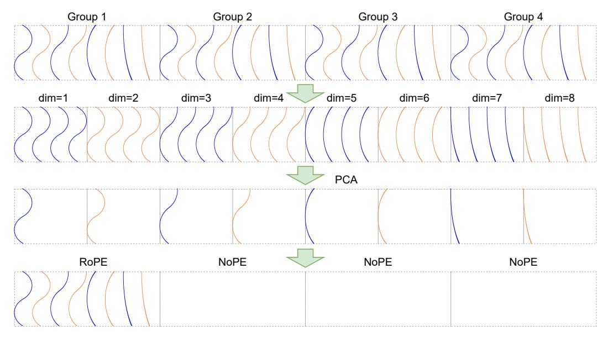

# **TransMLA**

In this section we formally present TransMLA, motivated by two observations:

- 1. For a fixed KV-cache budget, MLA is strictly more expressive than GQA. As proven in Appendix A (and illustrated in Figure 1a), any GQA layer can be rewritten as an MLA layer by introducing a single additional projection matrix. The reverse transformation is not always possible, implying that MLA subsumes GQA. When Rotary Positional Embeddings (RoPE) are present, the MLA equivalent must be expressed in the absorbed form.
- 2. Inference acceleration occurs only when MLA uses a smaller KV cache. Although one can build an MLA-equivalent representation of a GQA model, speedups arise only if the number of stored KV vectors is actually reduced. TransMLA therefore converts a GQA-based network into a DeepSeek-like MLA architecture, allowing the transformed model to run directly on DeepSeek's optimized inference stack and realize the full memory-latency benefits.

### 4.1 Merging All Kev Heads as One

Because MLA ties all KV heads to a single latent dimension, the first step in converting a GQA layer to MLA is to merge every GQA key-value group into one latent head before any KV-cache compression is applied. For each query head i, we introduce  $W_i^{UK} \in \mathbb{R}^{d \times gd}$  with the group index  $j = \left\lceil \frac{i}{h/g} \right\rceil - 1$ , and initialize the matrix  $W_i^{UK}[:,jd:(j+1)d]$  to be  $I_d$  (identity matrix of shape  $(d \times d)$ , with all other elements set to 0. (We adopt the matrix indexing notation used in Python and PyTorch, and will continue to do so throughout this work without further explanation.) This initialization allows the projection of the key's latent representation to be simultaneously mapped

Figure 2: Pipeline of RoRoPE for decoupling RoPE. Blue lines denote real-part dimensions, orange lines denote imaginary-part dimensions. When the keys from multiple heads are concatenated, permuting dimensions does not change the computation, so we gather the same dimension (i.e., the same rotational frequency) across all heads and apply joint principal-component analysis—using the identical procedure for the real and imaginary parts. For each frequency we keep a single principal component, which captures the dominant positional variation and can be represented by a standard RoPE in one attention head.

onto multiple query heads, with only the corresponding key head being multiplied by the appropriate query head. Similarly, during the computation of the multiple heads of the values, the attention scores for each head are multiplied accordingly. To keep the output unchanged, we similarly initialize  $W_i^{UV}$  so that only the corresponding value head is an identity mapping, while all other elements are set to zero. Since we have now merged all the key heads into a single head, in order to ensure that this transformation is equivalent to the original, we also merge the RoPE operations from different heads into one large RoPE operation, denoted as  $\widehat{\text{RoPE}}$ , applied to the entire merged key head. Since the original RoPE operation in GQA is the same for each head,  $\widehat{\text{RoPE}}$  simply applies the same RoPE operation repeatedly for every d dimensions. In this way, the computation of GQA attention is transformed into the following form:

$$[\mathbf{c}_t^K; \mathbf{c}_t^V] = \mathbf{c}_t^{KV} = W^{DKV} \mathbf{x}_t, \quad W^{DKV} = \begin{pmatrix} W^K \\ W^V \end{pmatrix} \in \mathbb{R}^{2gd \times D}$$
(11)

$$[\mathbf{q}_{t,1}; \mathbf{q}_{t,2}; ...; \mathbf{q}_{t,h}] = \mathbf{q}_t = W^Q \mathbf{x}_t, \quad W^Q \in \mathbb{R}^{hd \times D}$$
(12)

$$\hat{\mathbf{q}}_{t,i}^{R} = \widehat{\text{RoPE}}((W_i^{UK})^{\top} \mathbf{q}_{t,i}, t), \quad \hat{\mathbf{k}}_t^{R} = \widehat{\text{RoPE}}(\mathbf{c}_t^{K}, t)$$
(13)

$$\hat{\mathbf{o}}_{t,i} = \sum_{j=1}^{t} \operatorname{softmax}_{j} \left( \frac{\left( \hat{\mathbf{q}}_{t,i}^{R} \right)^{\top} \hat{\mathbf{k}}_{j}^{R}}{\sqrt{d}} \right) \mathbf{c}_{j}^{V}, \tag{14}$$

$$\mathbf{y}_{t} = W^{O}[W_{1}^{UV}\hat{\mathbf{o}}_{t,1}; ...; W_{h}^{UV}\hat{\mathbf{o}}_{t,h}]. \tag{15}$$

It is evident that the total KV cache size remains unchanged since we still need to store  $\mathbf{c}_t^{KV} \in \mathbb{R}^{2gd}$  for each token, which is the same as in the original GQA model. However, the dimension of each attention head has increased by a factor of g, and the introduction of new parameters  $W_i^{UK}$  and  $W_i^{UV}$  leads to higher computational costs. To achieve actual acceleration in the transformed MLA, compressing the KV cache is therefore essential. By merging multiple KV heads, we can better identify shared principal components and represent the KV cache in a lower-dimensional latent space. Moreover, merging multiple key heads is crucial for efficiently decoupling RoPE in the subsequent steps.

#### 4.2 Rotating Queries and Keys to Minimize Transformation Loss Towards Decoupled RoPE

As illustrated in Figure 2, applying RoRoPE to the merged head removes the bulk of the positional signal from K. In Equation 14, the term  $(\hat{\mathbf{q}}_{t,i}^R)^{\top} \hat{\mathbf{k}}_j^R$  can be expressed as the sum of inner products over paired dimensions across multiple attention heads, incorporating positional information:

$$\left(\hat{\mathbf{q}}_{t,i}^{R}\right)^{\top}\hat{\mathbf{k}}_{j}^{R} = \sum_{l=1}^{d/2} \left[\hat{\mathbf{q}}_{t,i}^{[2l-1::d]}; \hat{\mathbf{q}}_{t,i}^{[2l::d]}\right]^{R^{\top}} \left[\hat{\mathbf{k}}_{j}^{[2l-1::d]}; \hat{\mathbf{k}}_{j}^{[2l::d]}\right]^{R}.$$
(16)

Here, the notation [2l::d] is inspired by Python slicing syntax and denotes selecting elements starting from the (2l)-th dimension, then taking every d-th element thereafter until the end of the vector. The vector  $\left[\hat{\mathbf{q}}_{t,i}^{[2l-1::d]};\hat{\mathbf{q}}_{t,i}^{[2l::d]}\right]^R$  thus has dimension 2g.

Since multiple key heads are concatenated into a single head and each head shares the same RoPE, the real and imaginary components corresponding to the *l*-th 2D subspace (i.e., the paired two dimensions) of RoPE within each original attention head can be expressed as follows:

$$\left[\hat{\mathbf{q}}_{t,i}^{[2l-1::d]}; \hat{\mathbf{q}}_{t,i}^{[2l::d]}\right]^{R} = \cos t\theta_{l} \left[\hat{\mathbf{q}}_{t,i}^{[2l-1::d]}; \hat{\mathbf{q}}_{t,i}^{[2l::d]}\right] + \sin t\theta_{l} \left[-\hat{\mathbf{q}}_{t,i}^{[2l::d]}; \hat{\mathbf{q}}_{t,i}^{[2l-1::d]}\right], \quad (17)$$

$$\left[\hat{\mathbf{k}}_{j}^{[2l-1::d]}; \hat{\mathbf{k}}_{j}^{[2l::d]}\right]^{R} = \cos j\theta_{l} \left[\hat{\mathbf{k}}_{j}^{[2l-1::d]}; \hat{\mathbf{k}}_{j}^{[2l::d]}\right] + \sin j\theta_{l} \left[-\hat{\mathbf{k}}_{j}^{[2l::d]}; \hat{\mathbf{k}}_{j}^{[2l-1::d]}\right].$$
(18)

When the concatenated real and imaginary components of  $\hat{\mathbf{q}}_{t,i}$  and  $\hat{\mathbf{k}}_j$  within the l-th 2-dimensional subspace are multiplied by an orthogonal matrix  $\mathbf{U}_l \in \mathbb{R}^{g \times g}$ , the inner product with RoPE applied remains invariant. Specifically,

$$\sum_{l=1}^{d/2} \left( \left[ \mathbf{U}_{l} \hat{\mathbf{q}}_{t,i}^{[2l-1::d]}; \mathbf{U}_{l} \hat{\mathbf{q}}_{t,i}^{[2l::d]} \right] \right)^{R^{\top}} \left( \left[ \mathbf{U}_{l} \hat{\mathbf{k}}_{j}^{[2l-1::d]}; \mathbf{U}_{l} \hat{\mathbf{k}}_{j}^{[2l::d]} \right] \right)^{R} = \hat{\mathbf{q}}_{t,i}^{R^{\top}} \hat{\mathbf{k}}_{j}^{R}.$$
(19)

This demonstrates that the rotational transformation  $\mathbf{U}_l$  preserves the RoPE-based inner product structure. Simply put, because the same rotation values (i.e.,  $\cos t\theta_l$  and  $\sin t\theta_l$ ) are applied identically to each dimension of the l-th 2D subspace across all attention heads, any orthogonal transformation  $\mathbf{U}_l^{\mathsf{T}}\mathbf{U}_l = \mathbf{I}$  applied to these dimensions within the same subspace leaves the inner product  $\hat{\mathbf{q}}_{t,i}^{R^{\mathsf{T}}}\hat{\mathbf{k}}_{j}^{R}$  unchanged. However, the preceding equation reveals a critical constraint: for the inner product's value to remain unchanged after transformation, the same orthogonal matrix  $\mathbf{U}_l$  must be applied to both the real (2l-1) and imaginary (2l) components of the key vectors within each 2D subspace. For a detailed proof and our proposed solution, please refer to Appendix B.

We apply Principal Component Analysis (PCA) to the attention heads in the context of RoPE, introducing a method we call RoRoPE. Using a small dataset, we extract the key output, compute its principal component projection matrices  $\{\mathbf{U}_l\}_{l\in\{1,\dots,d/2\}}$ , and rotate both  $W^K$  and  $W^{UK}$  (as shown in Eq13,  $\hat{\mathbf{q}}_{t,i}$  and  $\hat{\mathbf{k}}_j$  are generated from  $W^{UK}$  and  $W^K$  respectively, so rotating  $\hat{\mathbf{q}}_{t,i}$  and  $\hat{\mathbf{k}}_j$  can be achieved by rotating  $W^{UK}$  and  $W^K$ ) using a similar procedure as described above. This rotation effectively concentrates the essential information into the first few heads. As an equivalent transformation, instead of discarding all non-principal components of the key, we remove their RoPE encoding while preserving positional information within the principal components.

To enable the transformed model to utilize standard RoPE, we represent the principal component information for corresponding positions across other heads using the dimensions of the first attention head. However, using a one-dimensional space for all positional information proves limiting. To address this, we exploit the similar frequencies of adjacent dimensions in RoPE, treating them as equivalent positions. This allows us to use multiple dimensions within a single attention head to represent positional information, a technique we refer to as **FreqFold**. Additional information on FreqFold can be found in Appendix C.

