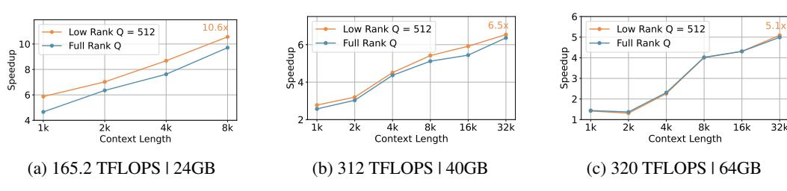

# 5.4 Hardware-Agnostic Inference Speedup with TransMLA

By converting MHA/GQA models into MLA models that are fully compatible with the DeepSeek codebase and compressing the KV cache, TransMLA enables us to leverage all optimizations and tooling available in DeepSeek. Using the vLLM framework, we achieve substantial real-world inference speedups.

In Figure 5, we benchmarked the inference performance of an MLA model—with a 92.97% reduction in KV cache size—on three consumer-grade AI accelerators with different compute capabilities and memory sizes: 165.2 TFLOPS with 24GB memory, 312 TFLOPS with 40GB memory, and 320 TFLOPS with 64GB memory. The figure shows the inference speedup of the MLA model relative to the original MHA model. Low-rank Q and Full-rank Q indicate whether the query projections were also compressed. Context length represents the total sequence length (i.e., context length plus generated tokens).

Our experiments show that the inference speedup of MLA models increases as the context length grows, which aligns with our expectations. Since the primary performance gain of MLA stems from KV cache compression, longer contexts lead to more substantial savings and thus higher speedups. Remarkably, for the 8K context window on the first hardware platform, the TransMLA-transformed model achieves an impressive **10.6x inference acceleration**. To the best of our knowledge, the MHA2MLA method has not reported any inference speedup results.

Figure 5: Inference speedups with TransMLA comparing to the original LLaMA2 7B model on three consumer-grade AI accelerators. **Low-rank Q** and **Full-rank Q** indicate whether the query projections were also compressed. **Context length** represents the total sequence length.

