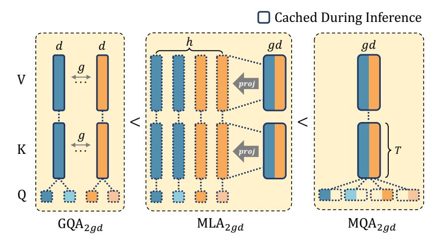

# A.1 Introduction

This section provides a theoretical analysis to demonstrate that Multi-Head Latent Attention (MLA) with decoupled Rotary Position Embedding (RoPE), as described in Section [3.3](#page-3-1) of the main paper, possesses greater expressive power than Grouped-Query Attention (GQA) (Section [3.2\)](#page-3-2). This analysis assumes comparable KV cache sizes and number of query heads.

Our primary argument focuses on the core projection mechanisms that generate queries, keys, and values, abstracting away from the specifics of RoPE application initially. We first present the following proposition concerning the relative expressiveness of these core mechanisms:

Proposition 1. *Given the same KV cache size and number of query heads, the expressiveness of the core attention projection mechanisms follows the order:* GQA < MLAFactorized < MQA*.*

Here, MLAFactorized refers to an attention mechanism employing low-rank factorization for its key and value projections, representing the content-processing aspect of the full MLA. It is important to note that in the proposition, the query projection in MLAFactorized does not undergo low-rank factorization; this differs from the full MLA, where the query is also factorized. After proving this proposition, we will discuss how the full MLA architecture, which incorporates such an MLAFactorized core for its content components and an MQA core for its decoupled RoPE components, is thereby more expressive than GQA. For this analysis, we primarily consider the impact of the architectural structure on representational capacity, setting aside the direct effects of RoPE itself on the expressiveness comparison between the fundamental GQA, MLA-Factorized, and MQA structures.

Figure 6: Comparison of Multi-Query Attention (MQA), Group Query Attention (GQA), and Multi-Head Latent Attention (MLA). In this work, we illustrate that given the same KV cache size, the expressiveness increases in the order of GQA, MLA, and MQA. In the figure, h, d, g denote the number of heads, hidden dimension of each head, and the number of groups (K/V heads) in GQA, respectively. In MQA, the head dimension is set to gd to align the KV cache size with GQA and MLA. As a result, the KV cache size per token per layer for all three approaches is 2gd

