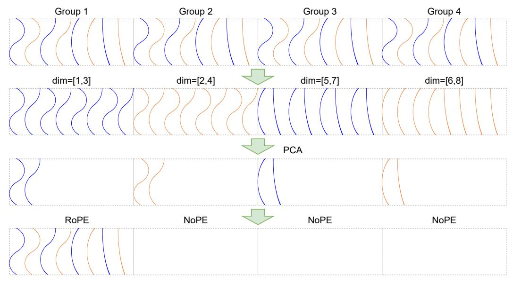

# B Proof of RoPE Inner Product Invariance under Orthogonal Transformation

In this subsection, we provide a rigorous proof of Equation 19, namely:

$$\sum_{l=1}^{d/2} \left( \left[ \mathbf{U}_{l} \hat{\mathbf{q}}_{t,i}^{[2l-1::d]}; \mathbf{U}_{l} \hat{\mathbf{q}}_{t,i}^{[2l::d]} \right] \right)^{R^{\top}} \left( \left[ \mathbf{U}_{l} \hat{\mathbf{k}}_{j}^{[2l-1::d]}; \mathbf{U}_{l} \hat{\mathbf{k}}_{j}^{[2l::d]} \right] \right)^{R} = \hat{\mathbf{q}}_{t,i}^{R^{\top}} \hat{\mathbf{k}}_{j}^{R}.$$

Here, d is the dimension of each original attention head. The notation  $\mathbf{q}_{t,i}^{[2l-1::d]}$  (and similarly for other terms) refers to an h-dimensional vector collecting the (2l-1)-th components from each of the h original attention heads. The matrix  $\mathbf{U}_l$  is an  $h \times h$  orthogonal matrix. The superscript R denotes the application of RoPE.

*Proof.* For the sake of convenience, we omit all i,j,k and let  $\mathbf{q}_{x,l} = \mathbf{q}_{t,i}^{[2l-1::]}$  and  $\mathbf{q}_{y,l} = \mathbf{q}_{t,i}^{[2l::]}$ . These are h-dimensional vectors. Similarly, let  $\mathbf{k}_{x,l} = \mathbf{k}_j^{[2l-1::]}$  and  $\mathbf{k}_{y,l} = \mathbf{k}_j^{[2l::]}$ .

The RoPE transformation, as defined by Equations (17) and (18) in the main text, applies as follows for a query vector at position t and key vector at position t within the t-th subspace:

For the query vector components:

$$(\mathbf{q}_{x,l})^R = \mathbf{q}_{x,l}\cos(t\theta_l) - \mathbf{q}_{y,l}\sin(t\theta_l)$$
$$(\mathbf{q}_{u,l})^R = \mathbf{q}_{x,l}\sin(t\theta_l) + \mathbf{q}_{u,l}\cos(t\theta_l)$$

For the key vector components:

$$(\mathbf{k}_{x,l})^R = \mathbf{k}_{x,l}\cos(j\theta_l) - \mathbf{k}_{y,l}\sin(j\theta_l)$$
$$(\mathbf{k}_{y,l})^R = \mathbf{k}_{x,l}\sin(j\theta_l) + \mathbf{k}_{y,l}\cos(j\theta_l)$$

We use the shorthand  $c_t = \cos(t\theta_l)$ ,  $s_t = \sin(t\theta_l)$ ,  $c_j = \cos(j\theta_l)$ , and  $s_j = \sin(j\theta_l)$ .

The right-hand side (RHS) of Equation (19) is given by the definition of the RoPE inner product:

$$\begin{aligned} \mathbf{q}_{t,i}^{R}^{\top} \mathbf{k}_{j}^{R} &= \sum_{l=1}^{d/2} \left[ (\mathbf{q}_{x,l})^{R}; (\mathbf{q}_{y,l})^{R} \right]^{\top} \left[ (\mathbf{k}_{x,l})^{R}; (\mathbf{k}_{y,l})^{R} \right] \\ &= \sum_{l=1}^{d/2} \left( ((\mathbf{q}_{x,l})^{R})^{\top} (\mathbf{k}_{x,l})^{R} + ((\mathbf{q}_{y,l})^{R})^{\top} (\mathbf{k}_{y,l})^{R} \right) \end{aligned}$$

Let  $S_l$  be the l-th term in this sum:

$$S_{l} = (c_{t}\mathbf{q}_{x,l} - s_{t}\mathbf{q}_{y,l})^{\top}(c_{j}\mathbf{k}_{x,l} - s_{j}\mathbf{k}_{y,l}) + (s_{t}\mathbf{q}_{x,l} + c_{t}\mathbf{q}_{y,l})^{\top}(s_{j}\mathbf{k}_{x,l} + c_{j}\mathbf{k}_{y,l})$$

$$= c_{t}c_{j}\mathbf{q}_{x,l}^{\top}\mathbf{k}_{x,l} - c_{t}s_{j}\mathbf{q}_{x,l}^{\top}\mathbf{k}_{y,l} - s_{t}c_{j}\mathbf{q}_{y,l}^{\top}\mathbf{k}_{x,l} + s_{t}s_{j}\mathbf{q}_{y,l}^{\top}\mathbf{k}_{y,l}$$

$$+ s_{t}s_{j}\mathbf{q}_{x,l}^{\top}\mathbf{k}_{x,l} + s_{t}c_{j}\mathbf{q}_{x,l}^{\top}\mathbf{k}_{y,l} + c_{t}s_{j}\mathbf{q}_{y,l}^{\top}\mathbf{k}_{x,l} + c_{t}c_{j}\mathbf{q}_{y,l}^{\top}\mathbf{k}_{y,l}$$

$$= (c_{t}c_{j} + s_{t}s_{j})(\mathbf{q}_{x,l}^{\top}\mathbf{k}_{x,l} + \mathbf{q}_{y,l}^{\top}\mathbf{k}_{y,l}) + (s_{t}c_{j} - c_{t}s_{j})(\mathbf{q}_{x,l}^{\top}\mathbf{k}_{y,l} - \mathbf{q}_{y,l}^{\top}\mathbf{k}_{x,l})$$

$$= \cos((t - j)\theta_{l})(\mathbf{q}_{x,l}^{\top}\mathbf{k}_{x,l} + \mathbf{q}_{y,l}^{\top}\mathbf{k}_{y,l}) + \sin((t - j)\theta_{l})(\mathbf{q}_{x,l}^{\top}\mathbf{k}_{y,l} - \mathbf{q}_{y,l}^{\top}\mathbf{k}_{x,l}).$$

Now, let's analyze the left-hand side (LHS) of Equation (19). Let  $\mathbf{q}'_{x,l} = \mathbf{U}_l \mathbf{q}_{x,l}$  and  $\mathbf{q}'_{y,l} = \mathbf{U}_l \mathbf{q}_{y,l}$ . Similarly, let  $\mathbf{k}'_{x,l} = \mathbf{U}_l \mathbf{k}_{x,l}$  and  $\mathbf{k}'_{y,l} = \mathbf{U}_l \mathbf{k}_{y,l}$ . The l-th term of the LHS sum, denoted  $S'_l$ , is:

$$S'_{l} = \left( ((\mathbf{q}'_{x,l})^{R})^{\top} (\mathbf{k}'_{x,l})^{R} + ((\mathbf{q}'_{y,l})^{R})^{\top} (\mathbf{k}'_{y,l})^{R} \right).$$

This has the same structure as  $S_l$ , just with primed variables:

$$S'_{l} = \cos((t-j)\theta_{l})((\mathbf{q}'_{x,l})^{\top}\mathbf{k}'_{x,l} + (\mathbf{q}'_{y,l})^{\top}\mathbf{k}'_{y,l}) + \sin((t-j)\theta_{l})((\mathbf{q}'_{x,l})^{\top}\mathbf{k}'_{y,l} - (\mathbf{q}'_{y,l})^{\top}\mathbf{k}'_{x,l}).$$

We need to show that the dot product terms involving primed variables are equal to their unprimed counterparts. Consider the first coefficient term:

$$\begin{aligned} (\mathbf{q}_{x,l}')^{\top} \mathbf{k}_{x,l}' + (\mathbf{q}_{y,l}')^{\top} \mathbf{k}_{y,l}' &= (\mathbf{U}_{l} \mathbf{q}_{x,l})^{\top} (\mathbf{U}_{l} \mathbf{k}_{x,l}) + (\mathbf{U}_{l} \mathbf{q}_{y,l})^{\top} (\mathbf{U}_{l} \mathbf{k}_{y,l}) \\ &= \mathbf{q}_{x,l}^{\top} \mathbf{U}_{l}^{\top} \mathbf{U}_{l} \mathbf{k}_{x,l} + \mathbf{q}_{y,l}^{\top} \mathbf{U}_{l}^{\top} \mathbf{U}_{l} \mathbf{k}_{y,l} \\ &= \mathbf{q}_{x,l}^{\top} \mathbf{k}_{x,l} + \mathbf{q}_{y,l}^{\top} \mathbf{k}_{y,l}. \end{aligned}$$

The last equation holds because  $U_l$  is an orthogonal matrix. This matches the corresponding term in  $S_l$ .

The same applies to the second coefficient term. In this way, we have proven that  $S'_l = S_l$  for each  $l \in \{1, ..., d/2\}$ . This implies that the LHS of Equation (19) is equal to its RHS:

$$\sum_{l=1}^{d/2} \left( \left[ \mathbf{U}_l \mathbf{q}_{t,i}^{[2l-1::]}; \mathbf{U}_l \mathbf{q}_{t,i}^{[2l::]} \right] \right)^{R^\top} \left( \left[ \mathbf{U}_l \mathbf{k}_j^{[2l-1::]}; \mathbf{U}_l \mathbf{k}_j^{[2l::]} \right] \right)^R = \mathbf{q}_{t,i}^{R^\top} \mathbf{k}_j^R.$$

This completes the proof, demonstrating that the orthogonal transformation  $\mathbf{U}_l$  applied to the h-dimensional vectors representing the l-th 2D subspace components across heads preserves the RoPE-based inner product structure.

In practice, we leverage this rotational invariance property to find a set of optimal orthogonal matrices  $\{\mathbf{U}_l\}$  that concentrate the principal components of the key vectors into the first few attention heads. The preceding proof reveals a critical constraint: for the inner product's value to remain unchanged after transformation, the same orthogonal matrix  $\mathbf{U}_l$  must be applied to both the real (2l-1) and imaginary (2l) components of the key vectors within each 2D subspace. This requirement precludes performing separate PCA on the real and imaginary parts. We must therefore find a single rotation that is jointly optimal for both.

Specifically, we formulate this as a joint optimization problem. First, we process a calibration dataset (e.g., Wikitext-2) to collect the key activations at each layer. For each RoPE subspace  $l \in \{1, \ldots, d/2\}$ , we obtain two collections of  $n \times h$ -dimensional matrices (where n denotes the number of samples): the "real" parts  $\{\mathbf{K}_{x,l}\}_l$  and the "imaginary" parts  $\{\mathbf{K}_{y,l}\}_l$ . To find a single transformation  $U_l$  that simultaneously compresses the information from both sets into the first few heads, we proceed as follows.

Let  $\sigma_{x,l} = \mathbf{K}_{x,l}^{\top} \mathbf{K}_{x,l}$  and  $\sigma_{y,l} = \mathbf{K}_{y,l}^{\top} \mathbf{K}_{y,l}$  be the  $h \times h$  covariance matrices of the real and imaginary key components, respectively. Our objective is to find an orthogonal matrix  $\mathbf{U}_l$  that maximizes the variance—or energy—concentrated in the first m heads after rotation. This corresponds to maximizing the trace of the top-left  $m \times m$  submatrix of the *summed* covariance of the rotated vectors. The problem is formally stated as:

$$\max_{\mathbf{U}_{l}} \operatorname{Tr}\left[\left(\mathbf{U}_{l}^{T}(\sigma_{x,l} + \sigma_{y,l})\mathbf{U}_{l}\right)_{:m,:m}\right] \quad \text{s.t.} \quad \mathbf{U}_{l}^{T}\mathbf{U}_{l} = I.$$
(32)

Figure 7: Pipeline of RoRoPE with FreqFold. RoRoPE encodes the entire frequency spectrum of all attention heads in a single latent dimension, which limits its expressive power. FreqFold remedies this by clustering adjacent-frequency dimensions and extracting their principal components jointly, allocating a higher-dimensional subspace to similar features. This richer representation enables  $K_{rope}$  to retain far more positional information.

Here,  $\mathbf{U}_l$  is the  $h \times h$  orthogonal optimization variable, and  $(\cdot)_{:m,:m}$  denotes the top-left  $m \times m$  submatrix. The solution to this trace maximization problem is obtained by performing an eigendecomposition on the summed covariance matrix  $\sigma_{x,l} + \sigma_{y,l}$ . The resulting matrix  $\mathbf{U}_l$ , whose columns are the eigenvectors sorted in descending order of their corresponding eigenvalues, is the optimal orthogonal transformation  $\mathbf{U}_l$ .

By applying this rotation, we ensure that the principal components from both the real and imaginary dimensions of the keys are aligned and concentrated within the first few heads. Consequently, we can discard the RoPE components from the remaining heads in both queries and keys while preserving the most significant positional information, thereby minimizing the performance degradation.

