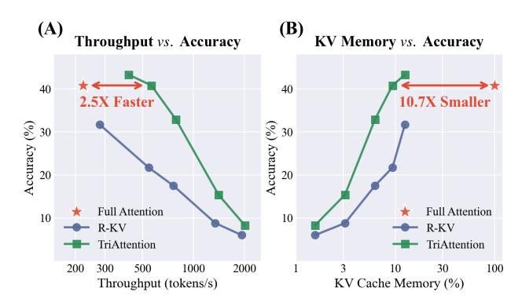
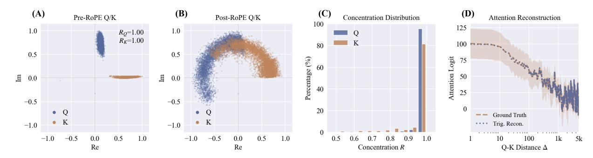
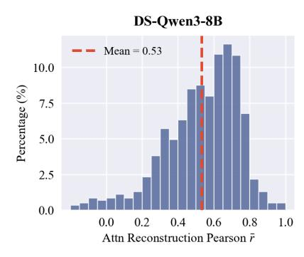
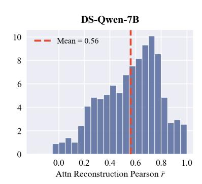
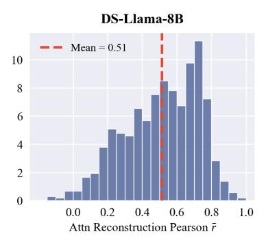

# 1. Introduction

Long reasoning in LLMs produces chain-of-thought sequences spanning tens of thousands of tokens [\(Wei et al.,](#page-10-0) [2022;](#page-10-0) [DeepSeek-AI,](#page-8-0) [2025;](#page-8-0) [Shao et al.,](#page-10-1) [2024;](#page-10-1) [Chen et al.,](#page-8-1)

*Figure 1.* Performance trade-offs on AIME25 (Qwen3-8B). (A) At equivalent accuracy (40.8%), TriAttention achieves 2.5× higher throughput than Full Attention. (B) TriAttention reduces KV cache memory by 10.7× while matching Full Attention accuracy.

[2025\)](#page-8-1). KV cache grows proportionally, creating severe memory bottlenecks. KV cache compression addresses this by retaining only the most important tokens, with importance estimated from attention scores computed over recent queries [\(Li et al.,](#page-9-0) [2024b;](#page-9-0) [Zhang et al.,](#page-10-2) [2023;](#page-10-2) [Devoto et al.,](#page-8-2) [2025;](#page-8-2) [Zhou et al.,](#page-10-3) [2024;](#page-10-3) [Tang et al.,](#page-10-4) [2024;](#page-10-4) [Shi et al.,](#page-10-5) [2024\)](#page-10-5).

However, these methods are inherently unstable: only a few queries are usable for importance estimation. They operate on post-RoPE queries, which rotate with position as illustrated in Figure [2\(](#page-1-0)B); consequently, only the most recent queries retain up-to-date orientations, forming a tiny observation window. With so few representative queries, important keys go undetected—a token receiving low attention during this short window may be permanently evicted, even if it becomes critical later. This is particularly challenging for retrieval heads [\(Wu et al.,](#page-10-6) [2025;](#page-10-6) [Xiao et al.,](#page-10-7) [2025\)](#page-10-7), where relevant tokens can remain dormant for long periods before becoming essential. In reasoning, such loss breaks the chain of thought. Prior work confirms this limitation: increasing the observation window does not help—performance peaks at around 25 queries, a tiny fraction of typical long contexts, and declines thereafter [\(Zhang et al.,](#page-10-8) [2025\)](#page-10-8).

We therefore turn to the pre-RoPE space, where we observe a notable phenomenon: across a large fraction of attention heads, Q and K vectors are highly concentrated around a fixed non-zero center, as shown in Figure [2\(](#page-1-0)A)—a property

1MIT 2NVIDIA 3ZJU ∗Equal contribution.

Figure 2. Q/K concentration and its implications for attention. (A) Pre-RoPE Q/K vectors at the dominant frequency band are highly concentrated (high Mean Resultant Length R). (B) RoPE rotation disperses these vectors into arc patterns. In (A-B), three distinct input sequences are overlayed, showing this structure is stable across content. (C) This concentration holds across nearly all heads. (D) When Q/K are concentrated, attention logits can be accurately reconstructed using a trigonometric series (Pearson r = 0.72).

we term *Q/K concentration*. This concentration remains stable across positions and contexts, *i.e.*, Figure 2(C). Because pre-RoPE vectors—before positional encoding is applied—are unaffected by positional rotation, this stability is intrinsic rather than coincidental. Moreover, pre-RoPE vectors are directly linked to attention through the RoPE formula, making these centers meaningful for assessing KV importance.

To leverage these properties, we first demonstrate these centers relate to attention behavior via a trigonometric series. When Q/K are highly concentrated, they can be approximated by their centers; substituting these centers into the RoPE formula, the attention logit reduces to a function that depends only on Q-K distance—a trigonometric series—forming an attention-vs-distance curve. This curve usually exhibits peaks at specific Q-K distances, and verify that keys at those distances indeed receive higher attention in practice, as demonstrated in Figure 2(D). This demonstrates that Q/K concentration causes attention to favor keys at specific distances, with the centers determining which distances are preferred. Furthermore, this preference can be predicted using trigonometric series computed from centers.

We apply this understanding to design TriAttention, a KV cache compression method. TriAttention scores keys and retains only the top-scoring ones to address the memory bottleneck. The key idea of our scoring function is to use the Q center together with the trigonometric series to evaluate importance differences among keys arising from distance preferences. For the minority of heads where Q is less concentrated, we incorporate Q/K norms as complementary signals (Guo et al., 2024; Kobayashi et al., 2020; Li et al., 2024a). We automatically balance these two components using a Q/K concentration metric.

We evaluate TriAttention on mathematical reasoning benchmarks. On AIME25, at equivalent accuracy to Full Attention, TriAttention achieves  $2.5 \times$  higher throughput or  $10.7 \times$  KV memory reduction (Figure 1), while R-KV achieves

only about half the accuracy at the same efficiency. At fixed memory budget, the advantage is equally pronounced: Tri-Attention nearly doubles the accuracy of R-KV on AIME25 (32.9% vs. 17.5%) and AIME24 (42.1% vs. 25.4%). On MATH 500, with only 1,024 out of 32k tokens in the KV cache, TriAttention closely matches Full Attention (68.4% vs. 69.6%). These results demonstrate that leveraging Q/K centers via the trigonometric series provides a more reliable signal for KV importance than observation-based methods.

### 2. Background and Related Work

KV cache compression retains only a subset of KV pairs under a fixed memory budget. The core challenge is *importance estimation*: determining which tokens will receive high attention from future queries. Existing methods approach this problem by analyzing post-RoPE representations, as we discuss in §2.2. To understand why post-RoPE analysis is limiting, we first review how RoPE works.

### 2.1. Rotary Position Embedding

Rotary Position Embedding (RoPE) (Su et al., 2024; Hong et al., 2024; Barbero et al., 2025) encodes positional information as rotations in vector space and has become the dominant positional encoding in modern LLMs (Dubey et al., 2024; Jiang et al., 2023; Qwen Team, 2025; Peng et al., 2023; Team et al., 2025). For a d-dimensional vector, RoPE divides it into d/2 two-dimensional subspaces indexed by  $f \in \{0,\ldots,d/2-1\}$ . The f-th subspace rotates at frequency  $\omega_f = \theta^{-2f/d}$  ( $\theta = 10000$  typically); we refer to it as frequency band f. For frequency band f, RoPE applies a rotation by angle  $\omega_f p$  at position p:

$$\begin{pmatrix} x'_{2f} \\ x'_{2f+1} \end{pmatrix} = \begin{pmatrix} \cos(\omega_f p) & -\sin(\omega_f p) \\ \sin(\omega_f p) & \cos(\omega_f p) \end{pmatrix} \begin{pmatrix} x_{2f} \\ x_{2f+1} \end{pmatrix} \quad (1)$$

We call the Q/K vectors before this rotation *pre-RoPE*, and after rotation *post-RoPE*.

*Figure 3.* Attention reconstruction correlation across three DeepSeek-R1 distilled LLMs, including Qwen3 [\(Qwen Team,](#page-9-7) [2025\)](#page-9-7), Qwen2.5 [\(Qwen Team,](#page-9-9) [2024\)](#page-9-9), and Llama3 [\(Dubey et al.,](#page-9-5) [2024\)](#page-9-5). Distribution of per-head reconstruction Pearson correlation (r¯) across all attention heads. The red dashed line indicates the mean. All models show right-skewed distributions with means above 0.5.

### 2.2. Post-RoPE Compression Methods

KV cache compression methods [\(Cai et al.,](#page-8-4) [2025;](#page-8-4) [Ge et al.,](#page-9-10) [2024;](#page-9-10) [Feng et al.,](#page-9-11) [2025;](#page-9-11) [Behnam et al.,](#page-8-5) [2025\)](#page-8-5) estimate token importance from post-RoPE representations. We categorize them into heuristic, attention-based, and norm-based types.

Heuristic methods. Early compression methods use heuristic rule-based attention patterns. StreamingLLM [\(Xiao et al.,](#page-10-11) [2024;](#page-10-11) [Gu et al.,](#page-9-12) [2025\)](#page-9-12) enables infinite-length streaming input by retaining only a small fixed-size cache: a few initial "sink" tokens plus a sliding window of recent tokens. The sink tokens exploit the observation that initial positions receive disproportionate attention regardless of their content—discarding them causes attention scores to lose a stable "sink" and degrades performance. While simple, such fixed rules cannot adapt to content-dependent importance, motivating more sophisticated approaches.

Attention-based methods. These methods use attention scores—computed on post-RoPE Q/K—to identify important tokens. H2O [\(Zhang et al.,](#page-10-2) [2023\)](#page-10-2) accumulates attention scores across decoding steps to identify "heavy-hitter" tokens that consistently receive high attention. SnapKV [\(Li](#page-9-0) [et al.,](#page-9-0) [2024b\)](#page-9-0) computes attention within a local window and aggregates scores to predict which tokens will matter for generation. Scissorhands [\(Liu et al.,](#page-9-13) [2023\)](#page-9-13) exploits the "persistence of importance" hypothesis, using historical attention to guide eviction. R-KV [\(Cai et al.,](#page-8-4) [2025\)](#page-8-4) scores tokens by attention from the most recent queries, combined with redundancy detection for reasoning models. LazyEviction [\(Zhang et al.,](#page-10-8) [2025\)](#page-10-8) tracks token importance recurrence within an observation window to delay eviction decisions.

Norm-based methods. VATP [\(Guo et al.,](#page-9-1) [2024\)](#page-9-1) observes that attention scores alone are insufficient: attention sinks receive high attention but have near-zero value norms, contributing little to the output. By incorporating value vector norms, VATP provides a more nuanced importance measure.

### 2.3. Limitations of Post-RoPE Methods

Both attention-based and norm-based methods can be viewed as operating in the post-RoPE space, where positional rotations have already been applied. This shared foundation leads to distinct but related limitations.

For attention-based methods, the key constraint is that queries rotate with position, limiting useful observations to a tiny window and causing important keys undetected.

For norm-based methods, the limitation is different: they leverage only vector magnitudes while ignoring directional information. Ideally, incorporating Q/K directions would improve importance estimation—attention depends on both norms and the angle between Q and K. However, in post-RoPE space, directions are entangled with positional rotations: a vector's direction changes continuously with position, making directional information difficult to exploit.

