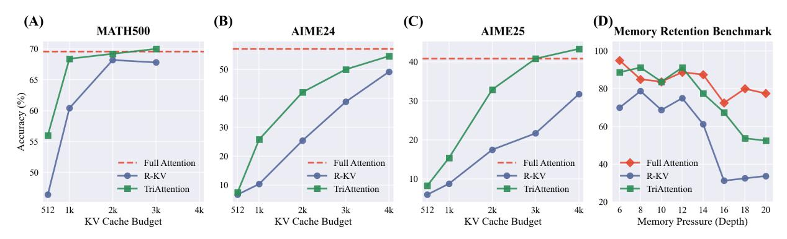

# 4. TriAttention

Based on the analysis in [§3,](#page-2-3) we propose a KV cache compression method that scores key importance and retains only the top-scoring keys (Figure [4\)](#page-3-3). The scoring function combines two signals ([§4.1\)](#page-4-0): the trigonometric series, which captures distance preferences, and norm information as a complement; the weight between them is adjusted based on Q/K concentration ([§4.2\)](#page-4-1). Finally, we describe how to apply this scoring for KV cache pruning ([§4.3\)](#page-5-0).

### 4.1. Key Importance Scoring

In KV cache, keys are already cached. Let kf ∈ C denote the pre-RoPE of a key k in frequency band f, and ∆ = pq − pk the Q-K distance.

Trigonometric Series Score. Keys at different positions have different distances to future queries. To estimate how much attention each key will receive, we use the Q center as a proxy for future queries—justified by the Q/K concentration observed in [§3.](#page-2-3) The trigonometric series then gives the expected attention at distance ∆:

$$S_{\text{trig}}(k, \Delta) = \sum_{f} \|\mathbb{E}[q_f]\| \cdot \|k_f\| \cdot \cos(\omega_f \Delta + \phi_f) \quad (6)$$

Here E[qf ] ∈ C is the Q center in frequency band f, computed from calibration data. Since keys in the cache are known, we directly use their representations kf . The phase ϕf = arg(E[qf ]) − arg(kf ) is the angular difference between the Q center and the current key.

Norm-Based Score. The trigonometric series assumes Q/K are exactly at their centers. In practice, there is variation around the centers, and this variation affects attention. We account for this with a norm-based term:

$$S_{\text{norm}}^{(0)}(k) = \sum_{f} \mathbb{E}[\|q_f\|] \cdot \|k_f\|$$
 (7)

Here E[∥qf ∥] is the expected query norm in band f, computed from calibration data. Unlike methods that only consider ∥k∥, we weight each frequency band by its expected query contribution.

### 4.2. Adaptive Weighting via Concentration

The trigonometric series score Strig is most accurate when Q/K are highly concentrated; the norm-based score Snorm becomes more important for the few heads where concentration is lower. We automatically balance these components using Q/K concentration as a weighting factor.

Recall that concentration is quantified by the Mean Resultant Length Rf = ∥E[qf ]∥/E[∥qf ∥] for each frequency band f. When Rf is high, the trigonometric series is accurate and Strig is reliable; when Rf is low, there is more variation around the center and Snorm provides useful complementary information.

We refine the norm-based score by scaling each frequency band by (1 − Rf ):

$$S_{\text{norm}}(k) = \sum_{f} (1 - R_f) \cdot \mathbb{E}[\|q_f\|] \cdot \|k_f\|$$
 (8)

This can be rewritten as:

$$S_{\text{norm}}(k) = \sum_{f} (\mathbb{E}[\|q_f\|] - \|\mathbb{E}[q_f]\|) \cdot \|k_f\|$$
 (9)

Intuitively, when Rf is high (concentration is strong), (1 − Rf ) is small, so Snorm contributes little and Strig dominates. When Rf is low (concentration is weak), the full norm contribution is preserved.

The final combined score is:

$$S(k, \Delta) = S_{\text{trig}}(k, \Delta) + S_{\text{norm}}(k)$$
 (10)

*Table 1.* Reasoning performance on AIME24 and AIME25. Best results are in **bold**, second best are <u>underlined</u>. All methods are compared under the same KV cache budget.

| Method         |          | AIM         | E24     |             | AIME25   |             |         |             |  |
|----------------|----------|-------------|---------|-------------|----------|-------------|---------|-------------|--|
|                | Qwen3-8B | DS-Llama    | DS-Qwen | GPT-OSS     | Qwen3-8B | DS-Llama    | DS-Qwen | GPT-OSS     |  |
| Full Attention | 57.1     | 50.4        | 43.8    | 69.2        | 40.8     | 31.4        | 34.2    | 60.0        |  |
| SnapKV         | 34.6     | 5.0         | 34.6    | 48.3        | 20.0     | 6.7         | 25.0    | 36.7        |  |
| R-KV           | 25.4     | <u>25.8</u> | 34.6    | <u>49.6</u> | 17.5     | <u>11.2</u> | 23.3    | <u>39.2</u> |  |
| TriAttention   | 42.1     | 33.8        | 42.5    | 59.2        | 32.9     | 19.6        | 30.0    | 49.2        |  |

A key may be queried from any future position, so its importance depends on all future query positions. We compute  $S(k,\Delta+\delta)$  at multiple offsets and define the averaged importance score as:

$$\tilde{S}(k) = \frac{1}{|\mathcal{D}|} \sum_{\delta \in \mathcal{D}} S(k, \Delta + \delta) \tag{11}$$

where  $\mathcal{D} = \{1, 2, 4, \dots, 2^{16}\}$  is the set of future offsets.

#### 4.3. KV Cache Pruning

With the scoring function  $\tilde{S}(k)$  defined, we score each key in the cache independently and retain only the top-B. Before selection, we address two practical considerations: reducing the computational overhead of frequent scoring, and handling Grouped-Query Attention (GQA) (Ainslie et al., 2023) where multiple query heads share each KV head.

Window-based Pruning. Scoring all keys at every decoding step is computationally expensive. Instead, we trigger pruning once every  $\beta=128$  generated tokens: when the 128-th token of each interval is generated, if the cache exceeds budget B, we score all keys, retain the top-B, and evict the rest. We call each 128-token interval a *window*, following R-KV (Cai et al., 2025). This batched approach significantly reduces overhead.

**Grouped-Query Attention.** In GQA, each KV head is shared by G query heads. Since  $\tilde{S}$  depends on query statistics ( $\mathbb{E}[q_f]$  and  $\mathbb{E}[\|q_f\|]$ ), each key receives G different scores. These scores operate at different scales across heads, making direct comparison unreliable.

We apply normalize-then-aggregate. Let  $\tilde{S}^{(g)}(k)$  denote the score computed using statistics from query head g. We first z-score normalize within each head:

$$\hat{S}^{(g)}(k) = \frac{\tilde{S}^{(g)}(k) - \mu_g}{\sigma_g}$$
 (12)

where  $\mu_g, \sigma_g$  are the mean and standard deviation of  $\{\tilde{S}^{(g)}(k)\}_k$  over all keys. We then aggregate via maximum:

$$S_{\text{final}}(k) = \max_{g \in \{0, \dots, G-1\}} \left( \hat{S}^{(g)}(k) \right)$$
 (13)

*Table 2.* Reasoning performance on MATH 500 with KV budget of 512. Best results are in **bold**, second best are underlined.

| Method         | Qwen3-8B    | DS-Llama    | DS-Qwen     | GPT-OSS     |
|----------------|-------------|-------------|-------------|-------------|
| Full Attention | 69.6        | 82.4        | 87.0        | 91.4        |
| SnapKV         | <u>49.2</u> | 65.5        | 66.4        | 68.2        |
| R-KV           | 46.4        | <u>76.9</u> | <u>71.6</u> | <u>77.4</u> |
| TriAttention   | 56.0        | 80.6        | 79.6        | 81.2        |

A key is retained if *any* query head deems it important. We retain the top-B keys by  $S_{\text{final}}(k)$  and evict the rest.

### 5. Experiments

#### 5.1. Experimental Setup

Models. We evaluate on four reasoning-capable LLMs spanning different architectures and scales: Qwen3-8B (Qwen Team, 2025), DeepSeek-R1-Distill-Llama-8B (DeepSeek-AI, 2025), DeepSeek-R1-Distill-Qwen-7B (DeepSeek-AI, 2025), and GPT-OSS-20B (OpenAI, 2025). These models are selected for their strong chain-of-thought reasoning capabilities and diverse architectural foundations.

**Baselines.** We compare against three methods: (1) *Full Attention*—no pruning, serving as the performance upper bound; (2) *SnapKV* (Li et al., 2024b)—selects important tokens based on historical attention scores from a local observation window; (3) *R-KV* (Cai et al., 2025)—a recent method combining attention-based importance scoring with redundancy detection for reasoning models. Additional comparisons with other methods are in Appendix E.

**Datasets.** We use three mathematical reasoning benchmarks: AIME 2024 (Mathematical Association of America, 2024) (30 problems), AIME 2025 (Mathematical Association of America, 2025) (30 problems), and MATH 500 (Hendrycks et al., 2021) (500 problems). AIME problems are challenging competition-level mathematics requiring multi-step reasoning; MATH 500 covers diverse mathematical reasoning tasks. We further evaluate on general tasks (LongBench, RULER) in Appendix E.

**Implementation Details.** Unless otherwise specified, ex-

*Figure 5.* Performance comparison on Qwen3-8B. (A–C) Accuracy vs. KV cache budget on three mathematical reasoning benchmarks. TriAttention consistently outperforms R-KV across all budget levels. (D) Memory retention on Recursive State Query benchmark. Depth refers to DFS recursion depth; deeper recursion requires retaining more intermediate states, increasing memory pressure.

periments are conducted on NVIDIA A100 80GB GPUs using bfloat16 precision with FlashAttention-2 [\(Dao,](#page-8-7) [2024\)](#page-8-7). GPT-OSS uses H100 GPUs with FlashAttention-3 [\(Shah](#page-10-13) [et al.,](#page-10-13) [2024\)](#page-10-13), as FlashAttention-3 requires Hopper architecture. For generation, we set maximum length to 32,768 (32k) tokens, temperature to 0.6, and top-p to 0.95. For AIME benchmarks, each problem is sampled 8 times and we report the average pass rate; for MATH 500, we sample once per problem. For KV cache compression, we follow the same settings as R-KV: every 128 tokens decoded, a compression round is triggered to prune the KV cache back to the specified budget. The default KV budget is 2048 tokens. For DS-Llama and MATH 500, we use a budget of 512 tokens due to shorter response lengths, ensuring that KV cache compression is actually exercised during generation.

### 5.2. Results

### 5.2.1. REASONING TASK PERFORMANCE

We evaluate TriAttention on standard mathematical reasoning benchmarks. Tables [1](#page-5-1) and [2](#page-5-2) present results on AIME and MATH 500 respectively. Across all models and datasets, Tri-Attention consistently achieves the best performance among KV cache compression methods, closely approaching Full Attention while outperforming all baselines.

To understand how performance varies with compression aggressiveness, we evaluate TriAttention and R-KV on Qwen3- 8B across a range of KV budgets from 512 to 4096 tokens on three benchmarks, as shown in Figure [5.](#page-6-0) TriAttention consistently outperforms R-KV across all budget levels, with the advantage being most pronounced at low-to-mid budgets. On MATH 500, TriAttention matches Full Attention at a budget of 1024 and slightly exceeds it at higher budgets. On the more challenging AIME benchmarks, Tri-Attention maintains a substantial lead: with a budget of 2048 on AIME25, TriAttention achieves 32.9% compared to R-KV's 17.5%—a 15.4 percentage point gap. Notably,

TriAttention matches or exceeds Full Attention with significantly compressed KV cache: on AIME25, it achieves 43.3% with a budget of 4096, surpassing Full Attention.

### 5.2.2. MEMORY RETENTION BENCHMARK

KV cache pruning may cause LLMs to forget intermediate states during long reasoning chains. To measure this effect, we design a benchmark based on *recursive simulation*.

Why Recursion Tests Memory. Recursive algorithms naturally stress memory retention: the model must descend through nested calls, retain intermediate states, then backtrack to produce results. Deeper recursion depth requires retaining more intermediate states, creating increasing memory pressure. If a KV cache pruning algorithm incorrectly discards these critical states, the model loses the information needed for backtracking, and errors cascade through all subsequent steps (see Appendix [C](#page-13-1) for an illustration). We use depth-first search (DFS) [\(Reif,](#page-10-14) [1985\)](#page-10-14) to instantiate this recursive simulation; see Appendix [C](#page-13-1) for task details.

We evaluate on Qwen3-8B with step counts from 6 to 20, comparing Full Attention, R-KV, and TriAttention on 80 samples per step count. Both compression methods use a KV budget of 2048, as shown in Figure [5\(](#page-6-0)D).

Under low-to-moderate memory pressure up to depth 16, TriAttention performs comparably to Full Attention, even slightly outperforming it at depths 8 and 12. Only beyond depth 18 does TriAttention begin to lag behind. This suggests that Full Attention's KV cache contains redundancy under typical workloads, and TriAttention effectively preserves the essential information for memory retention.

In contrast, R-KV consistently underperforms both methods across all depths. Most notably, R-KV exhibits catastrophic accuracy degradation starting at depth 16, dropping from approximately 61% at depth 14 to 31% at depth 16. This sharp decline indicates that the pruning of R-KV significantly

*Table 3.* Ablation studies on Qwen3-8B with KV budget of 2048. (A) Effect of removing trigonometric series score Strig. (B) Effect of removing concentration-based weighting. (C) Cross-domain generalization: comparing calibration on coding vs. reasoning data, both tested on reasoning.

(A) Trigonometric series score

| Method    | AIME24 | AIME25 |
|-----------|--------|--------|
| w/o Strig | 18.8   | 21.2   |
| TriAttn.  | 42.1   | 32.9   |

(B) Concentration-based weighting

| Method   | AIME24 | AIME25 |
|----------|--------|--------|
| w/o R    | 41.3   | 28.7   |
| TriAttn. | 42.1   | 32.9   |

(C) Cross-domain calibration

| Method    | AIME24 | AIME25 |
|-----------|--------|--------|
| Coding    | 44.2   | 29.2   |
| Reasoning | 42.1   | 32.9   |

*Table 4.* Throughput comparison on Qwen3-8B. At KV budgets achieving comparable accuracy to Full Attention, TriAttention shows significant throughput gains.

| Metric     | MATH 500        |          | AIME24     |          | AIME25         |          |  |
|------------|-----------------|----------|------------|----------|----------------|----------|--|
|            | Full Attn.      | TriAttn. | Full Attn. | TriAttn. | Full Attn.     | TriAttn. |  |
| KV Budget  | –               | 1024     | –          | 4096     | –              | 3072     |  |
| Accuracy   | 69.6            | 68.4     | 57.1       | 54.6     | 40.8           | 40.8     |  |
| Throughput | 1405.2 222.8 |          | 222.8      | 413.9    | 563.5 222.8 |          |  |
| Speedup    | 6.3×            |          | 1.9×       |          | 2.5×           |          |  |

*Table 5.* Comparison between R-KV and TriAttention at comparable reasoning accuracy and memory.

| Metric     |       | Comparable Accuracy | Comparable Memory |            |  |  |
|------------|-------|---------------------|-------------------|------------|--|--|
|            | R-KV  | TriAttn.            | R-KV              | TriAttn.   |  |  |
| KV Budget  | 2048  | 1024                | 1024              | 1024       |  |  |
| MATH 500   | 68.2  | 68.4                | 60.4              | 68.4 ↑8.0  |  |  |
| AIME24     | 25.4  | 25.8                | 10.4              | 25.8 ↑15.4 |  |  |
| Throughput | 760.4 | 1405.2 ↑644.88      | 1345.5            | 1405.2     |  |  |

impairs the model of retaining intermediate states.

### 5.2.3. ABLATION STUDY

Effect of Scoring Components. Our scoring function combines the trigonometric series score Strig with the normbased score Snorm. We validate both components by removing each in turn. Removing Strig and relying solely on Snorm substantially degrades performance (Table [3A\)](#page-7-0), confirming that distance preferences from the trigonometric series are essential. Conversely, removing Snorm and relying solely on Strig drops AIME24 accuracy from 45.8% to 40.4% (−5.4%), confirming that the norm-based score provides complementary information about token salience.

Effect of Adaptive Weighting. The Mean Resultant Length R balances the two scoring components based on Q/K concentration. We compare against a variant "w/o R" that replaces Snorm with S (0) norm, removing the (1 − Rf ) weighting. Table [3B](#page-7-0) shows that removing R consistently degrades performance, validating the effectiveness of using Q/K concentration to adaptively weight the scoring components.

Cross-Domain Calibration. TriAttention requires offline

calibration to collect Q/K statistics. A natural concern is whether these statistics overfit to the calibration domain. To test generalization, we calibrate on coding data [\(Jain](#page-9-18) [et al.,](#page-9-18) [2025\)](#page-9-18) instead of reasoning data and evaluate on reasoning benchmarks ("Coding" in Table [3C\)](#page-7-0). Table [3C](#page-7-0) shows that cross-domain calibration achieves comparable accuracies, demonstrating that the learned Q/K statistics generalize across domains rather than overfitting to specific tasks.

Future Offset Design. Our scoring function evaluates key importance at multiple future offsets D. We ablate two aspects: the range/number of offsets, and the spacing strategy (Table [E\)](#page-17-0). Increasing the maximum distance from 128 to 4096 improves accuracy from 41.7% to 48.8% (+7.1%), confirming that future offsets are beneficial. Geometric spacing ({1, 2, 4, . . .}) dramatically outperforms linear spacing (45.8% vs. 28.7%, −17.1%), as near-distance positions require denser sampling.

Calibration Sensitivity. We test robustness to calibration data quantity and quality (Table [F\)](#page-17-1). Performance is stable across calibration sizes from 50k to 960k tokens (45.4– 45.8%). Similarly, calibration data quality shows no clear correlation with accuracy: using Google homepage HTML (low quality) achieves 46.2%, comparable to ShareGPT chat data (46.7%). This confirms that the Q/K statistics captured during calibration are model-intrinsic properties, robust to the choice of calibration data.

