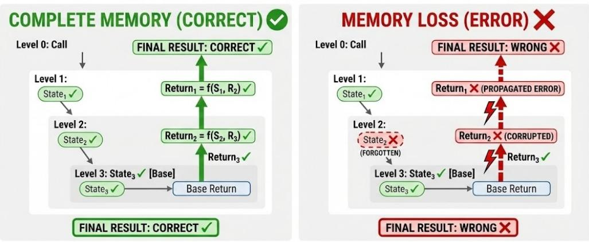

# B. RoPE and Trigonometric Series Connection

In this appendix, we establish the mathematical connection between RoPE (Rotary Position Embedding) and trigonometric series, explaining how attention heads can leverage RoPE to achieve distance-dependent attention patterns.

### B.1. RoPE as Complex Rotation

RoPE applies position-dependent rotations to Query and Key vectors. For a 2D subspace corresponding to frequency ωf , RoPE can be written in complex form:

$$\tilde{q}_f(p) = q_f \cdot e^{i\omega_f p}, \quad \tilde{k}_f(p) = k_f \cdot e^{i\omega_f p}$$
 (14)

where qf , kf ∈ C are the complex representations of Query and Key in frequency band f, and p is the position.

### B.2. General Form of RoPE Attention

The dot product between Query at position pq and Key at position pk in frequency band f is:

$$\operatorname{Re}(\tilde{q}_f(p_q) \cdot \overline{\tilde{k}_f(p_k)}) = \operatorname{Re}(q_f \overline{k_f} \cdot e^{i\omega_f(p_q - p_k)})$$
(15)

Summing over all frequency bands, the attention logit is:

$$\langle q, k \rangle_{\Delta} = \sum_{f} \|q_f\| \|k_f\| \cos(\omega_f \Delta + \phi_f)$$
(16)

where ∆ = pq − pk is the relative position, and ϕf = arg(qf ) − arg(kf ) is the phase difference. Crucially, the coefficients ∥qf ∥∥kf ∥ and phases ϕf depend on the specific Q/K vectors, which vary across different tokens.

### B.3. Special Case: Constant Q/K Yields Trigonometric Series

When pre-RoPE Q and K vectors are constant across tokens, the coefficients become fixed. Using the angle addition formula, the logit reduces to:

$$\langle q, k \rangle_{\Delta} = \sum_{f} \left[ a_f \cos(\omega_f \Delta) + b_f \sin(\omega_f \Delta) \right]$$
 (17)

where the coefficients are now constants:

$$a_f = ||q_f|| ||k_f|| \cos(\phi_f) \tag{18}$$

$$b_f = -\|q_f\| \|k_f\| \sin(\phi_f) \tag{19}$$

This is a trigonometric series in ∆. We note that RoPE frequencies follow a geometric progression ωf = θ −2f/d (where θ = 10000), not the harmonic progression ωn = nω0 of classical Fourier series.

The key insight is that:

- The **frequencies**  $\omega_f$  are predetermined by RoPE (geometric progression)
- When Q/K are constant, the **coefficients**  $(a_f, b_f)$  become fixed constants
- The model can "synthesize" arbitrary distance-dependent attention patterns by learning appropriate Q/K values

#### B.4. From Q/K Concentration to Predictable Distance Preferences

When Q/K vectors are highly concentrated around their centers—as quantified by high Mean Resultant Length R—the expected attention logit can be approximated using these centers:

$$\mathbb{E}[\langle q, k \rangle_{\Delta}] \approx \sum_{f} \|\mathbb{E}[q_f]\| \|\mathbb{E}[k_f]\| \cos(\omega_f \Delta + \phi_f)$$
 (20)

where  $\phi_f = \arg(\mathbb{E}[q_f]) - \arg(\mathbb{E}[k_f])$  is the phase difference between the mean vectors.

This approximation becomes accurate when concentration is high (i.e.,  $R \to 1$ ). In this regime, the Q/K centers fully determine the distance preference curve: different centers produce different attention-vs-distance curves, with peaks at specific Q-K distances. Crucially, these preferences are **predictable** from the centers alone, without observing actual attention scores—this is the key insight exploited by TriAttention.

#### **B.5. Mean Resultant Length**

The Mean Resultant Length R is a standard measure from directional statistics (Mardia & Jupp, 1999) that quantifies how tightly a distribution of vectors concentrates around its mean direction. For a set of unit vectors  $\{u_1, \ldots, u_n\}$ , the mean resultant length is defined as:

$$R = \left\| \frac{1}{n} \sum_{i=1}^{n} u_i \right\| \tag{21}$$

For vectors with varying magnitudes, such as Q/K vectors in attention heads, we generalize this to:

$$R = \frac{\|\mathbb{E}[q]\|}{\mathbb{E}[\|q\|]} \tag{22}$$

where expectations are taken over token positions. This ratio has intuitive bounds:

- R = 1: All vectors point in exactly the same direction (perfect concentration)
- R = 0: Vectors are uniformly distributed in all directions (no concentration)

In practice, we compute  $R_f$  for each frequency band f separately:

$$R_f = \frac{\|\mathbb{E}[q_f]\|}{\mathbb{E}[\|q_f\|]} \tag{23}$$

High  $R_f$  indicates that the trigonometric series approximation is accurate for band f, justifying the use of  $S_{\text{trig}}$ . The weighting factor  $(1 - R_f)$  in  $S_{\text{norm}}$  ensures that norm-based scoring contributes more when concentration is lower.

#### **B.6. Reconstruction Correlation**

To validate that Q/K concentration enables predictable distance preferences, we measure how well the trigonometric series reconstructs actual attention patterns. We define the **Reconstruction Correlation**  $\bar{r}$  as follows.

For a given attention head, let  $\hat{s}(\Delta)$  denote the predicted attention logit at distance  $\Delta$ , computed from Q/K centers via the trigonometric series (Equation 4 in the main text). For each query i, let  $\mathbf{a}_i = (a_{i,1}, a_{i,2}, \ldots)$  be its actual attention logits at distances  $\Delta_1, \Delta_2, \ldots$ , and let  $\hat{\mathbf{s}} = (\hat{s}(\Delta_1), \hat{s}(\Delta_2), \ldots)$  be the corresponding predictions.

The per-query correlation is the Pearson correlation coefficient:

$$r_i = \rho(\mathbf{a}_i, \hat{\mathbf{s}}) = \frac{\text{Cov}(\mathbf{a}_i, \hat{\mathbf{s}})}{\sigma_{\mathbf{a}_i} \sigma_{\hat{\mathbf{s}}}}$$
(24)

*Figure A.* Evaluating memory via recursive simulation. Left: With complete memory, all intermediate states are retained and correct values propagate upward. Right: When an intermediate state is lost (State2), the error propagates through all subsequent return values, corrupting the final result.

The reconstruction correlation r¯ is the average over all queries:

$$\bar{r} = \frac{1}{N} \sum_{i=1}^{N} r_i \tag{25}$$

Distance Sampling. To ensure balanced coverage across distance scales, we sample at logarithmically-spaced distances ∆ ∈ {1, 2, 4, 8, 16, . . .}. This prevents nearby distances (which are numerous) from dominating the correlation and ensures that long-range attention patterns are adequately represented.

### B.7. Dominant Frequency Band Selection

Not all frequency bands contribute equally to the attention logit. We define *dominant bands* as those contributing the most to the expected attention score. For each head, we compute the expected contribution of band f as:

$$C_f = \mathbb{E}[\|q_f\|] \cdot \mathbb{E}[\|k_f\|] \tag{26}$$

where expectations are taken over a calibration dataset.

We rank bands by Cf and select the Top-K bands (typically K = 2) for visualization. These dominant bands account for the majority of the attention logit magnitude. Figures in the main text visualize Q/K distributions in the 2D complex planes corresponding to these dominant bands.

