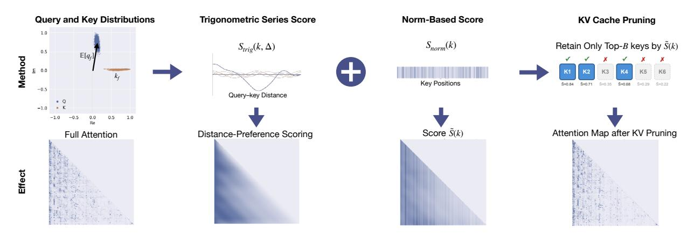

# C. Recursive State Query Benchmark Details

This appendix provides details of the Recursive State Query benchmark used in [§5.2.2.](#page-6-1)

### C.1. Task Definition

Given an undirected graph G = (V, E) and a target step count k, the model simulates k steps of depth-first search starting from a designated node and reports:

- Current node: The node where the traversal currently resides
- Stack state: The complete path from the start node to the current node (in order)
- Visited nodes: All nodes that have been visited during the traversal

Figure B. Method visualization with real attention maps, corresponding to the schematic in Figure 4. **Top row**: The four stages of TriAttention. (1) We compute the Q/K centers  $\mathbb{E}[q]$ ,  $\mathbb{E}[k]$  from pre-RoPE distributions. (2) Using the trigonometric series, we compute  $S_{\text{trig}}$  which scores keys based on distance preference. (3) We add the norm-based score  $S_{\text{norm}}$ , weighted by concentration, to obtain the final score  $\bar{S}(k)$ . (4) We retain top-scoring keys and evict the rest. **Bottom row**: Real attention maps illustrating the scenario described in Figure 4. From left to right: original attention pattern showing distance preference;  $S_{\text{trig}}$  visualization capturing the diagonal structure; combined score  $\bar{S}$  incorporating norm information; attention after KV cache pruning, preserving the essential pattern.

#### C.2. Why DFS for Memory Evaluation

DFS is well-suited for evaluating memory retention because:

- **History dependency**: The stack state depends on the complete traversal history—any intermediate information loss causes errors
- Uniform distribution: Information is uniformly distributed across the sequence rather than concentrated at the beginning or end
- Controllable difficulty: Task difficulty scales directly with step count
- Deterministic: The algorithm is deterministic (neighbors selected in ascending order), providing unique ground truth

### C.3. Evaluation Metric

We use *stack exact match* as the primary metric, which requires the complete path to be correct in order. This is the strictest metric and most sensitive to information loss caused by KV cache pruning.

### C.4. Why Recursion Tests Memory

Figure A illustrates why recursive simulation effectively tests memory retention. Recursive algorithms require the model to first descend through nested calls, then backtrack to produce results. During backtracking, the model must recall intermediate states from earlier in the sequence. If any state is forgotten, the error propagates through all subsequent return values, corrupting the final result.

#### D. Method Visualization

Figure B provides a detailed visualization of the TriAttention pipeline with real attention maps, complementing the schematic overview in Figure 4.

#### E. Comparison with Additional Baselines

We compare TriAttention with additional KV cache compression methods beyond SnapKV and R-KV evaluated in the main text.

Table [A](#page-15-1) compares with LazyEviction [\(Zhang et al.,](#page-10-8) [2025\)](#page-10-8) on AIME24 using DeepSeek-R1-Distill-Qwen-7B at multiple KV budgets, alongside H2O [\(Zhang et al.,](#page-10-2) [2023\)](#page-10-2), TOVA [\(Oren et al.,](#page-9-20) [2024\)](#page-9-20), and RaaS [\(Hu et al.,](#page-9-21) [2025\)](#page-9-21) (results cited from LazyEviction). TriAttention outperforms all methods at every budget, and matches Full Attention at 30% KV budget (46.7%).

|  |  | Table A. Comparison on AIME24 (DeepSeek-R1-Distill-Qwen-7B) at varying KV budgets. ∗Results cited from LazyEviction. |
|--|--|----------------------------------------------------------------------------------------------------------------------|
|  |  |                                                                                                                      |

| Method       | 10%  | 20%  | 30%  |
|--------------|------|------|------|
| FullKV       |      | 46.7 |      |
| H2O∗         | –    | –    | 33.3 |
| TOVA∗        | –    | –    | 36.7 |
| RaaS∗        | –    | –    | 36.7 |
| R-KV∗        | –    | –    | 43.3 |
| LazyEviction | 33.3 | 40.0 | 43.3 |
| TriAttention | 40.0 | 43.3 | 46.7 |

