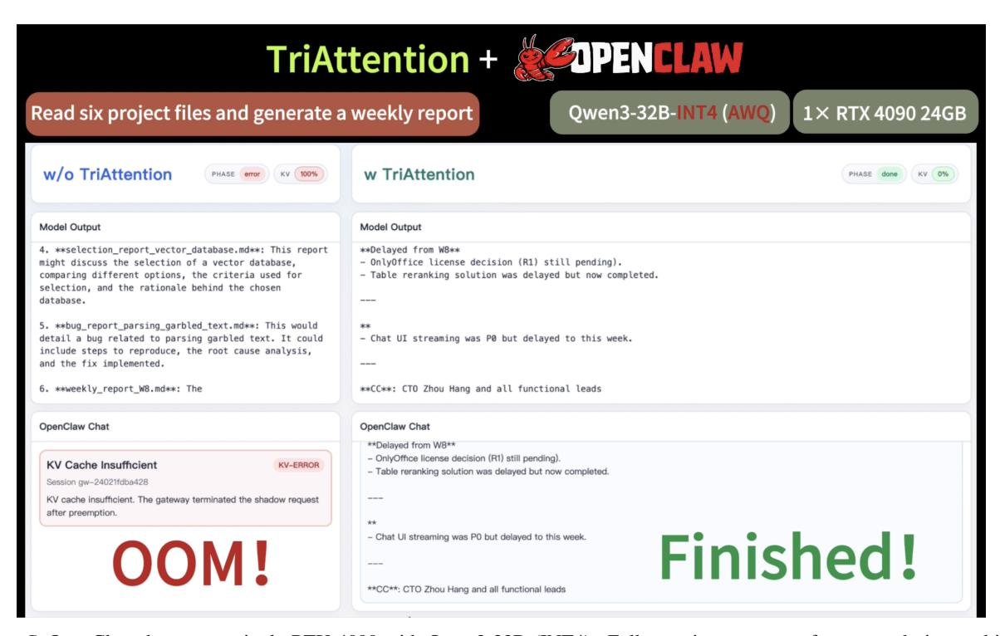

# I. MLA Architecture Validation

To test whether Q/K concentration generalizes beyond standard attention architectures, we evaluate on GLM-4.7-Flash, which uses Multi-head Latent Attention (MLA) with 940 heads. Table [G](#page-17-3) compares reconstruction quality (Pearson r) and directional concentration (MRL) between GQA and MLA architectures.

The MLA architecture shows comparable or stronger concentration and reconstruction quality compared to GQA. Notably, 96.6% of MLA heads achieve R > 0.95 (vs. 84.7% for GQA), indicating that the Q/K concentration phenomenon is

#### TriAttention: Efficient Long Reasoning with Trigonometric KV Compression

*Table B.* LongBench results (Qwen3-8B, 50% KV budget). 16 subtasks spanning QA, summarization, few-shot classification, retrieval, counting, and code. **Bold** = best among compression methods.

|               | QA     |      |      |      |      | Summarization |      |      | Few-shot |      |       | Retr. | Count | Co   | ode  |      |      |
|---------------|--------|------|------|------|------|---------------|------|------|----------|------|-------|-------|-------|------|------|------|------|
| Method        | NarrQA | Qasp | MFQA | HpQA | 2Wik | Musi          | GovR | QMSu | MNew     | TREC | TriQA | SSum  | PaRe  | PaCn | LCC  | ReBe | Avg  |
| Full Attn.    | 28.8   | 43.8 | 55.3 | 62.8 | 48.9 | 35.5          | 33.5 | 24.7 | 24.7     | 40.5 | 90.5  | 40.3  | 91.8  | 9.0  | 64.9 | 60.0 | 47.2 |
| SnapKV        | 26.9   | 37.0 | 45.5 | 59.2 | 46.3 | 33.1          | 32.2 | 23.0 | 23.4     | 40.5 | 89.9  | 41.0  | 91.1  | 7.5  | 66.4 | 59.9 | 45.2 |
| PyramidKV     | 25.9   | 30.4 | 39.1 | 52.2 | 39.9 | 29.7          | 29.9 | 22.2 | 21.9     | 33.5 | 90.0  | 40.7  | 93.4  | 8.0  | 65.7 | 60.2 | 42.7 |
| StreamingLLM  | 24.1   | 30.5 | 31.2 | 46.5 | 41.6 | 21.6          | 30.8 | 21.8 | 23.9     | 43.0 | 85.4  | 38.2  | 55.2  | 10.0 | 64.7 | 61.2 | 39.4 |
| KnormPress    | 17.6   | 24.4 | 40.3 | 29.2 | 26.4 | 14.9          | 28.8 | 21.6 | 20.9     | 50.0 | 81.6  | 41.2  | 79.1  | 7.1  | 31.7 | 47.5 | 35.1 |
| Ada-KV+SnapKV | 27.0   | 36.8 | 45.0 | 59.6 | 47.5 | 34.1          | 31.8 | 23.0 | 23.6     | 46.0 | 90.1  | 40.9  | 90.8  | 8.0  | 65.6 | 59.6 | 45.6 |
| TriAttention  | 28.1   | 43.0 | 51.4 | 60.2 | 44.9 | 36.9          | 32.9 | 23.8 | 24.3     | 69.0 | 90.3  | 39.9  | 91.0  | 7.0  | 65.0 | 61.3 | 48.1 |

Table C. RULER retrieval results (Qwen3-8B, 50% KV, 4K context). **Bold** = best among compression methods.

| Method       | RULER Avg |
|--------------|-----------|
| SnapKV       | 55.6      |
| PyramidKV    | 40.7      |
| StreamingLLM | 61.1      |
| TriAttention | 66.1      |

architecture-general and potentially even more pronounced in MLA.

### J. Real-World Deployment: Agentic Task on a Single GPU

We demonstrate TriAttention in a practical deployment scenario using OpenClaw, a multi-turn agent. We serve Qwen3-32B with AWQ INT4 quantization on a single RTX 4090 (24GB), where model weights alone consume most of the GPU memory, leaving a very limited budget for KV cache. This makes the setup particularly challenging for OpenClaw, since its prompt in the first request has already exceeds 15k tokens, and each interaction round further expands the context as the agent reads and processes six markdown documents to produce a weekly report.

With full attention (baseline), the KV cache grows unboundedly during multi-turn interaction, causing an out-of-memory error before the agent can complete the task. With TriAttention, KV cache compression keeps memory usage within budget throughout the entire session, allowing the agent to successfully read all documents and generate the report. A screenshot of the completed session is shown in Figure C.

*Table D.* Comparison with H2O on LongBench subtasks where H2O fits in 48GB GPU memory (Qwen3-8B, 50% KV). H2O requires materializing the full O(n 2 ) attention matrix and cannot use FlashAttention. Bold = best.

| Method       | Qasp | HpQA | 2Wik | Musi | GovR | QMSu | MNew | TREC | TriQA | SSum | NarrQA | MFQA | Avg  |
|--------------|------|------|------|------|------|------|------|------|-------|------|--------|------|------|
| H2O          | 39.2 | 50.7 | 43.9 | 30.7 | 32.9 | 23.4 | 24.4 | 56.5 | 89.1  | 39.1 | 21.2   | 45.4 | 41.4 |
| TriAttention | 43.0 | 60.2 | 44.9 | 36.9 | 32.9 | 23.8 | 24.3 | 69.0 | 90.3  | 39.9 | 28.1   | 51.4 | 45.4 |

*Table E.* Future offset ablation on Qwen3-8B (AIME24). Top: effect of offset range. Bottom: spacing strategy comparison (17 offsets, range [1, 65536]).

| Max Dist          | #Offsets | Acc  |
|-------------------|----------|------|
| 128               | 8        | 41.7 |
| 4096              | 13       | 48.8 |
| 8192              | 14       | 46.2 |
| 65536             | 17       | 45.8 |
| Linear spacing    |          | 28.7 |
| Geometric spacing |          | 45.8 |

*Table F.* Calibration data sensitivity on Qwen3-8B (AIME24). Top: effect of calibration data size. Bottom: effect of calibration data quality.

| Calibration       | Acc  |
|-------------------|------|
| 50k tokens        | 45.4 |
| 200k tokens       | 45.8 |
| 960k tokens       | 45.8 |
| HTML (low qual.)  | 46.2 |
| Code (mid qual.)  | 43.3 |
| Chat (high qual.) | 46.7 |

*Table G.* Cross-architecture comparison of reconstruction quality (Pearson r) and Q/K concentration (MRL) between GQA (Qwen3-8B) and MLA (GLM-4.7-Flash) architectures.

(A) Reconstruction quality (Pearson r)

(B) Q/K Concentration (MRL)

| Threshold | Qwen3-8B (GQA) | GLM-4.7 (MLA) |
|-----------|----------------|---------------|
| r > 0.90  | 0.8%           | 1.7%          |
| r > 0.70  | 13.0%          | 23.1%         |
| r > 0.50  | 53.5%          | 51.6%         |

| Threshold | Qwen3-8B (GQA) | GLM-4.7 (MLA) |
|-----------|----------------|---------------|
| R > 0.95  | 84.7%          | 96.6%         |
| R > 0.90  | 90.8%          | 99.8%         |

*Figure C.* OpenClaw demo on a single RTX 4090 with Qwen3-32B (INT4). Full attention runs out of memory during multi-turn interaction, while TriAttention completes the task within the GPU memory budget. Full video is available on our GitHub page: <https://github.com/WeianMao/triattention>.