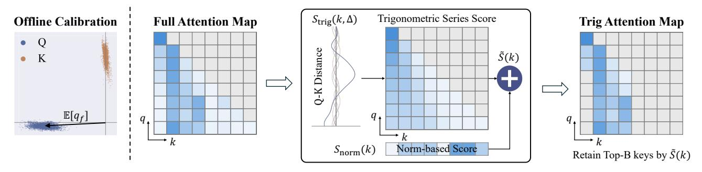

# 3. Pre-RoPE and Trigonometric Series

As outlined in the Introduction, we observe that Q and K vectors in pre-RoPE space are highly concentrated around nonzero centers, and this concentration remains stable across positions and contexts. This is not a property of specific head types, but a prevalent phenomenon across models, as shown in Figure [2\(](#page-1-0)A, C). In this section, we first characterize this concentration ([§3.1\)](#page-2-1), then show how it enables attention patterns to be described by a trigonometric series ([§3.2\)](#page-3-0), and finally validate this through experiments ([§3.3\)](#page-3-1).

### 3.1. The Pre-RoPE Concentration Phenomenon

We examine Q/K distributions in the pre-RoPE space. For each head, we identify its *dominant frequency bands*—the frequencies that contribute most to the attention logit [\(Zhou](#page-10-12) [et al.,](#page-10-12) [2025\)](#page-10-12) (see Appendix [B.7\)](#page-13-0)—and visualize Q/K vectors in the corresponding 2D planes.

*Observation* 3.1 (Prevalent Q/K Concentration)*.* Q and K

Figure 4. Method overview. From left to right: offline calibration computes Q distribution centers; then during inference, original attention is scored by combining  $S_{\text{trig}}$  and norm-based components; the rightmost panel shows the attention map after pruning. We observe that some heads exhibit distance preference—distant keys tend to receive higher attention. However, we also find that certain keys, despite being far from the query, receive little attention due to their low norms. This motivates our two scoring components:  $S_{\text{trig}}$  captures distance preference, while the norm-based score identifies low-norm keys. In this example,  $S_{\text{trig}}$  correctly assigns low scores to nearby keys, while the norm-based score identifies the earliest token (leftmost) as unimportant due to its low norm, despite its maximal distance. Together, they accurately identify tokens that will not be attended to and prune them. See Appendix D for visualizations with real attention maps.

vectors in pre-RoPE space are highly concentrated around non-zero centers across most attention heads. This concentration is stable across different token positions and input contexts, as illustrated in Figure 2(A).

To quantify this concentration, we use the **Mean Resultant Length**  $R = \|\mathbb{E}[q]\|/\mathbb{E}[\|q\|]$ , which measures how tightly vectors concentrate around their mean direction  $(R \to 1 \text{ indicates perfect concentration}; R \to 0 \text{ indicates uniform dispersion}$ ). Figure 2(C) shows that across all heads in Qwen3-8B, the vast majority exhibit R values approaching 1.0, confirming that Q/K concentration is prevalent.

This widespread concentration has important implications: when Q/K vectors are approximately constant, the attention computation simplifies dramatically, as we show next.

#### 3.2. Predictable Distance Preferences

When Q/K vectors are highly concentrated, we can approximate them by their centers. This approximation transforms the attention computation into a trigonometric series that depends only on Q-K distance, making attention patterns predictable from the centers alone.

Consider the RoPE attention formula. For a query q at position  $p_q$  and Key k at position  $p_k$ , RoPE rotates frequency band f at rate  $\omega_f$ . The pre-softmax logit is (see Appendix B):

$$\operatorname{logit}(q, k) = \sum_{f} \|q_f\| \|k_f\| \cos(\omega_f \Delta + \phi_f) \qquad (2)$$

where  $\Delta=p_q-p_k$  is the Q-K distance,  $q_f,k_f\in\mathbb{C}$  are the pre-RoPE components in frequency band f, and  $\phi_f=\arg(q_f)-\arg(k_f)$  is their phase difference.

When Q/K are concentrated, we approximate  $q_f \approx \bar{q}_f$  and  $k_f \approx \bar{k}_f$  (the centers). Since  $\bar{q}_f$  and  $\bar{k}_f$  are constants, the

logit becomes a function of distance alone:

$$logit(\Delta) \approx \sum_{f} \underbrace{\|\bar{q}_{f}\| \|\bar{k}_{f}\|}_{amplitude} cos(\omega_{f}\Delta + \underbrace{\bar{\phi}_{f}}_{phase})$$

$$= \sum_{f} \left[ a_{f} cos(\omega_{f}\Delta) + b_{f} sin(\omega_{f}\Delta) \right]$$
(3)

where coefficients  $a_f$ ,  $b_f$  are determined by the Q/K centers. This is a **trigonometric series** in Q-K distance  $\Delta$ .

Though RoPE frequencies follow a geometric rather than harmonic progression, the principle is analogous to Fourier synthesis: the learned Q/K centers determine the coefficients, which in turn shape the attention-vs-distance curve. Different centers produce different curves—some peak at small distances (local attention), others at large distances (attention sinks). In all cases, the distance preference is encoded in the Q/K centers and can be predicted via the trigonometric series.

#### 3.3. Experimental Validation

We experimentally test whether Q/K concentration causes attention to follow the distance preferences described by the trigonometric series. We compute the series from Q/K centers and check if it reconstructs actual attention. Successful reconstruction confirms this causal link and shows these preferences are predictable from the centers.

We test this on Qwen3-8B across all 1152 attention heads (36 layers  $\times$  32 heads) using a  $\sim$ 10K token sequence. For reconstruction, we compute the mean Q and K vectors from a calibration dataset in the pre-RoPE space—denoted  $\mathbb{E}[q_f]$  and  $\mathbb{E}[k_f]$  for frequency band f—and substitute them into the trigonometric series:

$$\hat{s}(\Delta) = \sum_{f} \|\mathbb{E}[q_f]\| \|\mathbb{E}[k_f]\| \cos(\omega_f \Delta + \phi_f)$$
 (4)

where ϕf = arg(E[qf ])−arg(E[kf ]) is the phase difference between the mean vectors. This yields a predicted attention curve over Q-K distance ∆ (Figure [2\(](#page-1-0)D)).

To quantify prediction quality, we define the Reconstruction Correlation r¯: the mean Pearson correlation between predicted and actual attention logits. For each query, we compute the correlation between its actual logits and the predicted curve, then average across all queries:

$$\bar{r} = \frac{1}{N} \sum_{i=1}^{N} \rho(\mathbf{a}_i, \hat{\mathbf{s}})$$
 (5)

Here ai is the vector of actual attention logits for query i, ˆs is the predicted logits from Equation [4,](#page-3-2) and ρ is Pearson correlation. Both ai and ˆs are evaluated at the same logarithmically-spaced distances ∆ = 1, 2, 4, 8, . . ., ensuring balanced coverage across distance scales.

Figure [2\(](#page-1-0)D) shows an example. For the first head of the first layer—chosen to avoid cherry-picking—the prediction closely tracks actual attention, achieving r¯ = 0.72. Across all heads in three different architectures (Qwen3, Qwen2.5, Llama3), r¯ peaks around 0.6–0.9 in the distribution, with mean values above 0.5; see Figure [3](#page-2-2) for the full distributions. The high correlation across many heads and architectures confirms that the trigonometric series computed from Q/K centers accurately predicts attention patterns. We further find that Q/K concentration is a model-intrinsic property: on Qwen3-8B, measuring MRL across Math, Coding, and Chat domains yields nearly identical values (0.977–0.980), with ∼90% of heads exhibiting R > 0.95 regardless of domain. The same holds across architectures, including MLA (Appendix [I\)](#page-15-0).

