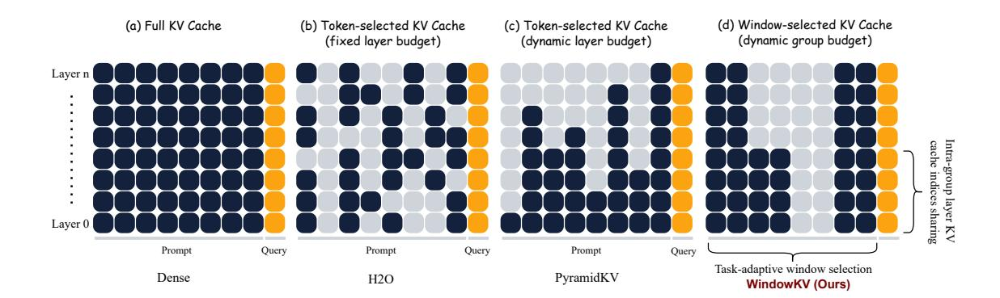

## WindowKV: Task-Adaptive Group-Wise KV Cache Window Selection for Efficient LLM Inference

Youhui Zuo1 , Sibo Wei2 , Chen Zhang1 , Zhuorui Liu1 , Wenpeng Lu2 , Dawei Song1 (B) 1Beijing Institute of Technology, Beijing, China 2Qilu University of Technology (Shandong Academy of Sciences), Jinan, China (B) Corresponding author.

## Abstract

With the advancements in long-context inference capabilities of large language models (LLMs), the KV cache has become one of the foundational components. However, its substantial GPU memory consumption makes KV cache compression a key technique for enabling efficient LLM inference in industrial scenarios. While recent studies have focused on optimizing the memory occupied by the KV cache, they overlook two critical factors: preserving semantic coherence and considering task-specific characteristic during compression. To address these limitations, we propose a novel task-adaptive KV cache window selection method, WindowKV. WindowKV dynamically selects local semantic windows consisting of consecutive tokens, according to taskspecific characteristics, ensuring the retained KV cache captures continuous, essential context. Additionally, we introduce an intra-group layer KV cache indices sharing strategy to reduce computational overhead, achieving a balance between performance and efficiency. We rigorously evaluate WindowKV on the Long-Bench benchmark, and the results demonstrate that it maintains a performance comparable to full KV cache retention while using only 12% of the original KV cache, significantly reducing memory requirements. Furthermore, our method also achieves state-of-the-art results in the Needle-in-a-Haystack evaluation, highlighting its effectiveness and robustness. [1](#page-0-0)

## 1 Introduction

Tasks requiring long-context understanding, such as long-text reading comprehension [\(Trivedi et al.,](#page-7-0) [2022\)](#page-7-0), in-context learning [\(Dong et al.,](#page-6-0) [2024b\)](#page-6-0), document summarization [\(Huang et al.,](#page-6-1) [2021\)](#page-6-1) and code completion [\(Zheng et al.,](#page-7-1) [2023\)](#page-7-1), have gained significant prominence in the era of LLMs. As a result, LLMs that are capable of processing extended context lengths have become increasingly

prevalent [\(Huang et al.,](#page-6-2) [2023\)](#page-6-2). For example, models like GPT-4 and DeepSeek-V3 support context lengths of up to 128K tokens, while Claude-3.5 and Yi extend this capability to 200K tokens [\(Achiam](#page-6-3) [et al.,](#page-6-3) [2023;](#page-6-3) [Liu et al.,](#page-6-4) [2024b;](#page-6-4) [Fu et al.,](#page-6-5) [2024\)](#page-6-5). However, the self-attention mechanism in transformer architectures exhibits quadratic complexity with respect the context length [\(Vaswani,](#page-7-2) [2017\)](#page-7-2), leading to significant increases in inference latency for long-context scenarios. One potential method to mitigate this latency is to cache the key and value (KV) states of previous tokens, thereby avoiding the recomputation of historical contexts [\(Wadding](#page-7-3)[ton et al.,](#page-7-3) [2013\)](#page-7-3). Nevertheless, as both the input context length and the number of layers increase, the memory required to store the KV states increases substantially [\(Luohe et al.,](#page-7-4) [2024\)](#page-7-4). For instance, storing a KV cache for 100K tokens in the LLaMA2-7B model [\(Touvron et al.,](#page-7-5) [2023\)](#page-7-5) demands over 50GB of memory, whereas a 2K token context requires less than 1GB [\(Wu et al.,](#page-7-6) [2024\)](#page-7-6). Overall, KV cache compression is essential to addressing issues such as memory demands, computational efficiency, energy consumption, and costs in LLMs, directly impacting their deployment and application effectiveness in industrial scenarios.

Recent studies have alleviated the aforementioned memory constraints by modifying attention architectures [\(Shazeer,](#page-7-7) [2019;](#page-7-7) [Ainslie et al.,](#page-6-6) [2023;](#page-6-6) [Liu et al.,](#page-6-7) [2024a\)](#page-6-7), or by implementing cross-layer sharing of the KV cache [\(Brandon et al.,](#page-6-8) [2024;](#page-6-8) [Sun et al.,](#page-7-8) [2024;](#page-7-8) [Wu and Tu,](#page-7-9) [2024\)](#page-7-9). However, these approaches require additional training. In contrast, another line of research has focused on compressing the KV cache during the inference phase. For example, some approaches evict the KV states of non-essential tokens under a fixed layer budget [\(Zhang et al.,](#page-7-10) [2023;](#page-7-10) [Xiao et al.,](#page-7-11) [2024;](#page-7-11) [Adnan et al.,](#page-6-9) [2024;](#page-6-9) [Ge et al.,](#page-6-10) [2024\)](#page-6-10). However, these methods overlook differences in attention sparsity between layers. PyramidInfer [\(Yang et al.,](#page-7-12)

1Our code is available at [GitHub.](https://github.com/optim996/WindowKV)

[2024b\)](#page-7-12) and PyramidKV [\(Cai et al.,](#page-6-11) [2024\)](#page-6-11) observe that dense attention is particularly prevalent in the lower layers, while sparse attention dominates in the higher layers [\(Wang et al.,](#page-7-13) [2023\)](#page-7-13). They propose allocating varying KV cache sizes across layers to maintain a pyramid-like structure.

However, the aforementioned methods individually select KV cache tokens, and the selected discrete tokens disrupt the semantic consistency of the context. This also contradicts human reading habits. When processing long texts, humans typically do not read token by token but rather process information in windows [\(Rayner,](#page-7-14) [1998\)](#page-7-14). Moreover, these methods employ a uniform compression strategy across all tasks, limiting their task-specific adaptability and overall performance. In fact, based on human experience, the information processing approaches for different tasks vary significantly. For instance, in a question-answering task, this can be seen as an information localization task [2](#page-1-0) , where the entire window is processed to capture comprehensive semantic details, thus facilitating accurate answer generation. In contrast, in a summarization task, the goal is information aggregation [3](#page-1-1) , where extract the most salient information from each window to generate a concise summary. The challenges outlined above motivate us to propose a task-adaptive KV cache window selection method. Additionally, to enhance computational efficiency, we integrated intra-group layer KV cache indices sharing strategy to better sustain the model's performance under constrained memory budgets.

In summary, our contributions are as follows:

- Different from previous KV cache compression methods that select discrete tokens, we introduce a task-adaptive window selection method, WindowKV. WindowKV dynamically compresses the KV cache based on taskspecific characteristics while preserving the semantic coherence within local windows.
- Additionally, we propose an intra-group layer KV cache indices sharing strategy to reduce computational overhead, achieving a balance between performance and efficiency.

• Extensive experiments are conducted on the LongBench and Needle-in-a-Haystack benchmarks. The results demonstrate that WindowKV achieves the highest number of stateof-the-art results across various backbone LLMs and KV cache configurations on Long-Bench, while also surpassing other baseline methods on the Needle-in-a-Haystack test.

## 2 Methodology

#### 2.1 Overview of KV Cache Compression

In autoregressive transformer-based LLMs, the generation of the i-th token requires the attention module to access the KV states of all preceding i − 1 tokens. To enhance the computational efficiency and avoid redundant calculations, these KV states are stored in the KV cache upon their initial computation. This caching mechanism significantly accelerates the inference process by eliminating the need for repeated computations. However, the KV cache can impose substantial memory demands, particularly for lengthy contexts. As a potential method, KV cache compression has been proposed to save memory while minimizing information loss as much as possible.

## 2.2 WindowKV

In this section, we introduce WindowKV, a novel approach that employs a window level KV cache selection method according to the specific requirements of the task, as shown in Figure [1](#page-2-0) (d). Unlike previous token level methods, our window selection method enhances semantic coherence in long-context inputs, by dynamically adapting to the task's characteristic, prioritizing relevant context, and closely mimicking human information processing. Additionally, to balance performance and efficiency, we integrate an intra-group layer KV cache indices sharing strategy.

## 2.2.1 Task-Adaptive Window Selection

In our method, we retain the last α tokens as an observation window, while the remaining context, referred to as the review context, is divided into multiple review windows. The observation window is utilized to identify important review windows for caching across all layers, tailored to the specific task.

For clarity, we illustrate the attention mechanism using a single head. In a standard LLM, this is

2 Information Localization Task: Identify the critical paragraphs within the given context, and then answer the relevant questions based on the information provided in these critical paragraphs.

3 Information Aggregation Task: Extract essential information from each paragraph and compile it into a cohesive summary.

Figure 1: Comparison of WindowKV with state-of-the-art KV cache compression methods. (a) Full KV retains all tokens in the KV cache for each layer, with cache size growing linearly with input length. (b) H2O maintains a fixed cache size across layers, selecting tokens based on attention scores. (c) PyramidKV adopts a pyramid-shaped cache structure, allocating varying cache budgets to different layers. These methods uniformly apply token level selection strategies across all tasks. (d) WindowKV, in contrast, introduces a task-adaptive window selection method combined with intra-group layer KV cache indices sharing strategy, dynamically allocating group budgets across different groups.

computed as follows:

$$\mathbf{A} = \operatorname{softmax}\left(\frac{\mathbf{Q} \cdot \mathbf{K}^{\mathsf{T}}}{\sqrt{d_k}}\right),\tag{1}$$

where  $d_k$  denotes the dimension of the key states.

To assess the importance of each token within the review context, we compute the attention score for each token based on the attention it receives from the observation window. This is formally expressed as:

$$t_j = \sum_{i \in [n-\alpha,n]} \mathbf{A}_{ij}, \quad j \in [0,n-\alpha], \quad (2)$$

where  $t_j$  represents the score of the j-th token in the review context, n denotes the input context length.

However, this token selection approach disrupts semantic coherence. To preserve semantic coherence and accommodate the variability in human reading patterns across different tasks, we further propose a task-adaptive window selection method. Specifically, in question-answering tasks, which can be viewed as **Information Localization**, humans must comprehend the semantic content of the entire review window to give accurate responses. In contrast, for tasks such as summarization and code completion, which can be viewed as **Information Aggregation**, humans only need to focus on the most critical and relevant context within individual review windows.

The review windows in the context can be repre-

sented as follows:

$$\mathbb{W}_k = \{t_j, \cdots, t_{j+\omega-1}\}, \quad k \in \left[1, \left\lceil \frac{n-\alpha}{\omega} \right\rceil \right],$$
(3)

where  $\omega$  denotes the review window size, window  $\mathbb{W}_k$  consists of tokens  $t_j, \dots, t_{j+\omega-1}$ , and  $\lceil \cdot \rceil$  denotes the ceiling function.

To facilitate this process, a task-adaptive classifier is trained, with detailed training procedures described in Appendix A.3 and A.5. Consequently, the scoring function for evaluating the importance of review windows in the context for a specific task is defined as follows:

$$s_k = \frac{1}{\min(p, \omega)} \cdot \text{sum}(\text{Top-}p(\mathbb{W}_k)), \quad (4)$$

where  $\operatorname{Top-}p(\mathbb{W}_k)=\{t_0',t_1',\cdots,t_{p-1}'\}$  represents the selection of the p tokens with the highest scores from the w tokens in the window. When  $p=\omega$ , it aligns with the information localization task. When  $p<\omega$ , the scenario aligns with the information aggregation task. The task type, identified by the task-adaptive classifier from the input context, is used to invoke the corresponding window selection method. Based on the allocated budget, a subset of high-scoring windows is retained from the review context to maintain the desired budget of KV cache. The detailed budget allocation strategy is described in Section 2.2.3.

However, performing review window selection at every layer is computationally expensive. Ma et al. (Ma et al., 2024) demonstrate that the attention scores of adjacent layers in LLMs exhibit similarity. Additionally, Liu et al. (Liu et al., 2025) proposed a layer-wise index reuse method under fixed layer budgets, which further validates the inter-layer similarity in LLMs. Inspired by the inter-layer similarity characteristics of LLMs, we propose the intra-group layer KV cache indices sharing strategy to optimize the trade-off between performance and efficiency in WindowKV.

## 2.2.2 Efficient Intra-Group Layer KV Cache Indices Sharing Strategy

To enhance the efficiency of review window selection, an intra-group layer KV cache indices sharing strategy is employed.

Assume that the transformer layers of a model are denoted as  $\mathbb{L}=\{l_0,l_1,\ldots,l_{m-1}\}$ , where m represents the number of layers in the model. The layers in  $\mathbb{L}$  are divided into  $H=\frac{m}{\gamma}$  groups, each containing  $\gamma$  layers. For a given group  $\mathbb{G}=\{l_g,l_{g+1},\ldots,l_{g+\gamma-1}\}$ , we apply the method from Section 2.2.1 to perform task-adaptive window selection on the first layer  $l_g$ , obtaining the KV cache indices  $\mathbb{I}_{l_g}$  to be retained for that layer. For the remaining layers in the group  $\{l_{g+1},\ldots,l_{g+\gamma-1}\}$ , they share the same KV cache indices  $\mathbb{I}_{l_g}$  as  $l_g$ .

By adopting this approach, the computational cost can be significantly reduced, as the window selection algorithm is executed only once per group.

#### 2.2.3 Dynamic Budget Allocation

Inspired by PyramidKV (Cai et al., 2024), we allocate budgets to each group using an arithmetic sequence. The total budget for all groups is defined as:

$$b^{\text{total}} = \sum_{h \in [0, H-1]} b^h, \tag{5}$$

where H represents the number of groups.

For all groups  $\{\mathbb{G}_0, \dots, \mathbb{G}_{H-1}\}$ , we first compute the budgets for the top group  $\mathbb{G}_{H-1}$  and the bottom group  $\mathbb{G}_0$  as:

$$b^{H-1} = \frac{b^{\mathrm{total}}}{\lambda \cdot H}$$
 and  $b^0 = \frac{2 \cdot b^{\mathrm{total}}}{H} - b^{H-1},$  (6)

where  $\lambda$  is a hyperparameter that controls the shape of the pyramid. The budgets for the remaining groups are calculated using the following equation:

$$b^{h} = b^{0} - \frac{b^{0} - b^{H-1}}{H-1} \times h.$$
 (7)

Finally, the budget for each group is averagely distributed across all layers within the group.

#### 3 Experiments

## 3.1 Experimental Setup

#### 3.1.1 Backbone LLMs & Benchmarks

Due to computational constraints, we evaluate WindowKV against baseline methods using state-of-the-art open-source LLMs, specifically Qwen2.5-1.5B-Instruct (Yang et al., 2024a) and LLaMA3-8B-Instruct (Touvron et al., 2023). LongBench (Bai et al., 2024) and Needle-in-a-Haystack (Fu et al., 2024) are two widely used benchmarks for evaluating KV cache compression methods. LongBench is specifically designed to assess the ability of language models to handle extended contexts. Needle-in-a-Haystack evaluates a model's ability to locate key information within long input sequences, testing the in-context retrieval capabilities of LLMs across various KV cache compression methods.

#### 3.1.2 Baseline Methods

We compare WindowKV with three state-of-theart methods: **StreamingLLM** (**SLM**) (Xiao et al., 2024), **Heavy Hitter Oracle** (**H2O**) (Zhang et al., 2023) and **PyramidKV** (**PKV**) (Cai et al., 2024), as well as the use of full KV. Among these, SLM and H2O allocate a uniform KV cache size across all layers, while PKV assigns different KV cache sizes to different layers. Each method adopts a distinct KV cache compression strategy. For more detailed information, please refer to Appendix A.2.

