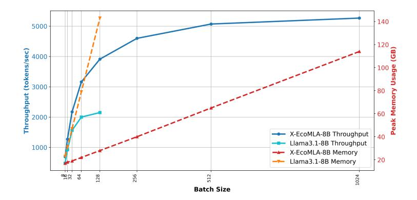

# 4.1 SVD-based Weight Initialization

As introduced in Section [3.2,](#page-2-1) the MLA module comprises several key parameters: *WDQ*, *WUQ*, *WQR*, *WDKV*, *WKR*, *WUK*, and *WUV*. Correct initialization of these matrices is crucial to ensure a smooth transition and to preserve as much of the original model's knowledge as possible. For other parameters such as the output transformation matrix *WO* and the feedforward module, we directly copy them from the pre-trained base model as initialization.

Although MLA and MHA are fundamentally different, MLA closely approximates a low-rank version of MHA if we disregard the positional embedding and intermediate layernorms. Based on this observation, we propose an SVD-based initialization method that initializes the MLA weights using SVD-decomposed low-rank matrices derived from the pre-trained attention weights. Our method is simple and can be illustrated within few lines of pseudocode as shown in Algorithm 1. As demonstrated in our experiments, such straightforward initialization could significantly enhance the knowledge distillation performance compared to random initialization.

For simplicity, we assume the pre-trained attention block employs MHA with weight matrices  $W^Q$ ,  $W^K$ ,  $W^V \in \mathbb{R}^{d \times d_h n_h}$ . However, our method can be readily extended to MQA Shazeer (2019) and GQA Ainslie et al. (2023) by duplicating the key and value weight matrices to align with the total number of attention heads. Our approach supports varying query and key dimensions under the constraint  $d_{qk} = d_r \leq d_h$ . For the value dimension, we assume that the MLA and MHA modules share the same dimensionality  $d_h$ .

To initialize  $W^{DQ}$ ,  $W^{UQ}$  and  $W^{QR}$ , we begin by performing SVD on the pretrained weight matrix  $W^{Q}$  to obtain:

$$W^{Q} = U_q \Sigma_q V_q^T, \tag{8}$$

where  $U_q \in \mathbb{R}^{d \times r_q}$ ,  $\Sigma_q \in \mathbb{R}^{r_q \times r_q}$ , and  $V_q \in \mathbb{R}^{d_h n_h \times r_q}$ . For the down-projection matrix  $W^{DQ}$ , we directly set  $W^{DQ} = U_q$ . For the up-projection matrices, we first compute  $\Sigma_q V_q^T$  and reshape it to  $\overline{W}^{UQR} \in \mathbb{R}^{r_q \times n_h \times d_h}$ . Then we partition it along the last dimension to derive the two up-projection matrices:  $W^{UQ}$  for the first  $d_{qk}$  elements and  $W^{QR}$  for the last  $d_r$ . This can be expressed as:

$$W^{UQ} = \text{reshape}(\overline{W}^{UQR}[:,:,:d_{qk}]), \quad W^{QR} = \text{reshape}(\overline{W}^{UQR}[:,:,-d_r:]), \tag{9}$$

where reshape(.) denotes the reshape function that merges the last two dimensions of the input tensor.

For the remaining MLA weight matrices associated with keys and values, we first perform a joint SVD on the concatenated  $W^K$  and  $W^V$ :

$$[W^K, W^V] = U_{kv} \Sigma_{kv} V_{kv}^T, \tag{10}$$

where  $U_{kv} \in \mathbb{R}^{d \times r_{kv}}$ ,  $\Sigma_{kv} \in \mathbb{R}^{r_{kv} \times r_{kv}}$ , and  $V_{kv} \in \mathbb{R}^{2d_h n_h \times r_{kv}}$ . For the down-projection matrix  $W^{DKV}$ , we directly set  $W^{DKV} = U_{kv}$ . To derive the up-projection matrix  $W^{UV}$ , we set it equal to the last  $d_h n_h$  columns of  $\Sigma_{kv} V'_{kv}$ . For the up-projection matrix for keys  $W^{UK}$ , we first extract the first  $d_h n_h$  columns of  $\Sigma_{kv} V'_{kv}$  and reshape them into  $\overline{W}^{UK} \in \mathbb{R}^{r_{kv} \times n_h \times d_h}$ . Subsequently, we select the first  $d_{qk}$  elements along the last dimension of  $\overline{W}^{UK}$  and reshape it back to obtain  $W^{UK}$ , which can be expressed as:

$$W^{UK} = \text{reshape}(\overline{W}^{UK}[:,:,:d_{ak}]). \tag{11}$$

Lastly, for the RoPE key embedding matrix  $W^{KR}$ , we employ a different initialization strategy as all attention heads share the same RoPE key embedding in MLA. We first compute the average key projection matrix  $W^K_{avg} \in \mathbb{R}^{d \times d_h}$  across all attention heads. Then, we extract the last  $d_r$  columns from it to initialize  $W^{KR}$ , which can be expressed as:

$$W^{KR} = W_{avg}^{K}[:, -d_r:]. (12)$$

Clearly, it is crucial to determine the rank values  $r_q$  and  $r_{kv}$  for the Q and KV matrices. We propose two methods for the rank selection: (i) **Fixed Rank Selection**, where constant rank values are used across all transformer blocks. (ii) **Dynamic Rank Selection**, which determines rank values based on two predefined energy thresholds  $\delta_q$ ,  $\delta_{kv} \in (0,1]$ . Taking  $W_Q$  as an example, we use SVD to decompose it and obtain the singular values:

$$\sigma_{i}, \quad j \in [\min(d, n_{h}d_{h})], \quad \text{where } \sigma_{i} \ge \sigma_{i+1}$$
 (13)

To determine the optimal rank, we define the cumulative energy based on the squared singular values. The rank  $r_{q_i}$  for the *i*-th transformer block is selected as follows:

$$r_{q_i} = \arg\min_{R} \left\{ \sum_{j=1}^{R} \sigma_j^2 \ge \delta_q E \right\}, \quad \text{where } E = \sum_{j=1}^{\min(d, n_h d_h)} \sigma_j^2$$
 (14)

This approach ensures that the selected rank captures at least  $\delta_q$  fraction of the total energy E. The same energy-based dynamic rank selection process can be applied to the KV weight matrix as well.

### 4.2 Training Process

**End-to-End Knowledge Distillation** The primary training stage involves an end-to-end distillation using a Supervised Fine-Tuning (SFT) dataset introduced in Wang et al. (2024a). During this stage, the goal is to minimize the KL divergence loss between the outputs of the student model (i.e., X-EcoMLA) and the teacher model, which can be expressed as:

$$\mathcal{L}_{\theta} = \sum_{t=1}^{T} \mathbf{KL}[p(\cdot|y_{1:t}, x, \theta_T) || p(\cdot|y_{1:t}, x, \theta)], \tag{15}$$

where  $\theta$  is the trainable parameters of the student model and  $\theta_T$  is the parameters of the teacher model, which is kept frozen while the distillation process. Such distillation step is crucial for transferring the rich, pre-trained knowledge from the teacher model. In Section A.5.1, we show that this distillation process is more effective than plain cross-entropy loss. Note that the teacher model can be any strong, pre-trained model—even one that is different from the base Transformer model that is used to construct the student model.

**Direct Preference Optimization (DPO)** In the final training stage, we perform DPO which is a binary cross entropy loss to adjust the preference of the student model. Following Wang et al. (2024a), we set the distilled student model itself as the reference model as it makes the training much stabler and produces a sufficient performance gain, which can be observed from the experiments section.

### 5 Experiments

### 5.1 Experimental Setup

**Model** In this paper, we primarily focus on SmolLM-series models  $^2$  (SmolLM-135M-Instruct, SmolLM-360M-Instruct, SmolLM-1.7B-Instruct) and Llama 3-series models  $^3$  (Llama 3.2-1B-Instruct, Llama 3.2-3B-Instruct, Llama 3.1-8B-Instruct) as our base models which span a variety of scales. All the models employ GQA as their attention module. For MLA, we utilize the same number of attention heads and the same head dimension for values. We tried multiple  $r_q$ ,  $r_{kv}$ , and  $d_{qk}(d_r)$  while maintaining a similar amount of parameters as the base model.

As mentioned earlier, we employ knowledge distillation, transferring knowledge from teacher models to the base model. In our experiments, we explore the impact of different teacher model sizes, including Llama3.2-1B-Instruct, Llama3.2-3B-Instruct, and Llama3.1-8B-Instruct Grattafiori et al. (2024). This approach allows us to analyze how the varying sizes of the teacher model impact the performance and efficiency of the distilled student model.

**Training procedure** Our approach begins with a pre-trained model, so we focus primarily on post-training rather than pre-training the base model again. We use a two-stage training procedure. Specifically, in the first stage (knowledge distillation), our X-EcoMLA model is trained with SFT using the KL loss between the output of the base model and the teacher model. We use AdamW optimizer with  $\beta = (0.9, 0.98)$  and set the training batch size at 96. We use the same dataset as used in the paper Wang et al. (2024a). It is constructed by aggregating and reformatting data from multiple publicly available sources, including *OpenHermes-2.5* Teknium (2023), *GenQA* Chen et al. (2024), and *Infinity-Instruct* of Artificial Intelligence (BAAI). For the second stage (DPO), based on finetuned models, we use the combination of three datasets for DPO preference tuning: *Llama3-ultrafeedback* Wang (2024), *orca\_dpo\_pairs* Lian et al. (2023), and *ultrafeedback\_binarized* Cui et al. (2023). We set the training batch size at 64 and still use AdamW as the optimizer. We unfreeze all parameters in our X-EcoMLA model and train them for one epoch for both SFT and DPO.

#### 5.2 Results

Similar to MambaInLlama Wang et al. (2024a), we adopt the LM Harness Eval benchmark Gao et al. (2023) (branch big-refactor) to perform zero-shot evaluation on 9 different tasks: ARC-Challenge (ARC) Clark et al. (2018), ARC-Easy (ARE) Clark et al. (2018), HellaSwag (HS) Zellers et al. (2019),

&lt;sup>2https://huggingface.co/collections/HuggingFaceTB/smollm-6695016cad7167254ce15966

&lt;sup>3https://huggingface.co/collections/meta-Llama/Llama-32-66f448ffc8c32f949b04c8cf

| Model and Setting | Init. Method                     | KV-Size | ARC   | ARE   | HS    | MMLU  | OBQA  | PIQA  | PBMD  | RA    | WG    | Avg.  |
|-------------------|----------------------------------|---------|-------|-------|-------|-------|-------|-------|-------|-------|-------|-------|
| SmolLM135M-Inst   | Base Model                       | 100%    | 27.39 | 43.64 | 41.91 | 24.11 | 33.80 | 67.30 | 55.80 | 32.06 | 51.22 | 41.91 |
| ↑X-EcoMLA         | Random ( $r_{kv} = 160$ )        | 50%     | 21.08 | 30.68 | 25.27 | 22.95 | 25.00 | 53.54 | 55.20 | 22.87 | 49.57 | 34.03 |
| ↑X-EcoMLA + DPO   | Random ( $r_{kv} = 160$ )        | 50%     | 21.59 | 30.56 | 25.17 | 22.95 | 26.20 | 53.97 | 55.20 | 22.97 | 49.33 | 34.22 |
| ↑X-EcoMLA         | Fixed ( $r_{kv} = 160$ )         | 50%     | 27.05 | 43.31 | 40.10 | 24.51 | 31.80 | 66.97 | 55.40 | 31.39 | 51.30 | 41.31 |
| ↑X-EcoMLA + DPO   | Fixed ( $r_{kv} = 160$ )         | 50%     | 28.24 | 45.33 | 40.26 | 26.20 | 33.60 | 65.89 | 55.60 | 32.63 | 50.36 | 42.01 |
| ↑X-EcoMLA         | Dynamic ( $\delta_{kv} = 0.85$ ) | 49.5%   | 26.88 | 43.52 | 39.84 | 24.50 | 31.80 | 67.08 | 55.00 | 31.87 | 51.62 | 41.35 |
| ↑X-EcoMLA + DPO   | Dynamic ( $\delta_{kv} = 0.85$ ) | 49.5%   | 27.99 | 45.29 | 40.46 | 25.84 | 33.40 | 65.51 | 55.20 | 32.73 | 50.28 | 41.86 |
| SmolLM360M-Inst   | Base Model                       | 100%    | 32.76 | 56.10 | 52.74 | 24.37 | 37.00 | 70.51 | 55.40 | 33.59 | 54.06 | 46.28 |
| ↑X-EcoMLA         | Random $(r_{kv} = 288)$          | 50%     | 22.10 | 36.36 | 26.72 | 23.22 | 25.00 | 55.60 | 55.20 | 23.25 | 48.38 | 35.09 |
| ↑X-EcoMLA + DPO   | Random ( $r_{kv} = 288$ )        | 50%     | 22.61 | 35.61 | 27.12 | 23.19 | 26.60 | 56.26 | 54.80 | 23.64 | 49.57 | 35.49 |
| ↑X-EcoMLA         | Fixed ( $r_{kv} = 288$ )         | 50%     | 33.11 | 54.55 | 50.77 | 23.26 | 36.60 | 71.06 | 55.40 | 31.96 | 54.14 | 45.65 |
| ↑X-EcoMLA + DPO   | Fixed ( $r_{kv} = 288$ )         | 50%     | 34.39 | 55.77 | 51.93 | 25.68 | 38.60 | 69.37 | 55.20 | 33.88 | 53.35 | 46.46 |
| ↑X-EcoMLA         | Dynamic ( $\delta_{kv} = 0.88$ ) | 49.3%   | 32.85 | 54.38 | 50.96 | 23.47 | 37.40 | 71.11 | 55.40 | 31.67 | 54.62 | 45.76 |
| ↑X-EcoMLA + DPO   | Dynamic ( $\delta_{kv} = 0.88$ ) | 49.3%   | 34.64 | 54.97 | 51.75 | 25.45 | 38.80 | 69.59 | 55.20 | 33.88 | 54.06 | 46.48 |
| Llama3.2-1B-Inst  | Base Model                       | 100%    | 37.97 | 63.51 | 60.77 | 46.09 | 35.00 | 74.37 | 60.20 | 38.09 | 59.67 | 52.85 |
| ↑X-EcoMLA         | Random $(r_{kv} = 512)$          | 53.1%   | 35.32 | 60.48 | 54.03 | 27.77 | 35.20 | 71.98 | 55.80 | 33.88 | 55.01 | 47.72 |
| ↑X-EcoMLA + DPO   | Random ( $r_{kv} = 512$ )        | 53.1%   | 38.99 | 62.71 | 56.20 | 28.04 | 36.80 | 73.39 | 56.40 | 36.27 | 56.20 | 49.44 |
| ↑X-EcoMLA         | Fixed ( $r_{kv} = 512$ )         | 53.1%   | 36.95 | 63.89 | 58.88 | 43.40 | 36.00 | 74.16 | 58.20 | 37.32 | 60.30 | 52.12 |
| ↑X-EcoMLA + DPO   | Fixed ( $r_{kv} = 512$ )         | 53.1%   | 39.93 | 63.89 | 60.73 | 42.39 | 37.80 | 74.92 | 58.80 | 40.77 | 60.54 | 53.31 |
| ↑X-EcoMLA         | Dynamic ( $\delta_{kv} = 0.95$ ) | 54.7%   | 37.12 | 63.64 | 58.87 | 43.26 | 34.40 | 73.72 | 60.00 | 37.51 | 60.22 | 52.08 |
| ↑X-EcoMLA + DPO   | Dynamic ( $\delta_{kv} = 0.95$ ) | 54.7%   | 41.21 | 64.86 | 60.96 | 42.86 | 37.60 | 74.43 | 58.60 | 39.23 | 58.33 | 53.12 |
| Llama3.2-3B-Inst  | Base Model                       | 100%    | 45.90 | 67.76 | 70.36 | 60.46 | 36.20 | 75.57 | 69.60 | 40.77 | 67.17 | 59.31 |
| ↑X-EcoMLA         | Random $(r_{kv} = 816)$          | 43%     | 41.64 | 67.34 | 65.11 | 46.97 | 36.40 | 75.24 | 61.6  | 39.04 | 63.69 | 55.23 |
| ↑X-EcoMLA + DPO   | Random ( $r_{kv} = 816$ )        | 43%     | 44.80 | 69.78 | 67.01 | 47.37 | 38.80 | 76.01 | 62.60 | 40.00 | 64.80 | 56.80 |
| ↑X-EcoMLA         | Fixed ( $r_{kv} = 816$ )         | 43%     | 43.09 | 67.76 | 69.54 | 56.96 | 37.00 | 75.84 | 66.00 | 41.34 | 67.48 | 58.33 |
| ↑X-EcoMLA + DPO   | Fixed ( $r_{kv} = 816$ )         | 43%     | 48.21 | 70.45 | 72.24 | 57.42 | 38.40 | 76.55 | 66.80 | 46.22 | 68.59 | 60.54 |
| ↑X-EcoMLA         | Dynamic ( $\delta_{kv} = 0.95$ ) | 43%     | 42.75 | 66.41 | 69.59 | 57.47 | 36.80 | 75.46 | 67.60 | 42.30 | 68.03 | 58.49 |
| ↑X-EcoMLA + DPO   | Dynamic ( $\delta_{kv} = 0.95$ ) | 43%     | 48.46 | 69.99 | 72.26 | 57.73 | 39.40 | 75.79 | 68.40 | 46.32 | 65.90 | 60.47 |

Table 1: Zero-shot evaluation of self-distilled X-EcoMLA with different initialization methods (random, SVD with fixed/dynamic rank selection) and base models on the LM Harness Eval benchmark across nine tasks: ARC-Challenge (ARC), ARC-Easy (ARE), HellaSwag (HS), MMLU, OpenBookQA (OBQA), PIQA, PubMedQA (PBMD), RACE (RA), and WinoGrande (WG). († denotes upcycling the "Base Model".)

MMLU (MM) Hendrycks et al. (2020), OpenBookQA (OBQA) Mihaylov et al. (2018), PIQA Bisk et al. (2020), PubMedQA (PBMD) Jin et al. (2019), and RACE (RA) Lai et al. (2017), WinoGrande (WG) Sakaguchi et al. (2021).

**Self-distillation Evaluation** Table 1 shows the benchmark performance of our proposed X-EcoMLA when we use the base models themselves as the teacher model, which we refer to as self-distillation. We evaluate three different initialization settings: (i) Fixed rank selection with random initialization, (ii) Fixed rank selection with SVD initialization, and (iii) Dynamic rank selection with SVD initialization. For all experiments, we set  $d_{qk} = d_r = 32$  and adjust  $r_q$ ,  $r_{kv}$ ,  $\delta_q$ , and  $\delta_{kv}$  accordingly to achieve around 50% KV cache compression while ensuring the total number of parameters after the MLA upcycling remain roughly the same. For each scenario, we evaluate training with the full dataset (6.8B tokens for SFT and 0.2B tokens for DPO) and it is observed that DPO significant boosts the distillation performance. For fixed rank selection schemes, it is evident that SVD initialization significantly enhances distillation performance compared to random initialization, yielding 22.8% and 30.91% improvements for SmolLM models and 8.1% and 6.5% improvements for Llama 3.2 models. Such observation demonstrates the necessity of applying our SVD initialization method to inherit the knowledge from the pre-trained targe models. For dynamic rank selection schemes, we observe similar performance as the fix rank selection in most experiments, which demonstrates its effectiveness. Note that our X-EcoMLA + DPO could always achieve better performance than the pre-trained base models with only 43% - 54.7% KV cache sizes.

**Extreme KV Cache Compression with Larger Teacher** Table 2 presents the impact of KV Cache compression on model accuracy across various benchmarks. For more details, please refer to Appendix A.4.4 and Table 11. We adopt Llama3.2-1B-Instruct as the base model and progressively reduce the KV cache size of our X-EcoMLA from 53.1% to 7.81%. With the same base model as our teacher, we observe a consistent accuracy drop across most evaluation tasks, which demonstrates the trade-off between reducing memory consumption and maintaining model accuracy.

However, our results reveal that such performance degradation from extreme KV cache compression can be mitigate if we utilize larger teacher models such as Llama3.2-3B-Instruct and Llama3.1-8B-Instruct. For instance, when reducing the KV cache to 15.6%, using Llama3.1-8B-Inst as the

| Model and Setting | Teacher          | Param   | Tokens                 | ARC           | ARE        | HS                    | MMLU       | OBQA               | PIQA  | PBMD  | RA    | WG    | Avg.  |
|-------------------|------------------|---------|------------------------|---------------|------------|-----------------------|------------|--------------------|-------|-------|-------|-------|-------|
| Llama3.2-1B-Inst  | -                | 1.24B   | -                      | 37.97         | 63.51      | 60.77                 | 46.09      | 35.00              | 74.37 | 60.20 | 38.09 | 59.67 | 52.85 |
|                   | 100              | 0% MLA  | Layers (r              | $k_v = 512$   | $r_q = 80$ | 54, d qk = | = 32) - KV | Size: <b>53.</b> 1 | %     |       |       |       |       |
| ↑X-EcoMLA + DPO   | Llama3.2-1B-Inst | 1.23B   | 3.6B                   | 39.93         | 63.51      | 60.52                 | 41.58      | 37.20              | 73.99 | 59.80 | 40.48 | 60.38 | 53.04 |
| ↑X-EcoMLA + DPO   | Llama3.2-3B-Inst | 1.23B   | 3.6B                   | 42.75         | 64.81      | 62.04                 | 43.88      | 37.40              | 73.72 | 59.20 | 41.44 | 61.48 | 54.08 |
| ↑X-EcoMLA + DPO   | Llama3.1-8B-Inst | 1.23B   | 3.6B                   | 44.03         | 68.86      | 63.49                 | 43.81      | 37.40              | 73.94 | 61.40 | 41.82 | 61.40 | 55.13 |
|                   | 100              | % MLA   | Layers (rk             | v = 256       | $r_q = 11$ | 84, d qk : | = 32) - KV | Size: 28.          | 1%    |       |       |       |       |
| ↑X-EcoMLA + DPO   | Llama3.2-1B-Inst | 1.23B   | 3.6B                   | 40.02         | 63.26      | 58.74                 | 39.79      | 36.40              | 72.80 | 55.60 | 40.19 | 60.38 | 51.91 |
| ↑X-EcoMLA + DPO   | Llama3.2-3B-Inst | 1.23B   | 3.6B                   | 40.70         | 64.35      | 60.10                 | 41.77      | 37.20              | 73.83 | 57.80 | 39.23 | 61.17 | 52.91 |
| ↑X-EcoMLA + DPO   | Llama3.1-8B-Inst | 1.23B   | 3.6B                   | 41.98         | 66.46      | 61.33                 | 41.78      | 37.20              | 74.27 | 59.00 | 40.00 | 60.69 | 53.63 |
|                   | 100              | % MLA   | Layers (r k | v = 128       | $r_q = 13$ | 44, d qk : | = 32) - KV | Size: 15.          | 6%    |       |       |       |       |
| ↑X-EcoMLA + DPO   | Llama3.2-1B-Inst | 1.23B   | 3.6B                   | 39.16         | 61.83      | 57.27                 | 37.85      | 36.20              | 73.45 | 56.40 | 40.19 | 60.06 | 51.38 |
| ↑X-EcoMLA + DPO   | Llama3.2-3B-Inst | 1.23B   | 3.6B                   | 39.42         | 62.88      | 58.41                 | 39.45      | 37.20              | 73.39 | 58.00 | 39.71 | 59.75 | 52.02 |
| ↑X-EcoMLA + DPO   | Llama3.1-8B-Inst | 1.23B   | 3.6B                   | 41.30         | 65.61      | 59.64                 | 39.47      | 37.60              | 74.27 | 59.20 | 39.52 | 59.83 | 52.94 |
| ↑X-EcoMLA + DPO   | Llama3.2-1B-Inst | 1.23B   | 7B                     | 40.10         | 62.88      | 58.17                 | 39.70      | 37.80              | 73.50 | 56.60 | 39.33 | 59.67 | 51.97 |
| ↑X-EcoMLA + DPO   | Llama3.2-3B-Inst | 1.23B   | 7B                     | 39.33         | 64.86      | 58.92                 | 41.86      | 37.40              | 73.83 | 58.80 | 39.71 | 59.59 | 52.70 |
| ↑X-EcoMLA + DPO   | Llama3.1-8B-Inst | 1.23B   | 7B                     | 42.49         | 67.13      | 60.58                 | 42.51      | 36.60              | 73.99 | 59.40 | 40.38 | 59.43 | 53.61 |
|                   | 10               | 00% MLA | Layers (r              | $t_{kv} = 64$ | $r_q = 14$ | 24, d qk : | = 32) - KV | Size: <b>9.4</b>   | %     |       |       |       |       |
| ↑X-EcoMLA + DPO   | Llama3.2-1B-Inst | 1.23B   | 7B                     | 39.16         | 62.63      | 56.04                 | 34.90      | 36.40              | 72.85 | 56.40 | 37.70 | 58.33 | 50.49 |
| ↑X-EcoMLA + DPO   | Llama3.2-3B-Inst | 1.23B   | 7B                     | 37.97         | 63.55      | 56.95                 | 37.54      | 35.40              | 72.74 | 57.00 | 38.66 | 59.27 | 51.01 |
| ↑X-EcoMLA + DPO   | Llama3.1-8B-Inst | 1.23B   | 7B                     | 39.85         | 67.13      | 58.45                 | 38.51      | 37.40              | 73.83 | 58.00 | 39.81 | 59.27 | 52.47 |
|                   | 100              | 0% MLA  | Layers (r              | $k_v = 48$ ,  | $r_q = 14$ | $40, d_{qk} =$        | = 32) - KV | Size: 7.81         | %     |       |       |       |       |
| ↑X-EcoMLA + DPO   | Llama3.2-1B-Inst | 1.23B   | 7B                     | 38.48         | 61.66      | 55.32                 | 30.62      | 35.20              | 72.36 | 56.60 | 37.99 | 59.43 | 49.74 |
| ↑X-EcoMLA + DPO   | Llama3.2-3B-Inst | 1.23B   | 7B                     | 36.18         | 62.21      | 55.82                 | 36.41      | 35.60              | 72.03 | 57.00 | 38.09 | 60.06 | 50.38 |
| ↑X-EcoMLA + DPO   | Llama3.1-8B-Inst | 1.23B   | 7B                     | 37.71         | 65.32      | 57.32                 | 36.27      | 36.80              | 72.96 | 58.20 | 38.76 | 58.80 | 51.35 |
|                   |                  |         |                        |               |            |                       |            |                    |       |       |       |       |       |

Table 2: Impact of KV-cache compression and teacher model size on performance. Reducing the KV-cache size lowers accuracy, but larger teacher models help recover performance. DPO further improves alignment and accuracy. (↑ denotes upcycling the base model.)

teacher recovers 1.56 of the average score (52.94 vs. 51.38) when trained with half of the dataset (3.6B tokens). With the larger teacher, our X-EcoMLA achieves even better performance than the pre-trained base model with only 15.6% KV cache size and 3.6B training tokens. As we increase the training tokens to 7B, we could even push the KV cache compression ratio to 9.4% without significant performance degradation compared to the pre-trained base model (52.47 vs. 52.85). These results highlight the effectiveness of leveraging larger teachers and preference tuning to resolve the adverse effects of extreme KV cache compression while maintaining strong accuracy across multiple NLP benchmarks.

**Scalability to Larger Models** We have extended X-EcoMLA to two 8B-parameter models (Llama3-8B and Llama3.1-8B). The results in Table 3 demonstrate that even under aggressive KV cache compression, X-EcoMLA maintains performance very close to the full-scale baseline. Notably, at KV-size 10.94%, performance remains nearly on par with the full model.

| Model                                              | KV-size | Avg.  | ARC   | ARE   | HS    | MM    | OBQA  | PIQ   | PM    | RA    | WG    |
|----------------------------------------------------|---------|-------|-------|-------|-------|-------|-------|-------|-------|-------|-------|
| Llama3-8B-Inst (Base)                              | 100%    | 65.78 | 56.66 | 81.61 | 75.81 | 63.82 | 42.60 | 78.62 | 75.00 | 46.03 | 71.90 |
| $\uparrow$ <b>X-EcoMLA (Ours;</b> $r_{kv} = 256$ ) | 15.63%  | 65.16 | 54.69 | 81.02 | 75.69 | 59.20 | 44.40 | 77.91 | 74.80 | 48.04 | 70.72 |
| Llama3.1-8B-Inst (Base)                            | 100%    | 66.63 | 54.86 | 79.55 | 79.23 | 68.13 | 43.00 | 80.90 | 75.40 | 44.69 | 73.88 |
| $\uparrow$ <b>X-EcoMLA (Ours;</b> $r_{kv} = 160$ ) | 10.94%  | 65.85 | 57.17 | 80.35 | 77.57 | 60.13 | 43.00 | 79.16 | 76.20 | 47.85 | 71.19 |

Table 3: Performance of X-EcoMLA with 8B models under aggressive KV cache compression

**System-Level Inference Metrics** We evaluate system-level performance in terms of throughput (sequences/sec) and peak GPU memory usage (GB) for both the baseline model (Llama3.1-8B) and our proposed model, X-EcoMLA-8B ( $r_{kv} = 128, 10.67 \times \text{KV}$  compression), across a range of batch sizes. All experiments are conducted on identical hardware (single AMD MI300 GPU) under consistent settings. As shown in Fig. 2, X-EcoMLA-8B achieves approximately  $1.7 \times \text{to } 2 \times \text{higher}$  throughput than the baseline across all batch sizes. In terms of memory efficiency, X-EcoMLA-8B substantially reduces peak memory consumption. For instance, at batch size 128, Llama3.1-8B consumes 143 GB of memory and fails to run larger batches, whereas X-EcoMLA-8B requires only 28 GB—representing a  $5 \times \text{reduction}$ . These results demonstrate that X-EcoMLA-8B not only maintains strong model accuracy but also delivers significant system-level improvements—achieving higher

Figure 2: System-level inference performance for Llama3.1-8B and X-EcoMLA-8B on 8×AMD MI300 GPUs. X-EcoMLA enables higher throughput and drastically reduced memory usage across batch sizes. Llama3.1-8B runs out-of-memory (OOM) beyond batch size 128, while X-EcoMLA scales smoothly up to batch size 1024.

throughput and dramatically lower memory usage. This makes it well-suited for latency-sensitive and memory-constrained deployment scenarios.

**Comparison with Existing Post-Training Low-Rank Methods** We conducted experiments to compare our solution with two of the most recent SOTA methods — MHA2MLA Ji et al. (2025) and PALU Chang et al. (2025) — and to clarify how X-EcoMLA improves upon these approaches.

**1. Comparison with MHA2MLA Baseline Setup** To more comprehensively evaluate the effectiveness of X-EcoMLA, we compare it against MHA2MLA Ji et al. (2025) under both continual pretraining and supervised fine-tuning (SFT) settings using the SmolLM 1.7B model. As SmolLM is originally built with MHA-based attention, this evaluation also demonstrates that X-EcoMLA can be seamlessly integrated into existing MHA-based architectures.

In the continual pretraining setting, we evaluate X-EcoMLA on the SmolLM 1.7B *base* model using a 12.5% KV cache size, following the same 6B-token training budget as the released MHA2MLA checkpoint4. We compare four configurations: (1) the full-attention baseline (100% KV cache), (2) MHA2MLA continually pretrained, (3) X-EcoMLA pretrained without a teacher, and (4) X-EcoMLA with self-distillation. Table 4 (top) summarizes the results where X-EcoMLA without a teacher achieves an average score of 51.94, slightly outperforming MHA2MLA (51.69) by +0.25. When using self-distillation, the accuracy improves to 52.87, reducing the gap to the full-attention baseline.

In the supervised fine-tuning setting, we use identical SFT data and compare performance under two KV compression ratios: 12.5% and 50%. We use SmolLM 1.7B-Instruct as both student and teacher for X-EcoMLA, and follow the joint-SVD +  $S_{higher}$  variant for MHA2MLA. As shown in Table 4 (bottom), X-EcoMLA outperforms MHA2MLA across both compression levels. At 12.5% KV size, X-EcoMLA achieves 49.34 vs. 48.19 (+1.15), and at 50%, it reaches 50.15 vs. 49.79 (+0.36).

We attribute this performance gain to a key architectural difference: the RoPE (Rotary Position Embedding) design. MHA2MLA stores separate Key-RoPE vectors per head. Under a fixed budget (e.g., 32 dimensions per token), each head receives only  $\frac{32}{n_h}$  RoPE dimensions. In contrast, X-EcoMLA adopts the unified RoPE approach used in DeepSeek MLA, where all heads share a single Key-RoPE vector. This allows each head to fully leverage all 32 dimensions, offering  $8 \times$  more positional encoding capacity in an 8-head setup—crucial for preserving performance under aggressive compression.

**2. Comparison with PALU** PALU Chang et al. (2025) represents a recent state-of-the-art approach for low-rank KV-cache compression. It decomposes the linear projection layers into low-rank matrices, caches the compressed intermediate states, and reconstructs the full keys and values on the fly during inference. To evaluate the effectiveness of X-EcoMLA, we compare X-EcoMLA against PALU using the Llama3-8B-Instruct model.

4https://huggingface.co/fnlp/SmolLM-1B7-MLA-d\_kv\_8

| Method                                          | KV Size | Avg. Acc. | ARC   | ARE   | HS    | MM    | OBQA  | PIQA  | PM    | RA    | WG    |
|-------------------------------------------------|---------|-----------|-------|-------|-------|-------|-------|-------|-------|-------|-------|
| SmolLM 1.7B (Base)                              | 100%    | 54.67     | 46.42 | 73.48 | 65.74 | 27.73 | 42.00 | 76.06 | 62.60 | 37.03 | 60.93 |
| MHA2MLA Ji et al. (2025)                        | 12.5%   | 51.69     | 41.55 | 69.57 | 61.43 | 24.63 | 39.00 | 74.70 | 60.20 | 35.69 | 58.41 |
| $\uparrow$ X-EcoMLA-pretrain ( $r_{kv} = 480$ ) | 12.5%   | 51.94     | 40.19 | 69.36 | 62.52 | 23.79 | 40.00 | 75.30 | 61.40 | 35.89 | 59.04 |
| $\uparrow$ X-EcoMLA ( $r_{kv} = 480$ )          | 12.5%   | 52.87     | 42.41 | 72.14 | 62.84 | 25.55 | 41.40 | 75.19 | 61.40 | 36.27 | 58.64 |
| SmolLM 1.7B-Ins (Base)                          | 100%    | 50.49     | 37.71 | 62.96 | 60.81 | 25.86 | 39.80 | 73.50 | 60.80 | 36.17 | 56.83 |
| MHA2MLA (SFT)                                   | 12.5%   | 48.19     | 35.07 | 60.94 | 56.18 | 23.36 | 36.40 | 72.36 | 57.20 | 34.83 | 57.38 |
| $\uparrow$ X-EcoMLA (SFT, $r_{kv} = 480$ )      | 12.5%   | 49.34     | 37.29 | 62.96 | 59.05 | 23.68 | 38.00 | 72.52 | 59.80 | 34.64 | 56.12 |
| MHA2MLA (SFT)                                   | 50%     | 49.79     | 37.63 | 62.29 | 59.60 | 24.09 | 38.20 | 74.05 | 60.40 | 34.35 | 57.46 |
| $\uparrow$ X-EcoMLA (SFT, $r_{kv} = 2016$ )     | 50%     | 50.15     | 37.97 | 64.06 | 60.23 | 24.89 | 39.00 | 73.34 | 60.20 | 34.93 | 56.75 |

Table 4: Comparison between X-EcoMLA and MHA2MLA a under both continual pretraining (top) and supervised fine-tuning (bottom) settings on the SmolLM 1.7B model.

Following the experimental protocol described in Section 4.2 of the PALU paper, we evaluate zero-shot performance on the used subset of the LM Harness Eval benchmark using PALU's best-performing configurations: G-LRD and J-LRD, both operating at a 50% KV compression ratio. Reported PALU results are taken directly from their paper. The results, summarized in Table 5, show that X-EcoMLA achieves an average accuracy of 67.34 at only 15.63% KV cache size. This performance is nearly on par with the full model (67.87) and clearly outperforms both PALU-J-LRD (66.19) and PALU-G-LRD (64.45), with respective gains of +1.15 and +2.89 points—despite using approximately  $3 \times$  less KV storage.

| Model                 | KV-Size | Avg Acc. | ARC   | ARE   | HS    | OBQA  | PIQA  | WG    |
|-----------------------|---------|----------|-------|-------|-------|-------|-------|-------|
| Llama3-8B-Inst (Base) | 100%    | 67.87    | 56.66 | 81.61 | 75.81 | 42.60 | 78.62 | 71.90 |
| PALU-J-LRD            | 50%     | 66.19    | 51.96 | 79.63 | 73.20 | 43.40 | 76.50 | 72.45 |
| PALU-G-LRD            | 50%     | 64.45    | 48.99 | 76.30 | 70.36 | 42.60 | 76.06 | 72.38 |
| †X-EcoMLA (Ours)      | 15.63%  | 67.34    | 54.69 | 81.02 | 75.69 | 44.40 | 77.53 | 70.72 |

Table 5: Comparison between X-EcoMLA and PALU baselines on Llama3-8B. Despite operating at a significantly lower KV size (15.63%), X-EcoMLA matches or outperforms 50%-KV SOTA methods.

**Expanded Discussion and Experimental Details** The Appendix provides additional context and supporting results that complement the main paper. In Section A.1, we present a more detailed discussion of related work on KV cache compression, training-based memory-efficient architectures, and upcycling techniques. Section A.2 outlines the pseudocode for our proposed SVD-based initialization strategy for MLA layers. Hyperparameter for both fixed and dynamic rank selection are reported in Section A.3, helping to guide practical configurations. Section A.4 includes supplementary evaluations: long-context benchmarks on LongBench (Section A.4.1); comparisons with H2O as an alternative KV cache compression method (Section A.4.2); hybrid MLA variants that combine attention and MLA layers (Section A.4.3); and detailed results from our extreme KV cache compression experiments (Section A.4.4). In Section A.5, we present ablation studies, analyzing the impact of distillation loss versus direct supervision (Section A.5.1), the role of LayerNorm (Section A.5.2), and the trade-off between larger teacher models and longer training (Section A.5.3). Collectively, these sections provide deeper insights into the design choices and empirical robustness of X-EcoMLA across diverse settings and compression budgets.

### 6 Conclusion

In this work, we introduced X-EcoMLA, a lightweight post-training adaptation approach that enables the upcycling of pre-trained Transformer attention into an efficient MLA or hybrid variant. By leveraging dark knowledge from a well-trained teacher model and employing SVD-based initialization, our method significantly reduces KV cache memory requirements without sacrificing model performance. Our results show that using an 8B teacher model allows us to compress the KV cache size of the Llama3.2-1B-Instruct baseline by 6.4× while preserving 100% of its average score across multiple tasks on the LM Harness Evaluation benchmark. This is achieved with only 3.6B training tokens and about 70 GPU hours on AMD MI300 GPUs. Alternatively, we can compress KV cache by 10.6× using 7B training tokens over approximately 140 GPU hours, while maintaining 99.8% of the average score. These findings highlight the potential of X-EcoMLA as a practical and scalable

solution for integrating MLA into existing LLMs, paving the way for more memory-efficient and deployable models without the need for costly retraining from scratch.

