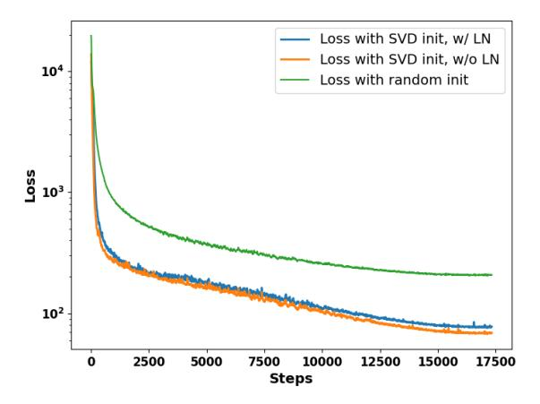

# A Appendix

### <span id="page-13-0"></span>A.1 Related Work

KV Cache Management in Transformers Several approaches have been proposed to reduce or compress the KV cache size of Transformers, which can be broadly categorized into training-based and post-training solutions [Shi et al.](#page-12-6) [\(2024\)](#page-12-6). Training-based methods involve modifying the model architecture and pre-training it, typically yielding better performance, whereas post-training methods are easier to apply and do not require retraining.

A variety of post-training KV cache management solutions have been explored in the literature. One common strategy is KV cache eviction, such as Heavy Hitter (*H*2*O*) [Zhang et al.](#page-12-7) [\(2023\)](#page-12-7), which defines an eviction policy based on the observation that only a few tokens contribute to the highest attention scores. This method retains the most recent and most significant tokens while discarding the others. Another approach is sliding window attention [Arora et al.](#page-10-3) [\(2024\)](#page-10-3); [Beltagy et al.](#page-10-7) [\(2020\)](#page-10-7), which restricts attention to a fixed number of recent tokens (or predefined patterns) to maintain a bounded KV cache size. Attention Sink [Xiao et al.](#page-12-9) [\(2023\)](#page-12-9) builds on this by retaining initial tokens in the KV cache to improve performance. Quantization-based KV cache compression [Kang et al.](#page-11-5) [\(2024\)](#page-11-5); [Zhang et al.](#page-12-8) [\(2024a\)](#page-12-8) reduces memory usage by storing KVs in a lower-precision format, while KV cache merging [Wang et al.](#page-12-10) [\(2024b\)](#page-12-10) minimizes information loss by merging KV entries instead of discarding them. Although post-training solutions are computationally efficient, they often lead to performance degradation due to information loss. In contrast, training-based methods offer a better balance between memory efficiency and model accuracy. This paper focuses on training-based solutions, which we review in the following.

Training-based KV Cache Management Training-based solutions modify the attention mechanism or replace it with alternative architectures in Transformer models to reduce KV cache memory requirements. For instance, multi-query attention (MQA[\)Shazeer](#page-12-11) [\(2019\)](#page-12-11) shares keys and values across all attention heads, reducing the KV cache size by a factor of *n* compared to a multi-head attention (MHA) model with *n* KV heads. However, sharing a single KV across n query heads can be too restrictive. To address this, grouped-query attention (GQA[\)Ainslie et al.](#page-10-4) [\(2023\)](#page-10-4) divides query heads into groups, allowing each group to share a single set of key and value heads, making a balance between memory efficiency and performance. Another notable approach is YOCO [Sun et al.](#page-12-12) [\(2024\)](#page-12-12), a decode-decoder model that consists of a self-decoder and a cross-decoder module. Instead of storing KV vectors for each layer and token, the self-decoder module provides a shared global KV cache to the cross-decoder layers, significantly reducing memory overhead. Multi-head latent attention (MLA), introduced in DeepSeek-V2 [Liu et al.](#page-11-0) [\(2024a\)](#page-11-0), is another KV-cache efficient variation of MHA. MLA reduces KV cache size by projecting input hidden states into a compressed latent space through low-rank projection, leading to a substantial reduction in memory usage. DeepSeek-V2 demonstrated that MLA can outperform standard MHA while maintaining efficiency.

Motivated by MLA's strong performance and efficiency, we focus on adapting MLA for already pre-trained models. However, training-based solutions typically require full pre-training from scratch or extensive continual training. This raises a fundamental question: Can we upcycle pre-trained models to their MLA counterparts without costly retraining? In the following section, we review existing solutions for model upcycling that can be leveraged for this purpose.

Upcycling Attention In [Komatsuzaki et al.](#page-11-6) [\(2022\)](#page-11-6), model upcycling is defined as "upgrading an existing model with a relatively small additional computational budget." This term has primarily been used to describe the conversion of dense models into mixture-of-experts (MoE) models in an efficient manner [Komatsuzaki et al.](#page-11-6) [\(2022\)](#page-11-6); [He et al.](#page-11-15) [\(2024\)](#page-11-15). In this paper, we focus on the concept of attention upcycling, which involves adapting pre-trained attention blocks in a Transformer into more efficient forms, such as MLA, without requiring full re-training from scratch. There are several examples of attention upcycling in the literature. For instance, in GQA, [Ainslie et al.](#page-10-4) [\(2023\)](#page-10-4) propose replacing MHA blocks with GQA and performing light continual pre-training for adaptation. Similarly, Hedgeho[gZhang et al.](#page-12-2) [\(2024b\)](#page-12-2) introduces an upcycling method that converts pre-trained attention into linear attention using knowledge distillation.

A notable line of work focuses on leveraging the duality between Transformer self-attention and alternative architectures. MambaInLlama [Wang et al.](#page-12-5) [\(2024a\)](#page-12-5) demonstrates this by replacing some

### **Algorithm 1** Python-like pseudocode of the proposed SVD initialization for MLA.

```
1 # MHA weights: W_Q, W_K, W_V
2 # MLA weights: W_DQ, W_UQ, W_QR, W_DKV, W_UK, W_KR, W_UV
4 # Initialization of W_DQ, W_UQ, and W_QR
5 U_q, sigma_q, V_q = svd(W_Q)
6 \text{ W}_DQ = U_q
7 \text{ W}_{QR} = (\text{sigma}_{q} \text{ V}_{q}).\text{view}(r_{q}, n_{h}, d_{h})
W_UQ = W_UQR_bar[:, :, :d_qk].view(r_q, n_h*d_qk)
9 W_QR = W_UQR_bar[:, :, -d_r:].view(r_q, n_h*d_r)
11 # Initialization of W_DKV, W_UK, W_KR, W_UV
12 U_kv, sigma_kv, V_kv = svd(torch.cat((W_K, W_V), -1))
13 W DKV = U kv
14 W_K_avg = W_K.view(d, n_h, d_h).mean(1)
15 W_KR = W_K_avg[:, -d_r:]
17 W_UKV = sigma_kv @ V_kv
18 W_UK_bar = W_UKV[:, :d_h*n_h].view(r_kv, n_h, d_h)
19 W_UK = W_UK_bar[:,:,:d_qk].view(r_kv, n_h*d_qk)
20 W_UV = W_UKV[:, d_h*n_h:]
```

<span id="page-14-0"></span>attention layers in pre-trained models with Mamba layers, initializing them from their corresponding attention layers, and then fine-tuning using end-to-end knowledge distillation. Similarly, MO-HAWK Bick et al. (2024) follows a knowledge distillation-based approach for training hybrid attention-Mamba models. However, MOHAWK differs from MambaInLlama in some aspects: (a) It does not initialize the student sub-quadratic model from the Transformer attention layers; (b) It incorporates intermediate layer distillation in addition to end-to-end distillation.

### <span id="page-14-1"></span>A.2 Algorithm

Our simple method for initializing the MLA weights using SVD approach applied to the pre-trained attention weights is summarized in the pseudocode in Algorithm 1.

### <span id="page-14-2"></span>A.3 Hyper-parameter Selection

In Table 6 and 7, we present the model performance with different hyperparameters for fixed rank selection and dynamic rank selection, respectively. In Table 6, we evaluate three KV ranks  $(r_{kv}=512,256,128)$  and two head dimensions  $(d_{qk}=32,64)$ . We adjust  $r_q$  accordingly to make sure all configurations have approximately the same number of parameters. The results indicate a significant performance loss as the KV rank  $r_{kv}$  decreases. With the same KV rank,  $d_{qk}=64$  generally provides better performance. However, such advantage is more obvious with  $r_{kv}=128,256$  where  $r_q$  is relatively large. When  $r_{kv}=512$ , both head dimensions provides similar performance. In Table 7, we explore two thresholds (90% and 95%) for  $r_q$  and  $r_{kv}$  and two head dimensions  $(d_{qk}=32,64)$  for dynamic rank selection. When training with a small portion of the dataset (1.6B), we notice that the performance is mainly influenced by the KV rank  $r_{kv}$ . Although setting  $d_{qk}=64$  leads to more parameters, it does not necessarily translate to performance improvement, even when trained with the full dataset.

### <span id="page-14-3"></span>A.4 Supplementary Results

### <span id="page-14-4"></span>A.4.1 Long Context Evaluations

We evaluated our MLA-optimized models on the LongBench benchmark, which covers a range of long-context understanding tasks such as LCC, Qasper, QMSum, Multi-News, and SamSum. Table 8 reports the results under various KV-cache size for both Llama3.2-1B and Llama3.2-3B models. Notably, X-EcoMLA 3B models achieves a score of 60.03 on LCC, significantly outperforming the full-sized Llama3.2-3B baseline (52.11), despite using only 43% of the KV cache. Across other tasks

<span id="page-15-1"></span>

| Configuration  | Param | $r_q$ | $r_{kv}$ | $d_{qk}$ | KV Size | Tokens | Avg Score |
|----------------|-------|-------|----------|----------|---------|--------|-----------|
|                | Base  | Model | : Llam   | a3.2-1   | B-Inst  |        |           |
| ↑X-EcoMLA +DPO | 1.23B | 864   | 512      | 32       | 53.1%   | 3.6B   | 53.04     |
| ↑X-EcoMLA +DPO | 1.23B | 480   | 512      | 64       | 56.3%   | 3.6B   | 53.14     |
| ↑X-EcoMLA +DPO | 1.23B | 1184  | 256      | 32       | 28.1%   | 3.6B   | 51.91     |
| ↑X-EcoMLA +DPO | 1.23B | 736   | 256      | 64       | 31.3%   | 3.6B   | 52.38     |
| ↑X-EcoMLA +DPO | 1.23B | 1344  | 128      | 32       | 15.6%   | 3.6B   | 51.38     |
| ↑X-EcoMLA +DPO | 1.23B | 864   | 128      | 64       | 18.8%   | 3.6B   | 51.60     |

Table 6: Hyperparameter selection for the internal dimensions of the X-EcoMLA block under a fixed setting with 100% MLA layers, without LayerNorm, and using an identical teacher model as the base.

<span id="page-15-2"></span>

| Configuration  | Param | $r_q$  | $r_{kv}$ | $d_{qk}$ | KV Size | Tokens | Avg Score |
|----------------|-------|--------|----------|----------|---------|--------|-----------|
|                | Base  | e Mode | l: Llam  | a3.2-1   | B-Inst  |        |           |
| ↑X-EcoMLA +DPO | 1.22B | 90%    | 90%      | 32       | 42.7%   | 1.6B   | 51.26     |
| ↑X-EcoMLA +DPO | 1.25B | 90%    | 90%      | 64       | 45.9%   | 1.6B   | 51.31     |
| ↑X-EcoMLA +DPO | 1.23B | 95%    | 90%      | 32       | 42.7%   | 1.6B   | 51.36     |
| ↑X-EcoMLA +DPO | 1.27B | 95%    | 90%      | 64       | 45.9%   | 1.6B   | 51.21     |
| ↑X-EcoMLA +DPO | 1.23B | 90%    | 95%      | 32       | 54.7%   | 1.6B   | 52.18     |
| ↑X-EcoMLA +DPO | 1.26B | 90%    | 95%      | 64       | 57.9%   | 1.6B   | 51.51     |
| ↑X-EcoMLA +DPO | 1.24B | 95%    | 95%      | 32       | 54.7%   | 1.6B   | 52.40     |
| ↑X-EcoMLA +DPO | 1.28B | 95%    | 95%      | 64       | 57.9%   | 1.6B   | 52.16     |
| ↑X-EcoMLA +DPO | 1.23B | 90%    | 95%      | 32       | 54.7%   | 7.0B   | 53.22     |
| ↑X-EcoMLA +DPO | 1.26B | 90%    | 95%      | 64       | 57.9%   | 7.0B   | 53.23     |

Table 7: Hyperparameter selection for the internal dimensions of the X-EcoMLA block under a dynamic setting with 100% MLA layers, without LayerNorm, and using an identical teacher model (Llama-3.2-1B) as the base.

such as Qasper, Multi-News, and SamSum, our compressed models match or even slightly exceed the performance of their full-cache counterparts. These results indicate that our method scales well to long-sequence scenarios and is particularly effective in memory-constrained environments.

<span id="page-15-3"></span>

| Model                   | KV-Size | Avg. Acc. | lcc   | repobench-p | qasper | qmsum | multi_news | samsum |
|-------------------------|---------|-----------|-------|-------------|--------|-------|------------|--------|
| Llama3.2-1B-Inst (Base) | 100.00% | 30.805    | 35.47 | 40.12       | 22.92  | 21.65 | 25.68      | 38.99  |
| ↑X-EcoMLA (ours)        | 53.13%  | 30.77     | 38.73 | 40.36       | 21.13  | 20.50 | 25.76      | 38.11  |
| ↑X-EcoMLA (ours)        | 28.13%  | 30.66     | 38.74 | 40.54       | 21.21  | 20.61 | 25.62      | 37.26  |
| Llama3.2-3B-Inst (Base) | 100.00% | 40.01     | 52.11 | 54.16       | 40.42  | 23.63 | 26.51      | 43.21  |
| ↑X-EcoMLA (ours)        | 42.91%  | 39.29     | 60.03 | 56.24       | 29.94  | 21.08 | 27.54      | 40.93  |
| †X-EcoMLA (ours)        | 25.00%  | 39.11     | 59.59 | 53.94       | 31.75  | 20.93 | 27.19      | 41.26  |

Table 8: Long-context evaluation on the LongBench benchmark across varying KV cache sizes. All the X-EcoMLA models are trained with Llama3.1-8B-Inst as the teacher model

#### <span id="page-15-0"></span>A.4.2 Comparison with other KV Cache Compression Techniques

We compare X-EcoMLA with the widely used H2O method Zhang et al. (2023), using the same base model (Llama3.2-1B-Instruct) and identical KV cache sizes. The evaluation is conducted on the **Im-eval-hardness** benchmark to assess performance under increasingly aggressive memory constraints. As shown in Table 9, X-EcoMLA consistently outperforms H2O across all compression levels—both in terms of average accuracy and on most individual tasks. Notably, at a KV size of 9.4%, X-EcoMLA achieves an average accuracy of **50.49**%, compared to **45.05**% for H2O, with particularly large gains on ARC, ARE, and PIQA. Even at 6.25% KV size, X-EcoMLA maintains a strong lead, indicating its robustness under extreme compression. These results demonstrate that X-EcoMLA achieves significantly better accuracy under the same memory budget, making it a strong candidate for memory-efficient inference.

| Model            | KV-size | Avg. Acc. | ARC   | ARE   | HS    | MM    | OBQA  | PIQ   | PM    | RA    | WG    |
|------------------|---------|-----------|-------|-------|-------|-------|-------|-------|-------|-------|-------|
| H2O              | 15.6%   | 50.30     | 37.71 | 57.41 | 59.91 | 40.83 | 31.60 | 71.11 | 60.40 | 37.99 | 55.80 |
| †X-EcoMLA (ours) | 15.6%   | 51.97     | 40.10 | 62.88 | 58.17 | 39.70 | 37.80 | 73.50 | 56.60 | 39.33 | 59.67 |
| H2O              | 9.4%    | 45.05     | 30.03 | 43.01 | 57.79 | 33.25 | 29.60 | 64.96 | 58.80 | 36.08 | 51.93 |
| †X-EcoMLA (ours) | 9.4%    | 50.49     | 39.16 | 62.63 | 56.04 | 34.90 | 36.40 | 72.85 | 56.40 | 37.70 | 58.33 |
| H2O              | 6.25%   | 41.30     | 26.54 | 34.68 | 52.75 | 26.95 | 28.60 | 59.03 | 58.60 | 34.26 | 50.28 |
| ↑X-EcoMLA (ours) | 6.25%   | 49.74     | 38.48 | 61.66 | 55.32 | 30.62 | 35.20 | 72.36 | 56.60 | 37.99 | 59.43 |

<span id="page-16-1"></span>Table 9: Comparison of X-EcoMLA and H2O Zhang et al. (2023) across various KV cache sizes. X-EcoMLA consistently outperforms H2O, especially under aggressive compression.

### <span id="page-16-0"></span>A.4.3 Hybrid MLA Models

In this section, we include some supplementary results. Table 10 shows the benchmark performance of our X-EcoMLA method on Llama3.2-1B-Inst model when we use the same model as teacher. We evaluate three different initialization settings: (i) Fixed rank selection with random initialization, (ii) Fixed rank selection with SVD initialization, and (iii) Dynamic rank selection with SVD initialization. For the fixed rank selection scenario, we set  $r_q = 854$ ,  $r_{kv} = 512$ , and  $d_{qk} = d_r = 32$  such that the total number of parameters after the MLA upcycling remain roughly the same. For the dynamic rank selection case, we apply a threshold of 0.95 for both  $r_q$  and  $r_{kv}$  so that the number of parameters aligns with other setups. We investigate two MLA layer upcycling strategies: upcycling 100% of layers to MLA and upcycling 50% of layers to MLA. For the 100% upcycling strategy, we replace all GQA modules in the base model with MLA. In this scenario, the proposed X-EcoMLA model uses only 53.1% of the KV cache size for fixed rank selection and 54.7% for dynamic rank selection. For the 50% upcycling strategy, we replace GQA modules in layers 1, 3, 5, 7, 8, 10, 12, and 14. This brings us 78.1% KV cache size for the fixed rank selection and 78% for dynamic rank selection.

For each strategy, we evaluate training with the full dataset (6.8B tokens) and half dataset (3.4B tokens). It is evident that for fixed rank selection schemes, SVD initialization significantly enhances distillation performance compared to random initialization, yielding an 8% improvement for 100% MLA and 3% improvement for 50% MLA.

| Model and Setting | Init. Method  | KV-Size | Tokens  | ARC       | ARE        | HS         | MMLU       | OBQA  | PIQA  | PBMD  | RA    | WG    | Avg.  |
|-------------------|---------------|---------|---------|-----------|------------|------------|------------|-------|-------|-------|-------|-------|-------|
|                   |               |         | TOKEHS  |           |            |            |            |       |       |       |       |       |       |
| Llama3.2-1B-Inst  | Base          | 100%    | -       | 37.97     | 63.30      | 60.65      | 46.05      | 34.80 | 74.32 | 60.00 | 38.18 | 59.67 | 52.77 |
|                   |               | 100%    | MLA La  | yers- Tea | acher: Ide | entical to | the Base ! | Model |       |       |       |       |       |
| ↑X-EcoMLA         | Random (512)  | 53.1%   | 6.8B    | 35.32     | 60.48      | 54.03      | 27.77      | 35.20 | 71.98 | 55.80 | 33.88 | 55.01 | 47.72 |
| ↑X-EcoMLA + DPO   | Random (512)  | 53.1%   | 7.0B    | 38.99     | 62.71      | 56.20      | 28.04      | 36.8  | 73.39 | 56.40 | 36.27 | 56.20 | 49.44 |
| ↑X-EcoMLA         | Fixed (512)   | 53.1%   | 6.8B    | 36.95     | 63.89      | 58.88      | 43.40      | 36.00 | 74.16 | 58.20 | 37.32 | 60.30 | 52.12 |
| ↑X-EcoMLA + DPO   | Fixed (512)   | 53.1%   | 7.0B    | 40.19     | 63.93      | 60.67      | 42.31      | 37.60 | 75.03 | 59.20 | 40.86 | 61.01 | 53.42 |
| ↑X-EcoMLA         | Dynamic (95%) | 54.7%   | 6.8B    | 37.12     | 63.64      | 58.87      | 43.26      | 34.40 | 73.72 | 60.00 | 37.51 | 60.22 | 52.08 |
| ↑X-EcoMLA + DPO   | Dynamic (95%) | 54.7%   | 7.0B    | 40.36     | 64.31      | 60.88      | 42.54      | 36.80 | 74.16 | 61.40 | 40.77 | 60.69 | 53.54 |
| ↑X-EcoMLA         | Fixed (512)   | 53.1%   | 3.4B    | 37.37     | 64.35      | 58.36      | 42.03      | 35.00 | 73.61 | 57.40 | 37.03 | 59.51 | 51.63 |
| ↑X-EcoMLA + DPO   | Fixed (512)   | 53.1%   | 3.6B    | 39.93     | 63.51      | 60.52      | 41.58      | 37.20 | 73.99 | 59.80 | 40.48 | 60.38 | 53.04 |
| ↑X-EcoMLA         | Dynamic (95%) | 54.7%   | 3.4B    | 37.12     | 63.64      | 58.44      | 42.14      | 34.40 | 73.61 | 57.00 | 37.22 | 59.98 | 51.50 |
| ↑X-EcoMLA + DPO   | Dynamic (95%) | 54.7%   | 3.6B    | 40.27     | 62.71      | 60.55      | 41.21      | 36.40 | 74.16 | 59.80 | 39.90 | 60.14 | 52.79 |
|                   |               | 50%     | MLA Lay | yers, Tea | cher: Ide  | ntical to  | the Base M | 1odel |       |       |       |       |       |
| ↑X-EcoMLA         | Random (512)  | 78.1%   | 6.8B    | 36.86     | 62.79      | 57.23      | 38.19      | 36.00 | 73.78 | 56.20 | 36.75 | 58.72 | 50.72 |
| ↑X-EcoMLA + DPO   | Random (512)  | 78.1%   | 7.0B    | 38.99     | 63.64      | 59.00      | 37.46      | 37.60 | 74.59 | 57.00 | 39.14 | 60.46 | 51.99 |
| ↑X-EcoMLA         | Fixed (512)   | 78.1%   | 6.8B    | 37.97     | 63.01      | 59.71      | 44.37      | 35.80 | 74.86 | 60.60 | 38.37 | 59.98 | 52.74 |
| ↑X-EcoMLA + DPO   | Fixed (512)   | 78.1%   | 7.0B    | 40.87     | 63.93      | 61.95      | 43.39      | 37.20 | 74.48 | 59.80 | 40.48 | 60.85 | 53.66 |
| ↑X-EcoMLA         | Dynamic (95%) | 78%     | 6.8B    | 38.48     | 63.85      | 59.78      | 44.27      | 35.60 | 74.54 | 60.40 | 38.18 | 60.85 | 52.88 |
| ↑X-EcoMLA + DPO   | Dynamic (95%) | 78%     | 7.0B    | 41.64     | 64.44      | 61.78      | 43.58      | 36.40 | 74.21 | 60.00 | 40.48 | 60.93 | 53.71 |
| ↑X-EcoMLA         | Fixed (512)   | 78.1%   | 3.4B    | 37.12     | 63.55      | 59.36      | 44.16      | 35.20 | 73.94 | 57.60 | 37.70 | 60.77 | 52.16 |
| ↑X-EcoMLA + DPO   | Fixed (512)   | 78.1%   | 3.6B    | 40.61     | 64.73      | 62.06      | 43.51      | 37.40 | 73.78 | 59.40 | 40.29 | 61.25 | 53.67 |
| ↑X-EcoMLA         | Dynamic (95%) | 78%     | 3.4B    | 38.05     | 63.09      | 59.37      | 43.60      | 35.00 | 74.27 | 59.80 | 36.94 | 60.93 | 52.33 |
| ↑X-EcoMLA + DPO   | Dynamic (95%) | 78%     | 3.6B    | 39.93     | 63.64      | 61.76      | 43.33      | 36.40 | 73.83 | 61.40 | 40.57 | 60.30 | 53.46 |

<span id="page-16-2"></span>Table 10: Zero-shot evaluation of MLA variants with different initialization methods (random, SVD with fixed rank selection, and SVD with dynamic rank selection) on the LM Harness Eval benchmark across nine tasks: ARC-Challenge (ARC), ARC-Easy (ARE), HellaSwag (HS), MMLU, OpenBookQA (OBQA), PIQA, PubMedQA (PBMD), RACE (RA), and WinoGrande (WG). († denotes upcycling the base model.)

### <span id="page-17-1"></span>A.4.4 More Details on Extreme KV Cache Compression Experiments

In this section, we include more details for Table 2 results. For each row, we also show the results of SFT training.

| Model and Setting | Teacher          | Param  | Tokens                 | ARC                  | ARE        | HS                     | MMLU       | OBQA               | PIQA  | PBMD  | RA    | WG    | Avg.  |
|-------------------|------------------|--------|------------------------|----------------------|------------|------------------------|------------|--------------------|-------|-------|-------|-------|-------|
| Llama3.2-1B-Inst  | -                | 1.24B  | -                      | 37.97                | 63.30      | 60.65                  | 46.05      | 34.80              | 74.32 | 60.00 | 38.18 | 59.67 | 52.77 |
|                   | 100              | 0% MLA | Layers (r              | $k_v = 512$          | $r_q = 80$ | 64, d <sub>qk</sub> =  | = 32) - KV | Size: <b>53.</b> 1 | l %   |       |       |       |       |
| ↑X-EcoMLA         | Llama3.2-1B-Inst | 1.23B  | 3.4B                   | 37.37                | 64.35      | 58.36                  | 42.03      | 35.00              | 73.61 | 57.40 | 37.03 | 59.51 | 51.63 |
| ↑X-EcoMLA + DPO   | Llama3.2-1B-Inst | 1.23B  | 3.6B                   | 39.93                | 63.51      | 60.52                  | 41.58      | 37.20              | 73.99 | 59.80 | 40.48 | 60.38 | 53.04 |
| ↑X-EcoMLA         | Llama3.2-3B-Inst | 1.23B  | 3.4B                   | 37.71                | 65.19      | 58.84                  | 43.13      | 36.20              | 73.45 | 58.20 | 37.89 | 59.67 | 52.25 |
| ↑X-EcoMLA + DPO   | Llama3.2-3B-Inst | 1.23B  | 3.6B                   | 42.75                | 64.81      | 62.04                  | 43.88      | 37.40              | 73.72 | 59.20 | 41.44 | 61.48 | 54.08 |
| ↑X-EcoMLA         | Llama3.2-8B-Inst | 1.23B  | 3.4B                   | 39.51                | 67.38      | 60.41                  | 43.18      | 38.40              | 73.94 | 60.40 | 38.28 | 61.72 | 53.69 |
| ↑X-EcoMLA + DPO   | Llama3.2-8B-Inst | 1.23B  | 3.6B                   | 44.03                | 68.86      | 63.49                  | 43.81      | 37.40              | 73.94 | 61.40 | 41.82 | 61.40 | 55.13 |
|                   | 100              | % MLA  | Layers (rk             | v = 256              | $r_q = 11$ | .84, d <sub>qk</sub> : | = 32) - KV | Size: 28.          | 1%    |       |       |       |       |
| ↑X-EcoMLA         | Llama3.2-1B-Inst | 1.23B  | 3.4B                   | 37.54                | 62.84      | 56.89                  | 41.22      | 33.6               | 73.12 | 55.4  | 36.46 | 59.19 | 50.70 |
| ↑X-EcoMLA + DPO   | Llama3.2-1B-Inst | 1.23B  | 3.6B                   | 40.02                | 63.26      | 58.74                  | 39.79      | 36.40              | 72.80 | 55.60 | 40.19 | 60.38 | 51.9  |
| ↑X-EcoMLA         | Llama3.2-3B-Inst | 1.23B  | 3.4B                   | 36.35                | 63.51      | 57.09                  | 41.30      | 35.00              | 73.07 | 56.80 | 36.46 | 60.14 | 51.08 |
| ↑X-EcoMLA + DPO   | Llama3.2-3B-Inst | 1.23B  | 3.6B                   | 40.70                | 64.35      | 60.10                  | 41.77      | 37.20              | 73.83 | 57.80 | 39.23 | 61.17 | 52.9  |
| ↑X-EcoMLA         | Llama3.2-8B-Inst | 1.23B  | 3.4B                   | 38.14                | 65.45      | 58.70                  | 41.15      | 36.20              | 73.67 | 59.00 | 36.17 | 60.62 | 52.12 |
| ↑X-EcoMLA + DPO   | Llama3.2-8B-Inst | 1.23B  | 3.6B                   | 41.98                | 66.46      | 61.33                  | 41.78      | 37.20              | 74.27 | 59.00 | 40.00 | 60.69 | 53.6  |
|                   | 100              | % MLA  | Layers (r <sub>k</sub> | v = 128              | $r_q = 13$ | 344, d <sub>qk</sub> : | = 32) - KV | Size: <b>15.</b>   | 6%    |       |       |       |       |
| ↑X-EcoMLA         | Llama3.2-1B-Inst | 1.23B  | 3.4B                   | 36.52                | 61.41      | 55.37                  | 38.02      | 34.60              | 72.52 | 56.00 | 35.60 | 58.56 | 49.8  |
| ↑X-EcoMLA + DPO   | Llama3.2-1B-Inst | 1.23B  | 3.6B                   | 39.16                | 61.83      | 57.27                  | 37.85      | 36.20              | 73.45 | 56.40 | 40.19 | 60.06 | 51.3  |
| ↑X-EcoMLA         | Llama3.2-3B-Inst | 1.23B  | 3.4B                   | 36.26                | 61.95      | 55.84                  | 39.28      | 35.40              | 71.76 | 57.60 | 35.89 | 59.27 | 50.3  |
| ↑X-EcoMLA + DPO   | Llama3.2-3B-Inst | 1.23B  | 3.6B                   | 39.42                | 62.88      | 58.41                  | 39.45      | 37.20              | 73.39 | 58.00 | 39.71 | 59.75 | 52.0  |
| ↑X-EcoMLA         | Llama3.2-8B-Inst | 1.23B  | 3.4B                   | 36.35                | 64.60      | 57.32                  | 38.25      | 37.00              | 73.45 | 60.40 | 35.22 | 58.25 | 51.20 |
| ↑X-EcoMLA + DPO   | Llama3.2-8B-Inst | 1.23B  | 3.6B                   | 41.30                | 65.61      | 59.64                  | 39.47      | 37.60              | 74.27 | 59.20 | 39.52 | 59.83 | 52.9  |
| ↑X-EcoMLA         | Llama3.2-1B-Inst | 1.23B  | 6.8B                   | 37.54                | 62.21      | 56.36                  | 39.67      | 35.40              | 73.23 | 55.60 | 35.31 | 58.33 | 50.4  |
| ↑X-EcoMLA + DPO   | Llama3.2-1B-Inst | 1.23B  | 7B                     | 40.10                | 62.88      | 58.17                  | 39.70      | 37.80              | 73.50 | 56.60 | 39.33 | 59.67 | 51.9  |
| ↑X-EcoMLA         | Llama3.2-3B-Inst | 1.23B  | 6.8B                   | 35.58                | 63.51      | 56.71                  | 41.38      | 35.80              | 72.80 | 57.20 | 35.89 | 58.56 | 50.8  |
| ↑X-EcoMLA + DPO   | Llama3.2-3B-Inst | 1.23B  | 7B                     | 39.33                | 64.86      | 58.92                  | 41.86      | 37.40              | 73.83 | 58.80 | 39.71 | 59.59 | 52.70 |
| ↑X-EcoMLA         | Llama3.2-8B-Inst | 1.23B  | 6.8B                   | 38.65                | 66.88      | 58.46                  | 42.01      | 34.80              | 73.67 | 60.00 | 36.46 | 59.12 | 52.2  |
| ↑X-EcoMLA + DPO   | Llama3.2-8B-Inst | 1.23B  | 7B                     | 42.49                | 67.13      | 60.58                  | 42.51      | 36.60              | 73.99 | 59.40 | 40.38 | 59.43 | 53.6  |
|                   | 10               | 0% MLA | Layers (r              | $r_{kv} = 64$        | $r_q = 14$ | 24, d <sub>qk</sub> :  | = 32) - KV | Size: <b>9.4</b>   | %     |       |       |       |       |
| ↑X-EcoMLA         | Llama3.2-1B-Inst | 1.23B  | 6.8B                   | 37.12                | 61.32      | 54.46                  | 34.89      | 35.60              | 72.36 | 56.80 | 35.22 | 57.30 | 49.4: |
| ↑X-EcoMLA + DPO   | Llama3.2-1B-Inst | 1.23B  | 7B                     | 39.16                | 62.63      | 56.04                  | 34.90      | 36.40              | 72.85 | 56.40 | 37.70 | 58.33 | 50.4  |
| ↑X-EcoMLA         | Llama3.2-3B-Inst | 1.23B  | 6.8B                   | 35.07                | 61.95      | 54.95                  | 38.61      | 35.20              | 72.09 | 57.40 | 35.98 | 58.25 | 49.9  |
| ↑X-EcoMLA + DPO   | Llama3.2-3B-Inst | 1.23B  | 7B                     | 37.97                | 63.55      | 56.95                  | 37.54      | 35.40              | 72.74 | 57.00 | 38.66 | 59.27 | 51.0  |
| ↑X-EcoMLA         | Llama3.2-8B-Inst | 1.23B  | 6.8B                   | 36.09                | 65.07      | 57.01                  | 38.60      | 35.80              | 72.96 | 58.00 | 35.98 | 59.98 | 51.0  |
| ↑X-EcoMLA + DPO   | Llama3.2-8B-Inst | 1.23B  | 7B                     | 40.02                | 67.17      | 58.40                  | 38.53      | 37.80              | 73.83 | 58.00 | 39.43 | 60.93 | 52.6  |
|                   | 100              | 0% MLA | Layers (r              | $\frac{1}{4v} = 48,$ | $r_q = 14$ | $40, d_{qk} =$         | = 32) - KV | Size: <b>6.2</b> 5 | 5%    |       |       |       |       |
| ↑X-EcoMLA         | Llama3.2-1B-Inst | 1.23B  | 6.8B                   | 36.77                | 60.61      | 53.51                  | 32.44      | 33.40              | 72.20 | 56.60 | 34.55 | 58.33 | 48.7  |
| ↑X-EcoMLA + DPO   | Llama3.2-1B-Inst | 1.23B  | 7B                     | 38.48                | 61.66      | 55.32                  | 30.62      | 35.20              | 72.36 | 56.60 | 37.99 | 59.43 | 49.7  |
| ↑X-EcoMLA         | Llama3.2-3B-Inst | 1.23B  | 6.8B                   | 33.70                | 61.32      | 54.11                  | 35.96      | 34.60              | 71.27 | 56.00 | 35.22 | 58.48 | 48.9  |
| ↑X-EcoMLA + DPO   | Llama3.2-3B-Inst | 1.23B  | 7B                     | 36.18                | 62.21      | 55.82                  | 36.41      | 35.60              | 72.03 | 57.00 | 38.09 | 60.06 | 50.3  |
| ↑X-EcoMLA         | Llama3.2-8B-Inst | 1.23B  | 6.8B                   | 36.35                | 64.60      | 55.50                  | 36.65      | 34.60              | 72.31 | 57.80 | 35.79 | 58.25 | 50.2  |
|                   |                  |        | 7B                     | 37.71                | 65.32      | 57.32                  | 36.27      | 36.80              | 72.96 | 58.20 | 38.76 | 58.80 | 51.35 |

<span id="page-17-2"></span>Table 11: Impact of KV-cache compression and teacher model size on performance. Reducing the KV-cache size lowers accuracy, but larger teacher models help recover performance. DPO further improves alignment and accuracy. (↑ denotes upcycling the base model.)

#### <span id="page-17-3"></span>A.5 Ablation Studies

### <span id="page-17-0"></span>A.5.1 Distillation vs. Cross-Entropy

In Table 12, we examine the trade-off between learning from the teacher knowledge (via KL divergence) and direct supervision from the dataset (via cross-entropy loss w.r.t. ground truth) during the SFT distillation stage. We adopt Llama3.2-1B-Instruct for both our base model and student model, and we use CE and KL to denote the weights for the cross-entropy loss and KL divergence loss. The results show that relying solely on direct supervision (CE = 1, KL = 0) significantly degrades model performance (48.54 vs. 52.77), underscoring the importance of leveraging teacher knowledge for effective learning.

In contrast, incorporating teacher knowledge—either exclusively or in combination with direct supervision—yields the best results, indicating the importance of teacher-guided learning in maintaining accuracy. Given these insights, we primarily adopt teacher-based learning in our configurations to minimize hyperparameter tuning efforts unless stated otherwise.

<span id="page-18-2"></span>

| Configuration    | CE | KL   | Avg Score |
|------------------|----|------|-----------|
| Llama3.2-1B-Inst | -  | -    | 52.77     |
| ↑X-EcoMLA        | 0  | 1    | 50.84     |
| ↑X-EcoMLA        | 1  | 0.01 | 50.93     |
| ↑X-EcoMLA        | 1  | 0.05 | 50.71     |
| ↑X-EcoMLA        | 1  | 0.1  | 50.98     |
| ↑X-EcoMLA        | 1  | 0    | 48.54     |

Table 12: Comparison of different CE and KL loss weightings in the SFT knowledge distillation phase. The experiment utilizes the same teacher as the base model and applies dynamic SVD compression with *δ<sup>q</sup>* = *δkv* = 0.95, trained on 20% of the dataset.

## <span id="page-18-0"></span>A.5.2 Impact of LayerNorm

The original MLA module incorporates additional LayerNorm layers between the down- and upprojection operations. However, we observe that it is beneficial to omit those LayerNorm layers in our proposed X-EcoMLA, as evidenced in Table [13](#page-19-0) and the loss curves in Figure [3](#page-18-3) in the Appendix. By removing the intermediate LayerNorm layers, our proposed X-EcoMLA demonstrates an improved loss convergence. Besides, across various setups (fixed, dynamic) and different training dataset sizes (3.4B, 6.8B) in Table [13,](#page-19-0) the removal of LayerNorm layers consistently leads to performance gains.

<span id="page-18-3"></span>

Figure 3: Loss curve comparison between random initialization and SVD initialization w/ and w/o LayerNorm layers. All schemes are trained with fixed KV rank selection and 100% MLA layers upcycling.

Figure [3](#page-18-3) shows the loss curves of our SVD initialization with and without layer normalization, as well as with random initialization. The results demonstrate that removing layer normalization leads to lower loss values.

### <span id="page-18-1"></span>A.5.3 Larger Teacher or more Training Data?

Table [14](#page-19-1) highlights the impact of increasing training data (tokens) versus using a larger teacher model on both accuracy score and training time. When using the same teacher model (Llama3.2-1B-Inst), increasing the number of training tokens (from 3.4B to 6.8B) improves performance but comes at the cost of significantly higher training time (from 4.82 to 9.64 hours).

On the other hand, switching to a larger teacher (e.g., Llama3.2-3B-Inst or Llama3.2-8B-Inst) provides notable accuracy improvements with less reliance on additional training data. For instance, using the

| Configuration                | Init. Method                     | LayerNorm | KV Size | Tokens | Avg Score |  |  |  |
|------------------------------|----------------------------------|-----------|---------|--------|-----------|--|--|--|
| Base Model: Llama3.2-1B-Inst |                                  |           |         |        |           |  |  |  |
| ↑X-EcoMLA                    | Dynamic ( $\delta_{kv} = 0.95$ ) | ✓         | 54.7%   | 6.8B   | 51.68     |  |  |  |
| ↑X-EcoMLA                    | Dynamic ( $\delta_{kv} = 0.95$ ) | X         | 54.7%   | 6.8B   | 52.08     |  |  |  |
| ↑X-EcoMLA                    | Fixed ( $r_{kv} = 512$ )         | ✓         | 53.1%   | 6.8B   | 51.68     |  |  |  |
| ↑X-EcoMLA                    | Fixed ( $r_{kv} = 512$ )         | X         | 53.1%   | 6.8B   | 52.12     |  |  |  |
| ↑X-EcoMLA                    | Dynamic ( $\delta_{kv} = 0.95$ ) | ✓         | 54.7%   | 3.4B   | 51.18     |  |  |  |
| ↑X-EcoMLA                    | Dynamic ( $\delta_{kv} = 0.95$ ) | X         | 54.7%   | 3.4B   | 51.50     |  |  |  |
| ↑X-EcoMLA                    | Fixed ( $r_{kv} = 512$ )         | ✓         | 53.1%   | 3.4B   | 50.89     |  |  |  |
| ↑X-EcoMLA                    | Fixed $(r_{kv} = 512)$           | ×         | 53.1%   | 3.4B   | 51.63     |  |  |  |

<span id="page-19-1"></span><span id="page-19-0"></span>Table 13: Comparison of MLA with LayerNorm vs. without LayerNorm

| Model and Setting                                                                      | Teacher          | Tokens | Training time | Avg Score |  |  |  |  |
|----------------------------------------------------------------------------------------|------------------|--------|---------------|-----------|--|--|--|--|
| Base Model: <b>Llama3.2-1B-Inst</b> ; 100% MLA Layers ( $r_{kv} = 512$ , $r_q = 864$ ) |                  |        |               |           |  |  |  |  |
| ↑X-EcoMLA                                                                              | Llama3.2-1B-Inst | 6.8B   | 9.64 hours    | 52.12     |  |  |  |  |
| ↑X-EcoMLA + DPO                                                                        | Llama3.2-1B-Inst | 7.0B   | 10.06 hours   | 53.42     |  |  |  |  |
| ↑X-EcoMLA                                                                              | Llama3.2-1B-Inst | 3.4B   | 4.82 hours    | 51.63     |  |  |  |  |
| ↑X-EcoMLA + DPO                                                                        | Llama3.2-1B-Inst | 3.6B   | 5.24 hours    | 53.04     |  |  |  |  |
| ↑X-EcoMLA                                                                              | Llama3.2-3B-Inst | 3.4B   | 6.24 hours    | 52.25     |  |  |  |  |
| ↑X-EcoMLA + DPO                                                                        | Llama3.2-3B-Inst | 3.6B   | 6.65 hours    | 54.08     |  |  |  |  |
| ↑X-EcoMLA                                                                              | Llama3.2-8B-Inst | 3.4B   | 8.54 hours    | 53.69     |  |  |  |  |
| ↑X-EcoMLA + DPO                                                                        | Llama3.2-8B-Inst | 3.6B   | 8.96 hours    | 55.13     |  |  |  |  |

Table 14: Comparison of training efficiency and accuracy when increasing training data (tokens) versus using a larger teacher model. Larger teachers yield better accuracy with moderate time increases. The time cost is measured on a 8 MI300 GPUs.

8B teacher with DPO achieves the highest score, outperforming training with double tokens under the smaller 1B teacher (55.13 vs. 53.42), even with less training time (8.96 vs. 10.06 hours). However, this comes with a moderate increase in training time.

These results suggest that leveraging a stronger teacher model is generally more efficient for improving accuracy than simply increasing training data. While additional tokens help, the benefit diminishes compared to the gains from using a larger teacher, making training with a larger teacher a more effective strategy when computational resources allow.