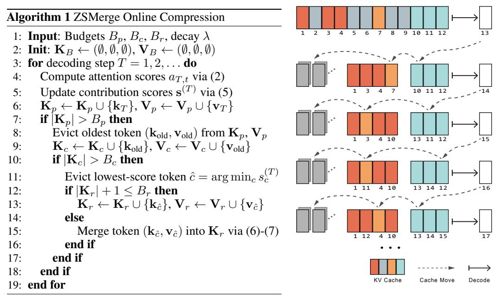

# 3.3 Contribution Evaluation

The contribution scores s (T) ∈ R T dynamically quantify each token's cumulative influence across decoding steps. For the t-th token, its score s (T) t evolves through exponential decay integration of attention activations:

$$s_t^{(T)} = \begin{cases} \lambda s_t^{(T-1)} + a_t^{(T)}, & T > 0\\ 0, & \text{otherwise} \end{cases}$$
 (5)

where the decay factor λ ∈ [0, 1] acts as a temporal discounting parameter analogous to reinforcement learning credit assignment, controlling the exponential decay of historical attention contributions.

In practice, we find that the performance is not highly sensitive to the precise value of λ. We therefore fix λ = 0.98 throughout this paper for simplicity, which yields a smooth balance between long-term and short-term contributions.

#### 3.4 Residual Token Merging

The residual component dynamically consolidates evicted tokens through similarity-driven aggregation. When merging a candidate token (kt, vt) into Kr, we adopt the following three-step procedure:

Figure 2: KV cache operation process

1. Select the most compatible residual slot via maximum dot production:

$$\hat{r} = \underset{r \in \{1, \dots, B_r\}}{\arg\max} \ \mathbf{k}_r^{\top} \mathbf{k}_t \tag{6}$$

2. Update the selected slot via incremental mean aggregation:

$$\mathbf{k}_{\hat{r}} \leftarrow \frac{w_{\hat{r}}\mathbf{k}_{\hat{r}} + \mathbf{k}_t}{w_{\hat{r}} + 1}, \quad \mathbf{v}_{\hat{r}} \leftarrow \frac{w_{\hat{r}}\mathbf{v}_{\hat{r}} + \mathbf{v}_t}{w_{\hat{r}} + 1}$$
(7)

3. Increment fusion count:  $w_{\hat{r}} \leftarrow w_{\hat{r}} + 1$ 

Figure 2 illustrates the dynamic cache evolution under budget parameters  $B_r = 2$ ,  $B_c = 4$ , and  $B_p = 3$  during sequence length expansion from T = 12 to T = 17.

