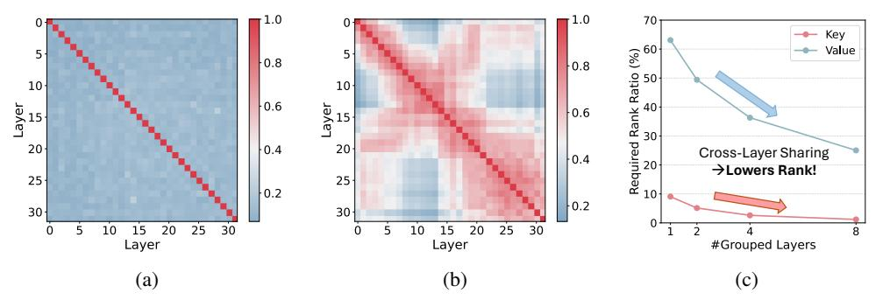

# 2 Related Work

Low-Rank KV-Cache Compression. A broad line of research exploits the *low-rank nature* of the KV-Cache to reduce its memory footprint. For instance, Multi-Head Latent Attention (MLA) [\[15,](#page-8-1) [16\]](#page-8-6) projects tokens onto a low-rank subspace and caches those latent representations instead of the original key and value states, however, MLA requires training the model from scratch. In contrast, several *post-training* techniques decompose the key/value parameter matrices to obtain low-rank projection modules similar to MLA, such as ASVD [\[49\]](#page-13-2), Palu [\[12\]](#page-8-4), and LoRC [\[50\]](#page-13-3). Other methods decompose the KV-Cache directly: EigenAttention [\[39\]](#page-12-8) applies SVD to a calibration dataset to derive projection matrices, whereas ShadowKV [\[41\]](#page-12-6) performs online SVD to capture the dynamic of different context. In xKV, we also exploits the low-rank nature of KV-Cache. However, unlike prior methods focusing on per layer compression, xKV further considers the shared information among multiple layers and extends the usage of low-rank to a new, cross-layer, dimension.

**Cross-Layer KV-Cache Optimization.** Going beyond the intra-layer perspective, another stream of research explores inter-layer redundancy of KV-Cache [10, 18, 32, 42, 46]. CLA [10] and YOCO[42] both modify the Transformer model architecture so that later layers can directly reuse or reference KV states from earlier layers. LCKV [46] restricts full KV storage to a small subset of layers, foregoing caches in other layers. However, these methods rely on retraining or model fine-tuning, which makes them less flexible. Minicache [32], in contrast, provides a flexible post-training alternative by merging the key and value tokens from adjacent similar layers using spherical linear interpolation. Our approach goes further by extracting shared singular vectors of multiple layers' KV-Caches thereby enabling higher compression.

Figure 2: (a) Average Token-wise Cosine Similarity for value-caches across different layers. For each pair of layers, we compute the token-level cosine similarities between their embeddings and average these values into a single similarity score. (b) CKA Matrix for the value-cache. The higher (warmer) values indicate stronger singular vector alignment across layers. (c) Required rank ratio (percentage of total dimension) for capturing 95% of the cumulative eigenvalues in the key (red) and value (blue) matrices, plotted against the number of grouped layers. For each group, we horizontally concatenate the key/value caches and compute the rank needed to achieve 95% of the cumulative eigenvalues. As the grouping increases, fewer ranks (relative to total dimension) are required, implying a higher compression rate for the same level of information preservation. We perform these analyses on the KV-Cache obtained from Llama-3.1-8B-Instruct, using the multi-valued NIAH dataset from the RULER [25] benchmark.

