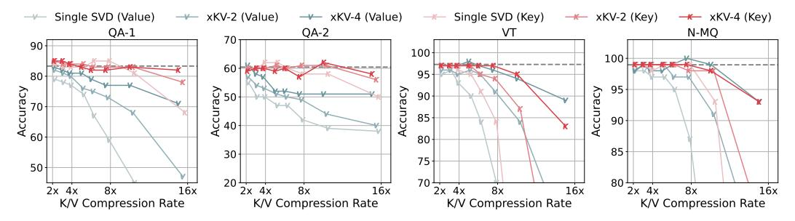

# 5.3 Evaluation on DeepSeek's MLA

To demonstrate the effectiveness of xKV on emerging attention variants, we evaluate it using DeepSeek-V2-Coder-Lite [17], which employs the efficient Multi-head Latent Attention (MLA) architecture [16]. Although MLA already significantly reduces the KV-Cache size per layer through low-rank projections, xKV further compresses this already compact latent cache by effectively leveraging cross-layer redundancy. We evaluate performance using the popular RepoBench-P [8, 33] and LCC [23] coding benchmark and present the results in Figure 4. As shown, with a group size of 4, xKV achieves a  $3\times$  compression rate on RepoBench and  $3.5\times$  on LCC without compromising accuracy. In contrast, other methods, such as MiniCache and Single SVD, fail to preserve accuracy on the MLA architecture even at substantially lower compression rates. These results underscore xKV's versatility and its compatibility with emerging architectures.

#### 5.4 Ablation Studies

Compressing key and value Separately. To understand how xKV affects key and value compression, we conduct ablation experiments on four subtasks from RULER (Figure 5) to evaluate how xKV (cross-layer low-rank SVD) affects key and value compression. Overall, xKV consistently boosts accuracy under varying compression rates. Also, keys exhibit higher compressibility than values, matching the eigenvalue analysis in Figure 2c. A closer inspection of the results reveals that the

Figure 5: Accuracy comparison of applying different methods to key and value separately on Llama-3.1-8B-Instruct using RULER benchmark.

achievable compression ratio appear to be task-dependent. On the questions-answering subtasks (QA-1 and QA-2) xKV can push the compression rate to  $16\times$  while still preserving performance. In Variable Tracking (VT) and NIAH multi-queries (N-MQ), accuracy begins to decline beyond  $8\times$  compression; however, in these same tasks, values tolerate compression more easily than in QA subtasks. These observations underscore how different tasks may demand different "sweet spots" for key versus value compression. In xKV, we employ a fixed compression ratio for all different tasks. Exploring task-specific or context-aware [5, 6, 34] rank allocation is a promising avenue for future work.

