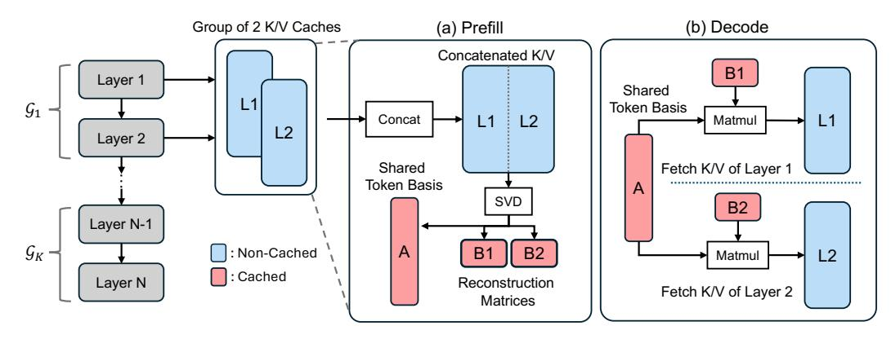
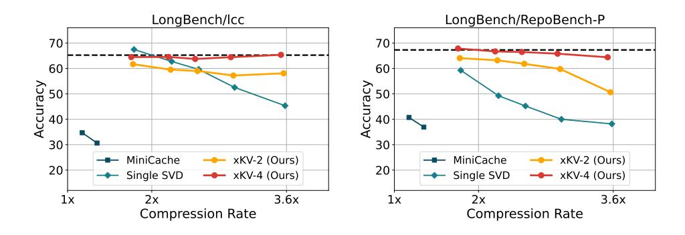

# **Analysis and Motivation**

In this section, we examine the cross-layer similarity of KV-Caches with different metrics to reveal the motivation behind the design of xKV.

#### 3.1 Cross-Layer Cosine Similarity

To understand the assumption used in a previous work [32], we first measure token-wise cosine similarity across various layer-pairs. The measurement on the cosine similarity is presented in Figure 2a. Notably, the adjacent layers exhibit low per-token similarity. This modest similarity fundamentally limits the compression rate achieved by prior representative methods [32]. However, a further examination using Centered Kernel Alignment (CKA) [29] reveals that while individual token representations differ significantly, multiple layers still share highly aligned singular vectors. While the embeddings vary at the token level, the latent subspaces spanned by KV-Cache across multiple layers remain notably similar. This observation motivates us to approach cross-layer KV-Cache compression by leveraging such sub-space alignments.

## 3.2 Revisit Cross-Layer Similarity with CKA

While token-wise (cosine) similarity offers a local perspective, a more holistic view can reveal deeper patterns in how an entire KV-Cache is aligned across layers. Specifically, we adopt Centered Kernel Alignment (CKA) [29] to measure the similarity in the overall structure of two layers' KV-Caches. Concretely, for a layer  $\ell$  with KV-cache  $\mathbf{X}_{\ell} \in \mathbb{R}^{n \times d}$ , we first define the centered Gram matrix  $\mathbf{G}_{\ell} = \mathbf{H} \mathbf{X}_{\ell} \mathbf{X}_{\ell}^{\top} \mathbf{H}$ , where  $\mathbf{H} = \mathbf{I}_{n} - \frac{1}{n} \mathbf{1} \mathbf{1}^{\top}$ .

$$\mathbf{G}_{\ell} = \mathbf{H} \mathbf{X}_{\ell} \mathbf{X}_{\ell}^{\top} \mathbf{H}, \text{ where } \mathbf{H} = \mathbf{I}_{n} - \frac{1}{n} \mathbf{1} \mathbf{1}^{\top}.$$

Then, the CKA between two layers  $\ell_1$  and  $\ell_2$  is

$$\mathrm{CKA}\big(\mathbf{X}_{\ell_1},\mathbf{X}_{\ell_2}\big) \; = \; \frac{\mathrm{trace}\big(\mathbf{G}_{\ell_1}\mathbf{G}_{\ell_2}\big)}{\sqrt{\mathrm{trace}\big(\mathbf{G}_{\ell_1}^2\big)\mathrm{trace}\big(\mathbf{G}_{\ell_2}^2\big)}} \, .$$

Unlike a token-wise cosine metric, which simply compares corresponding token embeddings, CKA reflects the similarity of *the entire distribution* of token embeddings in each layer. As shown in Appendix A, if  $CKA(\mathbf{X}_{\ell_1}, \mathbf{X}_{\ell_2})$  is high, then the dominant left singular vectors of  $\mathbf{X}_{\ell_1}$  are highly aligned to those of layer  $\ell_2$ . In other words, the basis vectors that define how the token varies in these two layers might be similar.

**Observation 1: Highly Aligned Basis.** In Figure 2b, we show the CKA value between each layers' KV-Cache of Llama-3.1-8B-Instruct. As shown in Figure 2b, many pairs of layers exhibit remarkably high CKA (red blocks) even though their token-wise cosine similarity are very modest. This observation suggests that, although individual token embeddings differ across layers, the dominant singular vectors (*i.e.*, basis) that span the KV-cache are, in fact, well-aligned. Thus, focusing solely on the cosine similarity between pairs of token embeddings can underestimate the potential for *cross-layer* merging and compression.

#### 3.3 Eigenvalue Analysis of KV-Cache

Observation 2: Horizontally Concatenated KV-Caches Require Lower Rank. Motivated by the observation that different layers' basis are well aligned, we examine the rank to achieve a certain level of information preservation after horizontally concatenating the key/value caches across multiple layers. Because each layer shows substantial cross-layer overlap (§3.2), a *single* set of low-rank basis vectors can effectively approximate the KV-Cache caches of all layers in the group. As illustrated in Figure 2c, a larger group size reduces the fraction of total rank needed to preserve the same variance. Compared with creating separate low-rank subspaces for each layer, this shared approach avoids storing nearly identical basis vectors multiple times, yielding a more compact yet expressive representation. In §4, we leverage these observations to propose our xKV method that achieves significantly higher compression ratios while preserving model accuracy.

Figure 3: Illustration of the xKV for compressing KV-Cache.

## 4 Methodology: xKV

Building on top of the core observations mentioned in previous subsections, we now present the core methodology of xKV, cross-layer SVD to identify a set of shared basis and leverage them to form a shared low-rank subspace that collectively approximates the KV-Caches from multiple layers. The design overview of xKV is shown in Figure 3.

**Notation.** Let L be the sequence length (number of tokens) and d be the hidden dimension of the KV-Caches. Because the same compression technique is applied to both the keys and values, we use a unified symbol  $\mathbf{X}_{\ell} \in \mathbb{R}^{L \times d}$  to represent either key or value cache for the  $\ell$ -th block.

**Cross-Layer SVD.** Suppose we select a subset (or *group*) of layers  $\mathcal{G} \subseteq \{0, \dots, N-1\}$ , and let  $\ell_1, \dots, \ell_{|\mathcal{G}|}$  be the layer indices in that subset. We form the horizontal concatenation of their KV-Caches:

$$\left[\mathbf{X}_{\ell_1}, \ldots, \mathbf{X}_{\ell_{|\mathcal{G}|}}\right] \in \mathbb{R}^{L \times (|\mathcal{G}| \cdot d)}.$$

We then perform a single *singular value decomposition (SVD)* on this concatenated matrix, retaining only the top-r singular values and corresponding singular vectors:

$$\left[\mathbf{X}_{\ell_1}, \dots, \mathbf{X}_{\ell_{|G|}}\right] \ \approx \ \mathbf{U}_r \, \mathbf{S}_r \, \mathbf{V}_r^{\top},$$

where  $\mathbf{U}_r \in \mathbb{R}^{L \times r}$ ,  $\mathbf{S}_r \in \mathbb{R}^{r \times r}$ , and  $\mathbf{V}_r^{\top} \in \mathbb{R}^{r \times (|\mathcal{G}| \cdot d)}$ . By further applying matrix fusion view, we can derive:

$$\mathbf{U}_r \, \mathbf{S}_r \, \mathbf{V}_r^\top \ = \ \left[ \mathbf{U}_r \, \mathbf{S}_r \right] \mathbf{V}_r^\top \ = \ \mathbf{A} \left[ \mathbf{B}_{\ell_1}, \dots, \mathbf{B}_{\ell_{|\mathcal{G}|}} \right],$$

where A holds the shared left singular vectors that span the shared low-rank subspace, and  $\mathbf{B}_{\ell_i} \in \mathbb{R}^{r \times d}$  are layer-specific reconstruction matrices.

**Stride-based Grouping.** Motivated by our empirical observation (see Figure 2b) that adjacent layers exhibit a strong singular vector alignment, we adopt a simple stride-based approach. Specifically, we partition the N Transformer blocks into contiguous *strides* of size G. Formally,

$$\mathcal{G}_k = \{k \cdot G, k \cdot G + 1, \dots, k \cdot G + (G - 1)\}\ (\text{for } k = 0, 1, \dots, \frac{N}{G} - 1),$$

so that each group  $\mathcal{G}_k \subseteq \{0,\ldots,N-1\}$  collects G adjacent layers. In this manner, xKV can effectively share a common set of principal components among layers that exhibit high mutual alignment.

## 4.1 Deploy Long Context LLM with xKV

**Prefill Phase.** During prefill, we gather the key and value states of each group of layers. We then apply the cross-layer SVD method on keys and values separately to extract the aligned left singular vector (*i.e.*, share basis) and the layer-specific reconstruction matrix. We apply decomposition on the fly during pre-filling to better capture the dynamic of KV-Cache [41]. While this includes additional computation, the overheads consume less than 10% of prefilling times at context length of 128k and become negligible when we handle longer context length scenarios for which xKV is designed. In a real-world use case, the proposed cross-layer decomposition could also be performed on the prefix cache [28] to reduce the storage costs and communication latency when fetching from remote storage [27].

**Decode Phase.** As illustrated in Figure 3b, we reconstruct the compressed KV-Cache corresponding to the prompt during decoding by multiplying the shared aligned basis  $\bf A$  with layer-specific construction matrix  ${\bf B}_{\ell_i}$ . For the newly generated tokens, we do not compress their KV-Cache as in general long-context scenarios, where prompts range from extensive documents, web information [1], or code repository [33], the KV-Cache from the generated response is typically much smaller than those corresponding to prompts. For instance, with a 64k token prompt, a subsequent 1k tokens response amounts to under 2% of the total. Consequently, leaving these tokens uncompressed introduces only a negligible overhead while better-preserving accuracy as demonstrated in previous KV-Cache compression works [11, 31, 41]. In use cases that entail very long generations, such as long writing [9] or reasoning [36], one could re-apply our cross-layer SVD to the newly produced tokens after accumulating a certain amount of generated tokens, thereby further reducing the memory overhead when needed.

## 5 Experiments

#### 5.1 Experiments Setup

**Models** We evaluate xKV on three widely used language models using Group-Query Attention (GQA): Llama-3.1-8B-Instruct [21] (8 KV heads), Qwen2.5-14B-Instruct-1M [48] (8 KV heads) and Qwen2.5-7B-Instruct-1M [48] (4 KV heads). To demonstrate xKV's high compatibility, we also include DeepSeek-Coder-V2-Lite-Instruct with 16B parameters based on Mixter-of-Experts (MoE) [14] with 2.4B activated parameters.

Table 1: Performance of different methods on the RULER benchmark evaluated at a context length of 64K.

| Method                  | Comp. | N-S1  | N-S2  | N-MK1 | N-MK2 | N-MQ  | N-MV | QA-1 | QA-2 | VT   | FWE  | Avg. |
|-------------------------|-------|-------|-------|-------|-------|-------|------|------|------|------|------|------|
| Llama-3.1-8B-Instruct   |       |       |       |       |       |       |      |      |      |      |      |      |
| Baseline                | 1.0   | 100.0 | 100.0 | 99.0  | 97.9  | 99.0  | 98.4 | 83.3 | 60.4 | 97.3 | 84.7 | 92.0 |
| Minicache               | 1.2   | 100.0 | 100.0 | 97.9  | 90.6  | 87.0  | 81.0 | 78.1 | 47.9 | 84.6 | 84.0 | 85.1 |
| Minicache               | 1.3   | 87.5  | 64.6  | 39.6  | 10.4  | 13.3  | 20.1 | 60.4 | 35.4 | 49.0 | 58.0 | 43.8 |
| Single SVD              | 2.5   | 100.0 | 100.0 | 100.0 | 97.9  | 97.9  | 96.1 | 80.2 | 58.3 | 96.9 | 79.5 | 90.7 |
| xKV-2 (Ours)            | 2.5   | 100.0 | 100.0 | 100.0 | 97.9  | 97.9  | 96.3 | 83.3 | 61.5 | 96.2 | 80.6 | 91.4 |
| xKV-4 (Ours)            | 2.4   | 100.0 | 100.0 | 100.0 | 97.9  | 98.4  | 97.1 | 84.4 | 60.4 | 96.2 | 81.2 | 91.6 |
| Single SVD              | 8.4   | 29.2  | 26.0  | 32.3  | 96.9  | 8.6   | 17.2 | 44.8 | 36.5 | 2.7  | 59.0 | 35.3 |
| xKV-2 (Ours)            | 8.3   | 99.0  | 75.0  | 69.8  | 97.9  | 74.5  | 65.9 | 67.7 | 49.0 | 36.9 | 73.3 | 70.9 |
| xKV-4 (Ours)            | 8.0   | 100.0 | 96.9  | 97.9  | 97.9  | 95.3  | 93.5 | 76.0 | 54.2 | 87.7 | 78.8 | 87.8 |
| Qwen2.5-7B-Instruct-1M  |       |       |       |       |       |       |      |      |      |      |      |      |
| Baseline                | 1.0   | 100.0 | 100.0 | 100.0 | 100.0 | 100.0 | 95.6 | 83.3 | 59.4 | 90.8 | 86.5 | 91.6 |
| Minicache               | 1.2   | 78.1  | 34.4  | 32.3  | 3.1   | 27.3  | 42.7 | 26.0 | 24.0 | 8.5  | 8.0  | 28.4 |
| Minicache               | 1.3   | 25.0  | 0.0   | 0.0   | 0.0   | 0.0   | 0.0  | 13.5 | 13.5 | 0.8  | 4.5  | 5.7  |
| Single SVD              | 2.3   | 100.0 | 100.0 | 99.0  | 99.0  | 99.7  | 92.7 | 75.0 | 58.3 | 80.8 | 75.7 | 88.0 |
| xKV-2 (Ours)            | 2.3   | 100.0 | 100.0 | 100.0 | 99.0  | 100.0 | 90.6 | 80.2 | 59.4 | 79.0 | 81.2 | 88.9 |
| xKV-4 (Ours)            | 2.2   | 100.0 | 100.0 | 100.0 | 99.0  | 100.0 | 90.9 | 83.3 | 60.4 | 85.0 | 83.0 | 90.2 |
| Single SVD              | 6.4   | 24.0  | 7.3   | 6.2   | 97.9  | 4.4   | 3.4  | 36.5 | 35.4 | 6.9  | 26.4 | 24.8 |
| xKV-2 (Ours)            | 6.3   | 99.0  | 81.2  | 75.0  | 97.9  | 38.3  | 57.0 | 56.2 | 46.9 | 46.7 | 41.3 | 64.0 |
| xKV-4 (Ours)            | 6.2   | 100.0 | 85.4  | 91.7  | 99.0  | 84.1  | 76.8 | 62.5 | 50.0 | 66.2 | 64.9 | 78.1 |
| Qwen2.5-14B-Instruct-1M |       |       |       |       |       |       |      |      |      |      |      |      |
| Baseline                | 1.0   | 100.0 | 100.0 | 100.0 | 99.0  | 100.0 | 99.2 | 80.2 | 66.7 | 99.6 | 91.3 | 93.6 |
| Minicache               | 1.1   | 100.0 | 100.0 | 100.0 | 99.0  | 98.2  | 99.0 | 72.9 | 61.5 | 90.8 | 84.4 | 90.6 |
| Minicache               | 1.3   | 0.0   | 1.0   | 0.0   | 0.0   | 0.0   | 0.0  | 17.7 | 27.1 | 0.2  | 8.3  | 5.4  |
| Single SVD              | 2.5   | 100.0 | 100.0 | 100.0 | 99.0  | 100.0 | 96.6 | 78.1 | 62.5 | 98.5 | 87.2 | 92.2 |
| xKV-2 (Ours)            | 2.5   | 100.0 | 100.0 | 100.0 | 99.0  | 100.0 | 95.6 | 81.2 | 61.5 | 99.2 | 86.1 | 92.2 |
| xKV-4 (Ours)            | 2.4   | 100.0 | 100.0 | 100.0 | 99.0  | 100.0 | 95.3 | 83.3 | 69.8 | 99.4 | 88.5 | 93.5 |
| Single SVD              | 8.4   | 12.5  | 9.4   | 18.8  | 96.9  | 25.5  | 14.3 | 32.3 | 44.8 | 8.1  | 59.0 | 32.2 |
| xKV-2 (Ours)            | 8.3   | 95.8  | 91.7  | 91.7  | 96.9  | 90.4  | 74.0 | 49.0 | 52.1 | 77.7 | 80.2 | 79.9 |
| xKV-4 (Ours)            | 8.0   | 100.0 | 96.9  | 99.0  | 97.9  | 97.1  | 88.5 | 63.5 | 58.3 | 86.0 | 86.5 | 87.4 |
|                         |       |       |       |       |       |       |      |      |      |      |      |      |

**Datasets.** We select RULER as our major benchmark, which features complex tasks such as retrieval, multi-hop tracking, and question-answering. For DeepSeek-Coder-V2, we adopt Repobench-P [33] and LCC [23] from LongBench's [8] collection to evaluate the LLM capabilities of code completion under long-context scenarios.

**Baselines.** We compare against two baselines. First, Single SVD, a special case of xKV with group size  $|\mathcal{G}|=1$ , factorizes each layer's key and value caches independently. For a fair comparison, the Single-Layer SVD also applies decomposition on the fly for every incoming request. We also compare xKV to representative inter-layer compression method, MiniCache. The baseline refers to the model's original (uncompressed) KV cache.

**Implementation Details.** We implement xKV using the Huggingface library. Because keys and values exhibit different sensitivities [12] to compression, we fix their rank ratio to 1:1.5 (for example, if the key rank is 96, then the value rank is 144). On the model with MLA, we apply xKV on the non-RoPE latent representations and leave the small decoupled RoPE keys uncompressed. For both Single-Layer SVD and xKV, we decompose the *pre-RoPE* key states, and then re-apply RoPE to the reconstructed keys during generation. Since the code for MiniCache was not publicly available, we re-implemented it based on the original paper and the SLERP code it references. We follow the official settings to merge half of the layers, from the middle to the end of the LLM, and we vary MiniCache's compression rate by adjusting the layer index at which merging begins. For a fair comparison, we keep the newly generated tokens uncompressed for all comparison targets. We measure the compression rate assuming a context length of 64k.

Figure 4: Evaluation results of different KV-Cache methods on DeepSeek-Coder-V2-Lite-Instruct model using RepoBench-P [33] and LCC[23]. The accuracy denotes the edit similarity [43], and the dotted line represents the baseline score with uncompressed KV-Cache.

## 5.2 Main Evaluation Results on RULER

Table 1 compares xKV against two baselines on the RULER benchmark [25] at a 64k context length. On both Llama-3.1-8B and Qwen2.5-14B using GQA [4] with eight key and value heads [4], we observe that *MiniCache* suffers marked performance degradation at compression ratios of 1.3×. This degradation stems from MiniCache's reliance on adjacent layers having high token-wise cosine similarity, which are not generally present. In contrast, Single SVD maintains strong accuracy at 2.5× compression, reflecting the observed low-rank nature of *individual* KV-caches. However, at extreme compression levels, Single SVD also experiences catastrophic performance degradation. By exploiting the low-rank nature of the KV-Cache, and by and constructing a shared low-rank subspace across layers, xKV far surpasses Single SVD's accuracy at moderate compression and remains nearly lossless.

Moreover, when increasing the group size (e.g., from 2 to 4 layers), xKV achieves further gains under the *same* compression ratio, underscoring the advantage of capturing a richer shared subspace among multiple layers. Notably, xKV still maintains competitive performance at an extreme  $8.0 \times 0.0 \times 0.00 \times 0.00$  compression ratio, achieving roughly  $6.8 \times 0.00 \times 0.00 \times 0.00 \times 0.00$  accuracy gain on Llama-3.1-8B, illustrating its efficacy in compressing KV-caches for large-context scenarios with minimal quality loss. We also examine xKV on the Qwen2.5-7B-1M, which natively has highly compact KV-Cache with only four key and value heads. We observe that the benefit of exploiting the inter-layer still holds, highlighting the xKV generalizability.

