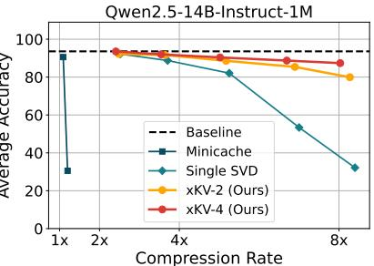

# **xKV: Cross-Layer SVD for KV-Cache Compression**

Chi-Chih Chang1 Chien-Yu Lin2 Yash Akhauri1 Wei-Cheng Lin3 Kai-Chiang Wu3 Luis Ceze2 Mohamed S. Abdelfattah1

Cornell University 2University of Washington

3National Yang Ming Chiao Tung University

## Abstract

Large Language Models (LLMs) with long context windows enable powerful applications but come at the cost of high memory consumption to store the Key and Value states (KV-Cache). Recent studies attempted to merge KV-cache from multiple layers into shared representations, yet these approaches either require expensive pretraining or rely on assumptions of high per-token cosine similarity across layers which generally does not hold in practice. We find that the dominant singular vectors are remarkably well-aligned across multiple layers of the KV-Cache. Exploiting this insight, we propose xKV, a simple post-training method that applies Singular Value Decomposition (SVD) on the KV-Cache of grouped layers. xKV consolidates the KV-Cache of multiple layers into a shared low-rank subspace, significantly reducing KV-Cache sizes. Through extensive evaluations on the RULER long-context benchmark with widely-used LLMs (e.g., Llama-3.1 and Qwen2.5), xKV achieves up to **6.8**× **higher compression rates** than the state-ofthe-art inter-layer technique, while improving accuracy by 2.7%. Moreover, xKV is compatible with the emerging Multi-Head Latent Attention (MLA) (e.g., DeepSeek-Coder-V2), **yielding a notable 3**× **compression rates** on coding tasks without performance degradation. These results highlight xKV's strong capability and versatility in addressing memory bottlenecks for long-context LLM inference. Our code is publicly available at: https://github.com/abdelfattah-lab/xKV.

Figure 1: Accuracy comparison of MiniCache [32], applying SVD on single layer's KV-Cache and xKV (cross-layer SVD) on Llama-3.1-8B-Instruct (left) and Qwen2.5-14B-Instruct-1M (right). Results are averaged across tasks from RULER [25] benchmark.

## 1 Introduction

Large language models (LLMs) [2, 7, 26, 37, 44, 45] have revolutionized numerous artificial intelligence (AI) applications with advanced cognitive capabilities that were previously unattainable with conventional machine learning (ML) models. Recent efforts to extend the context lengths of LLMs

have further expanded their potential: open-sourced models now support up to 1M tokens [\[38,](#page-12-3) [48\]](#page-12-4), and proprietary ones like Gemini push this limit even further to 10M tokens [\[44\]](#page-12-1). These extended context windows unlock a wide range of previously impractical applications, such as large-scale information retrieval and debugging or extending a large-scale codebase [\[15,](#page-8-1) [21,](#page-9-0) [37,](#page-12-0) [48\]](#page-12-4).

However, this expanded capability on long-context introduces significant challenges, particularly in the management of key-Value (KV) caches during inference [\[19,](#page-9-1) [30\]](#page-11-3). Typically, KV states are cached to avoid redundant computations; yet, under extended context lengths, the memory consumption of KV-Cache rapidly becomes prohibitive. This inflated memory footprint severely limits the number of concurrent inference requests, causing substantial throughput reduction. To address this, researchers have proposed various approaches to mitigate the large memory footprint of KV caches. These include quantization [\[13,](#page-8-2) [24,](#page-11-4) [35,](#page-11-5) [52\]](#page-13-0), token eviction [\[3,](#page-7-1) [11,](#page-8-3) [20,](#page-9-2) [31,](#page-11-6) [47,](#page-12-5) [51\]](#page-13-1), and low-rank decomposition [\[12,](#page-8-4) [41,](#page-12-6) [49,](#page-13-2) [50\]](#page-13-3). These approaches have primarily focused on intra-layer redundancies that compress the KV-Cache of each layer separately. While this often yields respectable per-layer compression, these methods do not utilize potential redundancy across layers [\[22\]](#page-11-7).

To effectively exploit cross-layer redundancy, pioneering methods such as Cross-Layer Attention (CLA) [\[10\]](#page-8-5) have introduced novel model architectures that share a single set of KV-Cache across groups of adjacent layers. Another notable approach, MiniCache [\[32\]](#page-11-0), utilizes the assumption of high cosine similarity between KV-Cache pairs in adjacent layers, merging them through spherical linear interpolation (SLERP) [\[40\]](#page-12-7). However, these existing methods present significant limitations. Specifically, they either necessitate expensive model pretraining due to architectural modifications [\[10\]](#page-8-5) or depend heavily on assumptions about KV-Cache similarity [\[32\]](#page-11-0) that often do not hold true in practical scenarios (see [§3\)](#page-2-0). Consequently, these constraints limit their achievable compression rates, come with a high accuracy degradation, or restrict the applicability to existing, pretrained models.

We revisit the inter-layer similarity via Centered Kernel Alignment (CKA) [\[29\]](#page-11-8). Our investigation shows that, despite having low cosine similarities, the KV-Cache of adjacent layers often have high similarities on their underlying dominant singular vectors. By exploiting this alignment, we can share basis vectors of multiple adjacent layers' KV-Cache, yielding a more compact representation. Leveraging these insights, we introduce xKV, a fully *plug-and-play* compression method that requires neither additional fine-tuning nor architectural changes. xKV compresses multiple layers' KV-Cache simultaneously by extracting their shared singular vectors through a cross-layer Singular Value Decomposition (SVD). Crucially, due to the alignment of singular vectors across layers, xKV achieves significantly better compression and accuracy trade-offs compared to applying SVD individually to single layers. Notably, xKV can compress not only pairs of two adjacent layers but also larger groups of layers, further enhancing compression ratios and accuracy retention.

Extensive experiments conducted on the challenging RULER benchmark with widely-used LLMs such as Llama and Qwen demonstrate the capabilities of xKV. Our method achieves up to 6.8× higher compression rates compared to the prior state-of-the-art inter-layer method, while simultaneously improving accuracy by 2.7%. Moreover, on the popular DeepSeek model architecture, which employs multi-head latent attention (MLA) [\[16\]](#page-8-6) and already aggressively reduces KV-Cache size, xKV further attains 3× compression without compromising accuracy, showcasing its versatility and compatibility across diverse attention mechanisms.

