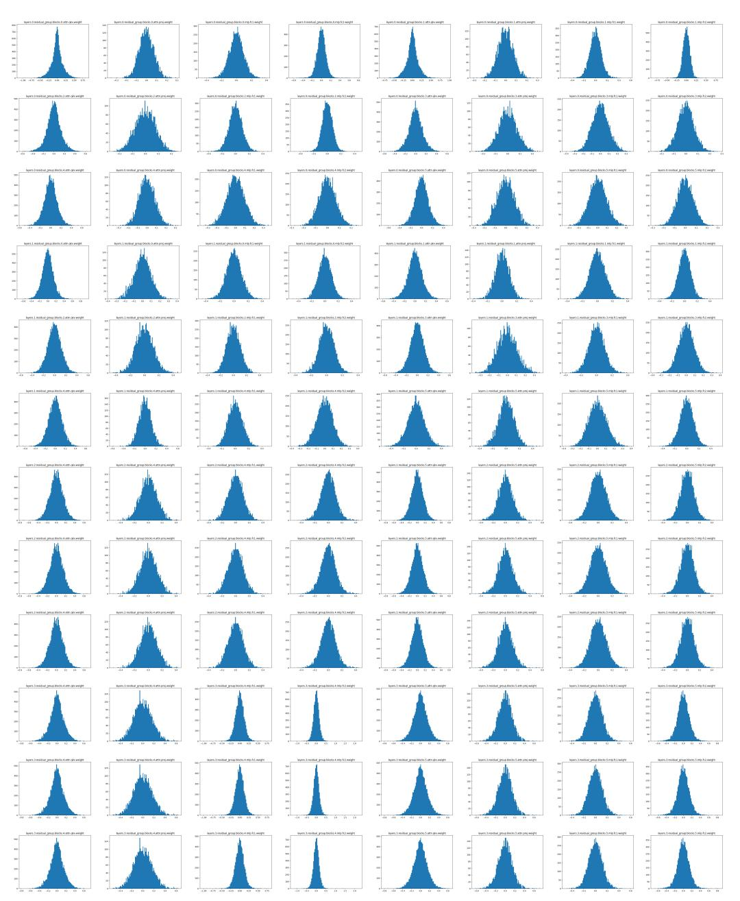
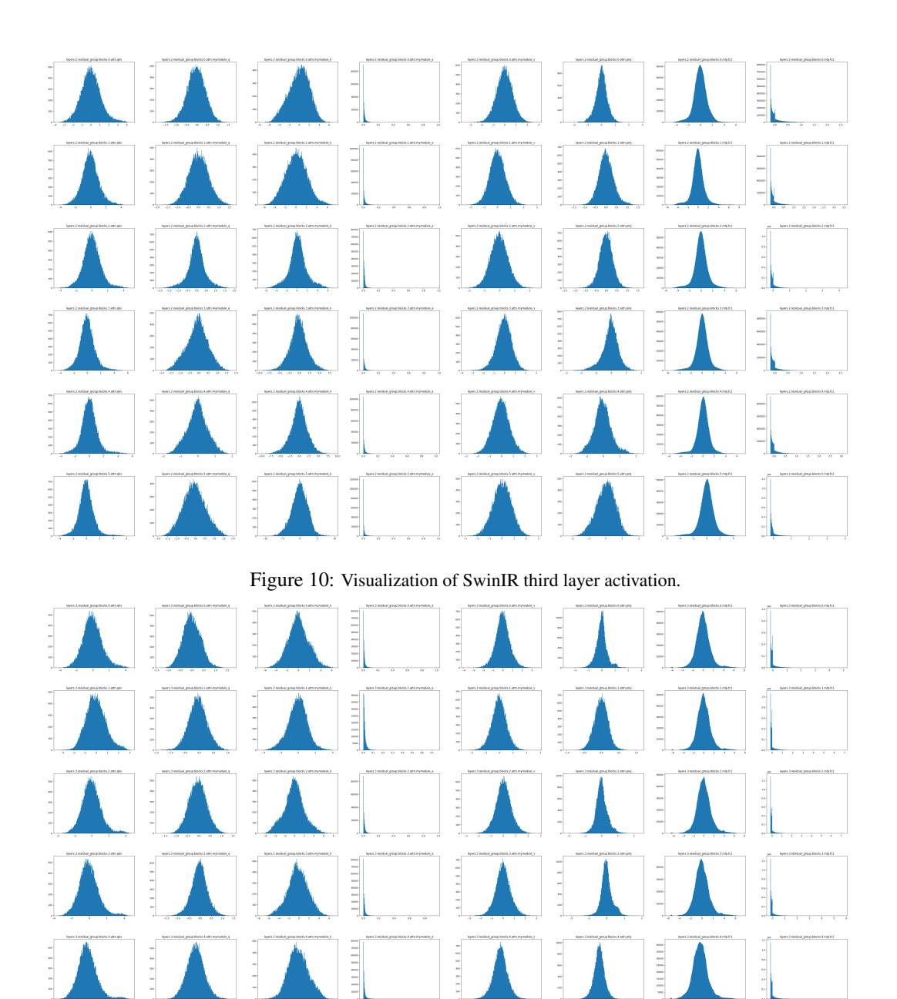

# References

- [1] Wele Gedara Chaminda Bandara and Vishal M. Patel. Hypertransformer: A textural and spectral feature fusion transformer for pansharpening. In *CVPR*, 2022. [1](#page-0-0)
- [2] Marco Bevilacqua, Aline Roumy, Christine Guillemot, and Marie Line Alberi-Morel. Low-complexity single-image super-resolution based on nonnegative neighbor embedding. In *BMVC*, 2012. [6](#page-5-1)
- [3] Zheng Chen, Yulun Zhang, Jinjin Gu, Linghe Kong, Xiaokang Yang, and Fisher Yu. Dual aggregation transformer for image super-resolution. In *CVPR*, 2023. [1](#page-0-0)
- [4] Zheng Chen, Yulun Zhang, Jinjin Gu, Yongbing Zhang, Linghe Kong, and Xin Yuan. Cross aggregation transformer for image restoration. In *NeurIPS*, 2022. [1](#page-0-0)
- [5] Jungwook Choi, Pierce I-Jen Chuang, Zhuo Wang, Swagath Venkataramani, Vijayalakshmi Srinivasan, and Kailash Gopalakrishnan. Bridging the accuracy gap for 2-bit quantized neural networks (qnn). *arXiv*, 2018. [2](#page-1-2)
- [6] Jungwook Choi, Zhuo Wang, Swagath Venkataramani, Pierce I-Jen Chuang, Vijayalakshmi Srinivasan, and Kailash Gopalakrishnan. Pact: Parameterized clipping activation for quantized neural networks. *arXiv preprint arXiv:1805.06085*, 2018. [2](#page-1-2)
- [7] Yoni Choukroun, Eli Kravchik, Fan Yang, and Pavel Kisilev. Low-bit quantization of neural networks for efficient inference. In *ICCVW*, 2019. [1](#page-0-0)
- [8] Matthieu Courbariaux, Itay Hubara, Daniel Soudry, Ran El-Yaniv, and Yoshua Bengio. Binarized neural networks: Training deep neural networks with weights and activations constrained to+ 1 or-1. *arXiv preprint arXiv:1602.02830*, 2016. [4,](#page-3-2) [17](#page-16-0)
- [9] Yifu Ding, Haotong Qin, Qinghua Yan, Zhenhua Chai, Junjie Liu, Xiaolin Wei, and Xianglong Liu. Towards accurate post-training quantization for vision transformer. In *ACM MM*, 2022. [1](#page-0-0)
- [10] Chao Dong, Chen Change Loy, Kaiming He, and Xiaoou Tang. Learning a deep convolutional network for image super-resolution. In *ECCV*, 2014. [1,](#page-0-0) [3](#page-2-2)
- [11] Chao Dong, Chen Change Loy, Kaiming He, and Xiaoou Tang. Image super-resolution using deep convolutional networks. *TPAMI*, 2016. [1,](#page-0-0) [3](#page-2-2)
- [12] Alexey Dosovitskiy, Lucas Beyer, Alexander Kolesnikov, Dirk Weissenborn, Xiaohua Zhai, Thomas Unterthiner, Mostafa Dehghani, Matthias Minderer, Georg Heigold, Sylvain Gelly, et al. An image is worth 16x16 words: Transformers for image recognition at scale. *arXiv*, 2020. [3](#page-2-2)
- [13] Hayit Greenspan. Super-resolution in medical imaging. *The Computer Journal*, 2008. [1](#page-0-0)
- [14] Dan Hendrycks and Kevin Gimpel. Bridging nonlinearities and stochastic regularizers with gaussian error linear units. *CoRR*, 2016. [4](#page-3-2)
- [15] Geoffrey Hinton, Oriol Vinyals, and Jeff Dean. Distilling the knowledge in a neural network. In *NeurIPS Workshop*, 2014. [5](#page-4-2)
- [16] Cheeun Hong, Sungyong Baik, Heewon Kim, Seungjun Nah, and Kyoung Mu Lee. Cadyq: Content-aware dynamic quantization for image super-resolution. In *ECCV*, 2022. [2,](#page-1-2) [3](#page-2-2)
- [17] Cheeun Hong, Heewon Kim, Sungyong Baik, Junghun Oh, and Kyoung Mu Lee. Daq: Channel-wise distribution-aware quantization for deep image super-resolution networks. In *WACV*, 2022. [3](#page-2-2)
- [18] Jia-Bin Huang, Abhishek Singh, and Narendra Ahuja. Single image super-resolution from transformed self-exemplars. In *CVPR*, 2015. [6](#page-5-1)
- [19] Yawen Huang, Ling Shao, and Alejandro F Frangi. Simultaneous super-resolution and cross-modality synthesis of 3d medical images using weakly-supervised joint convolutional sparse coding. In *CVPR*, 2017. [1](#page-0-0)
- [20] Itay Hubara, Yury Nahshan, Yair Hanani, Ron Banner, and Daniel Soudry. Accurate post training quantization with small calibration sets. In *ICML*, 2021. [1](#page-0-0)
- [21] Jithin Saji Isaac and Ramesh Kulkarni. Super resolution techniques for medical image processing. In *ICTSD*, 2015. [1](#page-0-0)
- [22] Benoit Jacob, Skirmantas Kligys, Bo Chen, Menglong Zhu, Matthew Tang, Andrew Howard, Hartwig Adam, and Dmitry Kalenichenko. Quantization and training of neural networks for efficient integerarithmetic-only inference. In *CVPR*, 2018. [3,](#page-2-2) [6,](#page-5-1) [7,](#page-6-1) [8,](#page-7-4) [18](#page-17-0)
- [23] Diederik Kingma and Jimmy Ba. Adam: A method for stochastic optimization. In *ICLR*, 2015. [6](#page-5-1)
- [24] Christian Ledig, Lucas Theis, Ferenc Huszár, Jose Caballero, Andrew Cunningham, Alejandro Acosta, Andrew Aitken, Alykhan Tejani, Johannes Totz, Zehan Wang, and Wenzhe Shi. Photo-realistic single image super-resolution using a generative adversarial network. In *CVPR*, 2017. [2,](#page-1-2) [3](#page-2-2)

- [25] Christian Ledig, Lucas Theis, Ferenc Huszár, Jose Caballero, Andrew Cunningham, Alejandro Acosta, Andrew P Aitken, Alykhan Tejani, Johannes Totz, Zehan Wang, et al. Photo-realistic single image super-resolution using a generative adversarial network. In *CVPR*, 2017. [1](#page-0-0)
- [26] Huixia Li, Chenqian Yan, Shaohui Lin, Xiawu Zheng, Baochang Zhang, Fan Yang, and Rongrong Ji. Pams: Quantized super-resolution via parameterized max scale. In *ECCV*, 2020. [2,](#page-1-2) [3](#page-2-2)
- [27] Rundong Li, Yan Wang, Feng Liang, Hongwei Qin, Junjie Yan, and Rui Fan. Fully quantized network for object detection. In *CVPR*, 2019. [2,](#page-1-2) [6,](#page-5-1) [7,](#page-6-1) [8,](#page-7-4) [18](#page-17-0)
- [28] Yuhang Li, Ruihao Gong, Xu Tan, Yang Yang, Peng Hu, Qi Zhang, Fengwei Yu, Wei Wang, and Shi Gu. Brecq: Pushing the limit of post-training quantization by block reconstruction. In *ICLR*, 2021. [1](#page-0-0)
- [29] Jingyun Liang, Jiezhang Cao, Guolei Sun, Kai Zhang, Luc Van Gool, and Radu Timofte. Swinir: Image restoration using swin transformer. In *ICCVW*, 2021. [1,](#page-0-0) [2,](#page-1-2) [3,](#page-2-2) [6,](#page-5-1) [7](#page-6-1)
- [30] Bee Lim, Sanghyun Son, Heewon Kim, Seungjun Nah, and Kyoung Mu Lee. Enhanced deep residual networks for single image super-resolution. In *CVPRW*, 2017. [2,](#page-1-2) [3,](#page-2-2) [5,](#page-4-2) [6,](#page-5-1) [7](#page-6-1)
- [31] Bee Lim, Sanghyun Son, Heewon Kim, Seungjun Nah, and Kyoung Mu Lee. Enhanced deep residual networks for single image super-resolution. In *CVPRW*, 2017. [6,](#page-5-1) [7](#page-6-1)
- [32] Ze Liu, Yutong Lin, Yue Cao, Han Hu, Yixuan Wei, Zheng Zhang, Stephen Lin, and Baining Guo. Swin transformer: Hierarchical vision transformer using shifted windows. In *ICCV*, 2021. [13](#page-12-0)
- [33] Ilya Loshchilov and Frank Hutter. Sgdr: Stochastic gradient descent with warm restarts. *arXiv*, 2016. [6](#page-5-1)
- [34] David Martin, Charless Fowlkes, Doron Tal, and Jitendra Malik. A database of human segmented natural images and its application to evaluating segmentation algorithms and measuring ecological statistics. In *ICCV*, 2001. [6](#page-5-1)
- [35] Yusuke Matsui, Kota Ito, Yuji Aramaki, Azuma Fujimoto, Toru Ogawa, Toshihiko Yamasaki, and Kiyoharu Aizawa. Sketch-based manga retrieval using manga109 dataset. *Multimedia Tools and Applications*, 2017. [6](#page-5-1)
- [36] Adam Paszke, Sam Gross, Francisco Massa, Adam Lerer, James Bradbury, Gregory Chanan, Trevor Killeen, Zeming Lin, Natalia Gimelshein, Luca Antiga, et al. Pytorch: An imperative style, high-performance deep learning library. *NeurIPS*, 2019. [6](#page-5-1)
- [37] Pejman Rasti, Tõnis Uiboupin, Sergio Escalera, and Gholamreza Anbarjafari. Convolutional neural network super resolution for face recognition in surveillance monitoring. In *AMDO*, 2016. [1](#page-0-0)
- [38] Radu Timofte, Eirikur Agustsson, Luc Van Gool, Ming-Hsuan Yang, Lei Zhang, Bee Lim, Sanghyun Son, Heewon Kim, Seungjun Nah, Kyoung Mu Lee, et al. Ntire 2017 challenge on single image super-resolution: Methods and results. In *CVPRW*, 2017. [3,](#page-2-2) [6](#page-5-1)
- [39] Zhijun Tu, Jie Hu, Hanting Chen, and Yunhe Wang. Toward accurate post-training quantization for image super resolution. In *CVPR*, 2023. [2,](#page-1-2) [3,](#page-2-2) [6,](#page-5-1) [7,](#page-6-1) [8,](#page-7-4) [18](#page-17-0)
- [40] Zhendong Wang, Xiaodong Cun, Jianmin Bao, Wengang Zhou, Jianzhuang Liu, and Houqiang Li. Uformer: A general u-shaped transformer for image restoration. In *CVPR*, 2022. [1](#page-0-0)
- [41] Zhou Wang, Alan C Bovik, Hamid R Sheikh, and Eero P Simoncelli. Image quality assessment: from error visibility to structural similarity. *TIP*, 2004. [6](#page-5-1)
- [42] Syed Waqas Zamir, Aditya Arora, Salman Khan, Munawar Hayat, Fahad Shahbaz Khan, and Ming-Hsuan Yang. Restormer: Efficient transformer for high-resolution image restoration. In *CVPR*, 2022. [1](#page-0-0)
- [43] Roman Zeyde, Michael Elad, and Matan Protter. On single image scale-up using sparse-representations. In *Proc. 7th Int. Conf. Curves Surf.*, 2010. [6](#page-5-1)
- [44] Liangpei Zhang, Hongyan Zhang, Huanfeng Shen, and Pingxiang Li. A super-resolution reconstruction algorithm for surveillance images. *Elsevier Signal Processing*, 2010. [1](#page-0-0)
- [45] Weihong Zhang and Ying Zhou. Chapter 2 - level-set functions and parametric functions. In *The Feature-Driven Method for Structural Optimization*. Elsevier. [4](#page-3-2)
- [46] Yulun Zhang, Kunpeng Li, Kai Li, Lichen Wang, Bineng Zhong, and Yun Fu. Image super-resolution using very deep residual channel attention networks. In *ECCV*, 2018. [1](#page-0-0)
- [47] Yulun Zhang, Yapeng Tian, Yu Kong, Bineng Zhong, and Yun Fu. Residual dense network for image super-resolution. In *CVPR*, 2018. [1](#page-0-0)
- [48] Shuchang Zhou, Yuxin Wu, Zekun Ni, Xinyu Zhou, He Wen, and Yuheng Zou. Dorefa-net: Training low bitwidth convolutional neural networks with low bitwidth gradients. *arXiv preprint arXiv:1606.06160*, 2016. [2](#page-1-2)

### Appendix / Supplemental material

### A Detailed structure of SwinIR

SwinIR comprises three core modules: shallow feature extraction, deep feature extraction, and high-quality (HQ) image reconstruction.

**Shallow and deep feature extraction.** Given a low-quality (LQ) input  $I_{LQ} \in \mathbb{R}^{H \times W \times C_{in}}$  (where H, W, and  $C_{in}$  represent the image height, width, and input channel number, respectively), a  $3 \times 3$  convolutional layer  $H_{SF}(\cdot)$  is employed to extract shallow features  $F_0 \in \mathbb{R}^{H \times W \times C}$  as follows:

$$F_0 = H_{SF}(I_{LO}), \tag{7}$$

where C denotes the number of feature channels. Subsequently, deep features  $F_{DF} \in \mathbb{R}^{H \times W \times C}$  are extracted from  $F_0$  as:

$$F_{DF} = H_{DF}(F_0), \tag{8}$$

where  $H_{DF}(\cdot)$  represents the deep feature extraction module, comprising K residual Swin Transformer blocks (RSTB) and a  $3 \times 3$  convolutional layer. Specifically, intermediate features  $F_1, F_2, \ldots, F_K$  and the output deep feature  $F_{DF}$  are sequentially extracted as follows:

$$F_i = H_{RSTB_i}(F_{i-1}), \quad i = 1, 2, \dots, K,$$
  
 $F_{DF} = H_{CONV}(F_K),$  (9)

where  $H_{RSTB_i}(\cdot)$  denotes the *i*-th RSTB, and  $H_{CONV}$  is the concluding convolutional layer. Incorporating a convolutional layer at the end of feature extraction introduces the inductive bias of the convolution operation into the Transformer-based network, laying a robust foundation for subsequent aggregation of shallow and deep features.

**Image reconstruction.** In the context of image super-resolution (SR), the high-quality image  $I_{RHQ}$  is reconstructed by combining shallow and deep features as follows:

$$I_{RHQ} = H_{REC}(F_0 + F_{DF}), \tag{10}$$

where  $H_{REC}(\cdot)$  is the reconstruction module's function. The reconstruction module is implemented using a sub-pixel convolution layer to upsample the feature. Additionally, residual learning is utilized to reconstruct the residual between the LQ and HQ images instead of the HQ image itself, formulated as:

$$I_{RHQ} = H_{SwinIR}(I_{LQ}) + I_{LQ}, \tag{11}$$

where  $H_{SwinIR}(\cdot)$  represents the SwinIR function.

### A.1 Residual Swin Transformer block

The residual Swin Transformer block (RSTB) is a residual block incorporating Swin Transformer layers (STL) and convolutional layers. Given the input feature  $F_{i,0}$  of the i-th RSTB, intermediate features  $F_{i,1}, F_{i,2}, \ldots, F_{i,L}$  are first extracted by L Swin Transformer layers as follows:

$$F_{i,j} = H_{STL_{i,j}}(F_{i,j-1}), \quad j = 1, 2, \dots, L,$$
 (12)

where  $H_{STL_{i,j}}(\cdot)$  is the *j*-th Swin Transformer layer in the *i*-th RSTB. A convolutional layer is added before the residual connection, and the output of RSTB is formulated as:

$$F_{i,out} = H_{CONV_i}(F_{i,L}) + F_{i,0},$$
 (13)

where  $H_{CONV_i}(\cdot)$  is the convolutional layer in the *i*-th RSTB.

**Swin Transformer layer.** Given an input of size  $H \times W \times C$ , the Swin Transformer first reshapes the input into a  $\frac{HW}{M^2} \times M^2 \times C$  feature by partitioning the input into non-overlapping  $M \times M$  local windows, where  $\frac{HW}{M^2}$  is the total number of windows. It then computes the standard self-attention for each window (i.e., local attention). For a local window feature  $X \in \mathbb{R}^{M^2 \times C}$ , the *query*, *key*, and *value* matrices Q, K, and V are computed as follows:

$$Q = XP_Q, \quad K = XP_K, \quad V = XP_V, \tag{14}$$

where  $P_Q$ ,  $P_K$ , and  $P_V$  are projection matrices shared across different windows. Typically,  $Q, K, V \in \mathbb{R}^{M^2 \times d}$ . The attention matrix is then computed via the self-attention mechanism within a local window as follows:

$$Attention(Q, K, V) = SoftMax(QK^{T}/\sqrt{d} + B)V,$$
 (15)

where B is the learnable relative positional encoding. In practice, the attention function is performed h times in parallel, and the results are concatenated for multi-head self-attention (MSA).

Next, a multi-layer perceptron (MLP) with two fully-connected layers and GELU non-linearity between them is used for further feature transformations. The LayerNorm (LN) layer is added before both MSA and MLP, with residual connections employed for both modules. The entire process is formulated as:

$$X = MSA(LN(X)) + X,$$
  

$$X = MLP(LN(X)) + X.$$
(16)

However, when the partition is fixed across different layers, there are no connections between local windows. Thus, regular and shifted window partitioning are used alternately to enable cross-window connections [32], with shifted window partitioning involving shifting the feature by  $(\lfloor \frac{M}{2} \rfloor, \lfloor \frac{M}{2} \rfloor)$  pixels before partitioning.

### A.2 Our settings

We use the SwinIR light version provided by the original authors. The light version has only 4 RSTBs in the body part while for each RSTB, there are only 6 STLs. For each STL's MSA, the number of heads is 6, the embedding dimension is 60, the window size is 8, and the MLP ratio is 2.

## B Detailed distribution of weights and activations

In code implementation, the RSTB is called layers while the STL is called blocks. We visualize all layers' distribution of the pre-trained SwinIR light model's weights in Figure 7. Bias is ignored as it is not quantized. Also, we visualize the distribution of activations from 32 image patches with a size of  $3 \times 64 \times 64$  in Figure 8, Figure 9, Figure 10, and Figure 11.

We can safely ignore the detailed value of each axis but just care about the shape of distributions.

Figure 7: Visualization of SwinIR weights.

Figure 8: Visualization of SwinIR first layer activation.

Figure 9: Visualization of SwinIR second layer activation.

Figure 11: Visualization of SwinIR fourth layer activation.

