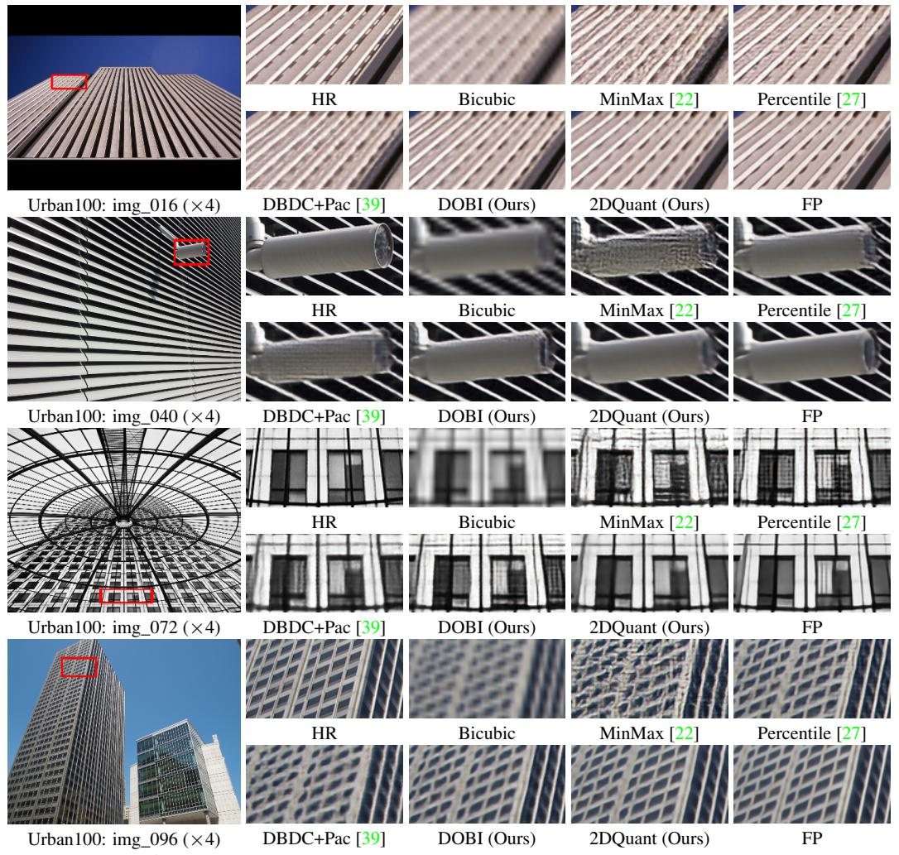

# C The derivation of the backward gradient propagation formula

In this section, we provide the derivation of our backpropagation formula.We follow the STE [\[8\]](#page-9-18) style to process the round term, which is

$$\frac{\partial \text{Round (x)}}{\partial x} = 1 \tag{17}$$

As for the clip function, we take a similar approach, which is

$$\frac{\partial \operatorname{Clip}(x,l,u)}{\partial x} = \begin{cases} 1 & \text{if } l \leq x \leq u \\ 0 & \text{if } x < l \text{ or } x > u \end{cases}$$

$$\frac{\partial \operatorname{Clip}(x,l,u)}{\partial l} = \begin{cases} 1 & \text{if } x < l \\ 0 & \text{if } x \geq l \end{cases}$$

$$\frac{\partial \operatorname{Clip}(x,l,u)}{\partial u} = \begin{cases} 1 & \text{if } x > u \\ 0 & \text{if } x \leq u \end{cases}$$

$$\frac{\partial \operatorname{Clip}(x,l,u)}{\partial u} = \begin{cases} 1 & \text{if } x > u \\ 0 & \text{if } x \leq u \end{cases}$$
(18)

With Eqs. [\(1\)](#page-2-1), [\(17\)](#page-16-1), and [\(18\)](#page-16-2), we first derive ∂vq ∂u

$$\frac{\partial v_q}{\partial u} = \frac{\partial}{\partial u} \left( \frac{u - l}{2^N - 1} v_r + l \right)$$

$$= \frac{1}{2^N - 1} v_r + \frac{u - l}{2^N - 1} \frac{\partial v_r}{\partial u}$$

$$= \frac{1}{2^N - 1} v_r + \frac{u - l}{2^N - 1} \left( -\frac{2^N - 1}{(u - l)^2} (v_c - l) + \frac{2^N - 1}{u - l} \frac{\partial v_c}{\partial u} \right)$$

$$= \frac{\partial v_c}{\partial u} + \frac{1}{2^n - 1} v_r - \frac{v_c - l}{u - l}$$
(19)

∂vq ∂l can be derived roughly the same, which can be written as

$$\frac{\partial v_q}{\partial l} = \frac{\partial}{\partial l} \left( \frac{u - l}{2^N - 1} v_r + l \right) 
= -\frac{1}{2^N - 1} v_r + \frac{u - l}{2^N - 1} \frac{\partial v_r}{\partial u} + 1 
= -\frac{1}{2^N - 1} v_r + \frac{u - l}{2^N - 1} \left( \frac{2^N - 1}{(u - l)^2} (v_c - l) + \frac{2^N - 1}{u - l} (\frac{\partial v_c}{\partial u} - 1) \right) + 1 
= \frac{\partial v_c}{\partial u} - \frac{1}{2^n - 1} v_r + \frac{v_c - l}{u - l}$$
(20)

## D More visual examples

We provide more visual illustrations to demonstrate the superiority of our method, as shown in Figure [12.](#page-17-1) In img\_016, our method does not distort straight lines. In img\_040, our method does not introduce noise to the camera and does not alter the shape at the camera lens. In img\_072, we once again outperform the full-precision model by not adding vertical stripes to the curtains. In img\_096, we ensure the shape of each window to the greatest extent. These images prove that we can surpass the current SOTA methods in visual effects and avoid misleading results in some tricky cases, generating correct results.

Figure 12: Visual comparison for image SR (×4) in some challenging cases.