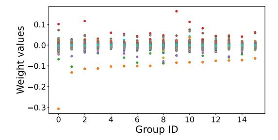
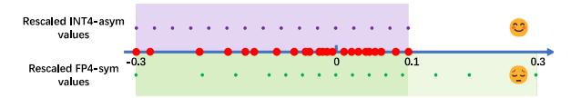

# 2 Background and Motivation

Model quantization methods. Quantization is a process that reduces the precision of Deep Neural Network (DNN) weights to decrease model size and accelerate model inference (Han et al., 2015; Jacob et al., 2018). Existing quantization methods can be broadly categorized into two types: Post Training Quantization (PTQ) and Quantization Aware Training (QAT) (Bengio et al., 2013; Gholami et al., 2022). QAT necessitates model training, which can be expensive, whereas PTQ does not. We focus on PTQ in this work.

Quantization of LLMs. There are two methods for quantizing LLMs: 1) Quantizing both weights (W) and activations (A), for example, W8A8 quantization (Dettmers et al., 2022; Xiao et al., 2023); 2) W-only quantization, for example, W4A16 one (Dettmers and Zettlemoyer, 2023). This article focuses on the W-only method. The naive W-only method is RTN. The advanced methods include GPTQ (Frantar et al., 2022) and AWQ (Lin et al., 2023). GPTQ uses second-order information to compensate for the error of quantized weights, while AWQ scales salient weights before quantization. Both methods use INT for quantization.

**Low-bit Formats.** The current mainstream quantization formats include low-bit INT and FP (Yao et al., 2022; Wu et al., 2023). INT is uniformly

distributed, while FP, with its exponent and mantissa design, has a distribution that is dense near zero and sparse far from it. In addition, some new formats have also emerged, such as NF (Dettmers et al., 2021), a new type of FP formats designed based on normal number distribution.

Lack of asymmetry for FP quantization In the weight tensors of LLMs, outliers often appear (Lin et al., 2023; Dettmers et al., 2023). Due to the randomness of these outliers, many weight tensors exhibit an asymmetric distribution of maximum and minimum values. This phenomenon is particularly noticeable when the group size is small. In Figure 2, we have randomly selected some LLaMA2 weight groups. It can be observed that more than 50% of the groups exhibit an asymmetric value distribution.

Figure 2: Randomly selected weight groups (groupsize is 128) from LLaMA2-7B. It is obvious that the maximum and minimum values in many groups are not symmetric about zero.

Figure 3: Red points are original asymmetric weight values. Recaled INT4-asym covers the weight values well, but the coverage range of rescaled FP4-sym exceeds the range of weight values, thus wasting values in FP formats.

For INT, asymmetric quantization with one zeropoint (for range translation) and one scale (for scaling) for each weight group can fit the asymmetric tensor distribution well. For example, if we apply asymmetric INT quantization to asymmetric weights in Figure 3, the original weights will be fully covered by the rescaled asymmetric INT (INTasym) values. However, when applying previous FP quantization (only one scale for scaling)12, the

https://github.com/openppl-public/ppq
https://github.com/TimDettmers/

range of rescaled symmetric FP (FP-sym) values exceeds the range of original weights, leading to a waste of the expressive ability of some FP values. Therefore, asymmetric FP quantization should be introduced for LLMs.

