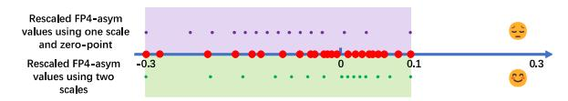

# 3 Asymmetric Floating Point Quantization

To make FP quantization applicable to the asymmetric distribution of LLM weights, an intuitive approach is to apply the method with one scale and zero-point used in asymmetric INT quantization to FP quantization, as shown in the purple section of Figure 4. However, this approach would shift the dense number area of FP from zero to the left of zero, eliminating the advantages of using FP formats. This might make FP less suitable for the value distribution of LLM weights. This phenomenon will be demonstrated in Section 4.

To preserve the advantage of FP formats, we propose asymmetric FP quantization with two separate scales, one for positive numbers and another for negative numbers in each weight group. In this way, the rescaled FP-asym values from AFPQ can better fit the distribution of original weights, as is shown in Figure 4 green section. The quantization algorithm is shown in Appendix B. The benefits of AFPQ include: 1) Enhanced FP quantization accuracy; 2) No additional storage overhead compared with asymmetric INT quantization (both need two parameters for one group).

Figure 4: Red points are original asymmetric weight values. Recaled FP4-asym using two scales gathers more values near zero than the FP4-asym using one scale and zero-point, which aligns with the distribution of LLMs weights more.

As AFPQ operates on each individual sub-tensor or group, it can work as a plugin to other high-level quantization algorithms such GPTQ (Frantar et al., 2022) and AWQ (Lin et al., 2023). To demonstrate the applicability, we integrate AFPQ with GPTQ and AWQ for better quantization accuracy for LLMs. To validate the inference efficiency, we have implemented an low-bit FP-asym inference system.

bitsandbytes

