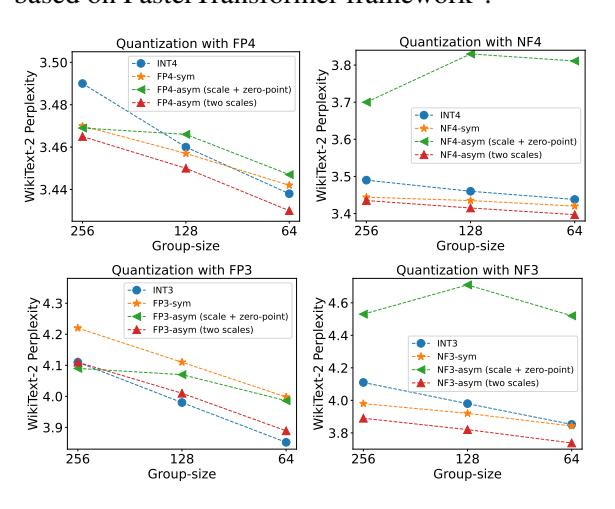

# 4 Experiments

**Experimental setup.** We focus on 4-/3-bit PTQ since they can mostly preserve the performance of LLMs (Dettmers and Zettlemoyer, 2023). The formats we use are shown in Appendix A. We select LLaMA2 (Touvron et al., 2023) models for basic evaluation because of their superior performance among open-sourced LLMs (Zhang et al., 2022; Scao et al., 2022). We also include WizardCoder (Luo et al., 2023) and Meta-Math (Yu et al., 2023) models for further evaluation. The validation datasets or benchmarks in this section include WikiText-2 (Merity et al., 2016), MMLU (Hendrycks et al., 2021), HumanEval (Chen et al., 2021), and gsm8k (Cobbe et al., 2021). Besides vanilla RTN quantization, we further include experiments based on GPTQ (Frantar et al., 2022) and AWQ (Lin et al., 2023). We conduct quantization experiments on AutoGPTQ project3. Our inference system implementation is based on FasterTransformer framework4.

Figure 5: When quantizing LLaMA2-70B, FP-asym and NF-asym quantization with two scales shows lower perplexity (ppl) on WikiText-2 (the lower the better).

Comparisons between AFPQ with two scales and the one with scale + zero-point. We evaluate LLaMA2-70B with these two methods using the RTN quantization on WikiText-2 perplexity following Frantar et al. (2022). As shown in Figure 5, quantization using FP-asym with two scales brings better quantization accuracy in both 4-bit and 3-bit grouped quantization for FP and NF formats. For simplicity, asymmetric FP quantization mentioned below is the one using two scales. Note that the

FasterTransformer

https://github.com/PanQiWei/AutoGPTQ

4https://github.com/NVIDIA/

Table 1: WikiText-2 perplexity and MMLU average accuracy on LLaMA2 models after 4-bit RTN quantization.

|              |          |       | LLaMA2-7B |       |       |       | LLaMA2-13B |       |       |       | LLaMA2-70B |       |       |  |
|--------------|----------|-------|-----------|-------|-------|-------|------------|-------|-------|-------|------------|-------|-------|--|
|              |          | g-1   | g256      | g128  | g64   | g-1   | g256       | g128  | g64   | g-1   | g256       | g128  | g64   |  |
|              | FP16     | 5.47  |           |       |       | 4.88  |            |       |       | 3.32  |            |       |       |  |
| WikiText-2↓  | INT4     | 6.12  | 5.75      | 5.72  | 5.67  | 5.20  | 5.02       | 4.98  | 4.97  | 3.67  | 3.49       | 3.46  | 3.44  |  |
| WIKITEAU-2 ↓ | NF4-sym  | 5.87  | 5.68      | 5.66  | 5.65  | 5.09  | 5.01       | 4.99  | 4.98  | 3.52  | 3.44       | 3.44  | 3.42  |  |
|              | NF4-asym | 5.77  | 5.67      | 5.66  | 5.64  | 5.07  | 5.00       | 4.98  | 4.97  | 3.51  | 3.44       | 3.42  | 3.40  |  |
|              | FP16     |       | 46.58     |       |       |       | 55.38      |       |       |       | 69.58      |       |       |  |
| MMLU(%)↑     | INT4     | 40.31 | 43.67     | 45.28 | 45.59 | 52.92 | 54.09      | 54.33 | 54.44 | 67.82 | 68.43      | 68.32 | 68.53 |  |
| WINIEC(N)    | NF4-sym  | 43.04 | 43.94     | 45.09 | 45.70 | 53.59 | 54.37      | 54.58 | 54.84 | 67.96 | 68.41      | 68.66 | 69.18 |  |
|              | NF4-asym | 45.05 | 43.53     | 45.42 | 46.12 | 54.10 | 54.93      | 54.71 | 55.03 | 67.78 | 68.64      | 68.81 | 68.93 |  |

Table 2: WikiText-2 perplexity and MMLU average accuracy on LLaMA2 models after 3-bit RTN quantization.

|              |          | LLaMA2-13B |       |       |       | LLaMA2-70B |       |       |       |       |       |       |       |
|--------------|----------|------------|-------|-------|-------|------------|-------|-------|-------|-------|-------|-------|-------|
|              |          | g-1        | g256  | g128  | g64   | g-1        | g256  | g128  | g64   | g-1   | g256  | g128  | g64   |
|              | FP16     |            | 4.88  |       |       |            | 3.32  |       |       |       |       |       |       |
| WikiText-2↓  | INT3     | 542.80     | 7.10  | 6.66  | 6.40  | 10.68      | 5.67  | 5.52  | 5.39  | 7.53  | 4.11  | 3.98  | 3.85  |
| WIKI IEXI-2↓ | NF3-sym  | 74.27      | 6.74  | 6.45  | 6.26  | 7.73       | 5.53  | 5.43  | 5.35  | 8.38  | 3.98  | 3.92  | 3.85  |
|              | NF3-asym | 9.85       | 6.42  | 6.29  | 6.15  | 6.53       | 5.46  | 5.35  | 5.27  | 5.42  | 3.89  | 3.82  | 3.74  |
|              | FP16     | 46.58      |       |       | 55.38 |            |       |       | 69.58 |       |       |       |       |
| MMLU(%)↑     | INT3     | 25.22      | 37.46 | 38.50 | 40.06 | 27.79      | 48.91 | 51.23 | 50.77 | 34.39 | 64.77 | 65.05 | 66.16 |
| WINILO(70)   | NF3-sym  | 26.20      | 36.85 | 38.61 | 38.47 | 38.96      | 49.84 | 50.97 | 51.72 | 40.63 | 66.40 | 65.90 | 66.92 |
|              | NF3-asym | 30.31      | 38.58 | 41.61 | 41.11 | 42.74      | 52.31 | 52.60 | 53.3  | 56.07 | 66.23 | 66.78 | 66.43 |

performance of the FP3 formats is still worse than INT3, this is because FP3 can only represent 7 values for quantization, whereas INT3 and NF3 can represent 8. To ensure a fair comparison, the remaining quantization experiments in this section are conducted using INT and NF formats.

Results across various group-sizes and bitwidths using RTN quantization. To demonstrate the generality of our method, we evaluate our AFPQ using RTN on LLaMA2 models with different bit-widths and group-sizes. The evaluation focuses on WikiText-2 and MMLU benchmark with in-context learning (5-shot) following Lin et al. (2023). We provide the 4-bit and 3-bit results in Table 1 and Table 2, respectively. For both bitwidths, quantization with NF-asym achieves better or on-par results in all settings. It performs even better when model size is smaller and bit-width is smaller. For example, NF3-asym with group-size 128 can lead to 3% MMLU accuracy improvement for LLaMA2-7B (a model size well-suited for edge deployments (Dettmers et al., 2023)) compared with INT3 and NF3-sym quantization. The conclusions of FP4 and FP3 are similar to NF formats, which are shown in Appendix C.

**Results of applying AFPQ to GPTQ and AWQ.** Although being effective PTQ methods, there is still an accuracy gap between FP16 LLMs and quantized ones using GPTQ or AWQ. In Table 3 and Table 4, We try to improve these methods by replacing the INT3 quantization with NF3-

Table 3: WikiText-2 perplexity and MMLU average accuracy on LLaMA2-70B after we integrate asymmetric FP quantization with **GPTQ**.

|                          |          | LLaMA2-70B |       |       |       |  |  |  |  |
|--------------------------|----------|------------|-------|-------|-------|--|--|--|--|
|                          |          | g-1        | g256  | g128  | g64   |  |  |  |  |
| FP16: 3.32 NF3-asyn      | INT3     | 4.57       | 3.88  | 3.77  | 3.67  |  |  |  |  |
|                          | NF3-sym  | 4.16       | 3.77  | 3.72  | 3.67  |  |  |  |  |
|                          | NF3-asym | 4.07       | 3.73  | 3.66  | 3.61  |  |  |  |  |
| MMI 11(0/.) A            | INT3     | 60.10      | 66.65 | 67.25 | 67.75 |  |  |  |  |
| MMLU(%) ↑ FP16: 69.58 | NF3-sym  | 64.45      | 67.03 | 67.42 | 67.72 |  |  |  |  |
|                          | NF3-asym | 64.95      | 67.33 | 68.05 | 68.03 |  |  |  |  |

Table 4: WikiText-2 perplexity and MMLU average accuracy on LLaMA2-70B after we integrate asymmetric FP quantization with **AWQ**.

|                           |          | LLaMA2-70B |       |       |       |  |  |  |  |
|---------------------------|----------|------------|-------|-------|-------|--|--|--|--|
|                           |          | g-1        | g256  | g128  | g64   |  |  |  |  |
| WikiText-2↓ FP16: 3.32 | INT3     | 4.91       | 4.10  | 3.87  | 3.72  |  |  |  |  |
|                           | NF3-sym  | 4.26       | 4.03  | 3.83  | 3.71  |  |  |  |  |
|                           | NF3-asym | 4.18       | 3.87  | 3.74  | 3.65  |  |  |  |  |
| MMI 11(%) A               | INT3     | 59.08      | 65.15 | 66.45 | 67.40 |  |  |  |  |
| MMLU(%) ↑ FP16: 69.58  | NF3-sym  | 62.60      | 65.02 | 65.88 | 67.66 |  |  |  |  |
|                           | NF3-asym | 63.57      | 66.56 | 67.00 | 67.41 |  |  |  |  |

asym ones in GPTQ and AWQ, respectively. We evaluate LLaMA2-70B with WikiText-2 perplexity and MMLU (5-shot) accuracy. Note that the INT3 or NF3 baseline is already strong, our NF3-asym quantization can still raise the performance to a higher level. For group-size 128, the commonly used setting in Frantar et al. (2022); Lin et al. (2023), our method can reduce WikiText-2 ppl by 0.11 from GPTQ-INT3 and 0.13 from AWQ-INT3, which should be considered significant.

## Results in coding and mathematical tasks.

As quantization may hurt LLMs' performance in difficult downstream tasks, such as coding and mathematical ones, we also evaluate AFPQ on the WizardCoder-7B model and the MetaMath-7B model in Table 5. The benchmark for WizardCoder and MetaMath is HumanEval and gsm8k, respectively. We use AWQ with NF3-asym in the group-size-64 quantization. We can see that NF3-asym helps reach the highest quantization accuracy in both tasks. Notably, the accuracy of quantized WizardCoder-7B is enhanced by 4.87% compared with AWQ-INT3, which strongly proves the effectiveness of our method.

Table 5: Evaluation results on WizardCoder-7B and MetaMath-7B after 3-bit AWQ with group-size of 64. For WizardCoder-7B, we show the percentage of pass rates on the HumanEval. For MetaMath-7B, we show the testing accuracy on gsm8k.

|                  | FP16  | INT3  | NF3-sym | NF3-asym |
|------------------|-------|-------|---------|----------|
| WizardCoder-7B ↑ |       |       | 45.12   | 52.43    |
| MetaMath-7B ↑    | 66.41 | 63.52 | 60.86   | 64.53    |

Efficiency evaluation. Since our AFPO method needs to store two parameters (two scales) for each quantization group, the same as the asymmetric INT quantization (one scale and one zero-point), no additional storage is needed for our method compared with the INT-asym one. As for the inference speed, since low-bit NF-based kernels have not been proposed in previous work, we develop these kernels and integrate them into FasterTransformer framework. The implementation details can be found in Appendix D. We measure the end-toend latency of LLaMA2 models on a single A6000 GPU. We keep the batch size to be 1, the input sequence length to be 128, and a uniform output token count of 20. In Table 6, our AFPQ method with NF4-asym achieves up to 1.62x speedup compared with FP16 baseline. Although it incurs inference overhead compared with INT4-/NF4-sym-based system, we believe the gap can be narrowed with kernel optimizations, which we leave it as a future work.

Table 6: Inference latency (ms) of LLaMA2-7B and LLaMA2-13B under different formats

|            | FP16   | INT4   | NF4-sym | NF4-asym |
|------------|--------|--------|---------|----------|
| LLaMA2-7B  | 415.06 | 174.29 | 187.23  | 265.54   |
| LLaMA2-13B | 788.01 | 309.87 | 317.15  | 485.42   |

#### 5 Conclusion

In this study, we identify that the lack of asymmetry in previous FP quantization can lead to poor quantization for LLM weight tensors with asymmetric distribution. To solve the problem, we propose asymmetric FP quantization which sets separate scales for positive and negative values. Our method can be easily plugged into other effective methods, including GPTQ and AWQ, for performance improvements. AFPQ enhances LLM quantization results and needs no additional storage compared with asymmetric INT quantization.

#### References

Yoshua Bengio, Nicholas Léonard, and Aaron Courville. 2013. Estimating or propagating gradients through stochastic neurons for conditional computation. *arXiv* preprint arXiv:1308.3432.

Mark Chen, Jerry Tworek, Heewoo Jun, Qiming Yuan, Henrique Ponde de Oliveira Pinto, Jared Kaplan, Harri Edwards, Yuri Burda, Nicholas Joseph, Greg Brockman, et al. 2021. Evaluating large language models trained on code. *arXiv preprint arXiv:2107.03374*.

Karl Cobbe, Vineet Kosaraju, Mohammad Bavarian, Mark Chen, Heewoo Jun, Lukasz Kaiser, Matthias Plappert, Jerry Tworek, Jacob Hilton, Reiichiro Nakano, Christopher Hesse, and John Schulman. 2021. Training verifiers to solve math word problems. arXiv preprint arXiv:2110.14168.

Tim Dettmers, Mike Lewis, Younes Belkada, and Luke Zettlemoyer. 2022. Llm. int8 (): 8-bit matrix multiplication for transformers at scale. *arXiv preprint arXiv:2208.07339*.

Tim Dettmers, Mike Lewis, Sam Shleifer, and Luke Zettlemoyer. 2021. 8-bit optimizers via block-wise quantization. *arXiv preprint arXiv:2110.02861*.

Tim Dettmers, Ruslan Svirschevski, Vage Egiazarian, Denis Kuznedelev, Elias Frantar, Saleh Ashkboos, Alexander Borzunov, Torsten Hoefler, and Dan Alistarh. 2023. Spqr: A sparse-quantized representation for near-lossless llm weight compression. *arXiv* preprint arXiv:2306.03078.

Tim Dettmers and Luke Zettlemoyer. 2023. The case for 4-bit precision: k-bit inference scaling laws. In *International Conference on Machine Learning*, pages 7750–7774. PMLR.

Elias Frantar, Saleh Ashkboos, Torsten Hoefler, and Dan Alistarh. 2022. Gptq: Accurate post-training quantization for generative pre-trained transformers. *arXiv preprint arXiv:2210.17323*.

- Amir Gholami, Sehoon Kim, Zhen Dong, Zhewei Yao, Michael W Mahoney, and Kurt Keutzer. 2022. A survey of quantization methods for efficient neural network inference. In *Low-Power Computer Vision*, pages 291–326. Chapman and Hall/CRC.
- Song Han, Huizi Mao, and William J Dally. 2015. Deep compression: Compressing deep neural networks with pruning, trained quantization and huffman coding. *arXiv preprint arXiv:1510.00149*.
- Dan Hendrycks, Collin Burns, Steven Basart, Andy Zou, Mantas Mazeika, Dawn Song, and Jacob Steinhardt. 2021. Measuring massive multitask language understanding. *Proceedings of the International Conference on Learning Representations (ICLR)*.
- Benoit Jacob, Skirmantas Kligys, Bo Chen, Menglong Zhu, Matthew Tang, Andrew Howard, Hartwig Adam, and Dmitry Kalenichenko. 2018. Quantization and training of neural networks for efficient integer-arithmetic-only inference. In *Proceedings of the IEEE conference on computer vision and pattern recognition*, pages 2704–2713.
- Ji Lin, Jiaming Tang, Haotian Tang, Shang Yang, Xingyu Dang, and Song Han. 2023. Awq: Activationaware weight quantization for llm compression and acceleration. *arXiv preprint arXiv:2306.00978*.
- Ziyang Luo, Can Xu, Pu Zhao, Qingfeng Sun, Xiubo Geng, Wenxiang Hu, Chongyang Tao, Jing Ma, Qingwei Lin, and Daxin Jiang. 2023. Wizardcoder: Empowering code large language models with evolinstruct. *arXiv preprint arXiv:2306.08568*.
- Stephen Merity, Caiming Xiong, James Bradbury, and Richard Socher. 2016. Pointer sentinel mixture models. *arXiv preprint arXiv:1609.07843*.
- Baptiste Rozière, Jonas Gehring, Fabian Gloeckle, Sten Sootla, Itai Gat, Xiaoqing Ellen Tan, Yossi Adi, Jingyu Liu, Tal Remez, Jérémy Rapin, et al. 2023. Code llama: Open foundation models for code. *arXiv preprint arXiv:2308.12950*.
- Teven Le Scao, Angela Fan, Christopher Akiki, Ellie Pavlick, Suzana Ilic, Daniel Hesslow, Roman ´ Castagné, Alexandra Sasha Luccioni, François Yvon, Matthias Gallé, et al. 2022. Bloom: A 176bparameter open-access multilingual language model. *arXiv preprint arXiv:2211.05100*.
- Hugo Touvron, Thibaut Lavril, Gautier Izacard, Xavier Martinet, Marie-Anne Lachaux, Timothée Lacroix, Baptiste Rozière, Naman Goyal, Eric Hambro, Faisal Azhar, et al. 2023. Llama: Open and efficient foundation language models. *arXiv preprint arXiv:2302.13971*.
- Xiaoxia Wu, Zhewei Yao, and Yuxiong He. 2023. Zeroquant-fp: A leap forward in llms post-training w4a8 quantization using floating-point formats. *arXiv preprint arXiv:2307.09782*.

- Guangxuan Xiao, Ji Lin, Mickael Seznec, Hao Wu, Julien Demouth, and Song Han. 2023. Smoothquant: Accurate and efficient post-training quantization for large language models. In *International Conference on Machine Learning*, pages 38087–38099. PMLR.
- Zhewei Yao, Reza Yazdani Aminabadi, Minjia Zhang, Xiaoxia Wu, Conglong Li, and Yuxiong He. 2022. Zeroquant: Efficient and affordable post-training quantization for large-scale transformers. *Advances in Neural Information Processing Systems*, 35:27168– 27183.
- Longhui Yu, Weisen Jiang, Han Shi, Jincheng Yu, Zhengying Liu, Yu Zhang, James T Kwok, Zhenguo Li, Adrian Weller, and Weiyang Liu. 2023. Metamath: Bootstrap your own mathematical questions for large language models. *arXiv preprint arXiv:2309.12284*.
- Susan Zhang, Stephen Roller, Naman Goyal, Mikel Artetxe, Moya Chen, Shuohui Chen, Christopher Dewan, Mona Diab, Xian Li, Xi Victoria Lin, et al. 2022. Opt: Open pre-trained transformer language models. *arXiv preprint arXiv:2205.01068*.
- Yijia Zhang, Lingran Zhao, Shijie Cao, Wenqiang Wang, Ting Cao, Fan Yang, Mao Yang, Shanghang Zhang, and Ningyi Xu. 2023. Integer or floating point? new outlooks for low-bit quantization on large language models. *arXiv preprint arXiv:2305.12356*.

## **Appendix**

#### Low-bit formats used in this work

In this work, we use FP4 E2M1 and FP3 E2M0 formats. Both excludes NaN and Inf following Zhang et al. (2023). For NF formats, we use the values from Bitsandbytes5. The exact values of the INT, FP and NF formats used in our experiments are as follows:

**INT4:** [-8, -7, -6, -5, -4, -3, -2, -1, 0, 1, 2, 3, 4, 5, 6, 71

**FP4:** [-6, -4, -3, -2, -1.5, -1, -0.5, 0, 0.5, 1, 1.5, 2, 3, 4, 6]

NF4: [-1,-0.6961928009986877, 0.5250730514526367. -0.39491748809814453. -0.28444138169288635, -0.18477343022823334, -0.09105003625154495, 0, 0.07958029955625534, 0.16093020141124725, 0.24611230194568634, 0.33791524171829224, 0.44070982933044434, 0.5626170039176941, 0.7229568362236023, 1]

**INT3:** [-4, -3, -2, -1, 0, 1, 2, 3] **FP3:** [-4, -2, -1, 0, 1, 2, 4]

NF3: [-1,-0.5350227355957031, 0.2469314038753510, 0, 0.1833375245332718, 0.3819939494132996, 0.6229856610298157, 1]

