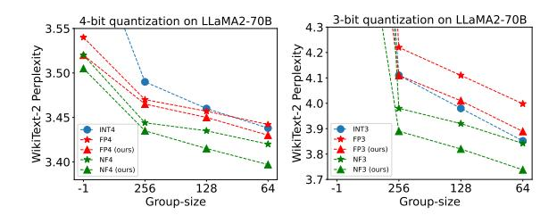

# **AFPQ: Asymmetric Floating Point Quantization for LLMs**

Yijia Zhang†, Sicheng Zhang†, Shijie Cao‡, Dayou Du§, Jianyu Wei¶, Ting Cao‡, Ningyi Xu†

†Shanghai Jiao Tong University †Microsoft Research Asia

§The Hong Kong University of Science and Technology (Guangzhou)

§The Hong Kong University of Science and Technology (Guangzhou)

¶University of Science and Technology of China

{zhangyijia, zhangsicheng, xuningyi}@sjtu.edu.cn, {shijiecao, ting.cao}@microsoft.com, ddu487@connect.hkust-gz.edu.cn, noob@mail.ustc.edu.cn

#### **Abstract**

Large language models (LLMs) show great performance in various tasks, but face deployment challenges from limited memory capacity and bandwidth. Low-bit weight quantization can save memory and accelerate inference. Although floating-point (FP) formats show good performance in LLM quantization. they tend to perform poorly with small group sizes or sub-4 bits. We find the reason is that the absence of asymmetry in previous FP quantization makes it unsuitable for handling asymmetric value distribution of LLM weight tensors. In this work, we propose asymmetric FP quantization (AFPQ), which sets separate scales for positive and negative values. Our method leads to large accuracy improvements and can be easily plugged into other quantization methods, including GPTQ and AWQ, for better performance. Besides, no additional storage is needed compared with asymmetric integer (INT) quantization. The code is available at https://github. com/zhangsichengsjtu/AFPQ.

#### 1 Introduction

LLMs have significantly advanced language understanding, generation, and reasoning (Touvron et al., 2023; Rozière et al., 2023; Zhang et al., 2022). However, the increasing size of LLMs poses great pressure on memory capacity and bandwidth during deployment. Low-bit quantization is a widely used solution to decrease both memory capacity and bandwidth requirements. To effectively accommodate LLMs, new quantization methods have been proposed, such as GPTQ (Frantar et al., 2022) and AWQ (Lin et al., 2023). These methods quantize LLMs with low-bit INT formats.

Recent studies suggest utilizing low-bit FP formats, such as FP4 and NF4, in place of INT can lead to improved quantization accuracy of LLMs (Dettmers and Zettlemoyer, 2023; Zhang

Figure 1: On LLaMA2-70B (Touvron et al., 2023), our asymmetric FP quantization reduces the WikiText-2 perplexity (the lower the better) in both 3-bit and 4-bit FP quantization (NF, short for NormalFloat, is an advanced type of FP formats).

et al., 2023; Wu et al., 2023). This improvement is attributed to the non-uniform distribution of low-bit FP formats, which more effectively align with LLM weights, characterized by mostly smaller values and a long tail of larger, significant ones. Although generally superior, FP formats tend to be worse than INT when quantization with small group sizes or sub-4 bits.

We identify this is caused by the absence of asymmetry in FP quantization. Given that most weight tensors naturally exhibit asymmetric distributions, it is not suitable to quantize them with standard low-bit FP values, which have a symmetric distribution. Furthermore, we find the conventional methods used in asymmetric INT quantization, such as scale and zero-point adjustments, do not perform well in the context of FP quantization.

In this work, we propose asymmetric floating point quantization (AFPQ), a simple yet effective approach to fit the weight asymmetry in LLMs. Unlike previous symmetric FP quantization, which uses a uniform scale for positive and negative values within a weight group, AFPQ sets seperate scales for positive and negative values. AFPQ ensures that the rescaled FP values can better match the original weight values, thereby enhancing quantization accuracy in LLMs. In Figure 1, our AFPQ with FP and NP formats show better results in both

\*Equally contributed.

3-bit and 4-bit round-to-neare (RTN) quantization. Moreover, AFPQ requires no additional storage compared with asymmetric INT quantization. We also validate that the asymmetric FP (FP-asym) low-bit inference system can reach up to 1.62x speedup compared with FP16 systems.

Our contributions can be summarized as follows:

- 1. We identify that the subpar quantization accuracy of FP for LLMs is caused by the asymmetry of weights within the quantization group.
- We introduce the asymmetric FP quantization, which can enhance FP quantization performance significantly.
- As AFPQ operates on each individual subtensor or group, it can work as a plugin to other tensor-level quantization algorithms, such as GPTQ and AWQ. We integrate asymmetric FP quantization with these methods in this work.

