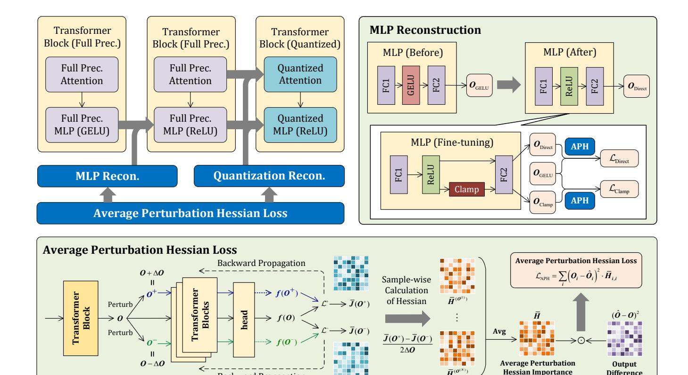

# Quantization Reconstruction:

- 12: **for**  $i = 0, \dots, \text{max\_iter do}$
- 13: Calculate the quantized output  $\widehat{O}$  by QDrop [46].
- 14: Calculate  $\mathcal{L}_{APH}$  based on Eq. (9).
- 15: Perform backward propagation and update the AdaRound [39] weights in  $\mathcal{B}$ .

16: **end for** 

**Output:** The quantized block  $\mathcal{B}$ .

 $\epsilon^{\top} \bar{J}^{(W)}$  and approximate the Hessian matrix with squared gradient, resulting in the quantization loss:

$$\mathbb{E}[\mathcal{L}(\widehat{\boldsymbol{W}})] - \mathbb{E}[\mathcal{L}(\boldsymbol{W})] \approx \sum_{i} \left( (\widehat{\boldsymbol{O}}_{i} - \boldsymbol{O}_{i}) \cdot \frac{\partial \mathcal{L}}{\partial \boldsymbol{O}_{i}} \right)^{2}, (2)$$

where O is the output, and  $\widehat{O}$  is the de-quantized one of O.

The above Hessian guided quantization loss adopts two approximations as in BRECQ: 1) the Hessian matrix is approximated by the Fisher Information Matrix (FIM) [13]; 2) the diagonal elements of FIM are approximated by the squared gradients w.r.t. the output. These approximations achieve high accuracy, when the task loss is the Cross-Entropy (CE) loss, and the model's predicted distribution aligns closely with the true data distribution. However, in practice, models are often unable to fit the true data distribution well, leading to inevitable approximation errors. Additionally, these approximations fail to generalize to tasks such as segmentation and object detection. As a consequence, when applied to ViTs, the loss in Eq. (2) is inferior to the MSE Loss in many ViT architectures as shown in Table 4.

Figure 2. Framework overview of APHQ-ViT. In the block-wise quantization process, we first reconstruct the MLP layer, followed by quantization reconstruction, both of which are optimized by the proposed Average Perturbation Hessian (APH) loss. The MLP Reconstruction (MR) method replaces the GELU activation function with ReLU and reduces the post-GELU activation range. The detailed implementation of the APH loss is visualized at the bottom.

**Backward Propagation** 

#### 3.2. Average Perturbation Hessian Loss

To address the limitations of the Hessian guided loss in Eq. (2), we develop a perturbation based estimation method that only relies on two fundamental assumptions as below:

- A.1) When performing Taylor series expansions for the loss, the third and higher-order derivatives can be omitted without significantly sacrificing the accuracy [10, 37, 39].
- A.2) The influence of individual elements on the final output is assumed to be independent, allowing the use of the diagonal Hessian as a practical substitute for the computationally intensive full Hessian [10, 43].

It is worth noting that A.1) and A.2) are widely used in various model compression methods, including BRECQ, which further rely on additional, stronger assumptions to achieve their results.

We first extend the loss function to ensure compatibility across diverse tasks. Instead of the conventional CE loss, we regard quantization as a knowledge distillation process on a small unlabeled calibration dataset. This allows us to directly employ distillation loss to address different tasks. Specifically, for classification, we adopt the KL divergence between the output logits as the distillation loss. For two-stage object

detection and instance segmentation, we combine the KL divergence from the classification head and the smooth L1 distance [16] from the regression head as the distillation loss. Compared to the CE Loss, these distillation losses share the following common characteristics:  $\mathcal{L}(\hat{O}, O) \geq 0$ , and  $\mathcal{L}(\hat{O}, O) = 0$  if and only if  $O = \hat{O}$ . According to the extreme value theorem [21], if  $\mathcal{L}$  is differentiable at  $\hat{O} = O$ , then we have:

$$\bar{J}^{(O)} = \frac{\partial \mathcal{L}(\hat{O}, O)}{\partial \hat{O}} \bigg|_{\hat{O} = O} = 0.$$
 (3)

Based on Eq. (3), we treat the errors introduced by quantization or MLP Reconstruction as small perturbations denoted by  $\epsilon$ , and perform a Taylor expansion as below:

$$\mathcal{L}(\boldsymbol{O}+\boldsymbol{\epsilon}) - \mathcal{L}(\boldsymbol{O}) = \boldsymbol{\epsilon}^{\top} \bar{\boldsymbol{J}}^{(\boldsymbol{O})} + \frac{1}{2} \boldsymbol{\epsilon}^{\top} \bar{\boldsymbol{H}}^{(\boldsymbol{O})} \boldsymbol{\epsilon} + O(\|\boldsymbol{\epsilon}\|^{3})$$
$$= \frac{1}{2} \boldsymbol{\epsilon}^{\top} \bar{\boldsymbol{H}}^{(\boldsymbol{O})} \boldsymbol{\epsilon} + O(\|\boldsymbol{\epsilon}\|^{3}) \approx \frac{1}{2} \boldsymbol{\epsilon}^{\top} \bar{\boldsymbol{H}}^{(\boldsymbol{O})} \boldsymbol{\epsilon},$$
(4)

where  $\mathcal{L}(O+\epsilon)$ ,  $\mathcal{L}(O)$  are the abbreviations of  $\mathcal{L}(O+\epsilon,O)$  and  $\mathcal{L}(O,O)$ , respectively,  $\bar{H}^{(O)}$  is the Hessian matrix of

 $\mathcal{L}$  w.r.t  $\mathbf{O}$ , and  $O(\|\epsilon\|^3)$  represents the sum of the third and higher-order derivatives. As depicted in Eq. (3),  $\mathcal{L}(\mathbf{O})$  and  $\bar{J}^{(\mathbf{O})}$  are zeros, and  $O(\|\epsilon\|^3)$  is omitted according to A.1).

Based on A.2), we follow BRECQ by utilizing the blockdiagonal Hessian and disregarding the inter-block dependencies. By definition, the diagonal elements of the Hessian matrix are the second partial derivatives of the loss function:

$$\bar{\boldsymbol{H}}_{i,i}^{(\boldsymbol{O})} = \frac{\partial^2 \mathcal{L}}{\partial \boldsymbol{O}_i^2} = \frac{\partial}{\boldsymbol{O}_i} \left( \frac{\partial \mathcal{L}}{\boldsymbol{O}_i} \right). \tag{5}$$

For the i-th diagonal element, we perturb O by  $\Delta O = 10^{-6}$ :  $O^+ = O + \Delta O \cdot 1$  and  $O^- = O - \Delta O \cdot 1$ , where 1 equals 1 for all elements. Based on the mean value theorem [21], there exists an O' between  $O^-$  and  $O^+$  such that

$$\bar{H}_{i,i}^{(O')} = \frac{\bar{J}_i^{(O^+)} - \bar{J}_i^{(O^-)}}{2 \cdot \Delta O_i}, \tag{6}$$

where  $\bar{J}^{(O^+)}$  and  $\bar{J}^{(O^-)}$  are the Jacobian matrices at  $O^+$  and  $O^-$ , which are computed through backward-propagation. As the perturbation  $\Delta O$  is small enough, we approximate  $\bar{H}^{(O)}_{i,i}$  by  $\bar{H}^{(O')}_{i,i}$ . The perturbation Hessian loss is thus formulated as below:

$$\mathcal{L}_{\text{PH}} = \sum_{i} \left( \widehat{O}_{i} - O_{i} \right)^{2} \cdot \bar{H}_{i,i}^{(O)}. \tag{7}$$

It is worth noting that using distinct Hessians for different samples may lead to an unstable training process. To address this issue, we compute the average Hessian across all samples and utilize the mean value to formulate the final reconstruction loss as below:

$$\bar{H}_{i,i} = \frac{1}{N} \sum_{n=1}^{N} \bar{H}_{i,i}^{(O^{(n)})},$$
 (8)

$$\mathcal{L}_{\text{APH}} = \sum_{i} \left( \hat{O}_{i} - O_{i} \right)^{2} \cdot \bar{H}_{i,i}, \tag{9}$$

where  ${\bf O}^{(n)}$  is the output of the n-th sample, and N is the sample size.

Ideally,  $\mathcal{L}_{\mathrm{APH}}$  and  $\mathcal{L}_{\mathrm{PH}}$  have the following properties.

**Theorem 3.1.** The expectation of the APH loss is consistent with that of the PH loss, i.e.,  $\mathbb{E}[\mathcal{L}_{APH}] = \mathbb{E}[\mathcal{L}_{PH}]$ , under certain independence assumptions.

**Theorem 3.2.** When utilizing mini-batch gradient descent, the variance of the gradient of the quantization parameter  $\theta$  w.r.t. the APH loss is smaller than that of the PH loss under certain independence assumptions:

$$\operatorname{Var}\left[\frac{\partial \mathcal{L}_{\text{APH}}}{\partial \theta}\right] \le \operatorname{Var}\left[\frac{\partial \mathcal{L}_{\text{PH}}}{\partial \theta}\right]. \tag{10}$$

We refer to Sec. A.1 and Sec. A.2 of the *supplementary material* for detailed proof. Theorems 3.1 and 3.2 imply that the gradient of the APH loss is an unbiased estimation on that of the PH loss, while effectively reducing its variance, under certain independence assumptions. As claimed in [22, 24], lower gradient variance results in faster convergence and improved training stability. Therefore, our proposed APH loss is expected to outperform the PH loss.

Compared to the Hessian in BRECQ, our method only requires one additional forward and backward pass, while maintaining the same training complexity. As a result, the extra computational overhead is negligible. The key advantages of our method lie in two-fold: 1) APH is deduced directly from the definition, thus eliminating errors introduced by the Fisher Information Matrix; 2) APH is theoretically generalizable to other tasks besides classification, such as object detection and segmentation.

#### 3.3. MLP Reconstruction

As depicted in Sec. 1, quantizing post-GELU activations in ViTs incurs two significant challenges: 1) the post-GELU activation distribution is highly imbalanced, *i.e.*, concentrating within the narrow interval (-0.17, 0], which leads to approximation errors during quantization [50]. 2) the activation range of post-GELU activations varies substantially.

In this section, we propose an MLP Reconstruction method to address the above two issues simultaneously. To deal with the imbalanced distribution, we replace all GELU activation functions in MLP with ReLU. Subsequently, we perform the feature knowledge distillation [19], and reconstruct MLP individually. Specifically, for each MLP, we obtain its original input and output using the unlabeled data. By following Sec. 3.2, we compute the average perturbation Hessian to determine the output importance. Thereafter, we replace the MLP activation function with ReLU and utilize the Hessian importance to calculate the weighted  $L_2$  distance between the output with ReLU and the original one with GELU, formulated as below:

$$\mathcal{L}_{\text{Direct}} = (\boldsymbol{O}_{\text{GELU}} - \boldsymbol{O}_{\text{Direct}})^2 \odot \bar{\boldsymbol{H}}, \quad (11)$$

where  $O_{\mathrm{Direct}} = \mathrm{FC2}(\mathrm{ReLU}(\mathrm{FC1}(\boldsymbol{X})))$  is the output of reconstructed MLP with ReLU for input  $\boldsymbol{X}, O_{\mathrm{GELU}}$  is the output of the original MLP with GELU, and  $\bar{\boldsymbol{H}}$  is the average perturbation Hessian.

The reason ReLU can be used as a replacement for GELU lies in the fact that, in deeper Transformers, ReLU may suffer from the dying ReLU problem [33], which is why GELU is typically used during training. However, as described in [34], neural networks with ReLU activations also theoretically possess universal approximation capabilities. In this paper, the MLP module are reconstructed individually for each layer, which is of shallow depth, thus avoiding the dying ReLU problem. This enables the network to achieve

Table 1. Comparison of the top-1 accuracy (%) on the ImageNet dataset with different quantization bit-widths. Here 'Opt.' means whether or not using an optimize-based PTQ method, 'PSQ' refers to 'Post-Softmax Quantizer', and 'PGQ' refers to 'Post-GELU Quantizer'. '\*' indicates that the results are reproduced by using the official code. 'TUQ', 'MPQ', 'GUQ', 'SULQ', and 'TanQ' are the abbreviations of 'Twin-Uniform Quantizer' in PTQ4ViT, 'Matthew-effect Preserving Quantizer' in APQ-ViT, 'Groupwise Uniform Quantizer' in IGQ-ViT, 'Shift-Uniform-Log2 Quantizer' in I&S-ViT, and 'Tangent Quantizer' in DopQ-ViT, respectively.

| Method         | Opt.         | PSQ             | PGQ     | W/A   | ViT-S | ViT-B | DeiT-T | DeiT-S | DeiT-B | Swin-S | Swin-B |
|----------------|--------------|-----------------|---------|-------|-------|-------|--------|--------|--------|--------|--------|
| Full-Prec.     | -            | -               | -       | 32/32 | 81.39 | 84.54 | 72.21  | 79.85  | 81.80  | 83.23  | 85.27  |
| PTQ4ViT [50]   | ×            | TUQ             | TUQ     | 3/3   | 0.10  | 0.10  | 3.50   | 0.10   | 31.06  | 28.69  | 20.13  |
| RepQ-ViT [27]  | ×            | $\log \sqrt{2}$ | Uniform | 3/3   | 0.10  | 0.10  | 0.10   | 0.10   | 0.10   | 0.10   | 0.10   |
| AdaLog [47]    | ×            | AdaLog          | AdaLog  | 3/3   | 13.88 | 37.91 | 31.56  | 24.47  | 57.47  | 64.41  | 69.75  |
| I&S-ViT [54]   | $\checkmark$ | SULQ            | Uniform | 3/3   | 45.16 | 63.77 | 41.52  | 55.78  | 73.30  | 74.20  | 69.30  |
| DopQ-ViT [49]  | $\checkmark$ | TanQ            | Uniform | 3/3   | 54.72 | 65.76 | 44.71  | 59.26  | 74.91  | 74.77  | 69.63  |
| QDrop* [46]    | $\checkmark$ | Uniform         | Uniform | 3/3   | 38.31 | 73.79 | 46.69  | 52.55  | 74.32  | 74.11  | 75.28  |
| APHQ-ViT(Ours) | $\checkmark$ | Uniform         | Uniform | 3/3   | 63.17 | 76.31 | 55.42  | 68.76  | 76.31  | 76.10  | 78.14  |
| PTQ4ViT [50]   | ×            | TUQ             | TUQ     | 4/4   | 42.57 | 30.69 | 36.96  | 34.08  | 64.39  | 76.09  | 74.02  |
| APQ-ViT [8]    | ×            | MPQ             | Uniform | 4/4   | 47.95 | 41.41 | 47.94  | 43.55  | 67.48  | 77.15  | 76.48  |
| RepQ-ViT [27]  | ×            | $\log \sqrt{2}$ | Uniform | 4/4   | 65.05 | 68.48 | 57.43  | 69.03  | 75.61  | 79.45  | 78.32  |
| ERQ [55]       | ×            | $\log \sqrt{2}$ | Uniform | 4/4   | 68.91 | 76.63 | 60.29  | 72.56  | 78.23  | 80.74  | 82.44  |
| IGQ-ViT [38]   | $\times$     | GUQ             | GUQ     | 4/4   | 73.61 | 79.32 | 62.45  | 74.66  | 79.23  | 80.98  | 83.14  |
| AdaLog [47]    | $\times$     | AdaLog          | AdaLog  | 4/4   | 72.75 | 79.68 | 63.52  | 72.06  | 78.03  | 80.77  | 82.47  |
| I&S-ViT [54]   | $\checkmark$ | SULQ            | Uniform | 4/4   | 74.87 | 80.07 | 65.21  | 75.81  | 79.97  | 81.17  | 82.60  |
| DopQ-ViT [49]  | $\checkmark$ | TanQ            | Uniform | 4/4   | 75.69 | 80.95 | 65.54  | 75.84  | 80.13  | 81.71  | 83.34  |
| QDrop* [46]    | $\checkmark$ | Uniform         | Uniform | 4/4   | 67.62 | 82.02 | 64.95  | 74.73  | 79.64  | 81.03  | 82.79  |
| OASQ [36]      | $\checkmark$ | Unifrom         | Uniform | 4/4   | 72.88 | 76.59 | 66.31  | 76.00  | 78.83  | 81.02  | 82.46  |
| APHQ-ViT(Ours) | ✓            | Uniform         | Uniform | 4/4   | 76.07 | 82.41 | 66.66  | 76.40  | 80.21  | 81.81  | 83.42  |

expressive capability comparable to that by using GELU.

To address the activation range issue, we design an alternative clamp loss to constrain the range effectively. Specifically, we compute the p-th percentile of all positive values and restrict the activations within this p-th percentile. The clipped output is formulated as:

$$A_{FC2} = \text{ReLU}(\text{FC1}(\boldsymbol{X})),$$
  
 $O_{\text{clamp}} = \text{FC2}(\text{clamp}(\boldsymbol{A}_{FC2}, \text{Quantile}_p(\boldsymbol{A}_{FC2}))).$  (12)

Accordingly, the clipped reconstruction loss is written as:

$$\mathcal{L}_{\text{Clamp}} = (\boldsymbol{O}_{\text{GELU}} - \boldsymbol{O}_{\text{clamp}})^2 \odot \boldsymbol{H}.$$
 (13)

The MLP Reconstruction loss is finally formulated as:

$$\mathcal{L}_{\text{Distill}} = \mathcal{L}_{\text{Direct}} + \alpha \cdot \mathcal{L}_{\text{Clamp}}, \tag{14}$$

where  $\alpha$  is a trade-off hyperparameter fixed as  $\alpha=2$ . It is important to note that  $\mathcal{L}_{\mathrm{Direct}}$  cannot be omitted. By solely using  $\mathcal{L}_{\mathrm{Clamp}}$  leads to vanishing gradients for hard-clipped activations. In regions where activations are hard-clipped, the gradients tend to be zero, hindering the effective update of the MLP parameters. By incorporating  $\mathcal{L}_{\mathrm{Direct}}$ , which leverages unclamped activations, the gradient vanishing issue is mitigated, thus facilitating effective learning.

#### 4. Experimental Results and Analysis

#### 4.1. Experimental Setup

**Datasets and Models.** For the classification task, we evaluate our method on ImageNet [41] with representative Vision Transformer architectures, including ViT [11], DeiT [44] and Swin [32]. For object detection and instance segmentation, we evaluate on COCO [28] by utilizing the Mask R-CNN [17] and Cascade Mask R-CNN [1] frameworks based on the Swin backbones.

Implementation Details. All pretrained full-precision Vision Transformers are obtained from the timm library. The pretrained detection and segmentation models are obtained from MMDetection [4]. Following existing works [25, 36, 46, 54], we randomly select 1024 unlabeled images from ImageNet and 256 unlabeled images from COCO as the calibration sets for classification and object detection, respectively. We adopt channel-wise uniform quantizers for weight quantization and layer-wise uniform quantizers for activation quantization, including the attention map. We follow the hyper-parameter settings as used in QDrop [46] by setting the batch size, learning rate for activation quantization, learning rate for tuning weight, the maximal iteration

&lt;sup>1https://github.com/huggingface/pytorch-image-models

Table 2. Quantization results (%) on COCO for the object detection and instance segmentation tasks. Here, 'Baseline' refers to the results by using only uniform quantizers for calibration. \* and † indicate that the results are re-produced by using the official code.

|                 |              |                 |       |        | Mask R-CNN |                      |          |        | Cascade Mask R-CNN |        |          |  |
|-----------------|--------------|-----------------|-------|--------|------------|----------------------|----------|--------|--------------------|--------|----------|--|
| Method          | Opt.         | PSQ             | W/A   | Swi    | in-T       | Swin-                | S        | Swi    | in-T               | Swi    | in-S     |  |
|                 |              |                 |       | $AP^b$ | $AP^{m}$   | $AP^b$               | $AP^{m}$ | $AP^b$ | $AP^{m}$           | $AP^b$ | $AP^{m}$ |  |
| Full-Precision  | -            | -               | 32/32 | 46.0   | 41.6       | 48.5                 | 43.3     | 50.4   | 43.7               | 51.9   | 45.0     |  |
| Baseline*       | ×            | Uniform         | 4/4   | 34.6   | 34.2       | 40.8                 | 38.6     | 45.9   | 40.2               | 47.9   | 41.6     |  |
| RepQ-ViT [27]   | ×            | $\log \sqrt{2}$ | 4/4   | 36.1   | 36.0       | $44.2_{42.7}\dagger$ | 40.2     | 47.0   | 41.1               | 49.3   | 43.1     |  |
| ERQ [55]        | ×            | $\log \sqrt{2}$ | 4/4   | 36.8   | 36.6       | 43.4                 | 40.7     | 47.9   | 42.1               | 50.0   | 43.6     |  |
| I&S-ViT [54]    | $\checkmark$ | SULQ            | 4/4   | 37.5   | 36.6       | 43.4                 | 40.3     | 48.2   | 42.0               | 50.3   | 43.6     |  |
| DopQ-ViT [49]   | $\checkmark$ | TanQ            | 4/4   | 37.5   | 36.5       | 43.5                 | 40.4     | 48.2   | 42.1               | 50.3   | 43.7     |  |
| QDrop* [46]     | $\checkmark$ | Uniform         | 4/4   | 36.2   | 35.4       | 41.6                 | 39.2     | 47.0   | 41.3               | 49.0   | 42.5     |  |
| APHQ-ViT (Ours) | $\checkmark$ | Uniform         | 4/4   | 38.9   | 38.1       | 44.1                 | 41.0     | 48.9   | 42.7               | 50.3   | 43.7     |  |

number in both MLP Reconstruction and QDrop reconstruction as 32, 4e-5, 1e-3 and 20000, respectively. In addition, we set the percentile p=0.99 in Eq. (12).

#### 4.2. Quantization Results on ImageNet

We first compare our method to the state-of-the-art approaches for post-training quantization of ViTs on ImageNet: 1) the calibration-only methods including PTQ4ViT [50], APQ-ViT [8], RepQ-ViT [27], ERQ [55], IGQ-ViT [38] and AdaLog [47]; and 2) the reconstruction-based methods including DopQ-ViT [49], QDrop [46] and OASQ [36].

As summarized in Table 1, for 4-bit quantization, some of the compared methods suffer a remarkable degradation in accuracy due to severe quantization loss of weights and activations. However, the performance of the proposed APHQ-ViT remains competitive compared to the full-precision models and consistently outperforms existing methods. As for 3-bit quantization, calibration-only methods yield an extremely low performance (*e.g.* 0.1%) in most scenarios. Reconstruction-based methods like DopQ-ViT and I&S-ViT also suffer significant accuracy loss on models that are challenging to quantize (*e.g.* ViT-S and DeiT-T). By contrast, APHQ-ViT maintains more stable accuracy when reducing the precision from 32 bits to 3 bits. It surpasses the second-best method, DopQ-ViT, by 10.71% when using the DeiT-T backbone and achieves an average improvement of 7.21%.

#### 4.3. Quantization Results on COCO

We further evaluate our method on COCO for object detection and instance segmentation. As shown in Table 2, the baseline method, which employs only uniform quantizers and QDrop, achieves lower accuracy compared to other calibration-only and reconstruction-based methods that utilize specific quantizers. By employing the APH loss and MLP Reconstruction, our method achieves results on par with or superior to those using specific quantizers.

Table 3. Ablation results w.r.t the top-1 accuracy (%) of the proposed main components on ImageNet with the W3/A3 setting.

| Method     | ViT-S | ViT-B | DeiT-T | DeiT-S | Swin-S |
|------------|-------|-------|--------|--------|--------|
| Full-Prec. | 81.39 | 84.54 | 72.21  | 79.85  | 81.80  |
| QDrop      | 38.31 | 73.79 | 46.69  | 52.55  | 74.11  |
| +APH       | 59.11 | 76.05 | 53.82  | 67.40  | 75.44  |
| +APH +MR   | 63.17 | 76.31 | 55.42  | 68.76  | 76.10  |

