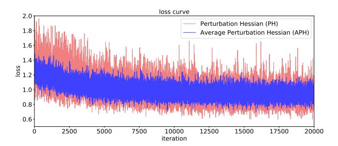

# Supplementary Material

In this document, we provide detailed proofs on Theorem 3.1 and Theorem 3.2 in the main body in Sec. A, and provide more ablation studies and visualization results in Sec. B and Sec. C, respectively.

#### A. Main Proofs

## A.1. Proof of Theorem 3.1

*Proof.* In regards of the perturbation Hessian  $\mathcal{L}_{PH}$ , we can deduce the following equation:

$$\mathbb{E}\left[\mathcal{L}_{\mathrm{PH}}\right] = \mathbb{E}_{\left(\boldsymbol{O}, \theta_{q}\right)} \left[ \sum_{i} \left( \widehat{\boldsymbol{O}}_{i}^{(k, \theta_{q})} - \boldsymbol{O}_{i}^{(k)} \right)^{2} \cdot \bar{\boldsymbol{H}}_{i, i}^{\left(\boldsymbol{O}^{(k)}\right)} \right]$$

$$= \sum_{i} \mathbb{E}_{\left(\boldsymbol{O}, \theta_{q}\right)} \left[ \left( \widehat{\boldsymbol{O}}_{i}^{(k, \theta_{q})} - \boldsymbol{O}_{i}^{(k)} \right)^{2} \cdot \bar{\boldsymbol{H}}_{i, i}^{\left(\boldsymbol{O}^{(k)}\right)} \right].$$
(15)

where  $\theta_q$  denotes the quantization parameter. Since the Hessian matrix is computed by adding fixed perturbations to the output, it is an inherent attribute of the networks. Thus, we assume that the Hessian matrix is independent of  $\widehat{O}_i^{(k,\theta_q)} - O_i^{(k)}$ , and the following equation holds:

$$\mathbb{E}\left[\mathcal{L}_{\text{PH}}\right] = \sum_{i} \mathbb{E}\left[\left(\widehat{\boldsymbol{O}}_{i}^{(k)} - \boldsymbol{O}_{i}^{(k)}\right)^{2}\right] \cdot \mathbb{E}\left[\bar{\boldsymbol{H}}_{i,i}^{(\boldsymbol{O}^{(k)})}\right].$$
(16)

As for the average perturbation Hessian, the following equations hold:

$$\mathbb{E}\left[\mathcal{L}_{\text{APH}}\right] = \mathbb{E}_{\left(\boldsymbol{O}, \theta_{q}\right)} \left[ \sum_{i} \left( \widehat{\boldsymbol{O}}_{i}^{(k, \theta_{q})} - \boldsymbol{O}_{i}^{(k)} \right)^{2} \cdot \bar{\boldsymbol{H}}_{i, i} \right]$$

$$= \sum_{i} \mathbb{E}\left[ \left( \widehat{\boldsymbol{O}}_{i}^{(k, \theta_{q})} - \boldsymbol{O}_{i}^{(k)} \right)^{2} \right] \cdot \mathbb{E}\left[ \bar{\boldsymbol{H}}_{i, i} \right]. \tag{17}$$

Based on Eqs. (16)-(17) and  $\mathbb{E}\left[\bar{\boldsymbol{H}}_{i,i}^{(\boldsymbol{O}^{(k)})}\right] = \mathbb{E}\left[\bar{\boldsymbol{H}}_{i,i}\right]$ , we can deduce that  $\mathbb{E}\left[\mathcal{L}_{\mathrm{PH}}\right] = \mathbb{E}\left[\mathcal{L}_{\mathrm{APH}}\right]$ .

#### A.2. Proof of Theorem 3.2

*Proof.* We firstly denote the gradient of the perturbation Hessian (PH) loss w.r.t. the quantization parameter  $\theta_q$  during the mini-batch gradient descent as below:

$$g(\theta_q) = \frac{2}{|B|} \sum_{k,i} \bar{\boldsymbol{H}}_{i,i}^{(\boldsymbol{O}^{(k)})} \left( \widehat{\boldsymbol{O}}_i^{(k)} - \boldsymbol{O}_i^{(k)} \right) \frac{\partial \left( \widehat{\boldsymbol{O}}_i^{(k)} - \boldsymbol{O}_i^{(k)} \right)}{\partial \theta_q},$$
(18)

where |B| is the batch size. We further define the random variable  $X_i^{(k)}$ :

$$X_i^{(k)} = 2\left(\widehat{O}_i^{(k)} - O_i^{(k)}\right) \frac{\partial \left(\widehat{O}_i^{(k)} - O_i^{(k)}\right)}{\partial \theta_a}.$$
 (19)

Accordingly, Eq. (18) can be rewritten as

$$g(\theta_q) = \frac{1}{|B|} \sum_{i} \sum_{k} X_i^{(k)} \cdot \bar{\boldsymbol{H}}_{i,i}^{(\boldsymbol{O}^{(k)})}.$$
 (20)

Similarly, as  $\bar{H}_{i,i} \approx \mathbb{E}[\bar{H}_{i,i}^{O^{(k)}}]$  when the sample size N becomes large enough. We denote the gradient of the average perturbation Hessian (APH) loss w.r.t. the parameter  $\theta_q$  as below:

$$\hat{g}(\theta_q) = \frac{1}{|B|} \sum_{i} \sum_{k} X_i^{(k)} \cdot \bar{\boldsymbol{H}}_{i,i}$$

$$\approx \frac{1}{|B|} \sum_{i} \left( \sum_{k} X_i^{(k)} \cdot \mathbb{E}[\bar{\boldsymbol{H}}_{i,i}^{\boldsymbol{O}^{(k)}}] \right). \tag{21}$$

We assume that all the output elements are independent across different samples and channels. Using the variance formula for the product of random variables, the gradient variance of the original PH loss is formulated as below:

$$\operatorname{Var}\left[g(\theta_{q})\right] = \frac{1}{|B|^{2}} \sum_{i} \left( \sum_{k} \operatorname{Var}\left[X_{i}^{(k)} \cdot \bar{\boldsymbol{H}}_{i,i}^{(\boldsymbol{O}^{(k)})}\right] \right)$$
$$= \frac{1}{|B|^{2}} \sum_{i} \left( \sum_{k} \mathbb{E}\left[\bar{\boldsymbol{H}}_{i,i}^{\boldsymbol{O}^{(k)}}\right]^{2} \operatorname{Var}\left[X_{i}^{(k)}\right] + R \right), \tag{22}$$

where

$$R = \text{Var}[X_i^{(k)}] \text{Var}[\bar{\boldsymbol{H}}_{i,i}^{\boldsymbol{O}^{(k)}}] + \mathbb{E}[X_i^{(k)}]^2 \text{Var}[\bar{\boldsymbol{H}}_{i,i}^{\boldsymbol{O}^{(k)}}]$$
(23)

The gradient variance of the APH is:

$$\operatorname{Var}\left[\hat{g}(\theta_{q})\right] = \frac{1}{|B|^{2}} \sum_{i} \left( \sum_{k} \operatorname{Var}\left[X_{i}^{(k)} \cdot \mathbb{E}[\bar{\boldsymbol{H}}_{i,i}^{\boldsymbol{O}(k)}]\right] \right)$$
$$= \frac{1}{|B|^{2}} \sum_{i} \left( \sum_{k} \mathbb{E}[\bar{\boldsymbol{H}}_{i,i}^{\boldsymbol{O}(k)}]^{2} \operatorname{Var}[X_{i}^{(k)}] \right)$$
(24)

As 
$$R \geq 0$$
, we can deduce that  $\operatorname{Var}\left[g(\theta_q)\right] \geq \operatorname{Var}\left[g'(\theta_q)\right]$ .

Table A. Ablation results w.r.t the top-1 accuracy (%) of the proposed main components on ImageNet with the W3/A3 setting.

| Method     | DeiT-B | Swin-B |
|------------|--------|--------|
| Full-Prec. | 84.54  | 85.27  |
| baseline   | 74.32  | 75.28  |
| +APH       | 75.62  | 77.16  |
| +APH +MR   | 76.31  | 78.14  |

Table B. Ablation results w.r.t the top-1 accuracy (%) of the proposed APH loss, compared to alternative losses on ImageNet with the W3/A3 setting.

| Method     | DeiT-B | Swin-B |
|------------|--------|--------|
| Full-Prec. | 81.80  | 85.27  |
| MSE        | 74.32  | 75.28  |
| BH         | 72.90  | 76.63  |
| PH         | 75.03  | 76.89  |
| APH        | 75.62  | 77.16  |

Table C. Ablation results w.r.t the top-1 accuracy (%) of the proposed MLP Reconstruction (MR) method on ImageNet with the W3/A3 setting.

| Method     | DeiT-B | Swin-B |
|------------|--------|--------|
| Full-Prec. | 81.80  | 85.27  |
| MR         | 81.43  | 84.97  |

#### **B. More Ablation Results**

In this document, we provide more ablation results for DeiT-B and Swin-B as complements to Tables 3-5 in the main body. The results are summarized in Table A, Table B and Table C. As displayed, the APH loss can significantly promotes the accuracy, and outperform the alternative losses. The proposed MR method also effectively reconstructs the pretrained model by replacing the GELU activation function with ReLU, without significantly sacrificing the accuracy.

#### C. Visualization Results

#### C.1. Loss Curve of APH

Fig. A shows the loss curves of the perturbation Hessian (PH) loss and the average perturbation Hessian (APH) loss for a certain block. As illustrated, the APH loss generally exhibits smaller fluctuations than the PH loss, resulting in more stable training.

Figure A. The loss curve of ViT-Small-blocks.6 on W3/A3.

(a) APH importance of top 8 tokens. (b) APH importance of patch tokens.

Figure B. Illustration on the token importance in ViT-S.blocks.7.

Figure C. Illustration on the channel importance.

