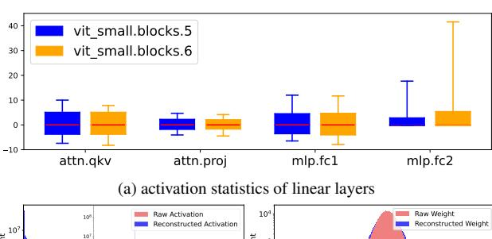
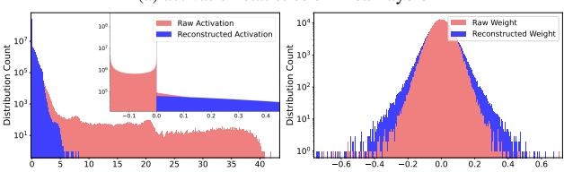

# APHQ-ViT: Post-Training Quantization with Average Perturbation Hessian Based Reconstruction for Vision Transformers

Zhuguanyu Wu1,2, Jiayi Zhang1,2, Jiaxin Chen1,2, Jinyang Guo3, Di Huang2, Yunhong Wang1,2

1State Key Laboratory of Virtual Reality Technology and Systems, Beihang University, China

2School of Computer Science and Engineering, Beihang University, Beijing, China

3School of Artificial Intelligence, Beihang University, Beijing, China

{goatwu, zhangjyi, jiaxinchen, jinyangguo, dhuang, yhwang}@buaa.edu.cn

#### **Abstract**

Vision Transformers (ViTs) have become one of the most commonly used backbones for vision tasks. Despite their remarkable performance, they often suffer significant accuracy drops when quantized for practical deployment, particularly by post-training quantization (PTQ) under ultra-low bits. Recently, reconstruction-based PTQ methods have shown promising performance in quantizing Convolutional Neural Networks (CNNs). However, they fail when applied to ViTs, primarily due to the inaccurate estimation of output importance and the substantial accuracy degradation in quantizing post-GELU activations. To address these issues, we propose APHQ-ViT, a novel PTQ approach based on importance estimation with Average Perturbation Hessian (APH). Specifically, we first thoroughly analyze the current approximation approaches with Hessian loss, and propose an improved average perturbation Hessian loss. To deal with the quantization of the post-GELU activations, we design an MLP Reconstruction (MR) method by replacing the GELU function in MLP with ReLU and reconstructing it by the APH loss on a small unlabeled calibration set. Extensive experiments demonstrate that APHO-ViT using linear quantizers outperforms existing PTO methods by substantial margins in 3-bit and 4-bit across different vision tasks. The source code is available at https://github.com/GoatWu/APHQ-ViT.

#### 1. Introduction

The success of Transformer-based models in natural language processing (NLP) [7, 45] has inspired their application to various computer vision tasks, such as image classification [3, 11, 32], object detection [2, 6, 53, 57] and instance segmentation [42, 48, 51, 52, 56]. Due to their sophisticated architectures for representation learning, substantial memory

(b) activation distribution of mlp.fc2 (c) weight distribution of mlp.fc2

Figure 1. (a) shows the box plot of activations for each linear layer in *vit-small.blocks.5* and 6 by using the 0.99 quantile, highlighting the varying ranges of post-GELU activations. (b) and (c) display that the activation range of *fc2* is significantly reduced after MLP Reconstruction, while the weight range only exhibits slight changes.

usage and computational overhead make it a great challenge to deploy these models on resource-constrained devices [23].

Model quantization has recently emerged as a promising solution to reduce the computational cost of deep learning models. This technique converts the weights or activations from float-point precision to low bit-width, while preserving the original model architectures. Most current quantization approaches are generally categorized into two groups: quantization-aware training (QAT) [5, 12] and post-training quantization (PTQ) [15, 40]. QAT methods typically achieve superior accuracy compared to PTQ by performing end-to-end training on the full pretraining dataset. Nevertheless, they are often time-intensive and encounter substantial limitations when the original dataset is inaccessible. In contrast, PTQ methods are more applicable as they rely solely on a small unlabeled calibration dataset instead of requiring

&lt;sup>™ Corresponding Authors

access to the full training set. PTQ methods can be further divided into two categories, *i.e*., the one that only involves calibration [\[27,](#page-8-9) [29,](#page-9-10) [35,](#page-9-11) [50\]](#page-9-12), and the reconstruction-based one [\[20,](#page-8-10) [36,](#page-9-13) [49,](#page-9-14) [54\]](#page-9-15), where the later generally achieves superior accuracy by introducing an efficient fine-tuning process. Despite their promising performance in quantizing CNNs [\[25,](#page-8-11) [30,](#page-9-16) [46\]](#page-9-17), the reconstruction-based methods suffer from the following two limitations when applied to ViTs.

- 1) *Inaccurate estimation of output importance.* Representative reconstruction-based PTQ methods employ the block-reconstruction framework [\[25,](#page-8-11) [46\]](#page-9-17), which fine-tunes the AdaRound [\[39\]](#page-9-18) weights to ensure that the output of the quantized block closely matches the output of the original full-precision one. The mean squared error (MSE) between the quantized and original outputs is one of the most commonly used metrics to evaluate quantization quality. However, this approach is suboptimal, since it treats all output tokens and dimensions equally, overlooking the critical importance of the class token and the importance variations across channels in ViTs as shown in Sec. [C](#page-11-0) of the *supplementary material*. Some works leverage the Hessian matrix based on Fisher information to explore the distinct importance [\[8,](#page-8-12) [25,](#page-8-11) [50\]](#page-9-12), while fail to surpass the MSE loss due to the inaccurate approximation on the Hessian matrix.
- 2) *Performance degradation in quantizing post-GELU activation.* As shown in Fig. [1](#page-0-0) (a), the quantization error in post-GELU activations stems from two primary factors. First, the activation distribution is highly imbalanced: negative activations are densely concentrated within a narrow interval [−0.17, 0], while positive activations follow sparse distributions. Second, the activation range varies significantly, reaching up to 40 in certain layers. Some works have attempted to deal with the imbalanced activation distribution by a twin-uniform quantizer that employs separate scaling factors for positive and negative activations [\[50\]](#page-9-12), or employ a hardware-friendly logarithmic quantizer with an arbitrary base [\[47\]](#page-9-19). However, they necessitate specialized hardware support for the quantizer, limiting their practicality in real-world applications.

To address the above issues, we propose a novel quantization approach dubbed APHQ-ViT for the post-training quantization of Vision Transformers. As illustrated in Fig. [2,](#page-3-0) to tackle the *inaccurate estimation of output importance*, we thoroughly investigate the current approximation methods with Hessian loss, and propose an improved average perturbation Hessian (APH) loss for block reconstruction. We show that applying APH to explore the importance of output can stabilize the reconstruction process, and further promote precision. To deal with *performance degradation in quantizing post-GELU activations*, we develop the MLP Reconstruction method (MR), by replacing the GELU activation function with ReLU. As shown in Fig. [1\(](#page-0-0)b) and (c), MR not only reduces the activation range while maintaining the

weight range, but also alleviates the imbalanced activation distributions, thus reducing the quantization error.

The main contributions of our work lie in three-fold:

- 1) We thoroughly analyze the limitations of existing Hessian guide quantization loss, and propose an improved Average Perturbation Hessian (APH) loss by mitigating the estimation deviations, which facilitates both the block-wise quantization reconstruction and MLP reconstruction.
- 2) We develop a novel MLP Reconstruction (MR) method by replacing the GELU activation function in MLP with ReLU, which simultaneously alleviates imbalanced activation distribution and significantly reduces the activation range, making the model more amenable to quantization.
- 3) We extensively conduct experiments on public datasets across various vision tasks in order to evaluate the performance of our method. Experimental results demonstrate that the proposed method, utilizing only linear quantizers, significantly outperforms the current state-of-the-art approaches with distinct Vision Transformer architectures, especially in the case of ultra-low bit quantization.

