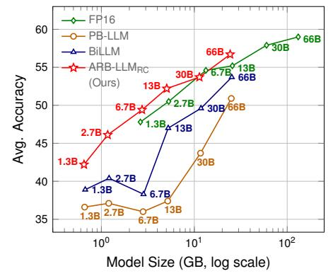
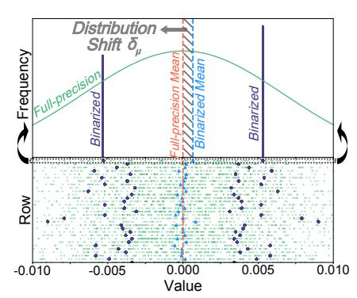
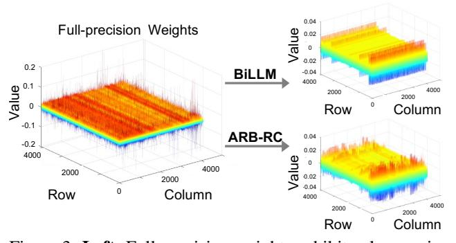

# ARB-LLM: ALTERNATING REFINED BINARIZATIONS FOR LARGE LANGUAGE MODELS

Zhiteng Li1\*, Xianglong Yan1\*, Tianao Zhang1, Haotong Qin2, Dong Xie3, Jiang Tian3, Zhongchao Shi3, Linghe Kong1†, Yulun Zhang1†, Xiaokang Yang1 Shanghai Jiao Tong University, 2ETH Zürich, 3Lenovo Research

## **ABSTRACT**

Large Language Models (LLMs) have greatly pushed forward advancements in natural language processing, yet their high memory and computational demands hinder practical deployment. Binarization, as an effective compression technique, can shrink model weights to just 1 bit, significantly reducing the high demands on computation and memory. However, current binarization methods struggle to narrow the distribution gap between binarized and full-precision weights, while also overlooking the column deviation in LLM weight distribution. To tackle these issues, we propose ARB-LLM, a novel 1-bit post-training quantization (PTQ) technique tailored for LLMs. To narrow the distribution shift between binarized and full-precision weights, we first design an alternating refined binarization (ARB) algorithm to progressively update the binarization parameters, which significantly reduces the quantization error. Moreover, considering the pivot role of calibration data and the column deviation in LLM weights, we further extend ARB to ARB-X and ARB-RC. In addition, we refine the weight partition strategy with columngroup bitmap (CGB), which further enhance performance. Equipping ARB-X and ARB-RC with CGB, we obtain ARB-LLMX and ARB-LLMRC respectively, which significantly outperform state-of-the-art (SOTA) binarization methods for LLMs. As a binary PTQ method, our ARB-LLMRC is the first to surpass FP16 models of the same size. Code: https://github.com/ZHITENGLI/ARB-LLM.

## 1 Introduction

Recently, Transformer-based (Vaswani, 2017) large language models have shown impressive performance across various natural language processing tasks. However, this unprecedented capability is largely attributed to the sheer scale of these models, which often encompass billions of parameters. For instance, open pre-trained Transformer (OPT) series (Zhang et al., 2022) includes various models, with the largest boasting 66B parameters. Similarly, the LLaMA family (Touvron et al., 2023) features variants such as LLaMA3-70B, showcasing even larger architectures. The substantial memory requirements for inference in such large models (e.g., 150 GB memory for a 70B model) pose significant challenges for their deployment on mobile devices.

Figure 1: OPT performance on 7 zero-shot Question Answering (QA) datasets. Our ARB-LLM $_{RC}$  outperforms the same-size FP16 models.

The study of compressing LLMs can be categorized into weight quantization (Lin et al., 2024; Frantar et al., 2023), low-rank factorization (Zhang et al., 2024; Yuan et al., 2023), network pruning (Sun et al., 2024; Frantar & Alistarh, 2023), and knowledge distillation (Zhong et al., 2024; Gu et al., 2024). Among these, binarization, a specific technique within the realm of quantization, is particularly distinguished for its ability to achieve extreme memory compression, reducing storage requirements to as low as 1 bit. Given the substantial size of LLMs, some binarization methods adopt the post-training quantization (PTQ) framework to enable a rapid transition from full-precision models to compact binarized versions, requiring minimal resources (*e.g.*, binarizing a 70B model in one 80 GB GPU).

\*Equal contribution

&lt;sup>†Corresponding authors: Linghe Kong, linghe.kong@sjtu.edu.cn, Yulun Zhang, yulun100@gmail.com

Recent binary PTQ methods, such as PB-LLM (Shang et al., 2024) and BiLLM (Huang et al., 2024), emphasize the identification of salient weights, which are crucial for model performance (Lin et al., 2024). The higher-bit representation and refined searching strategy for salient weights help to achieve a better trade-off between performance and storage. Despite their success, the refinement of the binarization process itself remains largely unaddressed, resulting in a significant difference between the binarized weights and their full-precision counterparts. This gap presents a considerable obstacle to further enhance the performance of binary LLMs.

To minimize quantization error during the binarization process, we revisit the solutions for the binarization objective. Our analyses reveal that: (i) The current approach is suboptimal due to the distribution shift between binarized and full-precision weights after binarization. As shown in Figure 2, the mean of the binarized weights is not aligned with the full-precision mean. Consequently, refining the binarization parameters based on the initial distribution of the binarized weights can yield a more accurate estimation of the original weights. Furthermore, this refinement can be alternately applied to different binarization parameters, ultimately leading to a significantly improved estimation. (ii) While the calibration set is small, it plays a crucial role in the quantization of LLMs. However, the integration of calibration data for updating binarization parameters, which reflects a more realistic scenario, remains underexplored. (iii) The weight distribution in LLMs exhibits noticeable columnwise deviations (see Figure 3), suggesting that the stan-

Figure 2: Distribution shift between the mean of binarized and full-precision weights. **Top**: distribution shift of one row. **Bottom**: distribution shifts of multiple rows. Each row represents a top view of the corresponding upper image.

dard row-wise binarization method is inflexible and potentially unsuitable. Thus, incorporating both row and column scaling factors can produce more representative binarization results.

With the above observations and analyses, we first propose Alternating Refined Binarization (ARB) to align the distribution between binarized and full-precision weights in standard binarization process. Then, we extend this approach by incorporating the calibration data and row-columnwise scaling factors, leading to two advanced extensions: ARB-X and ARB-RC. Additionally, based on previous methods, which divide salient and non-salient weights and group weights by magnitude, we refine the integration of these two divisions by a column-group bitmap (CGB).

Figure 3: **Left**: Full-precision weights exhibit column-wise deviations. **Right**: BiLLM (Huang et al., 2024) with row-wise binarization smooths the deviations. Our ARB-RC with row-column-wise binarization effectively preserves them.

Our key contributions can be summarized as follows:

- We propose a novel binarization framework **ARB**, designed to progressively align the distribution between binarized and full-precision weights. In addition, we provide rigorous theoretical analyses of the quantization error throughout the progressive updates.
- Building on the basic **ARB** framework, we develop two advanced extensions: ARB with calibration data (**ARB-X**), and ARB along row-column axes (**ARB-RC**). They are tailored to address specific challenges in binarized large language models.
- We propose a refined strategy to combine the salient column bitmap and group bitmap (CGB), which improves the bitmap utilization and further enhances the performance.
- Extensive experiments demonstrate that our ARB-LLMRC (ARB-RC + CGB) significantly outperforms SOTA binary PTQ methods while requiring less memory. Furthermore, ARB-LLMRC, for the first time, surpasses same-size FP16 models on zero-shot QA datasets.

