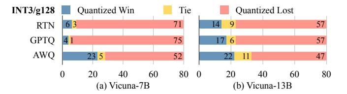
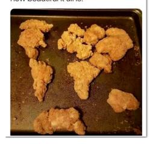
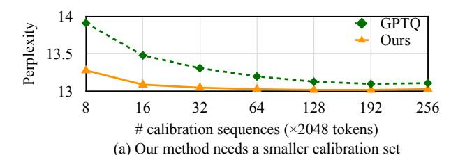
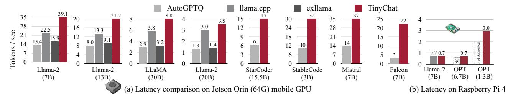

# 5 EXPERIMENTS

#### 5.1 Settings

Quantization. We focus on *weight-only grouped* quantization in this work. As shown in previous work [\(Dettmers &](#page-11-0) [Zettlemoyer,](#page-11-0) [2022;](#page-11-0) [Frantar et al.,](#page-11-0) [2022\)](#page-11-0), grouped quantization is always helpful for improving performance/model size trade-off. We used a group size of 128 throughout the work, except otherwise specified. We focus on INT4/INT3 quantization since they are able to mostly preserve the LLMs' performance [\(Dettmers & Zettlemoyer,](#page-11-0) [2022\)](#page-11-0). For AWQ, we used a small calibration set from the Pile [\(Gao et al.,](#page-11-0) [2020\)](#page-11-0) dataset in order not to overfit to a specific downstream domain. We used a grid size of 20 to search for the optimal α in Equation [5.](#page-4-0)

Models. We benchmarked our method on LLaMA [\(Tou](#page-13-0)[vron et al.,](#page-13-0) [2023a\)](#page-13-0) and OPT [\(Zhang et al.,](#page-14-0) [2022\)](#page-14-0) families. There are other open LLMs like BLOOM [\(Scao et al.,](#page-13-0) [2022\)](#page-13-0), but they are generally worse in quality, so we do not include them in our study. We further benchmark an instructiontuned model Vicuna [\(Chiang et al.,](#page-11-0) [2023\)](#page-11-0) and visual language models OpenFlamingo-9B [\(Awadalla et al.,](#page-10-0) [2023\)](#page-10-0) and LLaVA-13B [\(Liu et al.,](#page-12-0) [2023a\)](#page-12-0) to demonstrate the generability of our method.

Figure 5. Comparing INT3-g128 quantized Vicuna models with FP16 counterparts under GPT-4 evaluation protocol [\(Chiang et al.,](#page-11-0) [2023\)](#page-11-0). More winning cases (in blue) indicate better performance. AWQ consistently improves the quantized performance compared to RTN and GPTQ [\(Frantar et al.,](#page-11-0) [2022\)](#page-11-0), showing generalization to instruction-tuned models.

Evaluations. Following previous literature [\(Dettmers](#page-11-0) [et al.,](#page-11-0) [2022;](#page-11-0) [Xiao et al.,](#page-13-0) [2022;](#page-13-0) [Frantar et al.,](#page-11-0) [2022;](#page-11-0) [Dettmers](#page-11-0) [& Zettlemoyer,](#page-11-0) [2022;](#page-11-0) [Yao et al.,](#page-13-0) [2022\)](#page-13-0), we mainly profiled the quantized models on language modeling tasks (perplexity evaluation on WikiText-2 [\(Merity et al.,](#page-12-0) [2016\)](#page-12-0)) since perplexity can stably reflect the LLM's performance [\(Dettmers](#page-11-0) [& Zettlemoyer,](#page-11-0) [2022\)](#page-11-0).

Baselines. Our primary baseline is vanilla round-tonearest quantization (RTN). It is actually quite strong when using a small group size like 128 [\(Frantar et al.,](#page-11-0) [2022;](#page-11-0) [Dettmers & Zettlemoyer,](#page-11-0) [2022\)](#page-11-0). We also compare with a state-of-the-art method GPTQ [\(Frantar et al.,](#page-11-0) [2022\)](#page-11-0) for LLM weight quantization. For GPTQ, we also compare with an updated version that uses a "reorder" trick (denoted as GPTQ-Reorder or GPTQ-R). Other techniques like ZeroQuant [\(Yao et al.,](#page-13-0) [2022\)](#page-13-0), AdaRound [\(Nagel et al.,](#page-12-0) [2020\)](#page-12-0), and BRECQ [\(Li et al.,](#page-12-0) [2021\)](#page-12-0) rely on backpropagation to update the quantized weights, which may not easily scale up to large model sizes; they also do not outperform GPTQ [\(Fran](#page-11-0)[tar et al.,](#page-11-0) [2022\)](#page-11-0), thus not included for study.

## 5.2 Evaluation

Results on LLaMA models. We focus on LLaMA models (LLaMA [\(Touvron et al.,](#page-13-0) [2023a\) and Llama-2 \(Touvron](#page-13-0)

| COCO         | (CIDEr ↑)          | 0-shot                         | 4-shot                         | 8-shot                         | 16-shot                        | 32-shot                        | $\Delta$ (32-shot)               |
|--------------|--------------------|--------------------------------|--------------------------------|--------------------------------|--------------------------------|--------------------------------|----------------------------------|
| FP16         | -                  | 63.73                          | 72.18                          | 76.95                          | 79.74                          | 81.70                          | -                                |
| INT4 g128 | RTN GPTQ AWQ | 60.24 59.72 <b>62.57</b> | 68.07 67.68 <b>71.02</b> | 72.46 72.53 <b>74.75</b> | 74.09 74.98 <b>78.23</b> | 77.13 74.98 <b>80.53</b> | -4.57 -6.72 <b>-1.17</b>   |
| INT3 g128 | RTN GPTQ AWQ | 46.07 29.84 <b>56.33</b> | 55.13 50.77 <b>64.73</b> | 60.46 56.55 <b>68.79</b> | 63.21 60.54 <b>72.86</b> | 64.79 64.77 <b>74.47</b> | -16.91 -16.93 <b>-7.23</b> |

**Table 6.** Quantization results of a visual language model OpenFlamingo-9B (Awadalla et al., 2023) on COCO Captioning datasets. Activation-aware Weight Quantization outperforms existing methods under zero-shot and various few-shot settings, demonstrating the generability to different modalities and in-context learning workloads. Activation-aware Weight Quantization reduces the quantization degradation (32-shot) from 4.57 to 1.17 under INT4-g128, providing 4× model size reduction with negligible performance loss.

| Model (Accuracy↑) | VQAv2 | GQA  | VizWiz | SQA-I | VQA-T | POPE | MME    | MMB  | SEED | llava-bench | MM-Vet |
|-------------------|-------|------|--------|-------|-------|------|--------|------|------|-------------|--------|
| VILA-7B           | 80.3  | 63.1 | 59.6   | 68.0  | 62.6  | 86.3 | 1489.4 | 69.8 | 61.7 | 75.2        | 35.1   |
| VILA-7B-AWQ       | 80.1  | 63.0 | 57.8   | 68.0  | 61.9  | 85.3 | 1486.3 | 68.8 | 61.3 | 75.8        | 35.9   |
| VILA-13B          | 80.5  | 63.6 | 63.1   | 70.5  | 64.0  | 86.3 | 1553.6 | 73.8 | 62.8 | 78.3        | 42.6   |
| VILA-13B-AWQ      | 80.4  | 63.6 | 63.0   | 71.2  | 63.5  | 87.0 | 1552.9 | 73.6 | 62.2 | 77.6        | 42.0   |

**Table 7.** INT4-g128 results of VILA-7B and VILA-13B (Lin et al., 2024) on 11 visual-language benchmarks. AWQ consistently shows lossless performance on all benchmarks. Benchmark names are abbreviated due to space limits. VQA-v2 (Goyal et al., 2017); GQA (Hudson & Manning, 2019); VisWiz (Gurari et al., 2018); SQAI: ScienceQA-IMG (Lu et al., 2022); VQAT: TextVQA (Singh et al., 2019); POPE (Li et al., 2023d); MME (Fu et al., 2023); MMB: MMBench (Liu et al., 2023b); MMBCN: MMBench-Chinese (Liu et al., 2023b); SEED: SEED-Bench (Li et al., 2023a); LLaVAW: LLaVA-Bench (In-the-Wild) (Liu et al., 2023a); MM-Vet (Yu et al., 2023).

et al., 2023b)) due to their superior performance compared to other open-source LLMs (Zhang et al., 2022; Scao et al., 2022); it is also the foundation of many popular open-source models (Taori et al., 2023; Chiang et al., 2023). We evaluate the perplexity before and after quantization in Table 4. AWQ consistently outperforms round-to-nearest (RTN) and GPTQ (Frantar et al., 2022) (w/ and w/o reordering) across different model scales (7B-70B) and generations.

Results on Mistral / Mixtral models. We also evaluated AWQ on the Mistral and Mixtral models, which are among the most popular open-source LLMs and Mixture-of-Experts (MoE) models, respectively (Jiang et al., 2023; 2024). The results indicate that AWQ achieves superior performance on both the Mistral and Mixtral models. This demonstrates that AWQ is effective across various model architectures.

Quantization of instruction-tuned models. Instruction tuning can significantly improve the models' performance and usability (Wei et al., 2021; Sanh et al., 2021; Ouyang et al., 2022; Chung et al., 2022). It has become an essential procedure before model deployment. We further benchmark our method's performance on a popular instruction-tuned model Vicuna (Chiang et al., 2023) in Figure 5. We used the GPT-4 score to evaluate the quantized models' performance against the FP16 counterpart on 80 sample questions (Chiang et al., 2023). We compare the responses with both orders (quantized-FP16, FP16-quantized) to get rid of the ordering

| <b>MBPP</b> (7B)   | pass@1                         | pass@10                        | GSM8K              | 7B    | 13B                            | 70B   |
|--------------------|--------------------------------|--------------------------------|--------------------|-------|--------------------------------|-------|
| FP16               | 38.53                          | 49.77                          | FP16               | 13.87 | 26.16                          | 56.41 |
| RTN GPTQ AWQ | 37.51 31.97 <b>40.64</b> | 48.49 44.75 <b>49.25</b> | RTN GPTQ AWQ | 12.13 | 21.23 24.26 <b>25.25</b> | 56.03 |

**Table 8.** INT4-g128 quantization results of CodeLlama-7b-Instruct-hf on MBPP dataset and Llama-2 (7B/13B/70B) on GSM8K dataset. AWQ outperforms existing methods on programming and math datasets, demonstrating the generability to different scenarios and evaluation settings. Notably, AWQ under the INT4-g128 configuration demonstrates comparable performance to the original FP16 model across both datasets.

effect (we found GPT-4 tends to increase the rating of the first input), leading to 160 trials. AWQ consistently improves the INT3-g128 quantized Vicuna models over RTN and GPTQ under both scales (7B and 13B), demonstrating the generability to instruction-tuned models.

Quantization of multi-modal language models. Large multi-modal models (LMMs) or visual language models (VLMs) are LLMs augmented with vision inputs (Alayrac et al., 2022; Li et al., 2023b; Koh et al., 2023; Driess et al., 2023; Zhang et al., 2023; Liu et al., 2023a). Such models are able to perform text generation conditioned on image/video inputs. Since our method does not have the overfitting issue to the calibration set, it can be directly applied to VLMs

**Question**: Can you explain this meme in detail?

**INT4-g128 RTN**: The meme in the image features a plate of food, likely fried chicken, with a unique twist. There are small pictures of the Earth and other planets placed on top of the food, creating an interesting and amusing visual. Alongside the plate, a caption reads, "Sometimes I look at pictures of the Earth from space and I marvel at how beautiful it all is." This combination of food and planet images adds a touch of humor and curiosity, making the viewer wonder about the context and intent behind the meme.

**INT4-g128 AWQ**: The meme in the image is a lighthearted and humorous take on the concept of looking at pictures of the Earth from space. A plate of fried food, specifically chicken nuggets, is presented with the caption, "Sometimes I look at pictures of the Earth from space and I marvel at how beautiful it all is." The playful combination of a food item and an Earth-related context creates a fun and entertaining visual.

Figure 6. Visual reasoning examples from LLaVA-13B model [\(Liu et al.,](#page-12-0) [2023a\)](#page-12-0). AWQ improves over the round-to-nearest (RTN) baseline, providing more reasonable answers. We color the text to show the correct or wrong responses.

**W4-RTN**: A model airplane flying in the sky.

**W4-AWQ**: Two toy airplanes sit on a grass field.

**W4-RTN**: A man is holding a baby elephant in his arms.

**W4-AWQ**: A man and his daughter pose with an elephant.

**W4-RTN**: A man and a dog walking past some bushes.

**W4-AWQ**: Two dogs are walking on the street.

Figure 7. Qualitative results of quantized OpenFlamingo-9B [\(Awadalla et al.,](#page-10-0) [2023\)](#page-10-0) on COCO captioning dataset (4-shot, INT4-g128 quantization). Our method significantly improves the captioning quality compared to the round-to-nearest (RTN) baseline. We color the text to show the correct or wrong captions.

to provide accurate and efficient quantization. We perform experiments with the OpenFlamingo-9B model [\(Awadalla](#page-10-0) [et al.,](#page-10-0) [2023\)](#page-10-0) (an open-source reproduction of [\(Alayrac et al.,](#page-10-0) [2022\)](#page-10-0)) on COCO captioning [\(Chen et al.,](#page-11-0) [2015\)](#page-11-0) dataset (Table [6\)](#page-7-0). We measured the average performance of 5k samples under different few-shot settings. We only quantize the language part of the model since it dominates the model size. AWQ outperforms existing methods under zero-shot and various few-shot settings, demonstrating the generability to different modalities and in-context learning workloads. It reduces the quantization degradation (32-shot) from 4.57 to 1.17 under INT4-g128, providing 4× model size reduction with negligible performance loss. To further demonstrate the generability of AWQ, we also evaluated AWQ on one of the SoTA multi-image visual language models: VILA. The result in Table [7](#page-7-0) shows that AWQ achieves lossless quantization performance on 11 visual-language benchmarks. We further provide some qualitative captioning results in Figure 7 to show our advantage over RTN. Our method provides a push-the-button solution for LMM/VLM quantization. It is the *first* study of VLM low-bit quantization to the best of our knowledge.

Visual reasoning results. We further provide some qualitative visual reasoning examples of the LLaVA-13B [\(Liu](#page-12-0) [et al.,](#page-12-0) [2023a\)](#page-12-0) model in Figure 6. AWQ improves the responses compared to round-to-nearest (RTN) for INT4-g128 quantization, leading to more reasonable answers. In this first example, the AWQ model can understand the meme as it resembles the Earth when looking from space, while RTN produces wrong descriptions (marked in red).

| OPT (Wiki PPL↓) 1.3B |       | 2.7B                  | 6.7B          | 13B            | 30B           |
|----------------------|-------|-----------------------|---------------|----------------|---------------|
| FP16                 | 14.62 | 12.47                 | 10.86         | 10.13          | 9.56          |
| RTN GPTQ          | 46.67 | 10476 193210 28.15 | 7622 16.65 | 17564 16.74 | 8170 11.75 |
| AWQ +GPTQ            | 35.71 | 25.70                 | 15.71         | 13.25          | 11.38         |

Table 9. Our method is orthogonal to GPTQ: it further closes the performance gap under extreme low-bit quantization (INT2-g64) when combined with GPTQ. Results are WikiText-2 perplexity of OPT models.

Results on programming and math tasks To further evaluate the performance of AWQ on tasks involving complex generations, we also tested AWQ on MBPP [\(Austin et al.,](#page-10-0) [2021\)](#page-10-0) and GSM8K [\(Cobbe et al.,](#page-11-0) [2021\)](#page-11-0). MBPP [\(Austin et al.,](#page-10-0) [2021\)](#page-10-0) consists of around 1,000 Python programming problems, designed to be solvable by entry level programmers, covering programming fundamentals, standard library functionality, etc. GSM8K [\(Cobbe](#page-11-0) [et al.,](#page-11-0) [2021\)](#page-11-0) was created to support the task of question answering on basic mathematical problems that require multistep reasoning. We quantize CodeLlama-7b-Instruct-hf and Llama-2 to INT4-g128 and perform experiments on programming and math datasets (Table [8\)](#page-7-0). AWQ outperforms existing methods on both datasets, demonstrating the generability to complex generation. AWQ under the INT4-g128 configuration demonstrates comparable performance to the original FP16 model on both datasets.

Extreme low-bit quantization. We further quantize LLM to INT2 to accommodate limited device memory (Table 9).

| Eval     | GPT    | Q        | Ours        |             |  |
|----------|--------|----------|-------------|-------------|--|
| Calib    | PubMed | Enron    | PubMed      | Enron       |  |
| PubMed   | 32.48  | 50.41 +4 | .89 (32.56  | 45.07 +0.50 |  |
| Enron +2 | 34.81  | 45.52    | +0.60 33.16 | 44.57       |  |

(b) Our method is more robust to calibration set distribution

**Figure 8. Left:** AWQ needs a much smaller calibration set to reach a good quantized performance. It can achieve better perplexity using  $10 \times$  smaller calibration set compared to GPTQ. **Right:** Our method is more robust to the calibration set distribution. Overall, using the same calibration and evaluation distribution works the best (PubMed-PubMed, Enron-Enron). But when using a different calibration distribution (PubMed-Enron, Enron-PubMed), AWQ only increases the perplexity by 0.5-0.6, while GPTQ has 2.3-4.9 worse perplexity. All experiments are done with the OPT-6.7B model under INT3-g128 quantization.

Figure 9. TinyChat provides a turn-key solution to transform the theoretical memory footprint reduction into a quantifiable speedup. As a result, TinyChat is up to  $3.9 \times$  and  $3.5 \times$  faster than the FP16 implementation from Huggingface on 4090 (desktop GPU) and Orin (mobile GPU), respectively. AWQ also democratizes Llama-2-13B deployment on laptop GPUs (4070) with merely 8GB memory.

RTN completely fails, and AWQ brings significant perplexity improvement on top of GPTQ. Our method is orthogonal to GPTQ. We can combine our method with GPTQ to further improve the INT2 quantization performance, making it a more practical setting.

#### 5.3 Data Efficiency and Generalization

Better data-efficiency for the calibration set. Our method requires a smaller calibration set since we do not rely on regression/backpropagation; we only measure the average activation scale from the calibration set, which is data-efficient. To demonstrate the idea, we compare the perplexity of the OPT-6.7B model with INT3-g128 quantization in Figure 8 (a). AWQ needs a much smaller calibration to reach a good quantized performance; it can achieve better perplexity using  $10 \times$  smaller calibration set compared to GPTQ (16 sequences v.s. 192 sequences).

Robust to the calibration set distributions. Our method is less sensitive to the calibration set distribution since we only measure the average activation scale from the calibration set, which is more generalizable across different dataset distributions. We further benchmarked the effect of the different calibration set distributions in Figure 8(b). We took two subsets from the Pile dataset (Gao et al., 2020): PubMed Abstracts and Enron Emails (Klimt & Yang, 2004). We use each of the subsets as the calibration set and evaluate the quantized model on both sets (the calibration and evaluation sets are split with no overlapping; we used 1k samples for

| $Model~(Throughput \!\!\uparrow)$ | Precision | A100  | 4090  | Orin |
|-----------------------------------|-----------|-------|-------|------|
| VILA-7B                           | FP16      | 81.6  | 58.5  | 11.5 |
| VILA-7B-AWQ                       | W4A16     | 155.3 | 168.1 | 35.6 |
| VILA-13B                          | FP16      | 48.5  | OOM   | 6.1  |
| VILA-13B-AWQ                      | W4A16     | 102.1 | 99.0  | 17.5 |

**Table 10.** TinyChat also enables seamless deployment of VILA (Lin et al., 2024), a state-of-the-art visual-language model, on multiple GPU platforms. Leveraging our 4-bit AWQ quantization, TinyChat accelerates VILA-7B by up to  $\bf 3.1 \times$  and VILA-13B by up to  $\bf 2.9 \times$ .

evaluation). Overall, using the same calibration and evaluation distribution works the best (PubMed-PubMed, Enron-Enron). But when using a different calibration distribution (PubMed-Enron, Enron-PubMed), AWQ only increases the perplexity by 0.5-0.6, while GPTQ has 2.3-4.9 worse perplexity. This demonstrates the robustness of AWQ to the calibration set distribution.

#### 5.4 Speedup Evaluation

**Settings.** In Figure 9, we demonstrate the system acceleration results from TinyChat. TinyChat optimizes both linear layers and layers that do not have quantized weights. We conduct benchmarking experiments on RTX 4090 and Jetson Orin following the protocol described in exllama ‡.

&lt;sup>‡https://github.com/turboderp/exllama

Figure 10. TinyChat offers 1.2-3.0× speedup over existing systems when running 4-bit quantized Llama models on NVIDIA Jetson Orin. It also supports a diverse range of general-purpose and coding-specific LLMs with at least 2.6× speedup over AutoGPTQ, which also supports all these workloads. Moreover, TinyChat seamlessly operates on Raspberry Pi and enables the deployment of LLMs with up to 7 billion parameters on extremely resource-constrained IoT devices.

We perform batch size = 1 inference for all LLMs using a fixed prompt length of 4 tokens. We generate 200 tokens for each inference run and calculate the median latency as the final result.

Results. As in Figure [9\(](#page-9-0)a), TinyChat brings 2.7-3.9× speedup to three families of LLMs (Llama-2, MPT and Falcon) on 4090 compared with the Huggingface FP16 implementation. For Llama-2-7B, we improve the inference speed from 52 tokens/s to 62 tokens/s through FP16 kernel fusion. On top of the stronger FP16 baseline, we further harvest 3.1× additional speedup from the fast quantized linear kernels. For Falcon-7B, the official implementation did not support KV cache correctly during the inference time, and thus it is significantly slower than other models. In this case, our FP16 optimizations bring about a larger speedup of 1.6×. On the laptop 4070 GPU with only 8GB memory, we are still able to run Llama-2-13B models at 33 tokens/s, while the FP16 implementation cannot fit 7B models. We also demonstrate visual-language model [\(Lin et al.,](#page-12-0) [2024\)](#page-12-0) acceleration results in Table [10.](#page-9-0) TinyChat brings about 3× speedup to both VILA-7B and VILA-13B on NVIDIA Jetson Orin. Notably, we implement the forward pass for all AWQ models using native PyTorch APIs, and this code is reused across various GPU architectures. Hence, TinyChat offers exceptional extensibility.

Comparisons against other systems. We compare Tiny-Chat against existing edge LLM inference systems Auto-GPTQ, llama.cpp and exllama in Figure 10. Our system achieves up to 1.7× speedup over llama.cpp on Orin. Furthermore, llama.cpp and exllama exhibit limited adaptability, primarily tailored for LLaMA and Llama-2 models. In contrast, our TinyChat supports a wide range of applications, including StarCoder [\(Li et al.,](#page-12-0) [2023c\)](#page-12-0), StableCode (GPT-NeoX) [\(Black et al.,](#page-11-0) [2022\)](#page-11-0), Mistral [\(Jiang et al.,](#page-12-0) [2023\)](#page-12-0), and Falcon [\(Penedo et al.,](#page-13-0) [2023\)](#page-13-0) while consistently delivering significant speedup over AutoGPTQ. TinyChat even democratizes LLM deployment on extremely resource-constrained Raspberry Pi 4B, achieving 0.7 tokens/s for 7B models.

