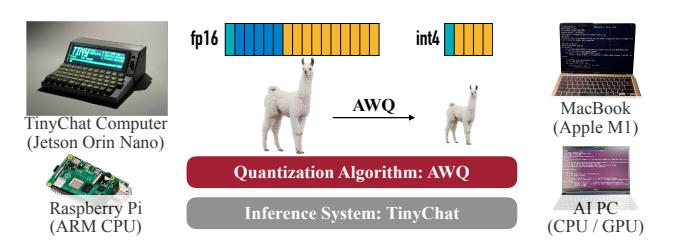

# AWQ: <u>ACTIVATION-AWARE WEIGHT QUANTIZATION FOR</u> ON-DEVICE LLM COMPRESSION AND ACCELERATION

Ji  ${\rm Lin}^{*1}$  Jiaming Tang $^{*12}$  Haotian Tang $^{\dagger1}$  Shang Yang $^{\dagger1}$  Wei-Ming Chen $^3$  Wei-Chen Wang $^1$  Guangxuan Xiao $^1$  Xingyu Dang $^{14}$  Chuang Gan $^{56}$  Song Han $^{13}$ 

https://github.com/mit-han-lab/llm-awq

#### **ABSTRACT**

Large language models (LLMs) have transformed numerous AI applications. On-device LLM is becoming increasingly important: running LLMs locally on edge devices can reduce the cloud computing cost and protect users' privacy. However, the astronomical model size and the limited hardware resource pose significant deployment challenges. We propose Activation-aware Weight Quantization (AWQ), a hardware-friendly approach for LLM low-bit weight-only quantization. AWO finds that not all weights in an LLM are equally important. Protecting only 1% salient weights can greatly reduce quantization error. To identify salient weight channels, we should refer to the activation distribution, not weights. To avoid the hardware-inefficient mix-precision quantization, we mathematically derive that scaling up the salient channels can reduce the quantization error. AWQ employs an equivalent transformation to scale the salient weight channels to protect them. The scale is determined by collecting the activation statistics offline. AWQ does not rely on any backpropagation or reconstruction, so it generalizes to different domains and modalities without overfitting the calibration set. AWQ outperforms existing work on various language modeling and domain-specific benchmarks (coding and math). Thanks to better generalization, it achieves excellent quantization performance for instruction-tuned LMs and, for the first time, multi-modal LMs. Alongside AWQ, we implement TinyChat, an efficient and flexible inference framework tailored for 4-bit on-device LLM/VLMs. With kernel fusion and platform-aware weight packing, TinyChat offers more than 3× speedup over the Huggingface FP16 implementation on both desktop and mobile GPUs. It also democratizes the deployment of the 70B Llama-2 model on mobile GPUs.

#### 1 Introduction

Deploying large language models (LLMs) directly on edge devices is crucial. On-device usage eliminates delays caused by sending data to a cloud server and enables LLMs to operate offline, which is beneficial for real-time applications like virtual assistants, chatbots, and autonomous vehicles. The operational costs associated with maintaining and scaling centralized cloud infrastructure can also be reduced. On-device LLM also enhances data security by keeping sensitive information local, reducing the chance of data breaches. LLMs, grounded in transformer-based architectures (Vaswani et al., 2017), have gathered significant attention for their impressive performance across diverse benchmarks (Brown et al., 2020; Zhang et al., 2022; Touvron

Proceedings of the 7th MLSys Conference, Santa Clara, CA, USA, 2024. **Best Paper Award.** Copyright 2024 by the author(s).

**Figure 1.** We introduce **AWQ**, a versatile weight quantization method for LLM. To implement AWQ, we developed **TinyChat** to deploy 4-bit quantized LLMs into various edge platforms, achieving a **3-4**× performance boost compared to FP16. Notably, we've also manufactured a **TinyChat computer**, powered by TinyChat, which contains an NVIDIA Jetson Orin Nano with only 8GB of memory and 15W power consumption. Demo: https://youtu.be/z91a8DrfqEw.

et al., 2023a; Scao et al., 2022). However, the large model size leads to the high serving costs. For example, GPT-3 has 175B parameters, which is 350GB in FP16, while the latest B200 GPU only has 192GB memory, let alone edge devices.

\*: Algorithm co-lead, †: system co-lead. ¹MIT ²Shanghai Jiao Tong University ³NVIDIA ⁴Tsinghua University ⁵MIT-IBM Watson AI Lab 6UMass Amherst. Correspondence to: Song Han <songhan@mit.edu>.

Low-bit weight quantization for LLMs can significantly reduce the memory footprint of on-device LLM inference but is hard. Quantization-aware training (QAT) is not efficient due to the high training cost, while post-training quantization (PTQ) suffers from large accuracy degradation under a low-bit setting. The closest work is GPTQ [\(Frantar et al.,](#page-11-0) [2022\)](#page-11-0), which uses second-order information to perform error compensation. However, it may overfit the calibration set during reconstruction, distorting the learned features on out-of-distribution domains (Figure [8\)](#page-9-0), which is problematic since LLMs are *generalist* models.

In this paper, we propose Activation-aware Weight Quantization (AWQ), a hardware-friendly low-bit weight-only quantization method for LLMs. Our method is based on the observation that *weights are not equally important* for LLMs' performance. There is a small fraction (0.1%-1%) of *salient* weights; skipping the quantization of these salient weights will significantly reduce the quantization loss (Table [1\)](#page-3-0). To find the salient weight channels, the insight is that we should refer to the *activation* distribution instead of the *weight* distribution, despite we are doing *weightonly* quantization: weight channels corresponding to larger activation magnitudes are more salient since they process more important features. To avoid the hardware-inefficient mixed-precision implementation, we analyze the error from weight quantization and derive that *scaling up the salient channels can reduce their relative quantization error* (Equation [2\)](#page-3-0). Following the intuition, we designed a per-channel scaling method to automatically search for the optimal scaling that minimizes the quantization error under full-weight quantization. AWQ does not rely on any backpropagation or reconstruction, so it can well preserve LLMs' generalization ability on various domains and modalities without overfitting to the calibration set.

To implement AWQ, we designed TinyChat, an efficient inference framework to convert theoretical memory savings from 4-bit LLM to measured speedup. Our framework significantly speeds up linear layers through on-the-fly dequantization. We also take advantage of efficient 4-bit weight packing and kernel fusion to minimize the inference overhead (*e.g*., intermediate DRAM access and kernel launch overhead), such that we can better realize the speed up from quantizing the weights to 4-bit, despite the computer is byte-aligned.

Experiments show that AWQ outperforms existing work on various tasks for different model families (*e.g*., LLaMA [\(Touvron et al.,](#page-13-0) [2023a\)](#page-13-0), OPT [\(Zhang et al.,](#page-14-0) [2022\)](#page-14-0)) and model sizes. Thanks to better generalization, it also achieves good quantization performance for *instructiontuned* LMs (*e.g*., Vicuna) and, for the first time, *multi-modal* LMs (OpenFlamingo [\(Awadalla et al.,](#page-10-0) [2023\)](#page-10-0)). TinyChat further translates the ∼4× lower memory footprint to mea-

sured speedup. On desktop, laptop and mobile GPUs, we consistently observe a 3.2-3.3× average speedup compared to the FP16 implementation by Huggingface across a diverse spectrum of LLMs. Furthermore, it facilitates effortless deployment of the Llama-2-70B model on a single NVIDIA Jetson Orin with 64GB of memory. It also democratizes 13 billion parameter LLM at an interactive pace of 30 tokens/second on a laptop RTX 4070 GPU with only 8GB of memory. AWQ has been widely adopted by industry and open-source community: [HuggingFace Transform](https://huggingface.co/docs/transformers/main_classes/quantization)[ers,](https://huggingface.co/docs/transformers/main_classes/quantization) [NVIDIA TensorRT-LLM,](https://github.com/NVIDIA/TensorRT-LLM/) [Microsfot DirectML,](https://blogs.windows.com/windowsdeveloper/2024/05/24/quantization-with-directml-helps-you-scale-further-on-windows/) [Google](https://console.cloud.google.com/vertex-ai/publishers/meta/model-garden/llama-2-quantized) [Vertex AI,](https://console.cloud.google.com/vertex-ai/publishers/meta/model-garden/llama-2-quantized) [Intel Neural Compressor,](https://github.com/intel/neural-compressor) [Amazon Sagemaker,](https://aws.amazon.com/blogs/machine-learning/boost-inference-performance-for-llms-with-new-amazon-sagemaker-containers/) [AMD,](https://community.amd.com/t5/ai/reduce-memory-footprint-and-improve-performance-running-llms-on/ba-p/686157) [FastChat,](https://github.com/lm-sys/FastChat/blob/main/docs/awq.md) [vLLM,](https://github.com/vllm-project/vllm/blob/main/vllm/model_executor/layers/quantization/awq.py) [LMDeploy,](https://github.com/InternLM/lmdeploy) and enables Falcon-180B deployable on a [single](https://github.com/NVIDIA/TensorRT-LLM/blob/main/docs/source/blogs/Falcon180B-H200.md) H200 GPU.

