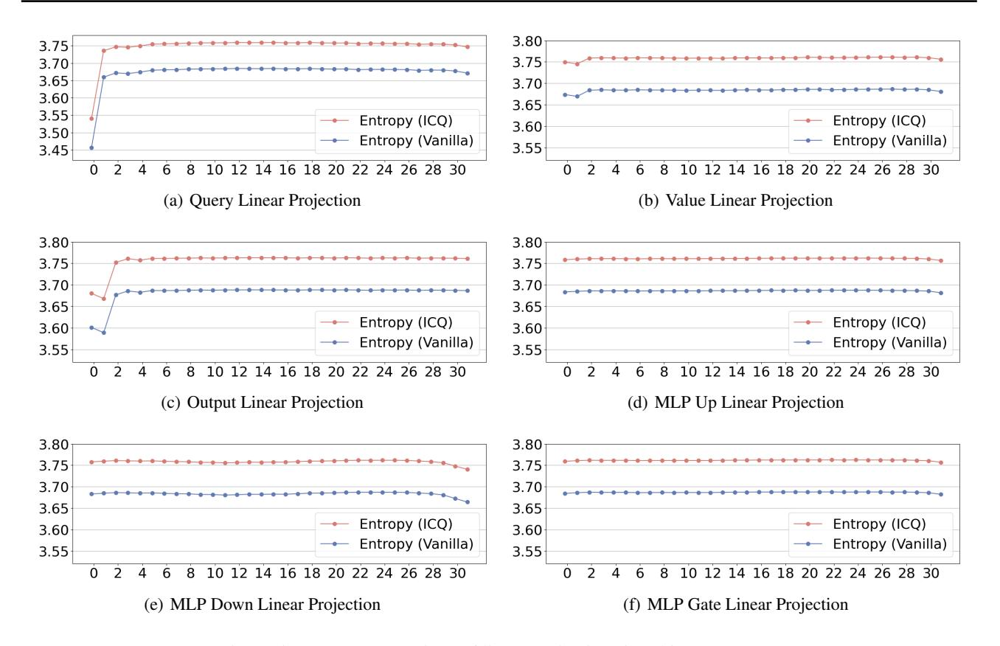

# B.4. Implementation Details

All experiments are conducted on Tesla A100 GPUs. Following [\(Dettmers et al.,](#page-9-7) [2023\)](#page-9-7), we apply the double quantization mechanism, and set the block size is 64 for quantization and 256 for double quantization. Regarding LoRA parameters, we set r = 64, α = 16, and LoRA dropout of 0.1 for models up to 13B and 0.05 for 33B and 65B models. We employ the paged AdamW optimizer with a beta2 value of 0.999, and a learning rate of 2e-4 for models up to 13B and 1e-4 for 33B and

Figure 5: Entropy comparison of linear projections in 4-bit LLaMA-7B

65B models., limiting the maximum gradient norm to 0.3 and adopting a constant learning rate strategy. Fine-tuning was executed for 10,000 and 20,000 steps on the Alpaca and FLAN v2 datasets, respectively, utilizing a batch size 16.

