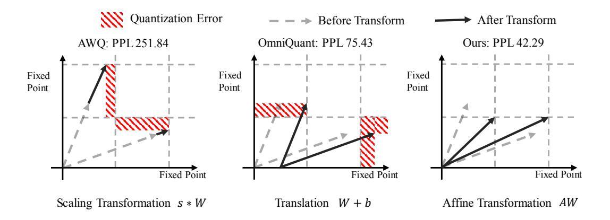

# 1 INTRODUCTION

Large Language Models (LLMs) [\(Zhang et al., 2022;](#page-11-0) [Touvron et al., 2023a;](#page-10-0)[b\)](#page-10-1) attract increasing attention due to their impressive performance. However, emergent logical reasoning abilities [\(Wei](#page-10-2) [et al., 2022a\)](#page-10-2) are only present in models above a certain size threshold. Hence, the training and inference efficiency of LLMs necessitates careful consideration. Specifically, the potential utilization of LLMs for inference on mobile and edge devices drives our motivation to focus on accelerating model inference. Quantization is regarded as one of the most promising methods among these compression methods. In particular, it maps weights or activations to lower bit representations, effectively reducing the memory usage of the model. Additionally, optimizing the compilation of operators for low-bit operations [\(MLC, 2023\)](#page-10-3) significantly enhance their efficiency and accelerate model inference.

1 Key Laboratory of Multimedia Trusted Perception and Efficient Computing,

2 ByteDance Inc. 3 Peng Cheng Laboratory, Shenzhen, China.

4 Institute of Artificial Intelligence, Xiamen University.

∗This work was done when Yuexiao Ma was intern at ByteDance Inc.

Code is available at: <https://github.com/bytedance/AffineQuant>

†Corresponding Author: rrji@xmu.edu.cn

Figure 1: The effect of scaling, translation and affine transformation on the quantization of the weights. The term "Fixed Point" refers to the 2 n − 1 quantization levels in n-bit quantization. s, b, and A are the scaling factor, translation factor, and affine transformation matrix, respectively. We assume that the input channel and output channel of W is 2. We consider each output channel as a two-dimensional vector.

Meanwhile, due to the substantial computational resources and high-quality data required for training LLMs, implementing quantization through model fine-tuning is challenging. Therefore, the research community is increasingly emphasizing training-free algorithms, termed as Post-Training Quantization (PTQ) [\(Wei et al., 2022c;](#page-11-1) [Xiao et al., 2023;](#page-11-2) [Wei et al., 2023;](#page-11-3) [Lin et al., 2023;](#page-9-0) [Shao](#page-10-4) [et al., 2023;](#page-10-4) [Yuan et al., 2023\)](#page-11-4). Post-training quantization allows for efficient optimization with less calibration data. However, this process can lead to significant performance degradation, particularly in small-sized models or low-bit scenarios.

Equivalent transformations are widely adopted in most PTQ methods. As illustrated in Figure [1,](#page-1-0) AWQ [\(Lin et al., 2023\)](#page-9-0) enhances scale computation by optimizing statistics and introduces the mean square error loss between the pre- and post-quantization feature maps as an optimization metric for the first time in LLMs. Recently, Omniquant [\(Shao et al., 2023\)](#page-10-4) introduces block-wise learnable scale and shift parameters for enhanced optimization. In higher dimensions, the concept of equivalent quantization is also gaining attention. RPTQ [\(Yuan et al., 2023\)](#page-11-4) achieves activation quantization per-cluster by sorting the columns of activation values. The reordering can be mathematically represented by converting the scale from a vector into a matrix form, where each row and column corresponds to a single scale value. This transformation effectively rearranges the activation columns and weight rows in an equivalent manner.

In summary, the evolution of equivalent quantization progresses from manual design to gradient optimization, from low-dimensional to high-dimensional transformations, and from single-scale merging to a combination of multiple operations, including translation and reordering. Equivalent quantization offers advantages in two main aspects. Firstly, by ensuring consistency between the pre- and post-quantization outputs, the introduced quantization noise can be effectively mitigated through optimization of the equivalence transform parameters. This aligns with the concept of post-training quantization, where the equivalence transform acts as an intermediate agent for noise improvement. Secondly, different types of equivalence transforms are orthogonal to each other. Intuitively, the introduction of each new type of equivalence transform expands the parameter optimization space, resulting in performance improvements.

Therefore, we propose an algorithm for equivalent affine transformation. Specifically, we leftmultiply the affine transform matrix to weights in the linear layer and right-multiply the activations with the transform matrix inverse. Guided by the mean square error loss, we optimize the affine transformation matrix, resulting in consistently lower loss compared to other algorithms on a wide range of models during the optimization process. Furthermore, we explore the invertibility of matrices during the optimization process. The Levy-Desplanques theorem [\(Naimark & Zeheb, 1997\)](#page-10-5) demonstrates that the strictly diagonally dominant matrices are invertible. To ensure that the affine transformation matrix is strictly diagonally dominant, we employ diagonal initialization and gradual mask methods. In this way, the optimization of high-dimensional matrices with limited calibration data is stabilized through a gradual optimization process that involves freezing the parameters. In terms of inference efficiency, our method is consistent with other methods after matrix merging. Finally, our method achieves state-of-the-art performance in LLMs quantization, particularly in scenarios involving small-scale models or lower bit configurations. Overall, our contributions are summarized as follows:

- We propose a novel affine transform in PTQ, which retains the benefits of PTQ, assures efficiency and generalization, significantly minimizes quantization error, especially under low-bit quantization, and enables the deployment of LLMs on edge devices.
- We propose a novel optimization algorithm that guarantees invertibility throughout the process, utilizing the Levy-Desplanques theorem, and simultaneously reduces computational costs.
- Our method obtains the state-of-the-art performance for large language model quantization, especially on low-bit or small models. Without additional overhead, on the w4a4 configuration of LLaMA2-7B, our perplexity on the C4 dataset is 15.76 (2.26↓ vs 18.02 in OmniQuant). Similarly, on the w4a4 configuration of LLaMA-30B, our accuracy on 6 zero-shot tasks is 58.61% (1.98 ↑ vs 56.63 in OmniQuant).

