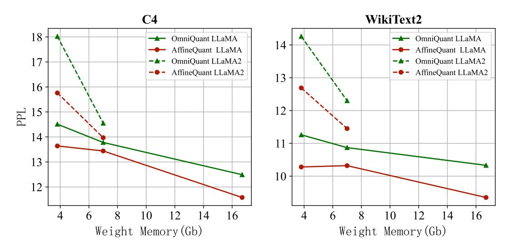
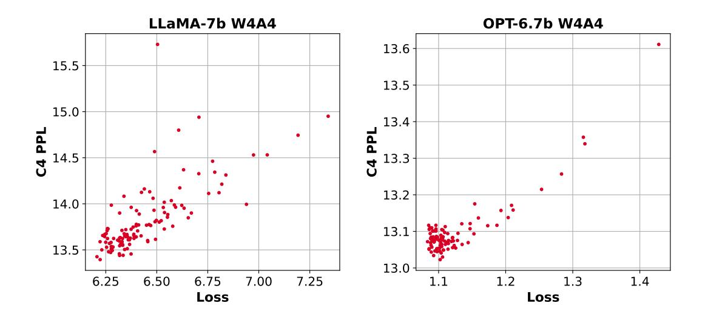
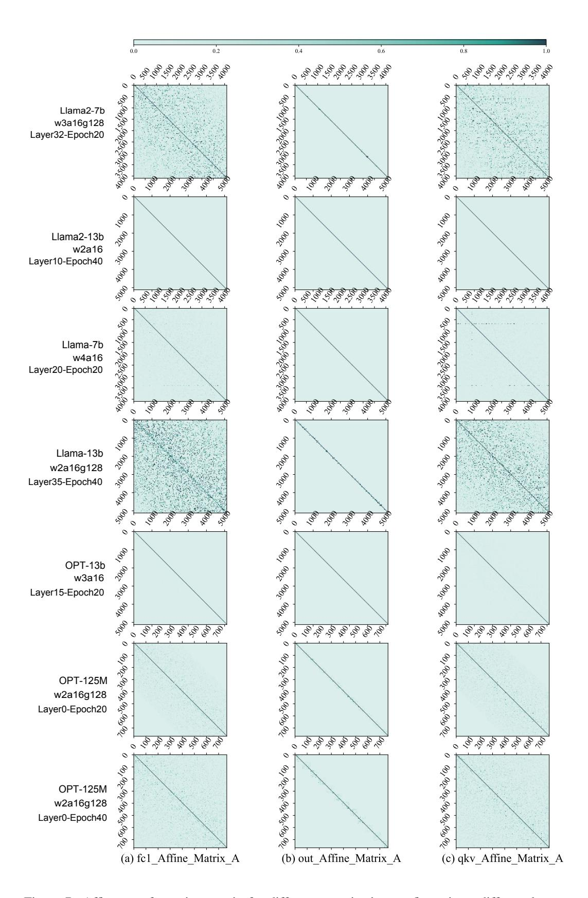

# A APPENDIX

#### A.1 PARETO FRONTS BASED ON WEIGHTED MEMORY

In Figure [4,](#page-11-7) We show the Pareto frontiers of AffineQuant and OmniQuant based on weighted memory and PPL trade-off for LLaMA1&2 models of different sizes in the 4/4 bit quantization configuration. The results clearly demonstrate that AffineQuant consistently outperforms the current State-Of-The-Art method, OmniQuant, without any additional overhead.

Figure 4: PPL vs. weight-memory Pareto-optimal curves for LLaMA1&2 models of different sizes in the 4/4 bit quantization configuration on C4 and WikiText2.

#### A.2 STRICTLY DIAGONAL DOMINANCE GUARANTEED

To avoid confusion in the proof between  $\alpha$  and the elements in the matrix A, we temporarily denote the affine matrix A as N.

**Theorem 1** When the stability factor  $\alpha$  is small enough, if  $N_e$  is strictly diagonally dominant, then  $N_{e+1}$  is strictly diagonally dominant.

**Proof 1** Without loss of generality, we take the *i*-th row of  $N_e$ . Since  $N_e$  is a strictly diagonally dominant matrix, we have,

$$|n_{ii}^e| > \sum_{j \neq i} |n_{ij}^e|.$$
 (10)

Where  $n_{ii}^e$ ,  $n_{ij}^e$  are the elements of the epoch e in the i-th row, i-th column and i-th row, j-th column of the matrix N. According to the above Equation 9, the absolute value of the i-th diagonal element of the e+1 epoch of matrix N is,

$$|n_{ii}^{e+1}| = |n_{ii}^e + \eta g_{ii}^e \frac{\partial L^e}{\partial n_{ii}^{e*}}|, \tag{11}$$

$$= |n_{ii}^e + \eta \frac{\partial L^e}{\partial n_{ii}^{e*}}|. \tag{12}$$

Where  $g_{ii}^e = 1$ ,  $n_{ii}^{e*}$  are the i-th diagonal elements of GM,  $N_e^*$  at epoch e, respectively.  $L^e$  is the loss at epoch e. Further,

$$|n_{ii}^{e+1}| = |n_{ii}^0 + \eta \sum_{r=0}^e \frac{\partial L^r}{\partial n_{ii}^{r*}}|.$$
(13)

 $n_{ii}^0$  is the scale when the matrix is initialized. Therefore, the diagonal values of the matrix N are not equal to 0 during the optimization process. Next, we focus on the right-hand side of Equation 10 at epoch e+1. Similarly,

$$\sum_{j \neq i} |n_{ij}^{e+1}| = \sum_{j \neq i} |n_{ij}^{e} + \eta g_{ii}^{e} \frac{\partial L^{e}}{\partial n_{ij}^{e*}}|, \tag{14}$$

$$= \sum_{j \neq i} |n_{ij}^h + \eta \sum_{x=h}^e g_{ii}^x \frac{\partial L^x}{\partial n_{ij}^{x*}}|. \tag{15}$$

Where  $1 \le h \le e$  is the epoch at which  $n_{ij}$  starts updating. In other words,  $n_{ij}^h = 0$ , and as h gets smaller  $n_{ij}$  gets closer to the diagonal. In addition,  $g_{ii}^x = \alpha$ . Therefore, we have,

$$\sum_{j \neq i} |n_{ij}^{e+1}| = \eta \alpha \sum_{j \neq i} |\sum_{x=h}^{e} \frac{\partial L^x}{\partial n_{ij}^{x*}}|.$$
 (16)

To make  $\sum_{j \neq i} |n_{ij}^{e+1}| < |n_{ii}^{e+1}|$  , we let

$$\eta \alpha \sum_{j \neq i} \left| \sum_{x=h}^{e} \frac{\partial L^x}{\partial n_{ij}^{x*}} \right| < \left| n_{ii}^0 + \eta \sum_{x=0}^{e} \frac{\partial L^x}{\partial n_{ii}^{x*}} \right|$$
 (17)

$$\alpha < \frac{|n_{ii}^0 + \eta \sum_{x=0}^e \frac{\partial L^x}{\partial n_{ii}^{x*}}|}{\eta \sum_{j \neq i} |\sum_{x=h}^e \frac{\partial L^x}{\partial n_{ii}^{x*}}|}$$

$$\tag{18}$$

Thus, when the stability factor  $\alpha$  is sufficiently small, if  $N_e$  is a strictly diagonally dominant matrix, then  $N_{e+1}$  is a strictly diagonally dominant matrix. The theorem is proved.

#### A.3 COMPARISON WITH FLEXROUND

Please refer to Table 7.

| Tuoie 7. 11 | mine Quant 15: 1 tenttouna: | · · · · P | monin u | ecuracy com | Julioon | OHOL  | or o siret tas | iko.  |
|-------------|-----------------------------|-----------|---------|-------------|---------|-------|----------------|-------|
|             | Dataset                     | PIQA      | ARC-e   | WinoGrande  | BoolQ   | ARC-c | HellaSwag      | Avg.  |
|             | Dataset                     | (†)       | (†)     | (†)         | ( )     | (†)   | (†)            | (†)   |
| LLaMA-7B    | FP16                        | 77.37     | 52.52   | 66.85       | 73.12   | 41.38 | 72.99          | 64.04 |
| w4a16       | FlexRound Lee et al. (2023) | 77.75     | 50.80   | 66.06       | 70.73   | 40.27 | 71.97          | 62.93 |
| wallo       | AffineQuant                 | 77.53     | 51.85   | 66.93       | 70.89   | 38.65 | 71.49          | 62.89 |
| LLaMA-13B   | FP16                        | 79.11     | 59.89   | 70.01       | 68.53   | 44.54 | 76.23          | 66.38 |
| w4a16       | FlexRound Lee et al. (2023) | 78.78     | 59.55   | 70.40       | 66.39   | 43.77 | 75.52          | 65.73 |
| w4a10       | AffineQuant                 | 78.84     | 59.55   | 69.38       | 69.48   | 43.52 | 75.18          | 65.99 |

Table 7: AffineQuant vs. FlexRound. We perform accuracy comparisons on 6 zero-shot tasks.

#### A.4 Loss and Model Performance

We maintain consistent matrix initialization while randomly sampling the stability factor  $\alpha$ , which influences loss convergence, for LLaMA-7B and OPT-6.7B. Using AffineQuant, we obtain the performance of 4/4 bit quantized models based on the sampled solution. In Figure 5, 6, we present scatter plots depicting the output loss of the last transformer block and the corresponding model performance on different datasets. These plots demonstrate a significant positive correlation between loss and model performance, with correlation coefficients of 0.95,0.96 on OPT-6.7B and LLaMA-7B in WikiText2, respectively. Based on this observation, we conclude that the quantization loss of the last transformer block's output exhibits a strong correlation with overall model performance.

Figure 5: The relationship between WikiText2 PPL and quantization loss of last transformer block on LLaMA-7B and OPT-6.7B with 4/4 bit quantization.

#### A.5 ADDITIONAL EXPERIMENT

We list additional experiments including:

- 1. the OPT model on the PTB dataset.
- 2. OPT model on C4 dataset.
- 3. LLaMA1&2 on the WikiText2 dataset.

Each experiment included models at different scales and a wide range of quantitative configurations.

#### A.6 AFFINE MATRIX

Figure 7 presents a comprehensive collection of affine transformation matrices, encompassing various transformer block locations, training epochs, layers, and quantization configurations.

Figure 6: The relationship between C4 PPL and quantization loss of last transformer block on LLaMA-7B and OPT-6.7B with 4/4 bit quantization.

Table 8: Weight-only quantization  $PPL(\downarrow)$  results on the OPT model PTB dataset.

| FP16 -       |                             |        |        |        |       | 13 <b>B</b> | 30 <b>B</b> |
|--------------|-----------------------------|--------|--------|--------|-------|-------------|-------------|
|              |                             | 32.54  | 16.96  | 15.11  | 13.08 | 12.33       | 11.84       |
| RTN          | 1                           | 4.6e3  | 7.1e3  | 2.5e4  | 5.7e3 | 3.0e4       | 6.2e3       |
| GP7          | Q (Frantar et al., 2022)    | 655.17 | 130.88 | 61.36  | 25.24 | 20.46       | 15.15       |
| w2a16g128 AW | Q (Lin et al., 2023)        | 263.88 | 71.87  | 43.15  | 19.49 | 17.61       | 14.92       |
| Om           | niQuant (Shao et al., 2023) | 126.49 | 34.33  | 25.28  | 18.92 | 16.74       | 14.51       |
| Affi         | neQuant                     | 65.23  | 30.06  | 27.11  | 18.22 | 16.35       | 14.09       |
| RTN          |                             | 5.1e3  | 19.4e3 | 7.7e4  | 6.1e3 | 8.2e3       | 4.1e3       |
|              | Q (Frantar et al., 2022)    | 245.28 | 55.61  | 36.12  | 19.45 | 17.02       | 14.05       |
|              | Q (Lin et al., 2023)        | 143.18 | 41.19  | 25.08  | 18.00 | 15.83       | 14.92       |
| Om           | niQuant (Shao et al., 2023) | 112.10 | 30.36  | 22.63  | 17.58 | 15.70       | 13.98       |
| Affi         | neQuant                     | 60.90  | 27.21  | 21.50  | 17.07 | 15.32       | 13.68       |
| RTN          | 1                           | 1.2e3  | 1.1e4  | 1.0e4  | 5.2e3 | 3.6e3       | 1.4e3       |
| GP7          | Q (Frantar et al., 2022)    | 34.05  | 27.39  | 15.94  | 13.75 | 13.71       | 12.54       |
| w3a16 AW     | Q (Lin et al., 2023)        | 80.73  | 33.20  | 224.11 | 18.46 | 35.45       | 66.68       |
| Om           | niQuant (Shao et al., 2023) | 40.76  | 19.06  | 16.29  | 13.77 | 12.96       | 12.19       |
| Affi         | neQuant                     | 38.38  | 19.14  | 16.32  | 14.19 | 13.54       | 12.48       |
| RTN          |                             | 64.67  | 222.13 | 337.75 | 39.90 | 65.33       | 34.27       |
|              | Q (Frantar et al., 2022)    | 45.17  | 19.90  | 17.06  | 14.24 | 12.84       | 12.54       |
|              | Q (Lin et al., 2023)        | 44.07  | 19.59  | 16.52  | 13.98 | 12.87       | 66.68       |
|              | niQuant (Shao et al., 2023) | 45.29  | 20.42  | 17.08  | 14.23 | 13.49       | 12.54       |
| Affi         | neQuant                     | 36.70  | 18.64  | 16.11  | 13.59 | 12.97       | 12.14       |
| RTN          |                             | 44.98  | 33.63  | 22.23  | 16.05 | 15.40       | 14.17       |
|              | Q (Frantar et al., 2022)    | 37.75  | 18.23  | 15.94  | 13.75 | 12.58       | 11.98       |
| w4a16 AW     | Q (Lin et al., 2023)        | 38.74  | 18.35  | 15.70  | 13.59 | 12.72       | 12.06       |
| Om           | niQuant (Shao et al., 2023) | 34.94  | 17.80  | 15.52  | 13.41 | 12.62       | 11.95       |
| Affi         | neQuant                     | 34.29  | 17.55  | 15.49  | 13.30 | 12.54       | 11.97       |
| RTN          |                             | 36.50  | 33.63  | 22.23  | 16.05 | 15.40       | 14.17       |
|              | TQ (Frantar et al., 2022)   | 35.48  | 17.41  | 15.42  | 13.21 | 12.42       | 11.89       |
| w4a16g128 AW | Q (Lin et al., 2023)        | 34.95  | 17.46  | 15.33  | 13.28 | 12.46       | 11.90       |
| Om           | niQuant (Shao et al., 2023) | 34.28  | 17.40  | 15.28  | 13.25 | 12.46       | 11.94       |
| Affi         | neQuant                     | 34.00  | 17.33  | 15.25  | 13.27 | 12.44       | 11.94       |

Table 9: Weight-only quantization PPL(↓) results on the OPT model C4 dataset.

| Config    | Method                        | 125M   | 1.3B   | 2.7B   | 6.7B  | 13B   | 30B   |
|-----------|-------------------------------|--------|--------|--------|-------|-------|-------|
| FP16      | -                             | 24.60  | 14.72  | 13.16  | 11.74 | 11.19 | 10.69 |
| w2a16g128 | RTN                           | 5.0e3  | 7.7e3  | 3.8e4  | 5.2e3 | 2.8e4 | 6.5e3 |
|           | GPTQ (Frantar et al., 2022)   | 597.66 | 60.88  | 33.83  | 18.55 | 16.34 | 12.89 |
|           | AWQ (Lin et al., 2023)        | 168.35 | 38.38  | 26.41  | 16.48 | 14.73 | 12.98 |
|           | OmniQuant (Shao et al., 2023) | 80.10  | 27.33  | 21.11  | 16.67 | 14.92 | 13.12 |
|           | AffineQuant                   | 46.22  | 23.28  | 23.10  | 15.62 | 14.60 | 12.93 |
| w2a16g64  | RTN                           | 3.9e3  | 7.3e3  | 1.2e5  | 6.3e3 | 7.5e3 | 4.0e3 |
|           | GPTQ (Frantar et al., 2022)   | 133.51 | 31.31  | 23.23  | 16.24 | 14.48 | 12.24 |
|           | AWQ (Lin et al., 2023)        | 90.19  | 27.34  | 20.01  | 15.20 | 13.90 | 12.43 |
|           | OmniQuant (Shao et al., 2023) | 64.01  | 23.71  | 19.16  | 15.44 | 14.16 | 12.80 |
|           | AffineQuant                   | 42.43  | 21.87  | 17.72  | 14.86 | 13.92 | 12.49 |
| w3a16     | RTN                           | 722.83 | 6.1e3  | 1.2e4  | 5.8e3 | 3.3e3 | 1.4e3 |
|           | GPTQ (Frantar et al., 2022)   | 37.75  | 19.45  | 13.75  | 15.67 | 12.28 | 11.34 |
|           | AWQ (Lin et al., 2023)        | 55.73  | 24.56  | 154.49 | 15.84 | 23.71 | 55.01 |
|           | OmniQuant (Shao et al., 2023) | 32.17  | 17.10  | 14.93  | 12.78 | 12.13 | 11.37 |
|           | AffineQuant                   | 28.19  | 16.42  | 14.27  | 12.72 | 12.04 | 11.21 |
| w3a16g128 | RTN                           | 40.13  | 126.47 | 372.23 | 32.56 | 44.12 | 25.70 |
|           | GPTQ (Frantar et al., 2022)   | 30.08  | 16.47  | 14.54  | 12.48 | 11.58 | 10.91 |
|           | AWQ (Lin et al., 2023)        | 30.39  | 16.27  | 14.19  | 12.30 | 11.61 | 10.96 |
|           | OmniQuant (Shao et al., 2023) | 29.34  | 16.11  | 14.15  | 12.31 | 11.63 | 10.98 |
|           | AffineQuant                   | 27.53  | 16.02  | 13.92  | 12.21 | 11.63 | 10.99 |
| w4a16     | RTN                           | 31.58  | 24.68  | 17.61  | 13.38 | 12.35 | 11.90 |
|           | GPTQ (Frantar et al., 2022)   | 27.12  | 15.57  | 13.75  | 12.15 | 11.36 | 10.80 |
|           | AWQ (Lin et al., 2023)        | 27.64  | 15.65  | 13.71  | 12.04 | 11.42 | 10.83 |
|           | OmniQuant (Shao et al., 2023) | 26.36  | 15.28  | 13.58  | 11.97 | 11.41 | 10.80 |
|           | AffineQuant                   | 25.47  | 15.18  | 13.43  | 11.90 | 11.36 | 10.80 |
| w4a16g128 | RTN                           | 26.79  | 15.71  | 13.79  | 12.31 | 11.51 | 10.94 |
|           | GPTQ (Frantar et al., 2022)   | 25.96  | 15.05  | 13.40  | 11.87 | 11.26 | 10.74 |
|           | AWQ (Lin et al., 2023)        | 25.90  | 15.04  | 13.39  | 11.87 | 11.28 | 10.75 |
|           | OmniQuant (Shao et al., 2023) | 25.63  | 15.03  | 13.38  | 11.85 | 11.29 | 10.75 |
|           | AffineQuant                   | 25.26  | 14.98  | 13.32  | 11.84 | 11.27 | 10.75 |

"fc1 Affine Matrix A" denotes the affine transformation matrix at fc1, "out Affine Matrix A" represents the affine transformation matrix at out proj, and "qkv Affine Matrix A" corresponds to the affine transformation matrix at qkv. To ensure consistency, we normalize the matrix values within the range of 0 to 1 using a specified normalization method. Notably, all matrices exhibit the property of being strictly diagonally dominant. Additionally, the low-bit affine transformation matrix demonstrates a higher capability to learn rotational features, thereby reducing the model's quantization error compared to the high-bit configuration.

Furthermore, as the training epochs progress, the affine transformation matrix acquires more nonprimary diagonal elements. On the other hand, the persistence of an approximate diagonal matrix at high quantization bits elucidates the modest performance improvement observed in high-bit quantization configurations. This phenomenon may also be attributed to the relatively small performance gap between the quantized model and the full-precision model.

#### A.7 EXPERIMENTAL DETAILS

To ensure a fair comparison, we align most of our optimization parameters with those of Omni-Quant [\(Shao et al., 2023\)](#page-10-4). Specifically, we apply INT2, INT3, and INT4 only-weight quantization to OPT [\(Zhang et al., 2022\)](#page-11-0) and LLaMA1&2 [\(Touvron et al., 2023a](#page-10-0)[;b\)](#page-10-1) models. Additionally, we employ grouping strategies of 64 or 128 for weight quantization with different bit configurations. The model's performance is evaluated on the WikiText2 [\(Merity et al., 2016\)](#page-10-13), PTB [\(Marcus et al., 1994\)](#page-10-14), and C4 [\(Raffel et al., 2020\)](#page-10-15) datasets. For algorithm optimization, we randomly select 128 segments from the WikiText2 training set, each containing 2048 tokens, as the calibration dataset. We leverage

Table 10: Weight-only quantization PPL(↓) results on the LLaMA1&2 model C4 dataset.

| Config    | Method                        | 1-7B  | 1-13B | 1-30B | 2-7B   | 2-13B |
|-----------|-------------------------------|-------|-------|-------|--------|-------|
| FP16      | -                             | 7.08  | 6.61  | 5.98  | 6.97   | 6.46  |
|           | RTN                           | 28.26 | 13.22 | 28.66 | 402.35 | 12.51 |
|           | GPTQ (Frantar et al., 2022)   | 9.49  | 8.16  | 7.29  | 9.81   | 8.02  |
| w3a16     | AWQ (Lin et al., 2023)        | 13.26 | 9.13  | 12.67 | 23.85  | 13.07 |
|           | OmniQuant (Shao et al., 2023) | 8.19  | 7.32  | 6.57  | 8.65   | 7.44  |
|           | AffineQuant                   | 8.03  | 7.20  | 6.55  | 8.57   | 7.56  |
|           | RTN                           | 8.62  | 7.49  | 6.58  | 8.40   | 7.18  |
|           | GPTQ (Frantar et al., 2022)   | 7.85  | 7.10  | 6.47  | 7.89   | 7.00  |
| w3a16g128 | AWQ (Lin et al., 2023)        | 7.92  | 7.07  | 6.37  | 7.84   | 6.94  |
|           | OmniQuant (Shao et al., 2023) | 7.34  | 6.76  | 6.11  | 7.35   | 6.65  |
|           | AffineQuant                   | 7.75  | 7.04  | 6.40  | 7.83   | 6.99  |
|           | RTN                           | 7.93  | 6.98  | 6.34  | 7.71   | 6.83  |
|           | GPTQ (Frantar et al., 2022)   | 7.43  | 6.84  | 6.20  | 7.37   | 6.70  |
| w4a16     | AWQ (Lin et al., 2023)        | 7.52  | 6.86  | 6.17  | 7.68   | 6.74  |
|           | OmniQuant (Shao et al., 2023) | 7.34  | 6.76  | 6.11  | 7.35   | 6.65  |
|           | AffineQuant                   | 7.30  | 6.75  | 6.10  | 7.29   | 6.64  |
|           | RTN                           | 7.37  | 6.69  | 6.06  | 7.24   | 6.58  |
|           | GPTQ (Frantar et al., 2022)   | 7.21  | 6.69  | 6.06  | 7.12   | 6.56  |
| w4a16g128 | AWQ (Lin et al., 2023)        | 7.21  | 6.70  | 6.05  | 7.13   | 6.56  |
|           | OmniQuant (Shao et al., 2023) | 7.21  | 6.69  | 6.06  | 7.12   | 6.56  |
|           | AffineQuant                   | 7.20  | 6.69  | 6.05  | 7.12   | 6.56  |

the scale of SmoothQuant [\(Xiao et al., 2023\)](#page-11-2) to initialize the diagonal of the affine transformation matrix. As the affine transformation is orthogonal to the translation operation, we incorporate the optimization of the learnable parameter shift and initialize it using Outlier Suppression+ [\(Wei et al.,](#page-11-3) [2023\)](#page-11-3). Our optimizer, learning rate, epoch, and learnable clipping of quantization parameters are consistent with OmniQuant [\(Shao et al., 2023\)](#page-10-4). The optimization process is performed on an Nvidia A100 GPU. We conduct a comparative analysis of various weight-only quantization methods, including GPTQ [\(Frantar et al., 2022\)](#page-9-12), AWQ [\(Lin et al., 2023\)](#page-9-0), and OmniQuant [\(Shao et al., 2023\)](#page-10-4).

Table 11: Weight-only quantization PPL(↓) results on the LLaMA1&2 model WikiText2 dataset.

| Config    | Method                        | 1-7B   | 1-13B  | 1-30B  | 2-7B   | 2-13B  |
|-----------|-------------------------------|--------|--------|--------|--------|--------|
| FP16      | -                             | 5.68   | 5.09   | 4.10   | 5.47   | 4.88   |
| w2a16     | RTN                           | 1.1e5  | 6.8e4  | 2.4e4  | 3.8e4  | 5.6e4  |
|           | GPTQ (Frantar et al., 2022)   | 2.1e3  | 5.5e3  | 499.75 | 7.7e3  | 2.1e3  |
|           | OmniQuant (Shao et al., 2023) | 15.47  | 13.21  | 8.71   | 37.37  | 17.21  |
|           | AffineQuant                   | 9.53   | 7.54   | 8.35   | 35.07  | 12.42  |
| w2a16g128 | RTN                           | 1.9e3  | 781.20 | 68.04  | 4.2e3  | 122.08 |
|           | GPTQ (Frantar et al., 2022)   | 44.01  | 15.60  | 10.92  | 36.77  | 28.14  |
|           | AWQ (Lin et al., 2023)        | 2.6e5  | 2.8e5  | 2.4e5  | 2.2e5  | 1.2e5  |
|           | OmniQuant (Shao et al., 2023) | 10.53  | 8.37   | 7.77   | 12.84  | 9.15   |
|           | AffineQuant                   | 13.51  | 7.22   | 6.49   | 10.87  | 7.64   |
| w2a16g64  | RTN                           | 188.32 | 101.87 | 19.20  | 431.97 | 26.22  |
|           | GPTQ (Frantar et al., 2022)   | 22.10  | 10.06  | 8.54   | 20.85  | 22.44  |
|           | AWQ (Lin et al., 2023)        | 2.5e5  | 2.7e5  | 2.3e5  | 2.1e5  | 1.2e5  |
|           | OmniQuant (Shao et al., 2023) | 9.41   | 7.62   | 7.14   | 10.56  | 8.14   |
|           | AffineQuant                   | 8.35   | 6.98   | 6.20   | 9.05   | 7.11   |
| w3a16     | RTN                           | 25.73  | 11.39  | 14.95  | 539.48 | 10.68  |
|           | GPTQ (Frantar et al., 2022)   | 8.06   | 6.76   | 5.84   | 8.37   | 6.44   |
|           | AWQ (Lin et al., 2023)        | 11.88  | 7.45   | 10.07  | 24.00  | 10.45  |
|           | OmniQuant (Shao et al., 2023) | 6.49   | 5.68   | 4.74   | 6.58   | 5.58   |
|           | AffineQuant                   | 6.30   | 5.60   | 4.68   | 6.55   | 5.62   |
| w3a16g128 | RTN                           | 7.01   | 5.88   | 4.87   | 6.66   | 5.51   |
|           | GPTQ (Frantar et al., 2022)   | 6.55   | 5.62   | 4.80   | 6.29   | 5.42   |
|           | AWQ (Lin et al., 2023)        | 6.46   | 5.51   | 4.63   | 6.24   | 5.32   |
|           | OmniQuant (Shao et al., 2023) | 6.15   | 5.44   | 4.56   | 6.03   | 5.28   |
|           | AffineQuant                   | 6.14   | 5.45   | 4.59   | 6.08   | 5.28   |
| w4a16     | RTN                           | 6.43   | 5.55   | 4.57   | 6.11   | 5.20   |
|           | GPTQ (Frantar et al., 2022)   | 6.13   | 5.40   | 4.48   | 5.83   | 5.13   |
|           | AWQ (Lin et al., 2023)        | 6.08   | 5.34   | 4.39   | 6.15   | 5.12   |
|           | OmniQuant (Shao et al., 2023) | 5.86   | 5.21   | 4.25   | 5.74   | 5.02   |
|           | AffineQuant                   | 5.84   | 5.20   | 4.23   | 5.69   | 5.01   |
| w4a16g128 | RTN                           | 5.96   | 5.25   | 4.23   | 5.72   | 4.98   |
|           | GPTQ (Frantar et al., 2022)   | 5.85   | 5.20   | 4.23   | 5.61   | 4.98   |
|           | AWQ (Lin et al., 2023)        | 5.81   | 5.20   | 4.21   | 5.62   | 4.97   |
|           | OmniQuant (Shao et al., 2023) | 5.77   | 5.17   | 4.19   | 5.58   | 4.95   |
|           | AffineQuant                   | 5.77   | 5.17   | 4.19   | 5.58   | 4.95   |

Figure 7: Affine transformation matrix for different quantization configurations, different layers, and different training epochs for OPT and LLaMA1&2.