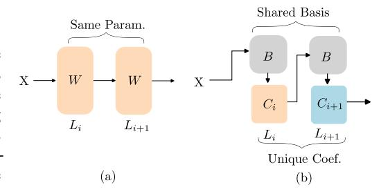

# BASIS SHARING: CROSS-LAYER PARAMETER SHARING FOR LARGE LANGUAGE MODEL COMPRESSION

Jingcun Wang

Technical University of Darmstadt jingcun.wang@tu-darmstadt.de

Ing-Chao Lin

National Cheng Kung University iclin@csie.ncku.edu.tw

Grace Li Zhang

Technical University of Darmstadt grace.zhang@tu-darmstadt.de Yu-Guang Chen

National Central University andyygchen@ee.ncu.edu.tw

Bing Li

University of Siegen Bing.Li@uni-siegen.de

## ABSTRACT

Large Language Models (LLMs) have achieved remarkable breakthroughs. However, the huge number of parameters in LLMs require significant amount of memory storage in inference, which prevents their practical deployment in many applications. To reduce memory storage of LLMs, singular value decomposition (SVD) provides a promising solution to approximate weight matrices for compressing LLMs. In this paper, we take a step further to explore parameter sharing across different layers with SVD to achieve more effective compression for LLMs. Specifically, weight matrices in different layers are decomposed and represented as a linear combination of a set of shared basis vectors and unique coefficients. The types of weight matrices and the layer selection for basis sharing are examined when compressing LLMs to maintain the performance. Comprehensive experiments demonstrate that Basis Sharing outperforms state-of-the-art SVD-based compression approaches and parameter sharing techniques, especially under large compression ratios. Code is available at: [https://github.com/TUDa-HWAI/Basis\\_Sharing](https://github.com/TUDa-HWAI/Basis_Sharing)

## 1 INTRODUCTION

Large Language Models (LLMs) have revolutionized natural language processing by enabling machines to understand human language more accurately. Although these models have remarkable capabilities, they are computation- and memory-intensive, making their deployment on resourceconstrained devices challenging. To address this challenge, model compression has become a widely adopted technique to reduce model size and complexity.

Common compression techniques, such as model distillation [\(Gu et al.,](#page-10-0) [2024;](#page-10-0) [Magister et al.,](#page-11-0) [2023;](#page-11-0) [Jiang et al.,](#page-10-1) [2023b;](#page-10-1) [Huang et al.,](#page-10-2) [2022;](#page-10-2) [Qiu et al.,](#page-11-1) [2024\)](#page-11-1), pruning [\(Frantar & Alistarh,](#page-10-3) [2023;](#page-10-3) [2022;](#page-10-4) [Ma](#page-10-5) [et al.,](#page-10-5) [2023;](#page-10-5) [Sun et al.,](#page-11-2) [2024;](#page-11-2) [Jiang et al.,](#page-10-6) [2024;](#page-10-6) [Petri et al.,](#page-11-3) [2023\)](#page-11-3), and quantization [\(Lin et al.,](#page-10-7) [2024;](#page-10-7) [Zhao et al.,](#page-12-0) [2024;](#page-12-0) [Ashkboos et al.,](#page-9-0) [2024;](#page-9-0) [Xiao et al.,](#page-12-1) [2023;](#page-12-1) [Sun et al.,](#page-11-4) [2023\)](#page-11-4), early-exit [\(Pan et al.,](#page-11-5) [2024;](#page-11-5) [Wang et al.,](#page-11-6) [2024a\)](#page-11-6) etc. have been extensively studied. While such techniques are effective in many scenarios, these methods often require hardware modification and expensive retraining. Compression techniques based on low-rank approximation with, e.g., Singular Value Decomposition (SVD) [\(Yuan et al.,](#page-12-2) [2023;](#page-12-2) [Hsu et al.,](#page-10-8) [2022;](#page-10-8) [Wang et al.,](#page-11-7) [2024b\)](#page-11-7), provide a promising alternative since they are not restricted by such constraints. In SVD-based weight compression, a weight matrix in a layer is processed individually by decomposing it into three matrices. By removing small singular values in the decomposed diagonal matrix, the original weight matrix can be approximated with fewer number of weight values.

Despite the benefits of SVD-based weight compression, the potential of grouping layers for weight approximation and compression has not been explored thoroughly. Since weight matrices in different layers of an LLM might share similarity, parameter sharing across layers can be exploited to further compress weight matrices for LLMs. In sharing parameters across layers, [Hay & Wolf](#page-10-9) [\(2024\)](#page-10-9) trained a small language model by restricting weight matrices in some layers to be the same. On the one hand, this brute-force method leads to significant performance degradation since weight matrices in different layers should vary to maintain their functionalities. On the other hand, it is impractical to train LLMs from scratch due to limited training data or high training costs.

Contrary to previous work, in this paper, we use pretrained LLMs to enable weight matrices across layers to share a common set of basis vectors but still retain their different functionalities with unique coefficients. Our method, called Basis Sharing, can compress LLMs effectively. In summary, our contributions are as follows:

- 1. We propose to represent weight matrices across different layers in a pretrained LLM with a linear combination of a set of shared basis vectors and coefficients unique to specific layers. This basis sharing can effectively reduce the number of parameters in LLMs while only affecting the performance of LLMs slightly.
- 2. We examine cross-layer basis sharing for different types of weight matrices in LLMs according to the incurred compression errors. The types of weight matrices whose sharing across layers does not incur significant compression error are selected for compressing LLMs.
- 3. For the selected types of weight matrices, we also develop a criterion to group layers to share a set of basis vectors but have individual coefficients to preserve the performance of LLMs.
- 4. We conduct extensive experiments on a variety of LLMs, including the LLaMA family [\(Touvron et al.,](#page-11-8) [2023a](#page-11-8)[;b\)](#page-11-9), OPT-6.7B [\(Zhang et al.,](#page-12-3) [2022\)](#page-12-3), Mistral-7B [\(Jiang et al.,](#page-10-10) [2023a\)](#page-10-10), and GPT-2 [\(Radford et al.,](#page-11-10) [2019\)](#page-11-10). Our Basis Sharing can surpasses the state-of-the-art SVD-based methods in both generation tasks and downstream reasoning tasks without any fine-tuning under compression ratios from 20% to 50%. Specifically, compared with state-ofthe-art SVD-based compression approaches, Basis Sharing can further reduce the perplexity by up to 25% on generation tasks and improve accuracy by up to 4% on downstream reasoning tasks under the same compression ratio.

## 2 RELATED WORK

Large Language Model Compression LLM compression techniques include model distillation, pruning and quantization, etc. [Gu et al.](#page-10-0) [\(2024\)](#page-10-0); [Huang et al.](#page-10-2) [\(2022\)](#page-10-2); [Magister et al.](#page-11-0) [\(2023\)](#page-11-0); [Jiang](#page-10-1) [et al.](#page-10-1) [\(2023b\)](#page-10-1) successfully applied model distillation to LLM by retraining, which incurs high computational cost. [Frantar & Alistarh](#page-10-3) [\(2023;](#page-10-3) [2022\)](#page-10-4); [Sun et al.](#page-11-2) [\(2024\)](#page-11-2); [Ma et al.](#page-10-5) [\(2023\)](#page-10-5) pruned weights that are less sensitive to outliers. However, the resulting unstructured weight matrices do not provide meaningful compression benefits on real hardware. Structured pruning techniques, such as 2:4 or 4:8 pruning, can achieve effective compression but restrict a fixed 50% pruning ratio, which limits flexibility in balancing performance and compression ratio. [Zhao et al.](#page-12-0) [\(2024\)](#page-12-0); [Ashkboos et al.](#page-9-0) [\(2024\)](#page-9-0); [Lin et al.](#page-10-7) [\(2024\)](#page-10-7); [Xiao et al.](#page-12-1) [\(2023\)](#page-12-1) allocated higher quantization bits to weights with larger influence on outliers, but it does not reduce the number of parameters, limiting its impact on overall compression.

SVD-based Weight Compression SVD-based weight compression has a flexible compression ratio to maintain performance without retraining. [Golub et al.](#page-10-11) [\(1987\)](#page-10-11) were the first to apply SVD for neural network compression, and [Lv et al.](#page-10-12) [\(2023\)](#page-10-12); [Wu et al.](#page-12-4) [\(2023\)](#page-12-4) extended this approach to shallow transformer models [\(Vaswani,](#page-11-11) [2017\)](#page-11-11). However, in LLM compression, these methods incur significant errors since they do not consider outliers in activations. FWSVD [\(Hsu et al.,](#page-10-8) [2022\)](#page-10-8) addresses this issue by incorporating the impact of outliers through the Fisher information analysis of weight matrices. However, this method requires gradient information during training process, which is computationally prohibitive for LLMs. ASVD [\(Yuan et al.,](#page-12-2) [2023\)](#page-12-2) alleviates this problem by selecting key channels in the weight matrix based on their sensitivity to outliers and minimizing compression error in these channels. While it avoids the need for gradients, ASVD still lacks a direct connection between SVD truncation error and the overall model compression error. SVD-LLM (Wang et al., 2024b) improves this by introducing a whitening matrix that captures outlier information, effectively reducing compression error. However, all of these methods focus only on compressing individual weight matrices within a single layer, missing the opportunity to exploit weight compression across multiple layers.

Parameter Sharing Parameter sharing reduces model size by reusing weight matrices across different layers. Inspired by recurrent neural networks, Dehghani et al. (2019) explored this concept within transformers by restricting all layers in the encoder and decoder to share the same weights. Similarly, Reid et al. (2021) divided transformer parameters into two groups (attention-related and feedforward-related) and compressed the model by sharing weights within each group. Takase & Kiyono (2021) applied selective weight sharing, where specific layers shared the same weights rather than all layers. Beyond direct weight sharing, Xiao et al. (2019); Bhojanapalli et al. (2021) introduced the idea of sharing attention scores between layers. By reusing attention scores, some weight matrices for attention computation could be discarded. Dynamic Tying (Hay & Wolf, 2024) determines layer-wise weight sharing during training using reinforcement learning, which is still time-consuming for large LLMs. All of these approaches have been tested only on smaller transformer models and typically require training from scratch or full parameter fine-tuning, which makes them impractical for LLMs.

#### 3 METHODOLOGY

Contrary to the previous techniques that require training from scratch and weights in some layers are restricted to be the same during training, we adopt a pretrained LLM to explore representing weights across different layers with combinations of a set of shared basis vectors and individual coefficients. Since the set of basis vectors can be shared across several layers, the number of parameters in the LLM can thus be reduced effectively. The difference between the previous weight sharing method and our Basis Sharing is illustrated in Figure 1.

Figure 1: (a) Two layers share the same weight matrix in previous work. (b) Two layers share the same basis matrix but have their individual coefficients in our work.

To exploit the cross-layer parameter sharing to compress LLMs, the subsequent subsections address the following challenges: 1) What methodologies can be used to process the weight matrices across layers in an LLM to determine a set of shared basis vectors and individual coefficients? 2) Which types of weight matrices across layers in an LLM can take advantage of parameter sharing without affecting its performance significantly? 3) Which layers can share a set of basis vectors in an LLM without affecting its performance significantly?

