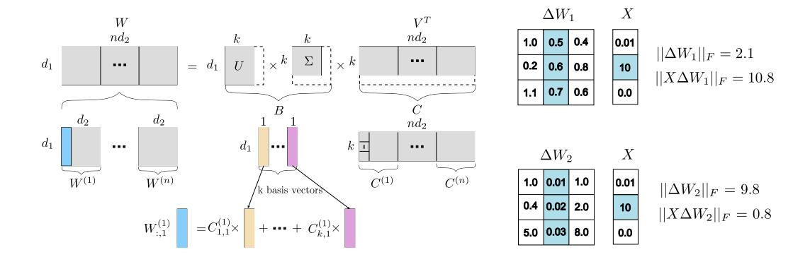
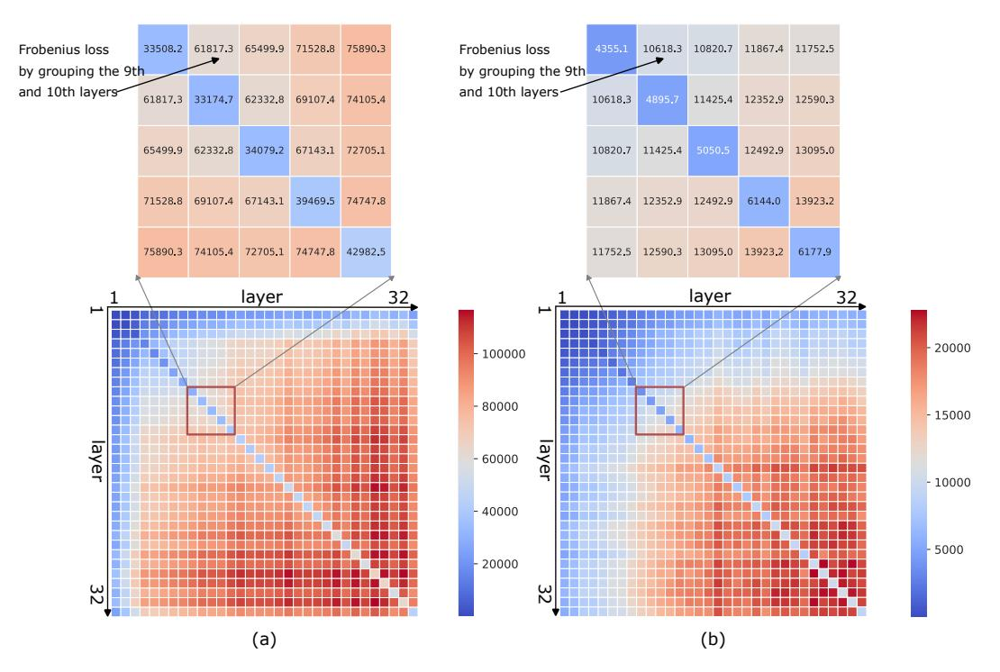
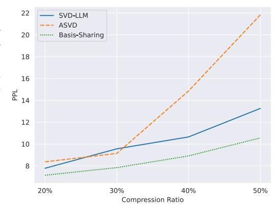
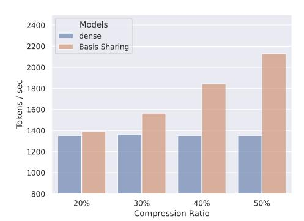
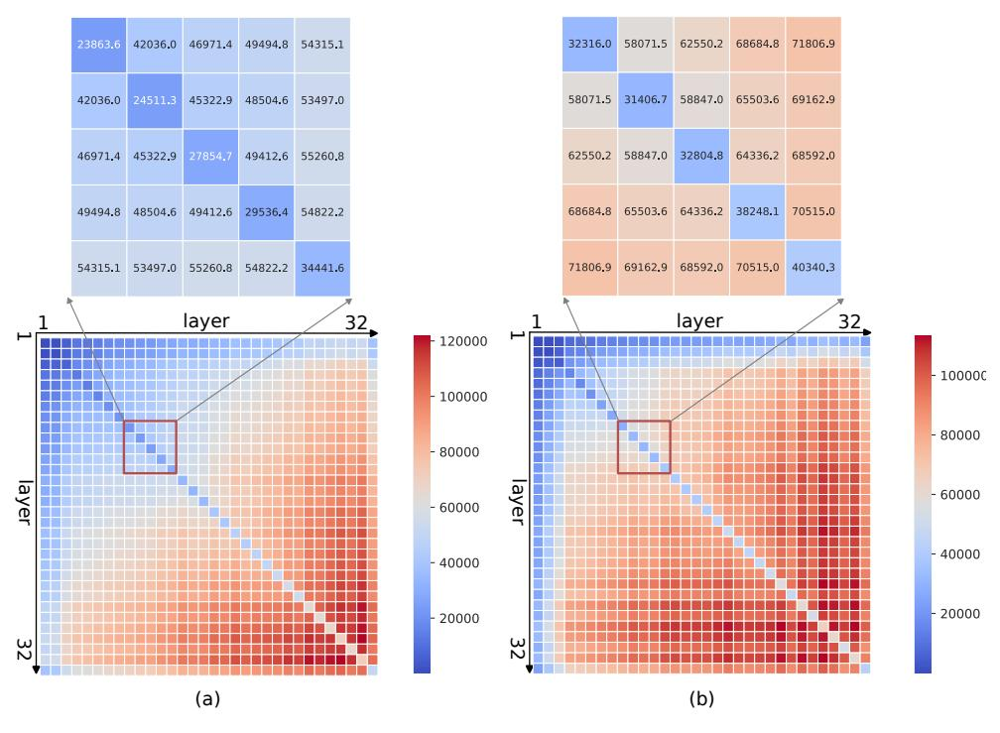
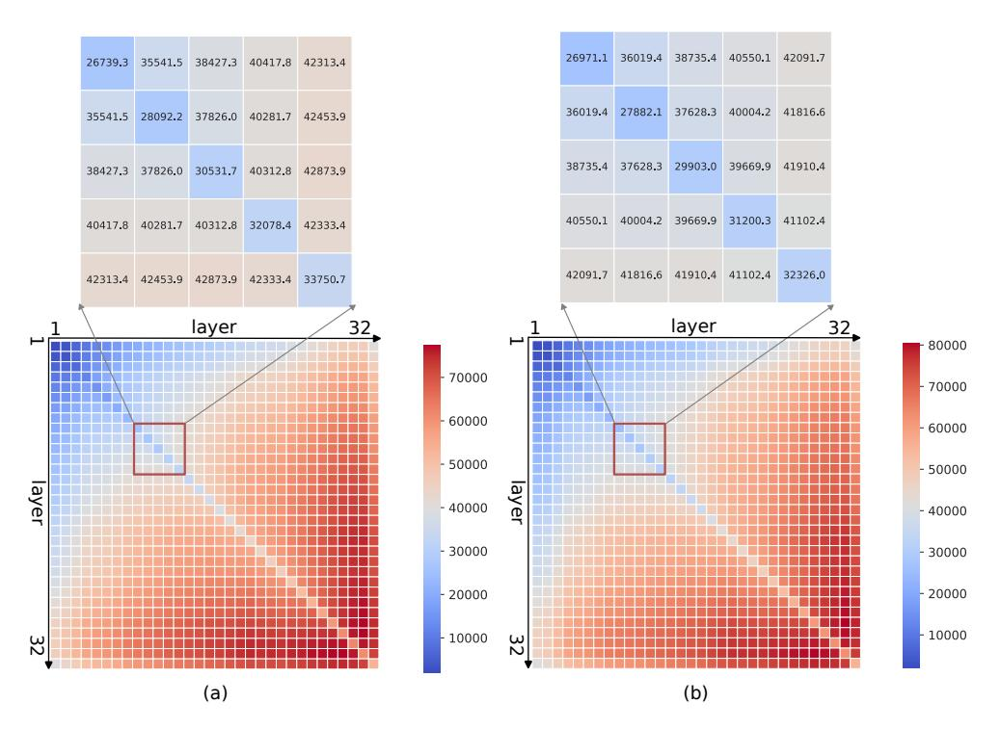

# 3.1 REPRESENTING WEIGHT MATRICES ACROSS LAYERS WITH COMBINATIONS OF BASIS VECTORS AND COEFFICIENTS

Suppose that we have weight matrices across n layers, denoted as  $\boldsymbol{W}^{(1)} \dots \boldsymbol{W}^{(n)}, \boldsymbol{W}^{(i)} \in \mathbb{R}^{d_1 \times d_2}$ . To derive a set of shared basis vectors and coefficients to represent such weight matrices, intuitively, such matrices can be horizontally concatenated into one matrix, denoted as  $\boldsymbol{W} \in \mathbb{R}^{d_1 \times nd_2}$ , and singular value decomposition (SVD) can be applied to decompose this matrix into three matrices:  $\boldsymbol{U}, \boldsymbol{\Sigma}, \boldsymbol{V}^T$ .  $\boldsymbol{\Sigma}$  is a  $d_1 \times nd_2$  diagonal matrix consisting of singular values of  $\boldsymbol{W}$ .

By selecting the top k singular values in  $\Sigma$ , W can be approximated as  $W \approx W_k = U_k \Sigma_k V_k^T$ , where the dimensions of  $U_k$ ,  $\Sigma_k$  and  $V_k^T$  are  $d_1 \times k$ ,  $k \times k$ , and  $k \times n d_2$ , respectively. The value of k should be determined to balance the compression ratio and the performance of the compressed LLM (Appendix A.1 shows the evaluation of k under a given compression ratio).  $W_k$  can be rewritten as  $W_k = BV_k^T$ , where B is the multiplication result of  $U_k$  and  $\Sigma_k$ . We call B a basis matrix and a column of B is a basis vector, denoted as  $B_{:,i}$ .  $V_k^T$  can be considered as a coefficient matrix, i.e.,  $V_k^T = C$ . Accordingly, the  $j^{th}$  column of the original weight matrix  $W^{(i)}$  in the  $i^{th}$  layer can be

Figure 2: Weight matrices across n layers are concatenated horizontally into a weight matrix, which is processed by SVD. The  $j^{th}$  column of the original weight matrix in a layer can be represented as a linear combination of k shared basis vectors and coefficients.

Figure 3:  $\Delta W_1$  and  $\Delta W_2$  are differences with respect to the original weight matrix after compression.  $||\Delta W_1||_F$  is smaller than  $||\Delta W_2||_F$ , but  $||X\Delta W_1||_F$  is larger than  $||X\Delta W_2||_F$ .

approximated as a liner combination of k basis vectors and individual coefficients as follows.

$$W_{:,j}^{(i)} \approx \sum_{m=1}^{k} B_{:,m} C_{m,j}^{(i)}.$$
 (1)

where  $C^{(i)}$  is the coefficient matrix in  $i^{th}$  layer. The process of weight matrix approximation and representation is illustrated in Figure 2.

In the weight matrix approximation with SVD above, input data, denoted as X, are not considered. In fact, the result of XW instead of W is used in inference. Accordingly, applying SVD directly onto weight matrices without incorporating input data might lead to significant computation loss and potentially affect the performance of the LLM. Figure 3 illustrates an example, where a weight matrix approximated with SVD leads to a large compression loss in the form of Frobenius loss, denoted as  $||X\Delta W||_F$ . Since the second element in the input data affects the computation accuracy significantly, the second column of the weight matrix should be approximated more accurately compared with other columns to reduce the overall computation loss. Yuan et al. (2023); Wang et al. (2024b) also pointed out similar results.

To incorporate the effect of input data into the weight approximation with SVD to maintain the performance of the LLM, we will scale the concatenated weight matrix W with a matrix  $S \in \mathbb{R}^{d_1 \times d_1}$  as follows

$$W = S^{-1}SW = S^{-1}(SW).$$
 (2)

The matrix S should be evaluated to represent the impact of input data on the weights, so that it can adjust W accordingly to reflect the significance of different input data. To obtain appropriate S, we will adapt the techniques developed in Wang et al. (2024b), where S can be evaluated with  $S(S)^T = cholesky((X)^TX)$ . However, X in their technique refers to input data of a layer instead of several layers in our method. To evaluate S considering several layers, we will vertically concatenate the input matrices in such layers, denoted as,  $X^{(1)}, \ldots, X^{(n)}$ , and compute the S with the concatenated X. In our experiments, we use 256 samples from WikiText-2 (Merity et al., 2016) with each 2048 tokens to evaluate X, similar to that in Wang et al. (2024b).

Instead of applying SVD directly on the concatenated weight matrix W, we will decompose SW with SVD and approximate this scaled weight matrix  $SW \approx U_k' \Sigma_k' V_k' = B'C'$ , where B' and C' are the revised basis matrix and coefficient matrix, respectively. To recover the approximated weight matrix for computation in inference,  $S^{-1}$  will be multiplied with B', the result of which will be the final adjusted basis matrix, i.e.,

$$W \approx S^{-1}U_k'\Sigma_k'V_k' = S^{-1}B'C' = B''C', \tag{3}$$

where B'' is the final adjusted basis matrix in our paper.

#### 3.2 SELECTION OF WEIGHT MATRICES IN LLMS FOR CROSS-LAYER PARAMETER SHARING

Modern LLMs are constructed based on the decoder-only transformer architecture. A layer in such an architecture includes several types of weight matrices, which have different functions.  $W_K$ ,  $W_Q$  and  $W_V$  are three types of projection matrices, which are used to generate the key, the query and the value matrices.  $W_O$ , another type of weight matrices, further transforms the attention result to build a new representation for an input embedding.  $W_{Up}$  and  $W_{Gate}$  (used in LLaMA and LLaMA2), further types of weight matrices, represent this transformation result into a high-dimension embedding. Afterwards,  $W_{Down}$ , the last type of weight matrices, projects the high dimension embedding back to the low dimension embedding. The types of weight matrices above have different functions, so that we need to determine which type of weight matrices can take advantage of cross-layer basis sharing with SVD described in Section 3.1 without affecting the performance of the LLM significantly.

First of all, the type of matrices whose function are to project a high-dimension embedding into a low-dimension embedding such as  $W_{Down}$  cannot take advantage of the cross-layer parameter sharing. The reason is that after the horizontal concatenation of such matrices, the rank of the concatenated matrix will be larger than that of an individual matrix. Under the same compression ratio, compressing the concatenated matrix with SVD incurs a larger Frobenius loss than the original weight matrix.

For the remaining types of weight matrices including  $W_K$ ,  $W_Q$ ,  $W_V$ ,  $W_O$ ,  $W_{Up}$  and  $W_{Gate}$ , we will determine whether each of them can use cross-layer basis sharing by examining the Frobenius loss resulted from this sharing. To explain this concept, we use basis sharing across two layers for  $W_K$  in LLaMA2-7B as an example. Assume that we remove small singular values by applying SVD on  $S_K^{(i)}W_K^{(i)}$  to achieve a compression ratio of 20%, where  $W_K^{(i)}$  is  $W_K$  matrix in the  $i^{th}$  layer  $(i \in [1,32])$  and  $S_K^{(i)}$  is the corresponding S matrix for  $W_K^{(i)}$ . The resulting Frobenius loss of each layer under this compression ratio will be evaluated. To evaluate the Frobenius loss incurred by basis sharing, we horizontally concatenate  $W_K^{(i)}$  of the  $i^{th}$  layer and  $W_K^{(j)}$  of the  $j^{th}$  layer as  $W_K^{(i,j)}$  where  $j \neq i, i, j \in [1,32]$ . SVD is applied on  $S_K^{(i,j)}W_K^{(i,j)}$  to remove small singular values to achieve the same compression ratio, where  $S_K^{(i,j)}W_K^{(i,j)}$  to remove small singular values to achieve the same compression ratio, where  $S_K^{(i,j)}$  is the corresponding S matrix for  $W_K^{(i,j)}$ . Afterwards, we evaluate the incurred Frobenius loss of basis sharing across two layers. Similarly, we repeat the process above for  $W_O$ . The results are illustrated in Figure 4, where the number/color in a block represents the resulting Frobenius loss if a basis matrix is shared between two layers and the numbers in the diagonal direction are obtained by applying SVD to the scaled weight matrix of a layer directly.

Figure 4 compares the results of basis sharing for  $W_K$  and  $W_O$ . Basis sharing across two layers for  $W_K$  can reduce the Frobenius loss. For example, when SVD is applied on  $S_K W_K$  for the  $9^{th}$  and  $10^{th}$  layers separately, the resulting Frobenius loss is evaluated as 33508.2 + 33174.7 = 66682.9. When the  $9^{th}$  and  $10^{th}$  layers share a common basis matrix, the Frobenius loss resulting from compression becomes smaller, i.e, 61817.3 < 66682.9. This indicates that allowing parameter sharing across two layers for  $W_K$  can enhance computation accuracy. This trend can be seen in  $W_K$ ,  $W_Q$ ,  $W_V$ ,  $W_{Up}$  and  $W_{Gate}$  (Appendix A.2 show the results). Accordingly, basis sharing across layers can be applied on such matrices.

On the contrary, basis sharing for  $W_O$  in  $9^{th}$  and  $10^{th}$  layers incurs the increase of the Frobenius loss, i.e., 10618.3 > 4355.1 + 4895.7. Accordingly, this parameter sharing should not be applied on  $W_O$  to avoid significant computation loss. For such matrices, we will apply SVD to process the individual matrix in each layer separately.

#### 3.3 SELECTION OF LAYERS FOR BASIS SHARING

Section 3.1 determines which types of weight matrices can be shared across layers. This subsection then determines which layers can share basis vectors to represent such types of weight matrices. To select layers for basis sharing, the basis sharing of such layers should not incur Frobenius loss larger than without sharing. According to Figure 4, the group of two adjacent layers leads to smaller Frobenius loss than the sum of the Frobenius loss of two separate layers. Based on this analysis, we will group adjacent layers with the order from the first layer to the last layer. Take a group of two layers as an example. The first layer and the second layer are grouped for basis sharing, followed by the group of the third layer and the fourth layer, etc.

Figure 4: Frobenius loss incurred by basis sharing across any two layers. The number/color in a block represents the resulting Frobenius loss if a basis matrix is shared by two layers and the numbers in the diagonal direction are obtained by applying SVD to the scaled weight matrix of a layer directly. (a) Frobenius loss incurred by basis sharing across two layers for WK in LLaMA2-7B. (b) Frobenius loss incurred by basis sharing across two layers for WO in LLaMA2-7B.

## 4 EXPERIMENTS

## 4.1 SETTINGS

Baseline We compare with the work where SVD-based weight approximation in each individual layer is applied without cross-layer parameter sharing. Such work includes ASVD [\(Yuan et al.,](#page-12-2) [2023\)](#page-12-2), FWSVD [\(Hsu et al.,](#page-10-8) [2022\)](#page-10-8) and SVD-LLM [\(Wang et al.,](#page-11-7) [2024b\)](#page-11-7). We also compared our method with Dynamic Tying [\(Hay & Wolf,](#page-10-9) [2024\)](#page-10-9), where weights in some layers are restricted to be the same by training from scratch. Since this method can only be applied on small language models, only GPT2 [\(Radford et al.,](#page-11-10) [2019\)](#page-11-10) was used to compared our method and Dynamic Tying.

Models and Datasets. We evaluate our method using several models. For LLMs, many models are evaluated, namely LLaMA family (LLaMA-7B, LLaMA-13B, LLaMA-30B, LLaMA2-7B) [\(Touvron](#page-11-8) [et al.,](#page-11-8) [2023a](#page-11-8)[;b\)](#page-11-9), OPT-6.7B [\(Zhang et al.,](#page-12-3) [2022\)](#page-12-3), Mistral-7B [\(Jiang et al.,](#page-10-10) [2023a\)](#page-10-10), GPT2. Three language modeling datasets used in our experiment include WikiText-2 [\(Merity et al.,](#page-11-14) [2016\)](#page-11-14), PTB [\(Marcus et al.,](#page-11-15) [1993\)](#page-11-15) and C4 [\(Raffel et al.,](#page-11-16) [2019\)](#page-11-16). Seven reasoning datasets used in the experiments include OpenbookQA [\(Banerjee et al.,](#page-9-2) [2020\)](#page-9-2), WinoGrande [\(Sakaguchi et al.,](#page-11-17) [2021\)](#page-11-17) HellaSwag [\(Zellers et al.,](#page-12-6) [2019\)](#page-12-6), PIQA [\(Bisk et al.,](#page-9-3) [2020\)](#page-9-3), MathQA [\(Amini et al.,](#page-9-4) [2019\)](#page-9-4), ARC-e, ARC-c [\(Clark](#page-10-14) [et al.,](#page-10-14) [2018\)](#page-10-14). All the reasoning tasks are tested in zero-shot setting with the implementation of LM-Evaluation-Harness framework [\(Gao et al.,](#page-10-15) [2024\)](#page-10-15).

Implementation details All of our models are based on the model implemented by the Hugging Face. LLaMA-30B are implemented with FP16, the rest models are implemented with FP32. To evaluate S, FP64 is used to maintain the computation precision. All experiments are tested on two NVIDIA A100 80GB GPUs. S is derived through 256 samples from WikiText-2 with 2048 sequence length. When the compression ratio is 40% or larger than 40% , the incurred compression errors increase, so that the output of a layer as the input of the next layer deviates significantly from its

Table 1:  $PPL(\downarrow)$  and Zero-shot( $\uparrow$ ) performance of LLaMA-7B with Basis Sharing and baselines under 20% to 50% compression ratio on three language modeling datasets and seven common sense reasoning datasets. The S of all tasks is obtained with the dataset WikiText-2.

| RATIO | МЕТНОО        | WikiText-2↓ | PTB↓   | C4↓    | Openb. | ARC_e | WinoG. | HellaS. | ARC_c | PIQA | MathQA | Average ↑ |
|-------|---------------|-------------|--------|--------|--------|-------|--------|---------|-------|------|--------|----------------------|
| 0%    | Original      | 5.68        | 8.35   | 7.34   | 0.28   | 0.67  | 0.67   | 0.56    | 0.38  | 0.78 | 0.27   | 0.52                 |
|       | SVD           | 20061       | 20306  | 18800  | 0.14   | 0.27  | 0.51   | 0.26    | 0.21  | 0.53 | 0.21   | 0.31                 |
|       | FWSVD         | 1727        | 2152   | 1511   | 0.15   | 0.31  | 0.50   | 0.26    | 0.23  | 0.56 | 0.21   | 0.32                 |
| 20%   | ASVD          | 11.14       | 16.55  | 15.93  | 0.25   | 0.53  | 0.64   | 0.41    | 0.27  | 0.68 | 0.24   | 0.43                 |
|       | SVD-LLM       | 7.94        | 18.05  | 15.93  | 0.22   | 0.58  | 0.63   | 0.43    | 0.29  | 0.69 | 0.24   | 0.44                 |
|       | Basis Sharing | 7.74        | 17.35  | 15.03  | 0.28   | 0.66  | 0.66   | 0.46    | 0.36  | 0.71 | 0.25   | 0.48                 |
|       | SVD           | 13103       | 17210  | 20871  | 0.13   | 0.26  | 0.51   | 0.26    | 0.21  | 0.54 | 0.22   | 0.30                 |
|       | FWSVD         | 20127       | 11058  | 7240   | 0.17   | 0.26  | 0.49   | 0.26    | 0.22  | 0.51 | 0.19   | 0.30                 |
| 30%   | ASVD          | 51          | 70     | 41     | 0.18   | 0.43  | 0.53   | 0.37    | 0.25  | 0.65 | 0.21   | 0.38                 |
|       | SVD-LLM       | 9.56        | 29.44  | 25.11  | 0.20   | 0.48  | 0.59   | 0.40    | 0.26  | 0.65 | 0.22   | 0.40                 |
|       | Basis Sharing | 9.25        | 29.12  | 22.46  | 0.27   | 0.63  | 0.63   | 0.40    | 0.30  | 0.68 | 0.24   | 0.45                 |
|       | SVD           | 52489       | 59977  | 47774  | 0.15   | 0.26  | 0.52   | 0.26    | 0.22  | 0.53 | 0.20   | 0.30                 |
|       | FWSVD         | 18156       | 20990  | 12847  | 0.16   | 0.26  | 0.51   | 0.26    | 0.22  | 0.53 | 0.21   | 0.30                 |
| 40%   | ASVD          | 1407        | 3292   | 1109   | 0.13   | 0.28  | 0.48   | 0.26    | 0.22  | 0.55 | 0.19   | 0.30                 |
|       | SVD-LLM       | 13.11       | 63.75  | 49.83  | 0.19   | 0.42  | 0.58   | 0.33    | 0.25  | 0.60 | 0.21   | 0.37                 |
|       | Basis Sharing | 12.39       | 55.78  | 41.28  | 0.22   | 0.52  | 0.61   | 0.35    | 0.27  | 0.62 | 0.23   | 0.40                 |
|       | SVD           | 131715      | 87227  | 79815  | 0.16   | 0.26  | 0.50   | 0.26    | 0.23  | 0.52 | 0.19   | 0.30                 |
|       | FWSVD         | 24391       | 28321  | 23104  | 0.12   | 0.26  | 0.50   | 0.26    | 0.23  | 0.53 | 0.20   | 0.30                 |
| 50%   | ASVD          | 15358       | 47690  | 27925  | 0.12   | 0.26  | 0.51   | 0.26    | 0.22  | 0.52 | 0.19   | 0.30                 |
|       | SVD-LLM       | 23.97       | 150.58 | 118.57 | 0.16   | 0.33  | 0.54   | 0.29    | 0.23  | 0.56 | 0.21   | 0.33                 |
|       | Basis Sharing | 19.99       | 126.35 | 88.44  | 0.18   | 0.42  | 0.57   | 0.31    | 0.23  | 0.58 | 0.22   | 0.36                 |

Table 2:  $PPL(\downarrow)$  and Zero-shot( $\uparrow$ ) performance of LLaMA2-7B with Basis Sharing under 20% to 50% compression ratios on three language modeling datasets and seven common sense reasoning datasets. The S of all language modeling tasks is evaluated with WikiText-2. For reasoning tasks, the S of the results outside the bracket is evaluated with WikiText-2, while inside is evaluated with Alpaca.

| RATIO W                  | ikiText-2↓                    | $PTB \!\!\downarrow$ | C4↓            | Openb.                     | ARC_e       | WinoG.                     | HellaS.     | ARC_c                      | PIQA                       | MathQA                     | Average↑                   |
|--------------------------|-------------------------------|----------------------|----------------|----------------------------|-------------|----------------------------|-------------|----------------------------|----------------------------|----------------------------|----------------------------|
| 0%                       | 5.47                          | 7.29                 | 7.29           | 0.31                       | 0.76        | 0.69                       | 0.57        | 0.43                       | 0.78                       | 0.28                       | 0.55                       |
| 20% 30% 40% 50% | 7.77 9.69 13.62 21.3 | 97.40 195.95      | 23.86 43.89 | 0.26 (0.27) 0.19 (0.21) | 0.48 (0.57) | 0.62 (0.62) 0.58 (0.57) | 0.38 (0.41) | 0.27 (0.32) 0.22 (0.27) | 0.66 (0.70) 0.61 (0.66) | 0.23 (0.24) 0.23 (0.23) | 0.43 (0.46) 0.38 (0.41) |

original values. This input deviation affects the evaluations of S with  $S(S)^T = cholesky((X)^T X)$ . To incorporate this input deviation, we update the weights in the next layers for basis sharing with such deviated inputs, similar to that in SVD-LLM.

#### 4.2 RESULTS

We evaluate the performance of the proposed cross-layer parameter sharing from four aspects: (a) Performance on generation and reasoning tasks and comparison with state of the art in zero-shot setting. (b) LLM Performance on different LLMs in zero-shot setting. (c) Performance on LLMs with various scales in zero-shot setting. (d) LLM performance with LoRA (Hu et al., 2021) fine-tuninng. (e) Comparison with training from scratch for weight sharing across layers.

**Performance on Generation & Reasoning Tasks** We demonstrate the performance of LLaMA-7B and LLaMA2-7B on ten datasets under different compression ratios from 20% to 50%. In evaluating the LLM performance, we group two consecutive layers in the order from the first layer to the last layer to share a basis matrix, while Basis Sharing with more than two layers will be discussed later. Table 1 shows the results of LLaMA-7B. The first three datasets are for text generation tasks and the rest seven datasets are for reasoning tasks. For text generation tasks evaluated by perplexity (PPL), Basis Sharing consistently achieves the lowest PPL among compared with the state-of-the-art methods across all compression ratios and tasks. In reasoning tasks, Basis Sharing achieves an average accuracy at least 3% higher than the state-of-the-art methods. As the compression ratio increases, model performance consistently declines across all the methods due to the incurred larger compression errors. In short, Basis Sharing outperforms SVD-LLM due to smaller compression errors as discussed in Section 3.

Table 3: PPL (↓) of three different LLMs – OPT-6.7B, LLaMA 2-7B, and Mistral-7B – under 20% compression ratio on WikiText-2.

| Метнор        | OPT-6.7B | LLaMA 2-7B | Mistral-7B |
|---------------|----------|------------|------------|
| SVD           | 66275    | 18192      | 159627     |
| FWSVD         | 14559    | 2360       | 6357       |
| ASVD          | 82       | 10.10      | 13.72      |
| SVD-LLM       | 16.04    | 8.5        | 10.21      |
| Basis Sharing | 11.79    | 7.70       | 7.57       |

Table 4: PPL (↓) of LLaMA-7B, 13B, 30B under 20% compression ratio on WikiText-2. OOM means out of memory error during the model compression.

| Метнор        | LLaMA-7B | LLaMA-13B | LLaMA-30B |
|---------------|----------|-----------|-----------|
| SVD           | 20061    | 946.31    | 54.11     |
| FWSVD         | 1630     | OOM       | OOM       |
| ASVD          | 11.14    | 6.74      | 22.71     |
| SVD-LLM       | 7.94     | 6.61      | 5.63      |
| Basis Sharing | 7.74     | 6.47      | 5.47      |

Table 2 presents the basis sharing results of LLaMA2-7B. For the common reasoning tasks, S are evaluated with both WikiText-2 and Alpaca (Taori et al., 2023) to demonstrate the performance difference. The result outside the bracket is based on the evaluation of S with WikiText-2, while the result within the bracket is based on the evaluation of S from Alpaca. It can be seen that LLaMA2-7B is more sensitive to parameter compression, especially on the PTB task. When the compression ratio reaches to 50%, the PPL of LLaMA2-7B is four times of the PPL of LLaMA-7B, while the performance on the remaining tasks are still comparable.

According to Table 2, the input dataset from which S is derived plays a crucial role in determining performance on common reasoning tasks in zero-shot settings. Generally, the model where S is evaluated with Alpaca achieves better accuracy than the model where S is evaluated with WikiText-2, especially on ARC\_e under 50% compression ratio. The accuracy difference can reach 11%. However, on WinoG. the difference is not obvious, the model where S is evaluated with WikiText-2 achieves even higher accuracy under 40% and 50% compression ratios.

**Performance on Different LLMs** To evaluate the generalization of Basis Sharing across multiple LLMs, we evaluate its PPL on three distinct models from three LLM families: OPT-6.7B (from the OPT family), LLaMA 2-7B (from the LLaMA family), and Mistral-7B (from the Mistral family). This comparison is conducted under a 20% compression ratio using the WikiText-2 dataset without any fine-tuning. It can be seen from Table 3, Basis Sharing consistently achieves the lowest PPL. Especially for OPT-6.7B and Mistral-7B, Basis Sharing achieves a PPL reduction up to 25% compared with SVD-LLM.

**Performance on LLMs with Various Scales** Basis Sharing can be applied to LLMs with large scales. To demonstrate this, we apply Basis Sharing on LLaMA with three different scales under 20% compression ratio, namely LLaMA-7B, LLaMA-13B and LLaMA-30B against the state-of-the-art methods. The result is shown in Table 4. According to this table, Basis Sharing achieves the best performance across all the scales. Since gradient needs to be computed with FWSVD, out of memory error occurs on an A100 GPU. In contrast, Basis Sharing can still be realized with an A100 GPU.

**Performance with LoRA Fine-Tuning** LoRA (Hu et al., 2021) is one of the most promising fine-tuning techniques to recover performance/accuracy. LoRA can also be applied to Basis Sharing to recover performance/accuracy. We used  $lora_r = 8$ ,  $lora_alpha = 32$ , and  $learning_rate = 1e-4$ , and used defaults for all other hyperparameters in the Hugging Face PEFT. Each model is fine tuned with WikiText-2 training dataset for two epochs.

Figure 5 shows the result after applying LoRA on LLaMA-7B with WikiText-2. It can be seen from the figure that all compression methods achieve similar PPL under 20% compression ratio, and PPL difference increases as the compression ratio goes up. Basis Sharing achieves the lowest PPL when the compression ratio reaches 50%.

Figure 5: LoRA fine-tuning results of LLaMA-7B under 20% compression ratio with different compression methods.

Table 6: Impact of grouping different numbers of layers on LLaMA-7B under compression ratios from 20% to 50%.

| # LAYERS | 20%  | 30%   | 40%   | 50%   |
|----------|------|-------|-------|-------|
| 1        | 7.94 | 9.56  | 13.11 | 23.97 |
| 2        | 7.74 | 9.25  | 12.39 | 19.99 |
| 3        | 7.72 | 9.27  | 12.60 | 20.06 |
| 4        | 7.65 | 9.18  | 12.58 | 20.86 |
| 5        | 7.62 | 9.19  | 12.81 | 24.45 |
| 6        | 7.64 | 9.20  | 14.13 | 25.40 |
| 7        | 7.67 | 9.24  | 14.64 | 27.30 |
| 8        | 7.75 | 9.49  | 14.60 | 27.92 |
| 16       | 7.95 | 10.58 | 19.72 | 49.11 |
| 32       | 7.94 | 9.56  | 30.82 | 85.24 |

Table 7: Impact of grouping different numbers of layers on LLaMA-7B under compression ratios from 20% to 50% after LoRA Fine-Tuning.

| # LAYERS | 20%  | 30%  | 40%   | 50%   |
|----------|------|------|-------|-------|
| 1        | 7.78 | 9.56 | 10.65 | 13.26 |
| 2        | 7.14 | 7.84 | 8.91  | 10.56 |
| 3        | 7.00 | 7.81 | 9.04  | 10.35 |
| 4        | 7.07 | 7.86 | 9.02  | 10.36 |
| 5        | 6.98 | 8.05 | 9.23  | 10.14 |
| 6        | 6.88 | 8.03 | 9.06  | 10.32 |
| 7        | 6.75 | 7.57 | 9.08  | 10.76 |
| 8        | 6.89 | 7.68 | 9.14  | 10.32 |
| 16       | 7.02 | 7.82 | 9.27  | 11.20 |
| 32       | 6.97 | 8.25 | 9.37  | 11.64 |
|          |      |      |       |       |

Comparison with Training from Scratch Table 5 compares Basis Sharing with Dynamic Tying. Tying ing(Hay & Wolf, 2024), where parameter sharing is realized by training from scratch. Instead of training from scratch, Basis Sharing leverages pretrained models that have been trained on large

Table 5: GPT2 20% compression ratio compared with Dynamic Tying.

| Метнор        | # Parm.        | Time   | PPL   |
|---------------|----------------|--------|-------|
| Dynamic Tying | 264M (GPT2-XL) | 13.75h | 49.37 |
| Basis Sharing | 94M (GPT2)     | 26.47s | 43.15 |

datasets and trained with more computational resources. As a result, Basis Sharing achieves fewer parameters, faster compression, and better PPL on WikiText-2 compared to Dynamic Tying.

#### 4.3 IMPACT OF LAYER SELECTION OF BASIS SHARING ON LLM PERFORMANCE

In section 3, we analyzed the change of Frobenius loss when two layers are grouped to share a set of basis vectors. In this section, we will demonstrate how grouping more than two consecutive layers affects the LLM performance.

Impact on LLM Performance in Zero-Shot Setting We grouped different numbers of consecutive layers to examine the impact of the number grouped layers on the LLM performance without any fine-tuning. Table 6 shows the result. The number in the first column indicates the number of consecutive layers sharing a common basis matrix. For example, 4 means that every four consecutive layers share a basis matrix in the order from the first layer to the last layer. Compared with no basis sharing in SVD-LLM (# LAYERS = 1) under 20% compression ratio, Basis Sharing achieves a similar performance. Grouping four or five layers to share a basis matrix is more reasonable when compression ratio is lower than 30%, since they have the lowest PPL. Two layers sharing a basis matrix is a good choice when the compression ratio is larger than 30%.

**Impact on LLM Performance with LoRA Fine-Tuning** We also examined the impact of grouping different number of layers on LLM performance after LoRA Fine-Tuning. Table 7 shows the result. According to this table, the performance of LLM can be enhanced compared with that without fine-tuning. In addition, this table also shows that after LoRA fine-tuning, grouping layers in LLaMA-7B for Basis Sharing can achieve better performance than that without basis sharing in SVD-LLM (# LAYERS = 1). Even when the number of grouped layer is 32, the performance of Basis Sharing is still better than that without basis sharing in SVD-LLM (# LAYERS = 1).

Impact on LLM Peformance with Full Parameter Fine-Tuning To examine the full potential of the Basis Sharing, we also conducted the full parameter fine-tuning to examine the impact of grouping different numbers of layers on LLM performance. Due to the high computational cost, we only fine tuned the LLaMA-7B on grouping 2, 4, 8, 16, 32 layers, respectively. The differences from LoRA fine-tuning are that we use here *learning\_rate* =

Table 8: Result of full parameter finetuning by grouping different numbers of layers.

| # LAYERS | 20%  | 30%  | 40%  | 50%   |
|----------|------|------|------|-------|
| 2        | 6.57 | 7.41 | 8.29 | 9.71  |
| 4        | 6.64 | 7.39 | 8.41 | 9.91  |
| 8        | 6.63 | 7.46 | 8.54 | 10.23 |
| 16       | 6.66 | 7.66 | 9.04 | 10.48 |
| 32       | 6.67 | 7.90 | 9.24 | 10.94 |

2e-6 and two A100 GPUs. The results of full parameter fine-tuning can be found in Table [8.](#page-8-2) It can be seen that the

performance with full parameter fine-tuning is only a little bit better than the performance with LoRA fine-tuning. The reason could be that WikiText-2 is relatively a small dataset to fine-tune the large model. Directly using this dataset to fine-tune could easily lead to overfitting. Therefore, we reduce the *learning\_rate* from 1e-4 to 2e-6.

#### 4.4 PERFORMANCE ON REAL HARDWARE

Basis Sharing not only reduces the memory required for storing parameters, but also enhances inference efficiency on real hardware. To demonstrate this advantage, we compared the performance of LLaMA-7B with and without Basis Sharing on a single A100 GPU, using a batch size of 512 and a sequence length of 32 to generate one token for each batch. With this setting, throughput was evaluated as the total number of tokens that can be processed by the model per second.

Figure [6](#page-9-5) shows the throughput result. It can be seen that as the compression ratio increases, the throughput of model with Basis Sharing also increases. Under 50% compression ratio, the throughput of Basis Sharing is 1.57 times of the dense model.

## 5 CONCLUSION

In this paper, we explore parameter sharing across different layers with SVD to achieve effective compression for LLMs. Specifically, weight matrices in different layers are decomposed and represented as a linear combination of a set of shared basis vectors and unique coefficients. The types of weight matrices and the layer selection for Basis Sharing are examined when compressing LLMs to maintain the performance. Comprehensive experiments demonstrate that Basis Sharing outperforms state-

Figure 6: Throughput of dense LLaMA-7B model and the compressed model with Basis Sharing under compression ratios from 20% to 50%.

of-the-art SVD-based compression approaches, especially under large compression ratios.

## REFERENCES

Aida Amini, Saadia Gabriel, Shanchuan Lin, Rik Koncel-Kedziorski, Yejin Choi, and Hannaneh Hajishirzi. MathQA: Towards interpretable math word problem solving with operation-based formalisms. In *Proceedings of the 2019 Conference of the North American Chapter of the Association for Computational Linguistics: Human Language Technologies, Volume 1 (Long and Short Papers)*, pp. 2357–2367. Association for Computational Linguistics, 2019.

Saleh Ashkboos, Amirkeivan Mohtashami, Maximilian L Croci, Bo Li, Martin Jaggi, Dan Alistarh, Torsten Hoefler, and James Hensman. Quarot: Outlier-free 4-bit inference in rotated llms. *arXiv preprint arXiv:2404.00456*, 2024.

Pratyay Banerjee, Kuntal Kumar Pal, Arindam Mitra, and Chitta Baral. Careful selection of knowledge to solve open book question answering. In *57th Annual Meeting of the Association for Computational Linguistics, ACL 2019*, pp. 6120–6129, 2020.

Srinadh Bhojanapalli, Ayan Chakrabarti, Andreas Veit, Michal Lukasik, Himanshu Jain, Frederick Liu, Yin-Wen Chang, and Sanjiv Kumar. Leveraging redundancy in attention with reuse transformers. *arXiv preprint arXiv:2110.06821*, 2021.

Yonatan Bisk, Rowan Zellers, et al. Piqa: Reasoning about physical commonsense in natural language. *Proceedings of the AAAI Conference on Artificial Intelligence*, 34:7432–7439, 2020.

- Peter Clark, Isaac Cowhey, Oren Etzioni, Tushar Khot, Ashish Sabharwal, Carissa Schoenick, and Oyvind Tafjord. Think you have solved question answering? Try ARC, the AI2 reasoning challenge. *arXiv:1803.05457v1*, 2018.
- Mostafa Dehghani, Stephan Gouws, Oriol Vinyals, Jakob Uszkoreit, and Lukasz Kaiser. Universal transformers. In *International Conference on Learning Representations*, 2019.
- Elias Frantar and Dan Alistarh. Optimal brain compression: A framework for accurate post-training quantization and pruning. *Advances in Neural Information Processing Systems*, 35:4475–4488, 2022.
- Elias Frantar and Dan Alistarh. Sparsegpt: Massive language models can be accurately pruned in one-shot. In *International Conference on Machine Learning*, pp. 10323–10337, 2023.
- Leo Gao, Jonathan Tow, Baber Abbasi, Stella Biderman, Sid Black, Anthony DiPofi, Charles Foster, Laurence Golding, Jeffrey Hsu, Alain Le Noac'h, Haonan Li, Kyle McDonell, Niklas Muennighoff, Chris Ociepa, Jason Phang, Laria Reynolds, Hailey Schoelkopf, Aviya Skowron, Lintang Sutawika, Eric Tang, Anish Thite, Ben Wang, Kevin Wang, and Andy Zou. A framework for few-shot language model evaluation, 2024. URL <https://zenodo.org/records/12608602>.
- Gene H Golub, Alan Hoffman, and Gilbert W Stewart. A generalization of the eckart-young-mirsky matrix approximation theorem. *Linear Algebra and its applications*, 88:317–327, 1987.
- Yuxian Gu, Li Dong, Furu Wei, and Minlie Huang. MiniLLM: Knowledge distillation of large language models. In *The Twelfth International Conference on Learning Representations*, 2024.
- Tamir David Hay and Lior Wolf. Dynamic layer tying for parameter-efficient transformers. In *The Twelfth International Conference on Learning Representations*, 2024.
- Yen-Chang Hsu, Ting Hua, Sungen Chang, Qian Lou, Yilin Shen, and Hongxia Jin. Language model compression with weighted low-rank factorization. In *International Conference on Learning Representations*, 2022.
- Edward J Hu, Yelong Shen, Phillip Wallis, Zeyuan Allen-Zhu, Yuanzhi Li, Shean Wang, Lu Wang, and Weizhu Chen. Lora: Low-rank adaptation of large language models. *arXiv preprint arXiv:2106.09685*, 2021.
- Yukun Huang, Yanda Chen, Zhou Yu, and Kathleen McKeown. In-context learning distillation: Transferring few-shot learning ability of pre-trained language models. *arXiv preprint arXiv:2212.10670*, 2022.
- Albert Q Jiang, Alexandre Sablayrolles, Arthur Mensch, Chris Bamford, Devendra Singh Chaplot, Diego de las Casas, Florian Bressand, Gianna Lengyel, Guillaume Lample, Lucile Saulnier, et al. Mistral 7B. *arXiv preprint arXiv:2310.06825*, 2023a.
- Mengnan Jiang, Jingcun Wang, Amro Eldebiky, Xunzhao Yin, Cheng Zhuo, Ing-Chao Lin, and Grace Li Zhang. Class-aware pruning for efficient neural networks. In *Design, Automation and Test in Europe Conference and Exhibition (DATE)*, 2024.
- Yuxin Jiang, Chunkit Chan, Mingyang Chen, and Wei Wang. Lion: Adversarial distillation of proprietary large language models. In *The 2023 Conference on Empirical Methods in Natural Language Processing*, pp. 3134–3154, 2023b.
- Ji Lin, Jiaming Tang, Haotian Tang, Shang Yang, Wei-Ming Chen, Wei-Chen Wang, Guangxuan Xiao, Xingyu Dang, Chuang Gan, and Song Han. Awq: Activation-aware weight quantization for on-device llm compression and acceleration. *Proceedings of Machine Learning and Systems*, 6: 87–100, 2024.
- Xiuqing Lv, Peng Zhang, Sunzhu Li, Guobing Gan, and Yueheng Sun. Lightformer: Light-weight transformer using svd-based weight transfer and parameter sharing. In *Findings of the Association for Computational Linguistics: ACL 2023*, pp. 10323–10335, 2023.
- Xinyin Ma, Gongfan Fang, and Xinchao Wang. Llm-pruner: On the structural pruning of large language models. *Advances in neural information processing systems*, 36:21702–21720, 2023.

- Lucie Charlotte Magister, Jonathan Mallinson, Jakub Dominik Adamek, Eric Malmi, and Aliaksei Severyn. Teaching small language models to reason. In *The 61st Annual Meeting Of The Association For Computational Linguistics*, 2023.
- Mitchell P. Marcus, Beatrice Santorini, and Mary Ann Marcinkiewicz. Building a large annotated corpus of English: The Penn Treebank. *Computational Linguistics*, 19(2):313–330, 1993.
- Stephen Merity, Caiming Xiong, James Bradbury, and Richard Socher. Pointer sentinel mixture models, 2016.
- Xuchen Pan, Yanxi Chen, Yaliang Li, Bolin Ding, and Jingren Zhou. Ee-tuning: An economical yet scalable solution for tuning early-exit large language models, 2024.
- Richard Petri, Grace Li Zhang, Yiran Chen, Ulf Schlichtmann, and Bing Li. Powerpruning: Selecting weights and activations for power-efficient neural network acceleration. In *Design Automation Conference (DAC)*, 2023.
- Ruidi Qiu, Amro Eldebiky, Grace Li Zhang, Xunzhao Yin, Cheng Zhuo, Ulf Schlichtmann, and Bing Li. Oplixnet: Towards area-efficient optical split-complex networks with real-to-complex data assignment and knowledge distillation. In *Design, Automation and Test in Europe Conference and Exhibition (DATE)*, 2024.
- Alec Radford, Jeffrey Wu, Rewon Child, David Luan, Dario Amodei, Ilya Sutskever, et al. Language models are unsupervised multitask learners. *OpenAI blog*, 1(8):9, 2019.
- Colin Raffel, Noam Shazeer, Adam Roberts, Katherine Lee, Sharan Narang, Michael Matena, Yanqi Zhou, Wei Li, and Peter J. Liu. Exploring the limits of transfer learning with a unified text-to-text transformer. *arXiv e-prints*, 2019.
- Machel Reid, Edison Marrese-Taylor, and Yutaka Matsuo. Subformer: Exploring weight sharing for parameter efficiency in generative transformers. *arXiv preprint arXiv:2101.00234*, 2021.
- Keisuke Sakaguchi, Ronan Le Bras, Chandra Bhagavatula, and Yejin Choi. Winogrande: an adversarial winograd schema challenge at scale. *Commun. ACM*, 64(9):99–106, 2021.
- Mingjie Sun, Zhuang Liu, Anna Bair, and J Zico Kolter. A simple and effective pruning approach for large language models. In *The Twelfth International Conference on Learning Representations*, 2024.
- Wenhao Sun, Grace Li Zhang, Huaxi Gu, Bing Lil, and Ulf Schlichtmann. Class-based quantization for neural networks. In *Design, Automation and Test in Europe Conference and Exhibition (DATE)*, 2023.
- Sho Takase and Shun Kiyono. Lessons on parameter sharing across layers in transformers. *arXiv preprint arXiv:2104.06022*, 2021.
- Rohan Taori, Ishaan Gulrajani, Tianyi Zhang, Yann Dubois, Xuechen Li, Carlos Guestrin, Percy Liang, and Tatsunori B. Hashimoto. Stanford alpaca: An instruction-following llama model, 2023.
- Hugo Touvron, Thibaut Lavril, Gautier Izacard, Xavier Martinet, Marie-Anne Lachaux, Timothée Lacroix, Baptiste Rozière, Naman Goyal, Eric Hambro, Faisal Azhar, et al. Llama: Open and efficient foundation language models. *arXiv preprint arXiv:2302.13971*, 2023a.
- Hugo Touvron, Louis Martin, Kevin Stone, Peter Albert, Amjad Almahairi, Yasmine Babaei, Nikolay Bashlykov, Soumya Batra, Prajjwal Bhargava, Shruti Bhosale, et al. Llama 2: Open foundation and fine-tuned chat models. *arXiv preprint arXiv:2307.09288*, 2023b.
- A Vaswani. Attention is all you need. *Advances in Neural Information Processing Systems*, 2017.
- Jingcun Wang, Bing Li, and Grace Li Zhang. Early-exit with class exclusion for efficient inference of neural networks. In *International Conference on AI Circuits and Systems (AICAS)*, 2024a.
- Xin Wang, Yu Zheng, Zhongwei Wan, and Mi Zhang. SVD-LLM: Truncation-aware singular value decomposition for large language model compression. *arXiv preprint arXiv:2403.07378*, 2024b.

- Yifan Wu, Shichao Kan, Min Zeng, and Min Li. Singularformer: Learning to decompose selfattention to linearize the complexity of transformer. In *International Joint Conference on Artificial Intelligence*, pp. 4433–4441, 2023.
- Guangxuan Xiao, Ji Lin, Mickael Seznec, Hao Wu, Julien Demouth, and Song Han. Smoothquant: Accurate and efficient post-training quantization for large language models. In *International Conference on Machine Learning*, pp. 38087–38099, 2023.
- Tong Xiao, Yinqiao Li, Jingbo Zhu, Zhengtao Yu, and Tongran Liu. Sharing attention weights for fast transformer. *International Joint Conference on Artificial Intelligence*, 2019.
- Zhihang Yuan, Yuzhang Shang, Yue Song, Qiang Wu, Yan Yan, and Guangyu Sun. ASVD: Activationaware singular value decomposition for compressing large language models. *arXiv preprint arXiv:2312.05821*, 2023.
- Rowan Zellers, Ari Holtzman, Yonatan Bisk, Ali Farhadi, and Yejin Choi. Hellaswag: Can a machine really finish your sentence? In *Proceedings of the 57th Annual Meeting of the Association for Computational Linguistics*, pp. 4791–4800, 2019.
- Susan Zhang, Stephen Roller, Naman Goyal, Mikel Artetxe, Moya Chen, Shuohui Chen, Christopher Dewan, Mona Diab, Xian Li, Xi Victoria Lin, Todor Mihaylov, Myle Ott, Sam Shleifer, Kurt Shuster, Daniel Simig, Punit Singh Koura, Anjali Sridhar, Tianlu Wang, and Luke Zettlemoyer. Opt: Open pre-trained transformer language models, 2022.
- Yilong Zhao, Chien-Yu Lin, Kan Zhu, Zihao Ye, Lequn Chen, Size Zheng, Luis Ceze, Arvind Krishnamurthy, Tianqi Chen, and Baris Kasikci. Atom: Low-bit quantization for efficient and accurate llm serving. *Proceedings of Machine Learning and Systems*, 6:196–209, 2024.

## A APPENDIX

#### A.1 RELATION BETWEEN COMPRESSION RATIO AND NUMBER OF BASIS VECTORS

Consider compressing n weight matrices to x% of their original sizes. Assume each matrix have d1 rows and d2 columns. The number of basis vectors (k) can be calculated as follows:

$$d_1k + kd_2n = d_1d_2n \times x\% \Rightarrow k = \frac{d_1d_2n \times x\%}{(d_1 + d_2n)}$$

### A.2 SHARE ERROR HEAT MAP

The Frobenius loss inccured by basis sharing for WQ , WV , WUp and WGate.

Figure 7: Frobenius loss incurred by basis sharing across any two layers. The number/color in a block represents the resulting Frobenius loss if a basis matrix is shared by two layers and the numbers in the diagonal direction are obtained by applying SVD to the scaled weight matrix of a layer directly. (a) Frobenius loss incurred by basis sharing across two layers for WQ in LLaMA2-7B. (b) Frobenius loss incurred by basis sharing across two layers for WV in LLaMA2-7B.

Figure 8: Frobenius loss incurred by basis sharing across any two layers. The number/color in a block represents the resulting Frobenius loss if a basis matrix is shared by two layers and the numbers in the diagonal direction are obtained by applying SVD to the scaled weight matrix of a layer directly. (a) Frobenius loss incurred by basis sharing across two layers for WUp in LLaMA2-7B. (b) Frobenius loss incurred by basis sharing across two layers for WGate in LLaMA2-7B.