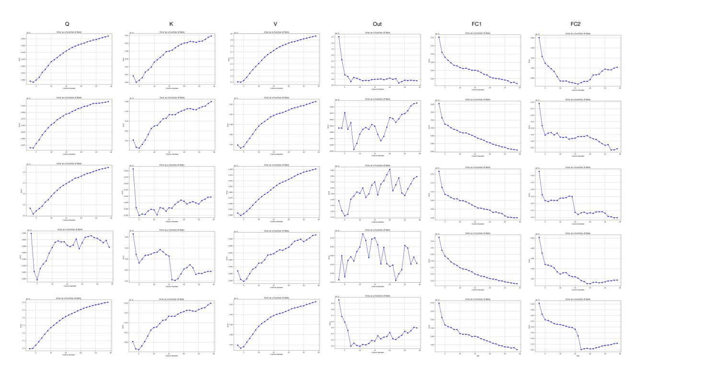
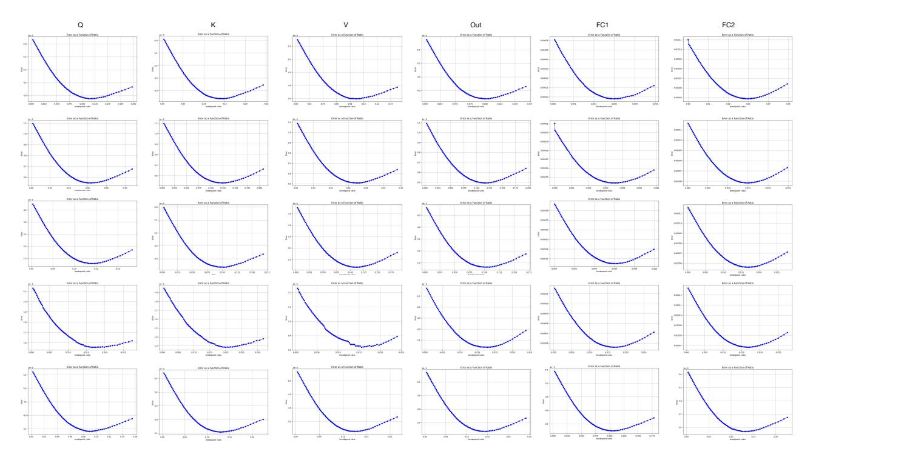
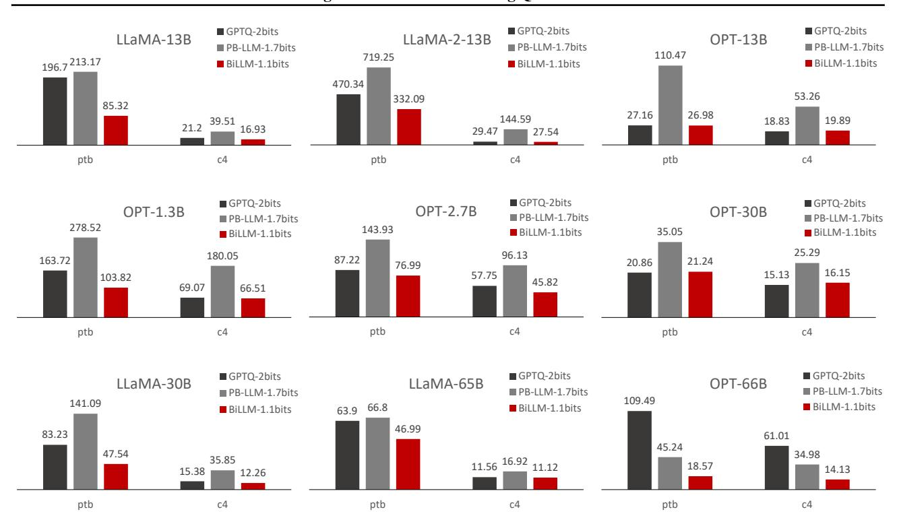
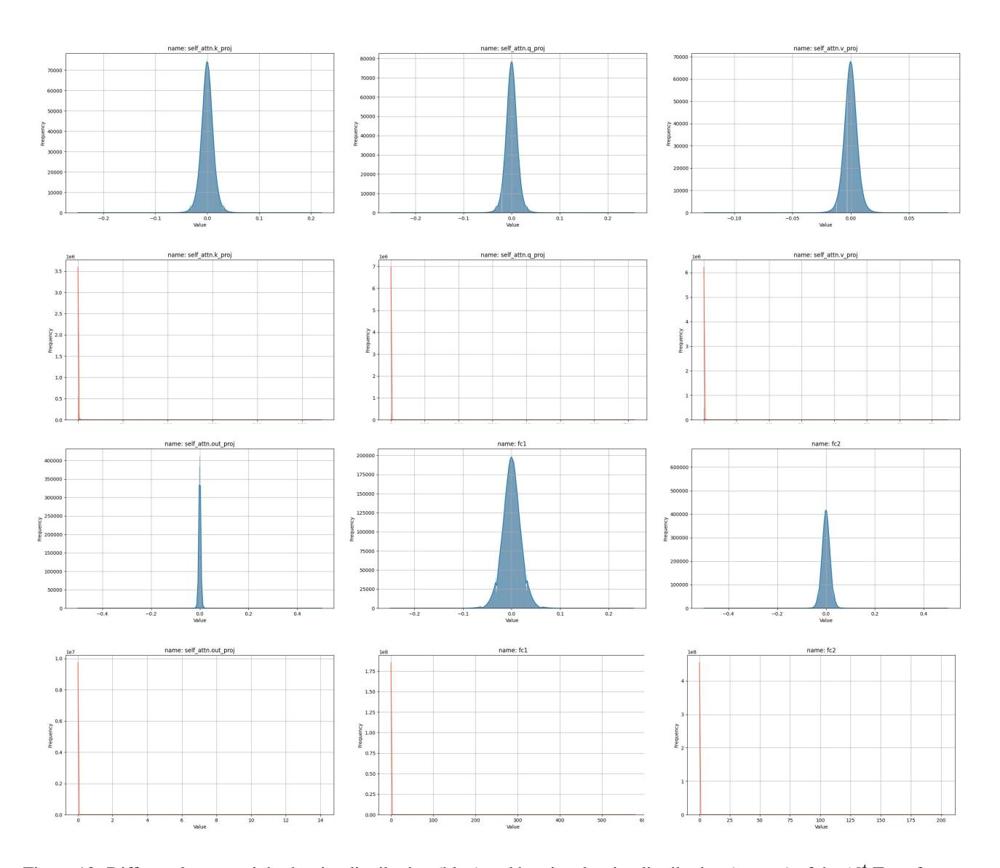
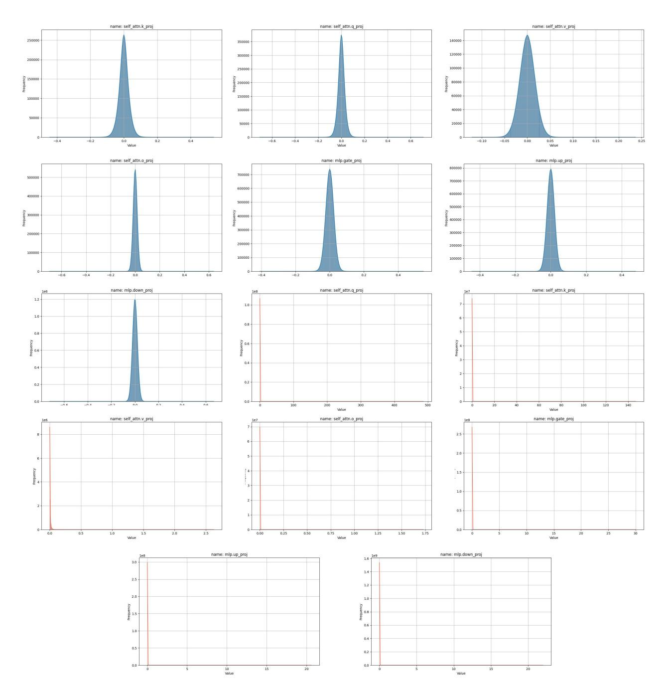
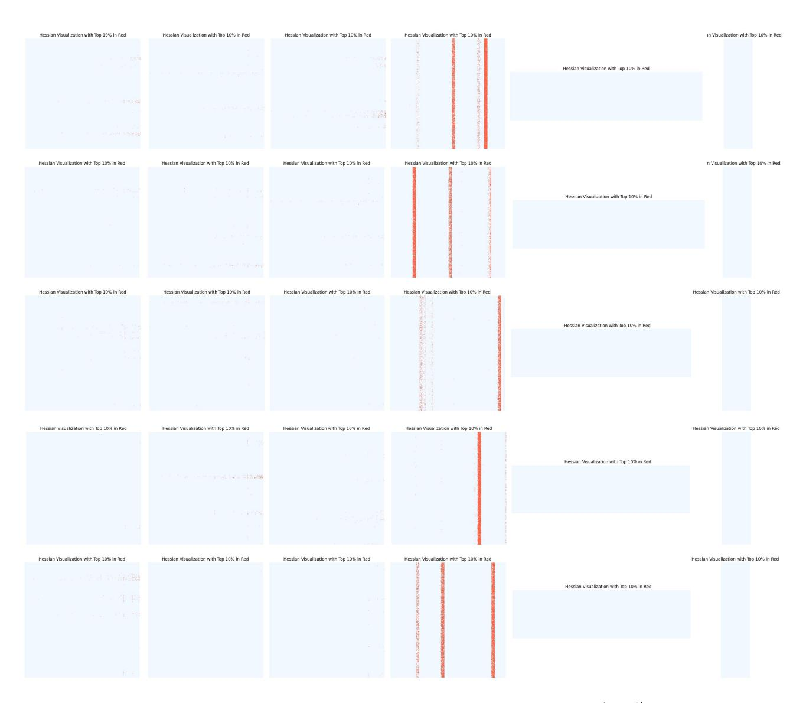

# <span id="page-12-0"></span>C. Searching Curve of Salient Column and Non-salient Distribution

<span id="page-12-1"></span>

Figure 9: Block-wise searching curve of salient columns in OPT-6.7B. The majority of the curves indicate that the minimal quantization error can be achieved at the block level by considering only a few columns as salient. The *Out Projection* layer has a larger number of salient columns, hence varying coverage for each block. The distribution in the *FC* layer is more dispersed. After optimal searching, the overall average weight bit is merely 1.1 bits.

We implemented a column-level segmentation and formulated a minimal-error column number search, as delineated in Equation [\(5\)](#page-3-4). The identification of the optimal count of salient column groups commences with the column exhibiting the highest salience. To mitigate the increase in bit-width resulting from residual approximation, we confined the search range to between 3 to 30 columns. Figure [9](#page-12-1) illustrates the search curve pertinent to the inaugural Transformer block within the OPT6.7B model. It includes six layers of operators (*Q*, *K*, *V*, *Out Projection*, *FC1*, and *FC2*), with each layer showing the search curves for the first five blocks. Figure [15](#page-19-0) elucidates the clustering of salient weights, suggesting that a majority of the layers and blocks are capable of attaining minimal quantization errors with a limited number of salient columns.

The block-wise changes in weight distribution brought about by OBC [\(Frantar & Alistarh,](#page-9-4) [2022\)](#page-9-4) introduce fluctuations in the search curve; however, the structured selection still manages to encompass the majority of salient weights. In the *Feedforward* layer, where salient weight distribution is more scattered, the search curve leans towards employing residual approximation across an increased number of columns. Nonetheless, Table [1,](#page-5-0) displaying the average weight bit numbers across various LLMs, confirms that this search strategy effectively maintains weight compression at approximately 1.1 bits.

Figure [10](#page-13-1) shows the unstructured search curve for the non-salient weights in the OPT6.7B model, with the same composition as that in Figure [9.](#page-12-1) The horizontal axis represents the ratio between p and the maximum weight value. Despite searching on a block-wise basis, the search curve still exhibits convex properties, indicating the presence of an optimal p∗. This phenomenon demonstrates that the non-salient weights exhibit characteristics closely resembling an ideal Gaussian or Laplacian distribution [\(You,](#page-10-18) [2010;](#page-10-18) [Fang et al.,](#page-9-18) [2020\)](#page-9-18).

<span id="page-13-1"></span>

Figure 10: Block-wise splitting curve of bell-shaped distribution in OPT6.7B. The overall presentation exhibits the characteristics of a convex function, fundamentally aligning with the theoretical optimal point in terms of theoretical basis.

## <span id="page-13-0"></span>D. Multi-evaluation Comparisons

### Perplexity results on PTB and C4.

We use tables in the main text to show the perplexity of the three methods GPTQ, PB-LLM, and BiLLM on the Wikitext2 dataset, and bar charts to show the perplexity results for LLaMA-7B, LLaMA2-7B, and OPT-6.7B on the PTB and C4 datasets. In the appendix, we show the quantitative comparison results for models of other sizes on the PTB and C4 datasets with more images.

In Figure [11,](#page-14-1) we find that although different models have different perplexity results, they still roughly follow the law that the larger the model, the lower the perplexity. BiLLM is generally still relatively better than the GPTQ and PB-LLM results in terms of perplexity with a lower bit-width configuration, while PB-LLM and GPTQ are higher or lower than each other, with slightly inferior results at very low bits.

## Zero-shot results

For completeness of testing, we have also tested and compared metrics such as the accuracy of GPTQ, PB-LLM, and BiLLM on datasets such as PIQA and BoolQ, all using Zero Shot's experimental setup. From Table [8,](#page-14-2) We find that despite the loss

#### BiLLM: Pushing the Limit of Post-Training Quantization for LLMs

<span id="page-14-1"></span>

Figure 11: GPTQ, PB-LLM, BiLLM performed on the PTB and C4 datasets, mainly on LLaMA-13B, LLaMA2-13B, OPT-13B, and so on. The results showed that BiLLM performed relatively well.

in quantification, a side-by-side comparison between the three methods still shows BiLLM to be superior overall, testing one level higher on some datasets, while the effect of some random perturbations, although present, does not pull down BiLLM's performance across the board. This suggests that BiLLM's quantization results have significantly improved performance at very low bits, and further validates the conclusions.

<span id="page-14-2"></span>Table 8: Accuracy on 7 data sets, from binarization LLaMA, LLaMA2, and OPT, and we also compare the results among GPTQ, PB-LLM, and BiLLM to validate the quantization effect.

| Model           | Method | Weight<br>Bits | Block<br>Size | PIQA ↑ | BoolQ ↑ | OBQA ↑ | Winogrande ↑ | ARC-e↑ | ARC-c↑ | Hellaswag ↑ |
|-----------------|--------|----------------|---------------|--------|---------|--------|--------------|--------|--------|-------------|
|                 | GPTQ   | 2.00           | 128           | 52.8   | 50.0    | 28.2   | 49.3         | 26.6   | 29.5   | 26.3        |
| LLaMA-7B        | PB-LLM | 1.70           | 128           | 54.6   | 59.7    | 30.4   | 50.6         | 28.2   | 24.6   | 28.7        |
|                 | BiLLM  | 1.09           | 128           | 61.2   | 62.7    | 31.8   | 51.1         | 36.0   | 25.7   | 36.8        |
|                 | GPTQ   | 2.00           | 128           | 51.1   | 43.9    | 29.0   | 50.8         | 26.6   | 28.5   | 26.3        |
| LLaMA2-7B       | PB-LLM | 1.70           | 128           | 53.8   | 62.3    | 30.2   | 49.3         | 28.0   | 25.0   | 27.7        |
|                 | BiLLM  | 1.08           | 128           | 60.6   | 61.8    | 33.2   | 52.4         | 36.2   | 24.4   | 34.8        |
|                 | GPTQ   | 2.00           | 128           | 56.6   | 51.1    | 25.6   | 51.2         | 31.3   | 22.9   | 30.4        |
| <b>OPT-6.7B</b> | PB-LLM | 1.70           | 128           | 57.6   | 55.5    | 24.2   | 47.7         | 33.2   | 21.0   | 31.0        |
|                 | BiLLM  | 1.11           | 128           | 58.6   | 62.2    | 29.0   | 51.5         | 34.1   | 23.9   | 31.9        |

### <span id="page-14-0"></span>E. Ablation of *BiLLM* with different block size

To explore the effect of different chunk sizes on the quantization effect of BiLLM, we set up block size settings including 32 columns and 64 columns up to 512 columns and performed quantization experiments on them. The results show that the overall perplexity is lower as the chunk granularity becomes finer and the number of bits used becomes relatively smaller.

We believe this is because the smaller the chunks, the finer the data representation, and the more scale is used, but increasing the diversity of quantization results also increases the weighting overhead. A block size of 128 can better balance the bit-width and quantization effect.

Table 9: Perplexity on Wikitext2, PTB, and C4 with different block size settings on *BiLLM*.

| Model     | Block Size | Wikitext2 | PTB     | C4     |
|-----------|------------|-----------|---------|--------|
|           | 512        | 74.14     | 1078.90 | 81.76  |
|           | 256        | 48.91     | 574.34  | 57.60  |
| LLaMA-7B  | 128        | 35.04     | 421.27  | 39.59  |
|           | 64         | 27.23     | 399.81  | 27.74  |
|           | 32         | 17.56     | 263.39  | 19.85  |
|           | 512        | 52.90     | 267.82  | 43.86  |
|           | 256        | 43.69     | 232.34  | 43.21  |
| LLaMA2-7B | 128        | 32.48     | 3877.38 | 40.52  |
|           | 64         | 20.12     | 830.36  | 24.46  |
|           | 32         | 13.58     | 440.40  | 17.34  |
|           | 512        | 151.81    | 257.22  | 101.96 |
|           | 256        | 84.42     | 116.44  | 77.25  |
| OPT-6.7B  | 128        | 35.36     | 73.63   | 43.16  |
|           | 64         | 33.36     | 48.16   | 31.94  |
|           | 32         | 20.48     | 31.02   | 21.47  |

## <span id="page-15-1"></span>F. Dialog Examples

In this section, we show some dialogue examples of binarized LLaMA-13B and Vicuna-13B.

## <span id="page-15-0"></span>G. Magnitude and Hessian Distribution of LLMs

Figure [2](#page-1-0) displays the distribution characteristics of weights and Hessian in LLMs. In this section, we provide additional examples to illustrate the bell-shaped distribution of weight values and the long-tailed distribution of Hessian weights. Figure [13](#page-17-0) depicts the distributions of four linear layers in the first Transformer block of the OPT-1.3B model, while Figure [14](#page-18-0) shows the distributions of seven linear layers in the sixth block of the LLaMA-7B model. The selection of these specific block positions is intended to demonstrate the universality of these distribution characteristics in LLMs.

Figure [15](#page-19-0) displays the distribution of sensitive weights across 5 Transformer blocks within the OPT-1.3B model. We present the Hessian distribution results for both the attention and feedforward blocks, with the red portion indicating the top 10% of the most significant weight distribution. We observed that the salient weights of Q, K, and V in the OPT family tend to concentrate in some columns or rows. Moreover, we noticed that salient weights in the *Out Projection* layer of multi-head self-attention blocks are distinctly concentrated in specific columns, supporting our structured selection approach discussed in the main text. In contrast, the distribution of salient weights in the feedforward layers is more dispersed. Based on these observations, we adopt a sensitivity-based structured search method to identify salient columns.

```
Prompt: Alaska is a state of ___
PB-LLM-1.7bit: mind & body aided with other person.
 BiLLM-1.1bit: the US, it is situated in North America.
       Prompt: Yangtze and Yellow River locate in ___
PB-LLM-1.7bit: the lower land.
 BiLLM-1.1bit: the country which is called as the country of the China.
               After climbing thirty flights of stairs, he was drenched in 
               sweat and didn't feel much like climbing. I advised him ___
       Prompt:
PB-LLM-1.7bit: he is really not very health.
               to get used now and the next day. After 2 days, he'd do a lot 
               better and his sweat had lower.
 BiLLM-1.1bit:
LLaMA-13B
       Prompt: What are the capitals of China, US and Russia?
               A's, U'sa and U's were. 2, U's with, A's, U's, U's: W, S'A 
               and U' with, U's, or US's, or U's: U's S – with
PB-LLM-1.7bit:
               The capital of China is Beijing, the capital of US is 
               Washington, DC, and the capital of Russia is Moscow.
 BiLLM-1.1bit:
               I have a friend who lives in New York and I would like to 
               visit him. How would I go there from Paris?
       Prompt:
PB-LLM-1.7bit: I would like it to go to Paris.
               You can fly from Paris to New York, and there are many 
               airlines that can take you there. You can also take a flight 
               to the New York, but you will have to check the schedule, as 
               it will depend.
 BiLLM-1.1bit:
       Prompt: What should I do after failed in a math exam?
PB-LLM-1.7bit: I failed to fail.
               Retake math exams if you don't pass this year. Take more 
               time to study and work on your weak areas. Or you
               need more support for the final, You can also seek outside 
               help in the same subject.
 BiLLM-1.1bit:
Vicuna-13B
```

Figure 12: Some examples of conversations. LLaMA-13B and Vicuna-13B are chosen to show the case of language supplementary and Q&A ability. And PB-LLM (int 8, 10%) is selected as the comparison. We color the text to show the reasonable or inappropriate responses.

<span id="page-17-0"></span>

Figure 13: Different layers weight density distribution (blue) and hessian density distribution (orange) of the 1 st Transformer block of the OPT-1.3B model

<span id="page-18-0"></span>

Figure 14: Different layers weight density distribution (blue) and hessian density distribution (orange) of the 6 th Transformer block of the LLaMA-7B model

<span id="page-19-0"></span>

Figure 15: Distribution of top 10% salient elements in Hessian matrix. The distribution of 1 st − 5 th Transformer blocks in OPT-1.3B