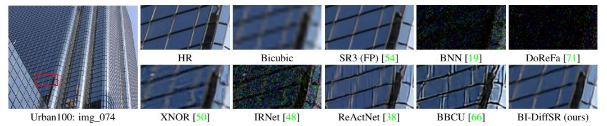

# 1 Introduction

Image super-resolution (SR) is a fundamental task in low-level vision and image processing. It aims to reconstruct high-resolution (HR) images from low-resolution (LR) counterparts. Currently, the mainstream methods for this task are deep neural networks, which employ learning-based techniques to map LR images to HR images [10, 70, 31, 54, 6, 68]. Among these methods, generative models [62, 9, 44] have garnered widespread attention for their ability to restore more realism results.

Especially, the diffusion model (DM) [16, 58, 52], a newly proposed generative model, exhibits impressive performance. With its superior generation quality and more stable training, diffusion model is widely used in various image tasks, including image SR [54, 63]. Specifically, the diffusion model transforms a standard Gaussian distribution into a high-quality image through a stochastic iterative denoising process. In image SR, it further constrains the generation scope by conditioning on the LR image to produce the targeted HR image.

However, to produce high-quality results, diffusion models require thousands of iterative steps, leading to slow inference processes and high computational costs. Some methods [58, 40, 37] implement faster sampling strategies via learning sample trajectories, effectively reducing the number of iterations to tens. Yet, a single inference step still demands substantial memory usage and floating-point computations, especially for SR tasks involving high-resolution images. Meanwhile, most edge devices (*e.g.*, mobile and IoT devices), have limited storage and computational resources. This hampers the deployment of diffusion models on these platforms and limits their application. Therefore, it is essential to compress diffusion models to accelerate inference speed and reduce computational costs while maintaining model performance.

\*Corresponding authors: Haotong Qin, qinhaotong@gmail.com; Yulun Zhang, yulun100@gmail.com

Figure 1: Visual comparison (×4) of binarization methods. Some methods (*e.g.*, BNN [\[19\]](#page-9-4)) cannot work on diffusion models. Several methods (*e.g.*, BBCU [\[66\]](#page-12-4)) suffer from blurring and artifacts. In contrast, our proposed BI-DiffSR outperforms other methods with accurate results.

Common compression approaches include pruning [\[11\]](#page-9-5), distillation [\[61\]](#page-11-7), and quantization [\[45,](#page-11-8) [66,](#page-12-4) [26\]](#page-10-4). Among these, 1-bit quantization (*i.e.*, binarization) stands out for its effectiveness. As the most aggressive form of bit-width reduction, binarization significantly reduces memory and computational costs by quantizing the weights and activations of full-precision (32-bit) models to 1-bit.

Nonetheless, existing binarization research primarily deals with higher-level tasks (*e.g.*, classification) and end-to-end models [\[49,](#page-11-9) [19,](#page-9-4) [39\]](#page-10-5). Applying existing binarization methods directly to current diffusion model architectures results in a significant performance drop. This is primarily due to two aspects: (1) Model Structure. Diffusion models typically apply the UNet architecture [\[53\]](#page-11-10) for noise estimation, which is not easy to binarize directly. *I. Dimension Mismatch:* The identity shortcut is crucial for the binarized SR model, since it facilitates the transfer of full-precision (FP) information, compensating for the binarized model [\[66\]](#page-12-4). However, in UNet, the feature dimensions change since downsampling/upsampling. The dimension mismatch prevents the usage of shortcuts, cutting off the full-precision propagation. *II. Fusion Difficulty:* The UNet structure uses skip connections to transfer information from encoder to decoder. However, the typical fusion method, concatenation, leads to the dimension mismatch. Alternatively, other methods (*e.g.*, addition) also struggle to achieve effective fusion due to significant differences in value ranges between encoder and decoder features. (2) Activation Distribution. Due to the multi-step iterative nature of diffusion models, the activation distribution dramatically changes with timesteps. Furthermore, the activation binarization will even amplify activation differences [\[50\]](#page-11-5). The difference increases the learning challenges for binarized modules (*e.g.*, binarized convolution), thereby hindering the effective representation of features. Consequently, the SR performance of the binarized diffusion model is limited.

Based on the above analysis, we propose a novel binarized diffusion model, BI-DiffSR, to achieve effective image SR. Our design comprises two main aspects: structure and activation. (1) Structure. We develop a simple yet effective convolutional UNet architecture, which is suitable for binarization. *I. Dimension Consistency:* We propose consistent-pixel-downsample (CP-Down) and consistentpixel-upsample (CP-Up) to ensure dimensional consistency in binarized computation. CP-Down and CP-Up maintain the full-precision information transfer during feature scaling. *II. Feature Fusion:* We develop the channel-shuffle-fusion (CS-Fusion) to facilitate the fusion of different features within skip connections and suit binarized modules. Through channel shuffle, we combine two input features into two shuffled features to balance their activation value ranges. (2) Activation. Considering the activation differences at different timesteps, we design the timestep-aware redistribution (TaR) and timestep-aware activation function (TaA). The TaR and TaA adjust the binarized module input and output activations according to different timesteps. This timestep-aware adjustment improves the flexibility and representational ability of the binarized module to various activation distributions.

Extensive experiments demonstrate that our proposed BI-DiffSR significantly outperforms existing binarization methods. As shown in Fig. [1,](#page-1-0) our BI-DiffSR restores more perceptually pleasing results than other methods. Overall, our contributions are as follows:

- We design the novel binarized model, BI-DiffSR, for image SR. To the best of our knowledge, this is the first binarized diffusion model applied to SR.
- We develop a UNet architecture optimized for binarization, with consistent-pixeldownsample (CP-Down) and upsample (CP-Up), and channel-shuffle-fusion (CS-Fusion).
- We introduce the timestep-aware redistribution (TaR) and activation function (TaA) to adapt activation distributions by timestep, enhancing the capabilities of the binarized module.
- Our BI-DiffSR surpasses current state-of-the-art binarization methods, and offers comparable perceptual performance to full-precision diffusion models.

