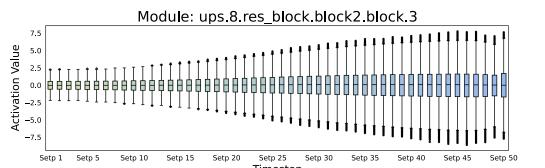
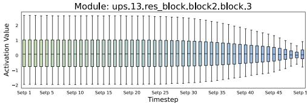
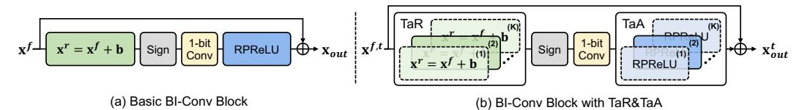

# 3.1 Model Structure

Overall. We employ a convolutional UNet [\[53\]](#page-11-10) as the noise estimation network. Details of the diffusion model for SR are provided in the supplementary materials. As the common choice within DMs, using UNet as the backbone for binarization offers generalizability. Moreover, for binarized models, the design should be compact and well-defined. Compared to the non-local self-attention operations, convolution is simpler and easier to implement. Our architecture is shown in Fig. [2a](#page-3-0), featuring an encoder-bottleneck-decoder (E-B-D) design.

Figure 2: The overall structure of the noise estimation network. (a) UNet: The model consists of ResBlock, CP-Down, CP-Up, and CS-Fusion. It predicts noise  $\epsilon_t$  with the upscaled LR image y, noise image  $\mathbf{x}_t$ , and timestep t. (b) ResBlock: Residual block, utilizes the binarized convolution (BI-Conv) block. The input and output dimensions of the block remain consistent, making it suitable for binarization. (c) TE: Time encoding, encoders timestep t to produce the timestep embedding  $\mathbf{t}_{em}$ .

Given the noise image  $\mathbf{x}_t \in \mathbb{R}^{H \times W \times 3}$  at t-th timestep, and the LR image  $\mathbf{y} \in \mathbb{R}^{H \times W \times 3}$  (bicubic to HR resolution), two images are concatenated along the channel dimension as the UNet input, where  $H \times W$  is the resolution. For timestep t, the sinusoidal position encoding [60] is applied to obtain the timestep embedding  $\mathbf{t}_{em} \in \mathbb{R}^C$ . The input images first pass through a convolutional layer to produce the shallow feature  $\mathbf{F}_s \in \mathbb{R}^{H \times W \times C}$ , where C is the channel number. Then, the shallow feature  $\mathbf{F}_s$  are further refined by the  $\mathcal{E}\text{-}\mathcal{B}\text{-}\mathcal{D}$  into the deepe feature  $\mathbf{F}_d \in \mathbb{R}^{H \times W \times C}$ . Each level of the  $\mathcal{E}\text{-}\mathcal{B}\text{-}\mathcal{D}$  is composed of multiple ( $N_e$  in  $\mathcal{E}$  and  $N_d$  in  $\mathcal{D}$ ) residual blocks (ResBlocks), with details illustrated in Fig. 2b. Within the ResBlocks, the timestep embedding  $\mathbf{t}_{em}$  is incorporated to provide temporal information. In the encoder  $\mathcal{E}$ , downsample module (i.e., CP-Down) progressively reduces feature resolution and increases channel number. Conversely, in the decoder  $\mathcal{D}$ , upsample module (i.e., CP-Up) gradually restores the high-resolution representation. Moreover, to compensate for information loss during downsampling, the skip connection is used to link features between the encoder and decoder. Finally, through one convolution, the predicted noise  $\epsilon_t \in \mathbb{R}^{H \times W \times 3}$  is obtained.

**Structure Analysis.** Although the UNet architecture is suitable for diffusion models, its unique structure poses challenges for direct binarization, which results in a substantial accuracy decrease compared to full-precision models. We identify two main issues/challenges that contribute to the problem: *dimension mismatch* and *fusion difficulty*.

**Challenge I: Dimension Mismatch.** In the binarized model, 1-bit quantization leads to significant information loss, limiting the capability for feature representation and the ultimate SR performance. Compared to binary activations, full-precision activations contain more information. Therefore, we can apply the identity shortcut to preserve the full-precision information. This operation effectively compensates for the information loss caused by binarization. However, in UNet, the frequent changes in feature resolution and channel size lead to dimension mismatches. This prevents the effective use of the identity shortcut and cuts off the propagation of full-precision information.

**Challenge II: Fusion Difficulty.** Another crucial structure of UNet is the skip connection, which links encoder and decoder features. The typical approach is to concatenate these features along the channel dimension and pass them to subsequent layers. However, concatenate causes dimension mismatch. As analyzed in **Challenge I**, it is unsuitable for binarization. Furthermore, we find that there is a significant difference in the activation ranges between the two inputs (from encoder and decoder) of the skip connection (Fig. 3d). This imbalance makes other fusion methods, *e.g.*, addition, also unsuitable, since the smaller range activation is masked by the larger one, as illustrated in Fig. 3d.

To better adapt binarization for the UNet architecture, we propose two structures: *Consistent-Downsample/Upsample* and *Channel-Shuffle Fusion*, as illustrated in Fig. 3.

**Consistent-Pixel-Downsample/Upsample.** To address the dimension mismatch in the UNet structure, we first confine all feature reshaping operations to the Upsample and Downsample modules. That is to ensure that the dimension of the main module, *i.e.*, ResBlock, remains matched. Meanwhile, we propose the consistent-pixel-downsample (CP-Down) and consistent-pixel-upsample (CP-Up).

Figure 3: (a) CP-Down: Consistent-pixel-downsample. (b) CP-Up: Consistent-pixel-upsample. (c) CS-Fusion: Channel-shuffle fusion. (d) In the skip connection, the value ranges of two features  $(x_1,$  $x_2$ ) may be significant differences, which impedes effective fusion. (e) The illustration of channel shuffle. the shuffled features  $(\mathbf{x}_1^{sh}, \mathbf{x}_2^{sh})$  have closely matched value ranges.

(1) **CP-Down:** We evenly split the input features  $\mathbf{x}_{in}^{do} \in \mathbb{R}^{H \times W \times C}$  along the channel dimension and process them through two convolutions with identical input and output dimensions. The stable (matching) dimension allows the usage of identity shortcuts. Finally, by applying Pixel-UnShuffle [57], we reduce the resolution of the features while increasing the channel number. The formula is:

$$\mathbf{x}_{in}^{do} = [\mathbf{x}_s^1, \mathbf{x}_s^2], \quad \mathbf{x}_s^i \in \mathbb{R}^{H \times W \times \frac{C}{2}}, \quad \mathbf{x}_{out}^{do} = \mathcal{PS}^{-1} \left( \mathcal{C}_1(\mathbf{x}_s^1) + \mathcal{C}_2(\mathbf{x}_s^2) \right), \tag{1}$$

where  $\mathbf{x}_{out}^{do} \in \mathbb{R}^{\frac{H}{2} \times \frac{W}{2} \times 2C}$  is the output of CP-Down;  $\mathcal{C}_1(\cdot)$  and  $\mathcal{C}_2(\cdot)$  represent two (binarized) convolutions;  $\mathcal{PS}^{-1}$  denotes the Pixel-UnShuffle operation.

(2) CP-Up: Similarly, feature upsampling is achieved through two convolutions combined with Pixel-Shuffle. The operation can be mathematically expressed as follows:

$$\mathbf{x}_{out}^{up} = \mathcal{PS}\left(\operatorname{Concat}\left(\mathcal{C}_{1}\left(\mathbf{x}_{in}^{up}\right), \mathcal{C}_{2}\left(\mathbf{x}_{in}^{up}\right)\right)\right),\tag{2}$$

 $\mathbf{x}_{out}^{up} = \mathcal{PS}\left(\operatorname{Concat}\left(\mathcal{C}_{1}\left(\mathbf{x}_{in}^{up}\right), \mathcal{C}_{2}\left(\mathbf{x}_{in}^{up}\right)\right)\right), \tag{2}$  where,  $\mathbf{x}_{in}^{up} \in \mathbb{R}^{H \times W \times C}$  and  $\mathbf{x}_{out}^{up} \in \mathbb{R}^{2H \times 2W \times \frac{C}{2}}$  denotes the input and output of CP-Up; Concat  $(\cdot)$  represents the channel concatenation operation;  $\mathcal{PS}$  is the Pixel-Shuffle operation.

With the above design, we ensure the flow of full-precision information throughout the UNet, effectively improving feature representation and enhancing SR performance.

Channel-Shuffle Fusion. To effectively fuse the features in the skip connection while meeting the requirements for dimension matching in binarization, we propose the channel-shuffle fusion (CS-Fusion), as shown in Fig. 3c. Given two features  $\mathbf{x}_1$ ,  $\mathbf{x}_2 \in \mathbb{R}^{H \times W \times C}$ , we first employ the channel-shuffle operation to mitigate the differences in their value ranges, as illustrated in Fig. 3e. Specifically, we split the two features according to the odd and even channel indexes. Then, we pair and concatenate features along the channel dimension, based on odd and even indexes, to produce two new shuffle features  $\mathbf{x}_1^{sh}, \mathbf{x}_2^{sh} \in \mathbb{R}^{H \times W \times C}$ . This process can be formulated as follows:

$$\mathbf{x}_{n} = [\mathbf{x}_{n}^{1}, \mathbf{x}_{n}^{2}, \dots, \mathbf{x}_{n}^{C-1}, \mathbf{x}_{n}^{C}], \quad n \in \{1, 2\},$$

$$\mathbf{x}_{m}^{sh} = \operatorname{Concat}\left(\left\{\mathbf{x}_{j}^{2i+(m-1)} \mid i = 1, \dots, C/2, j = 1, 2\right\}\right), \quad m \in \{1, 2\},$$
(3)

Through visualization in Fig. 3e, we can observe that the value range of features after channel shuffle becomes balanced. Subsequently, we process the shuffled features through two convolutions and addition to produce the final fused feature  $\mathbf{x}_{out}^{sh} \in \mathbb{R}^{H \times W \times C}$ , in a manner similar to Eq. (1), as:

$$\mathbf{x}_{out}^{sh} = C_1^{sh}(\mathbf{x}_1^{sh}) + C_2^{sh}(\mathbf{x}_2^{sh}), \tag{4}$$

where  $C_1^{sh}(\cdot)$  and  $C_2^{sh}(\cdot)$  are two (binarized) convolutions. This process realizes the fusion of two features, ensuring that dimensions are matched within the fusion process and in subsequent modules (e.g., ResBlock). Meanwhile, the matched dimension allows the usage of the identity shortcut, thus effectively transferring full-precision information. Overall, our proposed CS-Fusion achieves effective feature integration in the skip connection. Therefore, the binarized model can better represent features and improve SR performance. Furthermore, our CS-Fusion does not introduce additional memory or computational overhead since the channel shuffle only involves feature transformation operations. Experiments in Sec. 4.2 further reveal the impacts of CS-Fusion.

Figure 4: Visualization of the changes in activation distribution across 50 timesteps.

Figure 5: (a) The basic binarized convolutional (BI-Conv) block. The learnable bias b and the activation function RPReLU adjust the activations. (b) In timestep-aware redistribution (TaR) and activation function (TaA), multiple pairs of b and RPReLU are applied to adapt to the multi-step in DM. At each step t, only one pair of b and RPReLU is used (the darker modules with solid lines).

#### 3.2 Activation Distribution

**Basic Binarized Convolutional Block.** We first introduce the basic binarized module, as illustrated in Fig. 5a. For the full-precision activation  $\mathbf{x}^f \in \mathbb{R}^{H \times W \times C}$ , we initially shift its distribution and binarize the shifted activation to 1-bit activations with sign function  $Sign(\cdot)$ . The process is:

$$\mathbf{x}^r = \mathbf{x}^f + \mathbf{b}, \quad x^b = \operatorname{Sign}(x^r) = \begin{cases} +1, & x^r \ge 0 \\ -1, & x^r < 0 \end{cases} (\forall x^r \in \mathbf{x}^r, \ \forall x^b \in \mathbf{x}^b), \tag{5}$$

where  $\mathbf{b} \in \mathbb{R}^C$  is a learnable parameter;  $\mathbf{x}^b \in \mathbb{R}^{H \times W \times C}$  is the 1-bit activation. Meanwhile, for the binarized convolution, the full-precision weight  $\mathbf{w}^f \in \mathbb{R}^{C_{out} \times C_{in} \times K_h \times K_w}$  is also binarized to 1-bit weight  $\mathbf{w}^b \in \mathbb{R}^{C_{out} \times C_{in} \times K_h \times K_w}$ . To compensate for the differences between binary and full-precision weights, we scale  $\mathbf{w}^b$  using the mean absolute value of  $\mathbf{w}^f$  [50]. The total operation is:

$$w^b = \frac{\|\mathbf{w}^f\|_1}{n} \cdot \operatorname{Sign}(w^f), \quad \forall w^f \in \mathbf{w}^f, \ \forall w^b \in \mathbf{w}^b,$$
 (6)

where n is the number of  $\mathbf{w}^f$  values. Subsequently, the floating-point matrix multiplication in full-precision convolution can be replaced by logical XNOR and bit-counting operations as:

$$\mathbf{x}_{out}^{b} = \mathbf{x}^{b} * \mathbf{w}^{b} = \text{bit-count}\left(\text{XNOR}\left(\mathbf{x}^{b}, \mathbf{w}^{b}\right)\right)$$
 (7)

 $\mathbf{x}_{out}^b = \mathbf{x}^b * \mathbf{w}^b = \text{bit-count} \left( \text{XNOR} \left( \mathbf{x}^b, \mathbf{w}^b \right) \right) \tag{7}$  where \* means the convolutional operation;  $\mathbf{x}_{out}^b \in \mathbb{R}^{H \times W \times C}$  is the output of 1-bit convolution. Then, we adjust  $\mathbf{x}_{out}^b$  with the activation function RPReLU [38], resulting in  $\mathbf{x}_{act}^b \in \mathbb{R}^{H \times W \times C}$ .

Finally, we combine  $\mathbf{x}_{act}^b$  with full-precision activation  $\mathbf{x}^f$  via an identity shortcut to get the final output  $\mathbf{x}_{out} \in \mathbb{R}^{H \times W \times C}$ . Moreover, since the sign function  $\mathrm{Sign}(\cdot)$  is non-differentiable, we use the straight-through estimator (STE) [1] for backpropagation to train binarized models.

Distribution Analysis. In diffusion models, the multi-step iterative design leads to changes in the activation distribution as the timestep changes. By visualizing the activation distributions at different timesteps in Fig. 4, we can observe that activation distributions of adjacent timesteps are similar, whereas those separated by larger intervals show significant differences.

For full-precision models, the impact of these variations may be small due to the real-valued weight and activation. In contrast, for binarized modules, the activation distribution has a substantial impact on feature representation, and consequently, affects the SR performance. This is because 1-bit modules, due to the binary weights, struggle to effectively learn representations from different distributions, thereby limiting their modeling capabilities. Meanwhile, during the activation binarization, the sign function further amplifies activation differences, particularly for values around zero [38].

The basic binarized module utilizes the learnable biase and the activation function RPReLU to adjust the input and output activations. This approach mitigates the representational challenges posed by activation distribution differences across timestep to some extent. However, these static designs are insufficient to cope with the extreme activation changes across multiple timesteps in diffusion models. Consequently, the SR performance of the binarized diffusion model is limited. Experiments in Sec. 4.2, further demonstrate the above analyses.

**Timestep-aware Redistribution/Activation Function.** To cope with the variability of activation distribution with timestep, we propose the timestep-aware redistribution (TaR) and timestep-aware activation function (TaA). The module details are illustrated in Fig. 5b. The design of TaR and TaA is inspired by the mixture of experts (MoE) [56], applying a set of learnable biases and RPReLU activation functions to accommodate different timesteps.

Specifically, we apply K pairs of bias and RPReLU for TaR  $(\mathbf{b}^{(i)} \in \mathbb{R}^C)$  and TaA  $(\text{RPReLU}^{(i)})$ , where  $i \in \{1, 2, \dots, K\}$ . Given the total timesteps  $(e.g., \{1, 2, \dots, T\})$ , we evenly divide them into K groups in sequence. For the input activation  $\mathbf{x}^{f,t} \in \mathbb{R}^{H \times W \times C}$  at t-th timstep  $(t \in \{1, 2, \dots, T\})$ , we select the corresponding pair of bias and RPReLU based on the group associated with t, to adjust its input and output activation. The process can be formulated as:

$$\mathbf{x}^{r,t} = \operatorname{TaR}(\mathbf{x}_{in}^{t}) = \mathbf{x}_{in}^{t} + \sum_{i=1}^{K} \mathbf{1}_{i=\lfloor K \times t/T \rfloor} \cdot \mathbf{b}^{(i)},$$

$$\mathbf{x}_{act}^{b,t} = \operatorname{TaA}(\mathbf{x}_{out}^{b,t}) = \sum_{i=1}^{K} \mathbf{1}_{i=\lfloor K \times t/T \rfloor} \operatorname{RPReLU}^{(i)}(\mathbf{x}_{out}^{b,t}),$$
(8)

where  $\mathbf{1}_{(\cdot)}$  is the indicator function;  $\mathbf{x}^{r,t}$ ,  $\mathbf{x}^{b,t}_{out}$ ,  $\mathbf{x}^{b,t}_{act} \in \mathbb{R}^{H \times W \times C}$ , represent, at t-th timestep, the shifted input activation, the output of the 1-bit convolution, the output of the RPReLU activation function, respectively. Since the activations at adjacent timesteps exhibit a certain degree of similarity (as shown in Fig. 4), we employ the fixed grouping sampling strategy (defined in Eq. (8)).

Essentially, the TaR and TaA segment the multi-step process into smaller groups, limiting the range of activation changes. This reduces the difficulty of adjusting activations, allowing the binarized module to better adapt to changing activations. Therefore, the proposed TaR and TaA can effectively enhance the representation ability of the binarized module and ultimately improve SR performance. Meanwhile, compared to the basic module, there are no additional computational costs in our TaR and TaA. This is because, for each timestep, only one pair of bias and RPReLU are selected for use.

