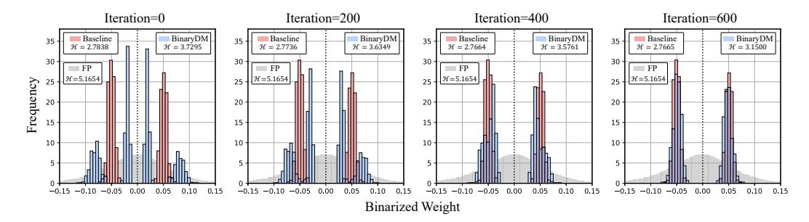

# 1 INTRODUCTION

Diffusion models (DMs) [\(Ho et al., 2020;](#page-10-0) [Song & Ermon, 2019\)](#page-12-0) have shown excellent capabilities in generation tasks in various fields, such as image [\(Ho et al., 2020;](#page-10-0) [Song & Ermon, 2019;](#page-12-0) [Song et al.,](#page-12-1) [2020b\)](#page-12-1), vision [\(Mei & Patel, 2023;](#page-11-0) [Ho et al., 2022\)](#page-10-1), and speech [\(Mittal et al., 2021;](#page-11-1) [Popov et al.,](#page-12-2) [2021;](#page-12-2) [Jeong et al., 2021\)](#page-11-2). DMs have become one of the most popular generative model paradigms with significant quality and diversity advantages. DMs generate data through the iterative noise estimates, while up to 1000 iterative steps slow the inference process and rely on expensive hardware resources. Although some proposed methods can effectively reduce the number of iterations to dozens of times [\(Song et al., 2020a;](#page-12-3) [San-Roman et al., 2021;](#page-12-4) [Nichol & Dhariwal, 2021;](#page-11-3) [Bao et al., 2022\)](#page-10-2), the complex neural network of DMs also results in a large number of floating point calculations and memory usage in each step, which hinders the efficient deployment and inference on edge. Therefore, the compression of DMs has been widely studied as a practical technology to accelerate the iterative process and reduce the inference cost, including quantization [\(Li et al., 2023b;](#page-11-4) [Shang et al., 2023\)](#page-12-5), distillation [\(Salimans & Ho, 2022;](#page-12-6) [Luo, 2023;](#page-11-5) [Meng et al., 2023\)](#page-11-6), pruning [\(Fang et al., 2023\)](#page-10-3), *etc*.

Low-bit quantization emerges as a practical approach to compress deep learning models by reducing the bit-width of parameters [\(Yang et al., 2019;](#page-13-0) [Gholami et al., 2022;](#page-10-4) [Qin et al., 2024\)](#page-12-7), and also has

4Zhongguancun Laboratory 5Xi'an Jiaotong University

Figure 1: Overview of BinaryDM, consisting of Evolvable-Basis Binarizer to enhance information representation and Low-rank Representation Mimicking to improve optimization direction.

satisfactory generality to various network architectures. Thus, with quantization, DMs can enjoy the compression and acceleration brought by fixed-point parameters and computation in inference (Li et al., 2023b;a; Shang et al., 2023). The 1-bit quantization, namely binarization, allows the binarized model to enjoy compact 1-bit parameters and efficient computation (Liu et al., 2020; Xu et al., 2021b;a). With the most aggressive bit-width, 1-bit weights can lead to up to 32× size reduction and replace expensive floating-point multiplications with addition constructions during inference, thus saving resources significantly (Rastegari et al., 2016; Frantar et al., 2023).

However, binarized DMs suffer significant performance degradation compared to their full-precision counterparts. The performance decline primarily arises from two aspects: **First**, weight binarization severely restricts the feature extraction capability of diffusion models, causing significant damage to information in critical representations of generative models. Though several weight binarization methods strive to mitigate binarization errors and enrich representations by floating-point scaling factors (Rastegari et al., 2016; Liu et al., 2020; Qin et al., 2023b; Zhang et al., 2024), the number of candidate values for each weight still drops from 232 to 21. The limited information-represent capacity of binarized filters leads to severe loss when compressing from full-precision initialization to 1-bit binarization. This fact causes catastrophic consequences for DMs that highly require representation capacity. **Second**, introducing discrete binarization functions in DMs poses a significant hurdle to stable convergence. Existing quantization-aware training methods for DMs usually employ direct output-based supervision (Li et al., 2023b; He et al., 2023). Binarization introduces significant errors in forward parameters and backward gradients, leading to disruptions in the optimization direction (Courbariaux et al., 2016). Learning the fine-grained details embedded in the synthetic features can contribute to the overall optimization process of binarized DMs. Unfortunately, the disruptive influence of extreme discretization becomes pronounced in this context, rendering the convergence vulnerable to disturbances and, in some cases, seemingly unattainable.

In this paper, we propose **BinaryDM** to push the weights of diffusion models toward binarization. The proposed method pushes the weights of diffusion models toward accurate and efficient binarization, considering the representation and computation properties. BinaryDM applies quantization-aware training to binarized DMs accurately for efficient inference, which takes the representation and computation properties of diffusion models into account and is composed of two novel techniques: From the representation perspective, we present an Evolvable-Basis Binarizer (EBB) to recover the representations generated by the binarized DM. EBB first applies dual sets of binary bases with learnable scalars to significantly enhance the feature extraction capability of the initial binarized weights, then evolves the high-order bases to the single-basis form guided by regularization loss. It is selectively applied only to key parameter locations of the DM architecture to reduce unnecessary evolution processes, easing the training burden and making the evolution smoother. From the optimization perspective, a Low-rank Representation Mimicking (LRM) is incorporated to enhance the binarization-aware optimization of diffusion models. LRM projects binarized and full-precision representations to low-rank, enabling the optimization of binarized DM to focus on the principal direction and mitigate direction ambiguity caused by the representation complexity of generation.

Comprehensive experiments show that our proposed BinaryDM has significant accuracy and efficiency gains compared to DMs binarized by existing SOTA binarization and low-bit quantization methods.

Our BinaryDM can consistently outperform the baseline on DDIM and LDM with binary weight, especially with ultra-low bit-width activation. For example, on CIFAR-10 32×32 DDIM, the precision metric of BinaryDM even exceeds the baseline by 9.46% (baseline 5.92 vs. BinaryDM 6.48) with 1-bit weight and 4-bit activation (W1A4), saving the binarized DM from collapse. BinaryDM even outperforms the higher bit-width SOTA quantization methods of DM. For LDM-8 on LSUN-Churches 256×256, W1A4 BinaryDM exceeds W4A4 EfficientDM in the FID metric by 4.43. As the first binarization method for DMs, BinaryDM yields impressive 15.2× and 29.2× savings on OPs and model size, demonstrating the vast advantages and potential for deploying the DM on edge.

#### 2 Related Work

**Diffusion models** (DMs) demonstrate outstanding performance across a diverse range of tasks (Ho et al., 2020; Song & Ermon, 2019; Song et al., 2020b; Niu et al., 2020; Mittal et al., 2021; Popov et al., 2021; Jeong et al., 2021; Peebles & Xie, 2023). However, their slow generation process presents a significant challenge to widespread implementation. Substantial research has focused on reducing the number of time steps to expedite the generation process (Watson et al., 2021; Chen et al., 2020; Song & Ermon, 2019; Song et al., 2020b; Feng et al., 2024b). Despite the reduction in time steps, the noise estimation network of DMs still demand expensive computation and memory for each step.

Quantization and binarization are explored widely as popular compression techniques (Nagel et al., 2020; Lin et al., 2021). These methods involve quantizing the full-precision parameters to lower bitwidth (e.g., 1-8 bit). By converting floating-point weights and activations into quantized values, the model size can be significantly reduced. This size reduction decreases computational complexity and substantially improves inference speed, memory usage, and energy consumption savings (Shang et al., 2023; Li et al., 2023a). One notable technique, quantization-aware training (Gholami et al., 2022; Qin et al., 2020; Yang et al., 2019), involves compressing DMs within a training/fine-tuning pipeline to update parameters (Li et al., 2023b; He et al., 2023). Despite these advancements, achieving 1-bit quantization for the weights of DMs remains a formidable challenge. This underscores the need for further research to unlock the potential benefits of 1-bit binarization in DMs. Appendix A presents more details about related works.

#### 3 BINARYDM

#### 3.1 Preliminaries

In the forward process of diffusion models, Gaussian noise is added to data  $x_0 \sim q(x)$  in T times via a schedule  $\beta_t$  controlling noise strength, the process can be expressed as

$$q\left(\boldsymbol{x}_{t} \mid \boldsymbol{x}_{t-1}\right) = \mathcal{N}\left(\boldsymbol{x}_{t}; \sqrt{1 - \beta_{t}} \boldsymbol{x}_{t-1}, \beta_{t} \boldsymbol{I}\right), \tag{1}$$

where  $x_t \in \{x_1, \dots, x_T\}$  denote the noisy samples at t-th step. The reverse process aims to generate samples by removing noise, approximating the unavailable conditional distribution  $q(x_{t-1} \mid x_t)$  with learned distributions  $p_{\theta}(x_{t-1} \mid x_t)$ , which can be expressed as

$$p_{\theta}\left(\boldsymbol{x}_{t-1} \mid \boldsymbol{x}_{t}\right) = \mathcal{N}\left(\boldsymbol{x}_{t-1}; \tilde{\boldsymbol{\mu}}_{\theta}\left(\boldsymbol{x}_{t}, t\right), \tilde{\beta}_{t} \boldsymbol{I}\right). \tag{2}$$

The mean  $\tilde{\mu}_{\theta}(x_t, t)$  and variance  $\tilde{\beta}_t$  could be derived using the reparameterization (Ho et al., 2020):

$$\tilde{\boldsymbol{\mu}}_{\theta}\left(\boldsymbol{x}_{t},t\right) = \frac{1}{\sqrt{\alpha_{t}}} \left(\boldsymbol{x}_{t} - \frac{1 - \alpha_{t}}{\sqrt{1 - \bar{\alpha}_{t}}} \boldsymbol{\epsilon}_{\theta}\left(\boldsymbol{x}_{t},t\right)\right), \qquad \tilde{\beta}_{t} = \frac{1 - \bar{\alpha}_{t-1}}{1 - \bar{\alpha}_{t}} \cdot \beta_{t}, \tag{3}$$

where  $\alpha_t = 1 - \beta_t$ ,  $\bar{\alpha}_t = \prod_{i=1}^t \alpha_i$ , and  $\epsilon_\theta$  denotes a function approximation with the learnable parameter  $\theta$ , which predicts  $\epsilon$  from  $x_t$ . The U-Net with spatial transformer layers is applied as the architecture of the noise estimation network in common practices. For the training of DMs, a simplified variant of the variational lower bound is usually applied as the loss function to achieve high sample quality, which can be expressed as

$$\mathcal{L}_{\text{simple}} = \mathbb{E}_{t, \boldsymbol{x}_0, \boldsymbol{\epsilon}_t} \left[ \left\| \boldsymbol{\epsilon}_t - \boldsymbol{\epsilon}_{\theta} \left( \sqrt{\overline{\alpha}_t} \boldsymbol{x}_0 + \sqrt{1 - \overline{\alpha}_t} \boldsymbol{\epsilon}_t, t \right) \right\|^2 \right]. \tag{4}$$

Figure 2: Comparison of binarized weights(channel-wise) for a convolutional layer. EBB possesses a broader representation range at the early stage and then gradually transitions to a single-basis state, while the quantitative information entropy  $\mathcal{H}$  further illustrates its enhanced representation capacity.

The binarization and quantization compress and accelerate the noise estimation model by discretizing weights and activations to low bit-width. In the baseline of the binarized diffusion model, the weight  $\boldsymbol{w} \in \boldsymbol{\theta}$  is binarized to 1-bit by  $\boldsymbol{w}^{\text{bi}} = \sigma \operatorname{sign}(\boldsymbol{w})$  (Rastegari et al., 2016; Courbariaux et al., 2016), where sign function confine  $\boldsymbol{w}$  to +1 or -1 with 0 thresholds,  $\boldsymbol{w}^{\text{bi}} \in \boldsymbol{\theta}^{\text{bi}}$  denotes the binarized weight, and  $\boldsymbol{\theta}^{\text{bi}}$  denotes the binarized noise estimation network.  $\sigma$  is the floating-point scalar, which is initialized as  $\frac{\|\boldsymbol{w}\|}{n}$  (n denotes the number of weight elements) and learnable during training process following (Rastegari et al., 2016; Liu et al., 2020). The activation is quantized by the LSQ quantizer (Esser et al., 2019). With the 32× compressed weight, the computation of noise estimation can also be replaced with integer additions, achieving significant compression and acceleration.

#### 3.2 EVOLVABLE-BASIS BINARIZER

In the current baseline, weights are quantized to 1-bit values to economize on storage and computation during inference, and activations can be quantized to integers. However, the extensive discretization of weights to binary in DMs results in a notable deterioration of the generated representations. The bit-width of each weight element is limited to the original  $\frac{1}{32}$ , significantly restricting the information-carrying capacity of DMs. Previous works present a straightforward approach that enhances binarized parameters via higher-order residual bases (Li et al., 2017; Huang et al., 2024a; Chen et al., 2024a) have achieved significant success in terms of accuracy, but the introduced additional bases result in substantial additional hardware overhead, making them unsuitable for practical deployment on existing hardware architectures. While these methods do not achieve full binarization, they significantly help the model approach full-precision performance.

These findings led us to consider the significance of higher-order residual binarization for DMs, as it notably enhances the information space and improves representational capacity. To utilize the representation capability of high-order bases while avoiding redundant costs during inference, we sought to use residual binarized structures as transitional structures and evolve during training. This would allow fully binarized DMs to start from a more favorable initial state, resulting in a smoother optimization process and better final outcomes.

We propose the Evolvable-Basis Binarizer (EBB) to address the adaptation challenges binarized DMs face during the early optimization stages due to structural limitations. EBB is implemented in two stages during training. The first stage uses higher-order residual multi-basis with regularization penalties, then transitions into the second stage with simple single-basis binary weights.

Learnable Multi-Basis. In the forward propagation of the first stage, EBB is defined as

$$\mathbf{w}_{\text{EBB}}^{\text{bi}} = \sigma_{\text{I}} \operatorname{sign}(\mathbf{w}) + \sigma_{\text{II}} \operatorname{sign}(\mathbf{w} - \sigma_{1} \operatorname{sign}(\mathbf{w})),$$
 (5)

where the  $\sigma_{\rm I}$  and  $\sigma_{\rm II}$  are learnable scalars which are initialized as  $\sigma_{\rm I}^0 = \frac{\| {\bm w} \|}{n}$  and  $\sigma_{\rm II}^0 = \frac{\| {\bm w} - \sigma_1 \operatorname{sign}({\bm w}) \|}{n}$ , respectively,  $\| \cdot \|$  denotes the  $\ell$ 2-normalization. The inference of layer binarized by EBB involves the computation of multiple bases. For instance, the convolution in binarized DM is

$$o = \boldsymbol{a} \times \boldsymbol{w}_{\text{EBB}}^{\text{bi}} = \sigma_{\text{I}} \left( \boldsymbol{a} \otimes \text{sign} \left( \boldsymbol{w} \right) \right) + \sigma_{\text{II}} \left( \boldsymbol{a} \otimes \text{sign} \left( \boldsymbol{w} - \sigma_{1} \text{sign} \left( \boldsymbol{w} \right) \right) \right), \tag{6}$$

where a denotes the activation, and  $\times$  and  $\otimes$  denote the convolution consisting of multiplication and addition instructions (Rastegari et al., 2016; Hubara et al., 2016), respectively.

In the backward propagation of EBB, the gradient of the learnable scalars is calculated as follows:

$$\frac{\partial \boldsymbol{w}_{\text{EBB}}^{\text{bi}}}{\partial \sigma_{\text{I}}} = \begin{cases} \operatorname{sign}(\boldsymbol{w}) \left(1 - \sigma_{\text{II}} \operatorname{sign}(\boldsymbol{w})\right), & \text{if } \sigma_{\text{I}} \operatorname{sign}(\boldsymbol{w}) \in (\boldsymbol{w} - 1, \boldsymbol{w} + 1), \\ \operatorname{sign}(\boldsymbol{w}), & \text{otherwise}, \end{cases}$$

$$\frac{\partial \boldsymbol{w}_{\text{EBB}}^{\text{bi}}}{\partial \sigma_{\text{II}}} = \operatorname{sign}(\boldsymbol{w} - \sigma_{1} \operatorname{sign}(\boldsymbol{w})), \qquad (8)$$

$$\frac{\partial \boldsymbol{w}_{\text{EBB}}^{\text{bi}}}{\partial \sigma_{\text{H}}} = \operatorname{sign}\left(\boldsymbol{w} - \sigma_{1} \operatorname{sign}\left(\boldsymbol{w}\right)\right),\tag{8}$$

where the Straight Through Estimator (STE) is applied to approximate the sign function during backward. With the binary basis with different learnable scalars, the representation capability of quantized weights can be significantly enhanced. The residual initialization makes the optimization of binarized DM start from an error-minimizing state. As presented in Figure 2, at the initialization at iteration-0, EBB exhibits significantly higher information entropy and a richer representational space. With EBB, the representation of weights is considerably more diversified than the binarized DM baseline, providing a more favorable initialization state for optimization.

**Transition Strategy.** We adopt a two-stage training process with a regularization strategy, allowing the DM to transition from an initial multi-basis structure to full binarization. In the first stage, regularization loss is applied to the higher-order learnable scaling factors, encouraging them to approach zero:

$$\mathcal{L}_{\text{EBB}} = \tau \frac{1}{N} \sum_{i=1}^{N} \sigma_{\text{II}}^{i}, \tag{9}$$

where N denotes the number of basic layers (e.g., convolutional, linear) in the noise estimation network of DMs, and  $\tau$  are hyperparameter coefficients used to balance the loss terms, typically set to 9e-2.

In the second stage, all higher-order terms are removed, and the forward propagation is simplified to:

$$\boldsymbol{w}^{\text{bi}} = \sigma_{\text{I}} \operatorname{sign}\left(\boldsymbol{w}\right). \tag{10}$$

Through regularization penalties, EBB can smoothly evolve from an initially more information-rich residual state to a single-basis state suitable for inference. As shown by the evolution process in Figure 2, the dequantized weights of EBB gradually converge to a bimodal distribution consistent with full binarization as iterations progress. However, EBB consistently retains more information throughout the process, making the overall optimization of the binary DM easier.

**Location Selection.** In our BinaryDM, the proposed EBB is partially applied to crucial and parametersparse locations of the diffusion models while retaining concise vanilla binarization at other locations to reduce unnecessary evolution processes and the associated training overhead. Specifically, we apply EBB where the feature scale is greater or equal to  $\frac{1}{2}$  input scale, i.e., the first and last six layers with only the 15% of whole parameters in the noise estimation network of BinaryDM. In contrast, other layers keep consistent with the binarized DM baseline with vanilla binarizers. On the one hand, applying EBB to these key parameter locations within DM architectures significantly enhances the information processing capacity of binarized DMs in the early stages of optimization, leading to a better overall learning process. On the other hand, using a vanilla binarizer for intermediate layers, which contain the most parameters but are less sensitive to quantization loss, reduces the instability caused by switching between stages for unimportant components and lowers the training overhead.

#### LOW-RANK REPRESENTATION MIMICKING

In the quantization-aware training of DMs, the discretization of parameter space caused by weight binarization and activation quantization function and the inaccurate gradient approximation involved in the derivation process bring difficulties to the stable convergence of binarized DM. Since having almost the same architecture, the original full-precision DM can be regarded as an oracle of the binarized one. Therefore, an intuitive approach is to assist the training of binarized DMs by mimicking the representation of full-precision replicas. During training, aligning outputs and intermediate representations of binarized DMs with full-precision counterparts can provide additional supervision, accelerating the convergence of quantized DMs significantly.

However, there are issues directly aligning the intermediate representations of binarized and fullprecision DMs during optimization. Firstly, fine-grained alignment of high-dimensional representation leads to a blurry optimization direction for DMs, especially when mimicking the intermediate

Figure 3: The impact of different distillation loss functions on the output features of each block in both full-precision DM and binary DM, measured by the  $\mathcal{L}_2$  distance. Our proposed LRM enables the binarized DM to have the best information-mimicking capability.

features is introduced. Secondly, compared to the full-precision DM, the intermediate features in the binarized one are derived from a discrete latent space since the discretization of parameters makes it difficult to mimic the full-precision DM directly.

Therefore, we propose Low-rank Representation Mimicking (LRM) to efficiently optimize the BinaryDM by mimicking full-precision representations in a low-rank space. We group the full-precision DM  $\theta^{\text{FP}}$  based on the timestep embedding modules composed of residual convolution and transformer blocks. The intermediate representation can be denoted as  $\hat{\varepsilon}_{\theta_i}^{\text{FP}}(\boldsymbol{x}_t,t) \in \mathbb{R}^{h \times w \times c}$ . We use principal component analysis (PCA) to project representations to low-rank space. The covariance matrix for representations of the full-precision DM is

$$C_{i} = \frac{1}{\left(h \times w\right)^{2}} \hat{\boldsymbol{\varepsilon}}_{\theta_{i}}^{\text{FP}}\left(\boldsymbol{x}_{t}, t\right) \hat{\boldsymbol{\varepsilon}}_{\theta_{i}}^{\text{FP}T}\left(\boldsymbol{x}_{t}, t\right), \tag{11}$$

where  $\theta_i$  represents the composition of the top i modules. The eigenvector matrix  $E_i \in \mathbb{R}^{c \times c}$  is

$$E_i^T C_i E_i = \Lambda_i, \tag{12}$$

where  $\Lambda_i$  is the diagonal matrix of eigenvalues of  $C_i$ , arranged in descending order. We take the matrix composed of the first  $\lceil \frac{c}{K} \rfloor$  column eigenvectors of  $E_i$  as the transformation matrix, denoted as  $E_i^{\lceil \frac{c}{K} \rceil}$ , where  $\lceil \cdot \rfloor$  denotes the round function and K denotes to the reduction times of dimension. We use  $E_i^{\lceil \frac{c}{K} \rceil}$  to project the intermediate representation of both full-precision and binarized:

$$\mathcal{R}_{i}^{\mathrm{FP}}\left(\boldsymbol{x}_{t},t\right)=\hat{\varepsilon}_{\theta_{i}}^{\mathrm{FP}}\left(\boldsymbol{x}_{t},t\right)E_{i}^{\lceil\frac{c}{K}\rfloor},\quad\mathcal{R}_{i}^{\mathrm{bi}}\left(\boldsymbol{x}_{t},t\right)=\hat{\varepsilon}_{\theta^{\mathrm{bi}}}^{\mathrm{bi}}\left(\boldsymbol{x}_{t},t\right)E_{i}^{\lceil\frac{c}{K}\rfloor},\tag{13}$$

where  $\hat{\varepsilon}_{\theta_i}^{\text{bi}}\left(x_t,t\right)$  denotes the intermediate representation of the i-th layer in the DM with binarized parameters  $\theta^{\text{bi}}$ , and  $\mathcal{R}_i^{\text{FP}}\left(x_t,t\right)$  and  $\mathcal{R}_i^{\text{bi}}\left(x_t,t\right)$  denote the low-rank representations of full-precision and binarized DMs, respectively, with the same shape  $h\times w\times \lceil\frac{c}{K}\rfloor$ . The K empirically defaults as 4 and is detailed ablated in Appendix B.2.

We then leverage the obtained low-rank representation to drive the binarized DM to learn the full-precision counterpart. We construct a mean squared error (MSE) loss between the i-th module of low-rank representations between full-precision and binarized DMs:

$$\mathcal{L}_{\text{LRM}i} = \left\| \mathcal{R}_i^{\text{FP}} - \mathcal{R}_i^{\text{bi}} \right\|. \tag{14}$$

The total loss function is composed of Eq.4, Eq.9 and Eq.14:

$$\mathcal{L}_{\text{total}} = \mathcal{L}_{\text{simple}} + \mathcal{L}_{\text{EBB}} + \lambda \frac{1}{M} \sum_{i=1}^{M} \mathcal{L}_{\text{LRM}i}, \tag{15}$$

where M denotes the number of timestep embedding modules in the noise estimation network of DMs, and  $\lambda$  is a hyperparameter coefficient to balance the loss terms, typically set to 1e-4.

Since the computation cost of obtaining the transformation matrix  $E_i^{\lceil \frac{c}{K} \rceil}$  in LRM is significantly expensive, we compute the matrix by the first batch of input and keep it fixed during the training

Figure 4: Visualization of samples generated by the binarized DM baseline and W1A4 BinaryDM.

Table 1: Comparison for unconditional generation on CIFAR-10 32 × 32 by DDIM with 100 steps

| Method   | #Bits | IS↑  | FID↓   | sFID↓ | Prec.↑ |
|----------|-------|------|--------|-------|--------|
| FP       | 32/32 | 8.90 | 5.54   | 4.64  | 67.92  |
| LSQ      | 2/32  | 8.17 | 18.56  | 8.30  | 59.22  |
| Baseline | 1/32  | 7.84 | 22.59  | 6.83  | 60.23  |
| BinaryDM | 1/32  | 8.28 | 11.92  | 5.42  | 61.84  |
| LSQ      | 2/8   | 7.64 | 29.66  | 30.63 | 58.76  |
| Baseline | 1/8   | 7.94 | 20.25  | 9.38  | 59.42  |
| BinaryDM | 1/8   | 8.47 | 11.21  | 5.49  | 62.65  |
| LSQ      | 2/4   | 4.04 | 137.75 | 43.68 | 40.74  |
| Baseline | 1/4   | 5.92 | 100.17 | 51.06 | 36.46  |
| BinaryDM | 1/4   | 6.48 | 87.77  | 51.73 | 37.25  |

process. The fixed mapping between representations is also beneficial to the optimization of binarized DMs from a stability perspective, as updates to the transformation matrix could significantly alter the direction of binary optimization, which would be disastrous for DMs with high demands for representational capacity and optimization stability.

LRM enables binarized DMs to mimic the representation of full-precision counterparts, improving the optimization process by introducing additional supervision. As shown in Fig [3,](#page-5-1) LRM effectively brings the local block closer to the full-precision block. Furthermore, by applying low-rank projections based on the principal components from full-precision representations before representation mimicking, the binarized DM can be optimized along clear and stable directions, accelerating the convergence of the model. Furthermore, binarized and full-precision DMs have entirely consistent architectures, making representation mimicking between them natural.

