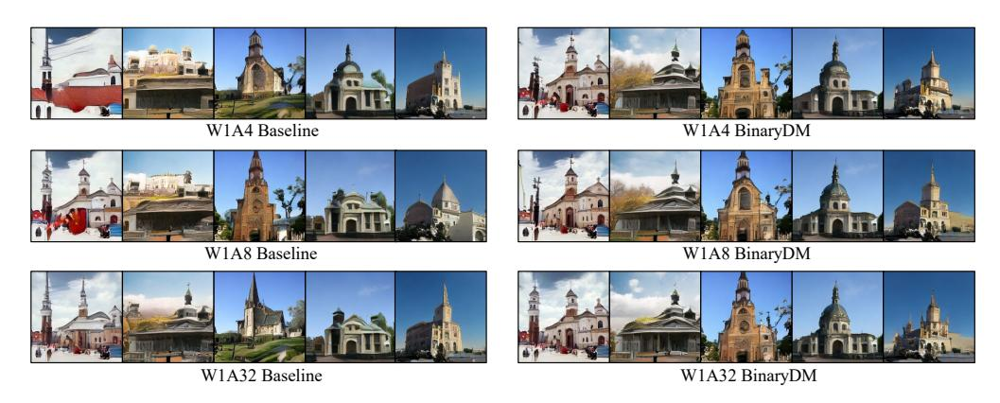

# B.2 ADDITIONAL RESULTS

Further Ablation Study on W1A4. The ablation experiments in our main text were conducted on W1A32, as the highlight of BinaryDM lies in achieving weight binarization for DM, with the activation quantization method always using a naive scheme without any additional complex techniques. Here, we also supplement the ablation results on the more efficient W1A4 model. As shown in the Table [7,](#page-16-0) when EBB was added alone, the generative performance of the binary DM improved significantly, with the FID decreasing from 10.87 to 8.53. After adding LRM, the FID further decreased to 7.74, clearly illustrating the effectiveness of their synergistic effect.

Effects of EBB. We conducted comprehensive experiments on various aspects of EBB's specific details to validate its effectiveness further.

|  |  |  |  | Table 7: Ablation results on LSUN-Bedrooms 256 × 256. |  |  |  |
|--|--|--|--|-------------------------------------------------------|--|--|--|
|--|--|--|--|-------------------------------------------------------|--|--|--|

| Method  | #Bits | FID↓  | sFID↓ | Prec.↑ | Recall↑ |
|---------|-------|-------|-------|--------|---------|
| FP      | 32/32 | 3.09  | 7.08  | 65.82  | 45.36   |
| Vanilla | 1/4   | 10.87 | 15.46 | 64.05  | 26.50   |
| +EBB    | 1/4   | 8.53  | 11.99 | 62.94  | 30.78   |
| +LRM    | 1/4   | 7.74  | 10.80 | 64.71  | 32.98   |

As a supplement to the ablation study on the final generation performance (Table [4\)](#page-9-0) in the main text, we present in Table [8](#page-16-1) the changes in training loss (Lsimple) at different iterations. The results indicate that EBB consistently achieves lower training loss, demonstrating its benefits for convergence.

Table 8: Training loss (Lsimple) at different iterations on LSUN-Bedrooms, comparing the baseline and the addition of EBB.

| Method           | #Bits        |                |                | Iterations     |                |                |
|------------------|--------------|----------------|----------------|----------------|----------------|----------------|
|                  |              | 1e1            | 1e2            | 1e3            | 1e4            | 1e5            |
| Baseline +EBB | 1/32 1/32 | 0.388 0.352 | 0.303 0.264 | 0.277 0.242 | 0.227 0.206 | 0.158 0.151 |

The results in Table [9](#page-16-2) and Table [10](#page-17-0) demonstrate that applying EBB significantly improves the generative quality of binarized diffusion models, highlighting the effectiveness of EBB. Furthermore, not applying EBB to the *Central Parts* yields better optimization results. The results in Table [10](#page-17-0) demonstrate that applying EBB significantly improves the generative quality of binarized diffusion models, highlighting the effectiveness of EBB. Furthermore, not applying EBB to the *Central Parts* yields better optimization results. This suggests that applying EBB only to the key parts reduces the number of parameter updates when transitioning to the second stage, thus leading to a more stable optimization process for binarized diffusion models. Specifically, applying EBB to regions with high parameter counts but lower sensitivity to binarization can lead to suboptimal optimization stability, resulting in worse performance compared to applying EBB selectively. Additionally, while Head and Tail Parts (12) achieves lower training loss in the first 1000 iterations compared to Head and Tail Parts (6), its weaker transition to full weight binarization results in higher loss at 100K iterations. This suggests that applying EBB only to the key parts reduces the number of parameter updates when transitioning to the second stage, thus leading to a more stable optimization process for binarized diffusion models.

Table 9: The impact of EBB application scopes on LSUN-Bedrooms (1/2), where *Head and Tail Parts* refers to how many of the first and last Timestep Embed Blocks and *Central Parts* refers to the middle Blocks.

| Head and Tail Parts | Central Parts | #Bits |       |       | Iterations |       |       |
|---------------------|---------------|-------|-------|-------|------------|-------|-------|
|                     |               |       | 1e1   | 1e2   | 1e3        | 1e4   | 1e5   |
| 0                   | 0             | 1/32  | 0.335 | 0.291 | 0.268      | 0.202 | 0.141 |
| 3                   | 0             | 1/32  | 0.335 | 0.263 | 0.230      | 0.184 | 0.138 |
| 6                   | 0             | 1/32  | 0.332 | 0.238 | 0.199      | 0.178 | 0.130 |
| 0                   | 0             | 1/32  | 0.331 | 0.223 | 0.201      | 0.183 | 0.133 |
| 12                  | 1             | 1/32  | 0.331 | 0.225 | 0.197      | 0.188 | 0.136 |

We conducted extensive experiments to verify the impact of the regularization loss coefficient µ on training, as shown in Table [11.](#page-17-1) Here, µ = 0 indicates that no regularization penalty is applied in the first stage, and the second learnable scalar σII is directly removed at the beginning of the second stage. The results demonstrate that the transition process using the regularization strategy leads to better optimization outcomes for the binarized DM. Furthermore, EBB shows good robustness to µ, with a moderately larger µ yielding better final generative performance.

Table 10: The impact of EBB application scopes on LSUN-Bedrooms (2/2).

| Head and Tail Parts | Central Parts | #Bits | FID↓ | sFID↓ | Precision↑ | Recall↑ |
|---------------------|---------------|-------|------|-------|------------|---------|
| 0                   | 0             | 1/32  | 8.02 | 12.81 | 64.83      | 33.12   |
| 3                   | 0             | 1/32  | 7.20 | 12.27 | 65.62      | 34.98   |
| 6                   | 0             | 1/32  | 6.99 | 12.15 | 67.51      | 36.80   |
| 0                   | 0             | 1/32  | 7.10 | 12.22 | 65.41      | 36.42   |
| 12                  | 1             | 1/32  | 7.10 | 12.29 | 66.41      | 34.54   |

Table 11: The impact of the regularization loss coefficient µ on LSUN-Bedrooms 256 × 256.

| µ    | #Bits | FID↓ | sFID↓ | Prec.↑ | Recall↑ |
|------|-------|------|-------|--------|---------|
| 0    | 1/32  | 8.01 | 13.16 | 64.34  | 30.06   |
| 9e-2 | 1/32  | 6.99 | 12.15 | 67.51  | 36.80   |
| 9e-3 | 1/32  | 7.26 | 12.26 | 65.10  | 34.44   |
| 9e-4 | 1/32  | 7.18 | 11.83 | 66.96  | 34.54   |

We conducted experiments on the timing of EBB's transition to the second stage. In Table [12,](#page-17-2) an iteration of 0 indicates that EBB is not applied. The results demonstrate the effectiveness of EBB and the transition strategy with regularization penalties, with a slightly longer regularization phase yielding marginally better final generative outcomes for binarized DMs.

Table 12: The impact of the iteration at which EBB transitions to the second stage on LSUN-Bedrooms 256 × 256.

| Iterations      | #Bits        | FID↓         | sFID↓          | Prec.↑         | Recall↑        |
|-----------------|--------------|--------------|----------------|----------------|----------------|
| 0               | 1/32         | 8.22         | 13.02          | 61.45          | 32.88          |
| 10000 100000 | 1/32 1/32 | 7.08 6.99 | 12.30 12.15 | 64.99 67.51 | 36.18 36.80 |

Further Discussion of EBB. From the perspective of the final optimization outcome, in Eq[.5,](#page-3-1) removing the sign function from the second term—i.e., replacing σII sign (w − σ1 sign (w)) with σII (w − σ1 sign (w))—can also achieve the same final evolutionary state. However, although this modification may provide stronger fitting ability in the early stages, it is not beneficial to achieve a fully binarized final model through optimization. This is because it would lead to a significant imbalance between the representations of the initial and final stages, causing the second term corresponding to σII to dominate due to its excessive information extraction capability, which in turn hinders the subsequent optimization of σ1 sign (w).

The additional experimental results we present in the Table [13](#page-17-3) show that this idea did not achieve the optimal generation performance. At the same time, we observed the value of σII at the end of the first phase of EBB training. We found that, unlike the original approach where regularization would force it to converge to nearly zero, σII still had a relatively large value, which indicates that this idea indeed hindered the natural evolution from multiple bases to a single base, and reduced the effectiveness of EBB as a method designed to enhance learning ability.

Table 13: The impact of applying the sign function to the second term in EBB on LSUN-Bedrooms 256 × 256.

| Method                 | #Bits | FID↓  | sFID↓ | Prec.↑ | Recall↑ |
|------------------------|-------|-------|-------|--------|---------|
| Baseline               | 1/4   | 10.87 | 15.46 | 64.05  | 26.50   |
| no sign in second term | 1/4   | 8.44  | 13.00 | 62.68  | 30.12   |
| BinaryDM               | 1/4   | 7.74  | 10.80 | 64.71  | 32.98   |

**Effects of LRM.** As a supplement to the ablation study on the final generation performance (Table 4) in the main text, we present in Table 14 the changes in training loss ( $\mathcal{L}_{simple}$ ) at different iterations. The results indicate that LRM consistently achieves lower training loss, demonstrating its benefits for convergence.

Table 14: Training loss ( $\mathcal{L}_{simple}$ ) at different iterations on LSUN-Bedrooms, comparing the no distillation, MSE and the addition of LRM.

| Method                       | #Bits |       |       | Iterations |       |       |
|------------------------------|-------|-------|-------|------------|-------|-------|
|                              |       | 1e1   | 1e2   | 1e3        | 1e4   | 1e5   |
| Baseline                     | 1/32  | 0.388 | 0.303 | 0.277      | 0.227 | 0.158 |
| $\mathcal{L}_{\text{MSE}}$   | 1/32  | 0.388 | 0.303 | 0.277      | 0.227 | 0.158 |
| $\mathcal{L}_{\textbf{LRM}}$ | 1/32  | 0.352 | 0.264 | 0.242      | 0.206 | 0.151 |

We evaluate the performance of our binarized diffusion model under various values of K (reduction times of dimension) when incorporating LRM. Additionally, we compare these results with the outcomes of applying MSE distillation directly to the output features of blocks without dimensionality reduction. The experiments reveal the model's generation capability improves effectively when an appropriate degree of dimension reduction is employed, as illustrated in Table 15.

Table 15: In the application of LRM, the impact of different reduction times of dimension on the experimental results on LSUN-Bedrooms  $256 \times 256$ .

| $\mathcal{L}_{\text{distil}}$  | K | #Bits                   | FID↓ | sFID↓                               | Prec.↑ | Recall † |
|--------------------------------|---|-------------------------|------|-------------------------------------|--------|---------------------|
| -                              | - | 1/32                    | 7.39 | 12.34                               | 65.98  | 35.84               |
| $\mathcal{L}_{\text{MSE}}^{-}$ |   | $ \bar{1}/\bar{3}2^{-}$ | 7.36 | 12.76                               | -62.05 | 33.64               |
|                                |   | $- \frac{1}{32}$        | 7.21 | $- \overline{12.22} - \overline{1}$ | 65.86  | 36.00               |
| $\mathcal{L}_{LRM}$            | 4 | 1/32                    | 6.99 | 12.15                               | 67.51  | 36.80               |
|                                | 8 | 1/32                    | 6.95 | 12.02                               | 64.20  | 35.44               |

As an additional clarification on stability, we also conducted experiments where the dimensionality reduction matrix  $E_i^{\lceil \frac{c}{K} \rfloor}$  is updated every 100 iterations. As shown in the Table 16, while using LRM consistently yields improvements (with FID decreasing from 7.39 to 7.11/6.99), the approach of initializing the matrix once and retaining it throughout results in the highest accuracy. This further confirms our analysis that fixing the dimensionality reduction matrix and not updating it is more beneficial for stable optimization.

Table 16: Results of different update frequency of LRM on LSUN-Bedrooms.

| Update Frequency (/iter) | #Bits | FID↓ | sFID↓ |
|--------------------------|-------|------|-------|
| 0 (w/o LRM)              | 1/32  | 7.39 | 12.34 |
| 100                      | 1/32  | 7.11 | 12.23 |
| $\infty$ (BianryDM)      | 1/32  | 6.99 | 12.15 |

**Further Efficiency Analysis.** We pointed out in the main text that certain high-order-based structures are computationally unfriendly. In fact, The models produced by our method save 1.96x in parameters (Size) and 2.00x in computational operations (OPs) during inference, and we have also provided hardware implementations. Specifically, methods based on higher-order residual bases require more sets of binarized weights and corresponding scaling factors during inference compared to Baseline or BinaryDM (Eq.10):

$$\boldsymbol{w}^{\text{bi}} = \sigma_{\text{I}} \left( \boldsymbol{w}_{I}^{bi} \right) + \sigma_{\text{II}} \left( \boldsymbol{w}_{II}^{bi} \right). \tag{18}$$

This at least doubles the parameter count and OPs. Additionally, although multiple sets of bases in higher-order methods are expected to be processed in parallel during inference, we found in our research that, to date, there has not been any implementation of this, making them computationally less efficient.

For actual hardware, we implemented convolution and linear layers unit by unit to estimate the overall model, utilizing the general deployment library Larq[1] on a Qualcomm Snapdragon 855 Plus to test the actual runtime efficiency of the aforementioned single convolution. Since the current deployment libraries do not support direct computation for W1A4, we used a combined approach to achieve it via W1A1. Specifically, for the W1A4 operator, since there is no existing 4-bit activation implementation, we decompose the activation as follows:

$$k \cdot a^{4bit} = 4k \cdot b_{a1}^{1bit} + 2k \cdot b_{a2}^{1bit} + k \cdot b_{a3}^{1bit} + \frac{1}{2}k \cdot b_{a4}^{1bit} - \frac{1}{2}k, \tag{19}$$

where

- k is the scaling factor of fp32 activation,
- $a^{4bit} \in \{-8, -7, -6, -5, -4, -3, -2, -1, 0, 1, 2, 3, 4, 5, 6, 7\},\$
- $b_{ai}^{1bit} \in \{-1, 1\}, i \in \{1, 2, 3, 4\}.$

As a result, the computation of 1-bit weights with int4 can be straightforwardly decomposed into the computation of 1-bit weights with 4 1-bit activations and one bias term  $(\frac{1}{2}k)$ , based on the W1A1 operator provided by Larq, with the addition of limited arithmetic operations. The runtime results for a single inference are summarized in the Table 17. Due to limitations of the deployment library and hardware, Baseline/BinaryDM achieved a 4.62x speedup, while High-Order only achieved an 3.11x speedup. With further hardware support for binary operations, BinaryDM is expected to achieve performance closer to the theoretical OPs calculations (15.2x), further widening the gap between its implementation and that of high-order methods.

Table 17: The actual runtime efficiency of a single convolution.

| Method     | #Bits | Size(MB) | Theoretical OPs( $\times 10^9$ ) | Runtime(µs/convolution) |
|------------|-------|----------|----------------------------------|-------------------------|
| FP         | 32/32 | 1045.4   | 96.0                             | 176371.0                |
| High-Order | 1/4   | 70.2     | 12.6                             | 56657.5                 |
| BinaryDM   | 1/4   | 35.8     | 6.3                              | 38174.2                 |

#### **B.3** VISUALIZATION RESULTS

**Visualization of the impact of LRM.** As a complement to Figure 3, we present the distance in output features between binary DM and full-precision DM on more blocks under different distillation losses. As shown in Figure 5, our proposed PCA-based distillation strategy consistently possesses the optimal guiding constraint capability.

**Additional Random Samples.** We showcase random generation results on various datasets, with unconditional generation on LSUN-Bedrooms, LSUN-Churches, and FFHQ datasets, and conditional generation on ImageNet. Overall, BinaryDM exhibits the best generation performance across datasets and maintains relatively stable performance as the activation bit-width decreases from 32 to 4 bits. In contrast, the Baseline lacks detailed textures and experiences significant performance degradation as the activation bit-width decreases.

Figure 5: A comprehensive record of the impact of different distillation loss functions on the output features of each block in both full-precision DM and binarized DM, measured using the L2 distance.

Figure 6: Samples generated by BinaryDM and Baseline on LSUN-Bedrooms 256 x 256

Figure 7: Samples generated by BinaryDM and Baseline on FFHQ 256 x 256

Figure 8: Samples generated by BinaryDM and Baseline on LSUN-Churches 256 x 256

Figure 9: Samples generated by BinaryDM and Baseline on ImageNet 256 x 256