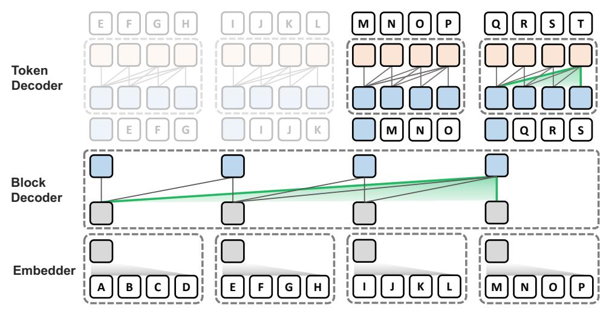

# 1 Introduction

Generating tokens with transformer-based autoregressive language models (LMs) is costly due to the self-attention mechanism that attends to all preceding tokens [\[6,](#page-10-0) [77\]](#page-15-0). To minimize computation, it is common to cache the key-value (KV) states of all tokens during decoding. However, significant initial latency remains from processing the KV states of all prompt tokens during the first decoding step. Also, while subsequent decoding steps only need to compute a single token, this is often bottlenecked by the memory access required to retrieve the KV states of all previous tokens. While numerous techniques have been proposed to reduce attention costs [\[23,](#page-11-0) [42,](#page-13-0) [2\]](#page-10-1), there has been limited research on effective architectures that structurally mitigate attention overheads in transformer-based LMs.

Hierarchical architectures [\[59,](#page-14-0) [36,](#page-12-0) [22,](#page-11-1) [56,](#page-14-1) [54,](#page-14-2) [57,](#page-14-3) [28,](#page-12-1) [50,](#page-13-1) [84\]](#page-16-0) have shown potential in efficiently modeling long sequences such as *character*-level text or pixel-level images by pooling inputs into coarser units. While most of these employ upsampling to regress back to a finer level for attention computation, several approaches [\[50,](#page-13-1) [84\]](#page-16-0) further enhance efficiency through local processing within each pooled unit. Nevertheless, they have not recognized or explored the potential of applying local processing to alleviate the overheads of autoregressive inference, explained above.

†Work done during an internship at LG AI Research. ∗Equal contribution. ‡Corresponding authors.

Figure 1: An overview of the Block Transformer architecture with a block length of LB = 4. Each letter represents a standard subword token. Attention is restricted within the dotted boundaries in the decoders. The KV values outside the boundary of the currently decoded block do not need to be retrieved during decoding, and can be discarded from memory. Consequently, given the prompt tokens, A, B, ..., L, the shaded parts do not need to be computed in the token decoder.

In this paper, we present the Block Transformer architecture which employs a global-to-local hierarchical structure at the *subword*-level to holistically maximize the *inference* benefits of global-to-local processing for self-attention. We begin with a brief summary of our architecture as shown in [Figure 1:](#page-1-0)

The lower layers are designed to efficiently capture the global input context by applying attention at the coarse level. First, the lightweight embedder maps each block of LB subword tokens into a single *input block embedding*. These are passed to the block decoder, an autoregressive transformer that applies self-attention between blocks to output a *output block embedding*, or *context embedding*, used by the upper layers to decode the next block. The upper layers are designed to predict the next block in finer detail, returning to the level of individual tokens. Here, the token decoder autoregressively decodes the tokens in the next block. Relying on the context embedding from the lower layers for global context, fine-level attention is applied only within the current block of LB tokens, using a minuscule local KV cache.

This structure alleviates a wide range of key inference bottlenecks with only simple modifications to the standard transformer. At the lower layers, coarse processing reduces the amount of KV cache storage by a factor of LB and memory access by LB 2 . At the upper layers, attention is applied within the local block of LB tokens, nearly eliminating its overhead. Consider a prompt with L tokens. While vanilla transformer layers would have to prefill and store the KV cache of L tokens and retrieve these at every decoding step, the upper layers of the Block Transformer only need to see up to LB ≪ L most recent tokens, nearly eliminating prefill computation and KV cache overheads.

While prior work [\[84\]](#page-16-0) has introduced similar structures, it has largely overlooked their potential benefits in autoregressive inference. Notably, they focus on optimizing overall FLOPs for efficient *pretraining* by exploiting lightweight local modules that simply map between coarse and fine representations. Our approach challenges this viewpoint, uncovering vital roles of both the *global* block decoder and *local* token decoder in language modeling. Ablations reveal that a more balanced parameter allocation across the global and local modules enhances performance *and* inference throughput, attributed to significant reduction in self-attention overheads within the local module.

Extensive experiments on models up to 1.4 billion parameters show that Block Transformers notably improve inference throughput for both prefill- and decode-intensive scenarios, achieving 10–20× gains in throughput compared to vanilla transformers with equivalent perplexity or zero-shot task performance. Despite the architectural restriction of global-to-local attention, our models show a comparable ability to utilize full context on recent long-context benchmarks, such as PG19 [\[62\]](#page-14-4) and Needle-In-a-Haystack [\[39\]](#page-13-2), when compared to their vanilla transformer counterparts. In addition, we show that it is possible to uptrain pretrained vanilla models into Block Transformers, closely approaching the performance of those pretrained from scratch, using minimal training budget.

