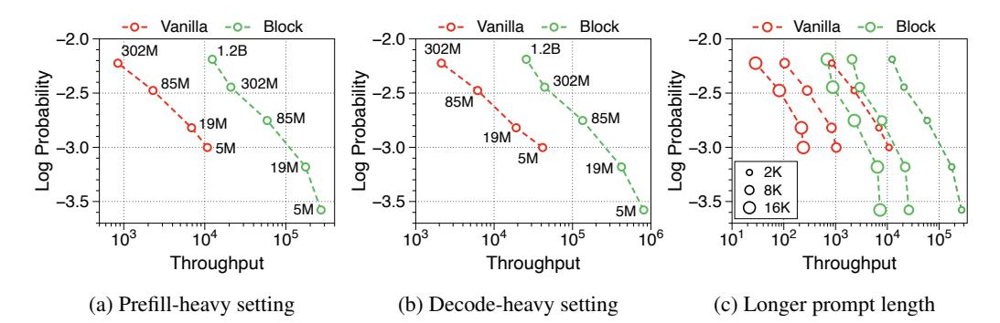
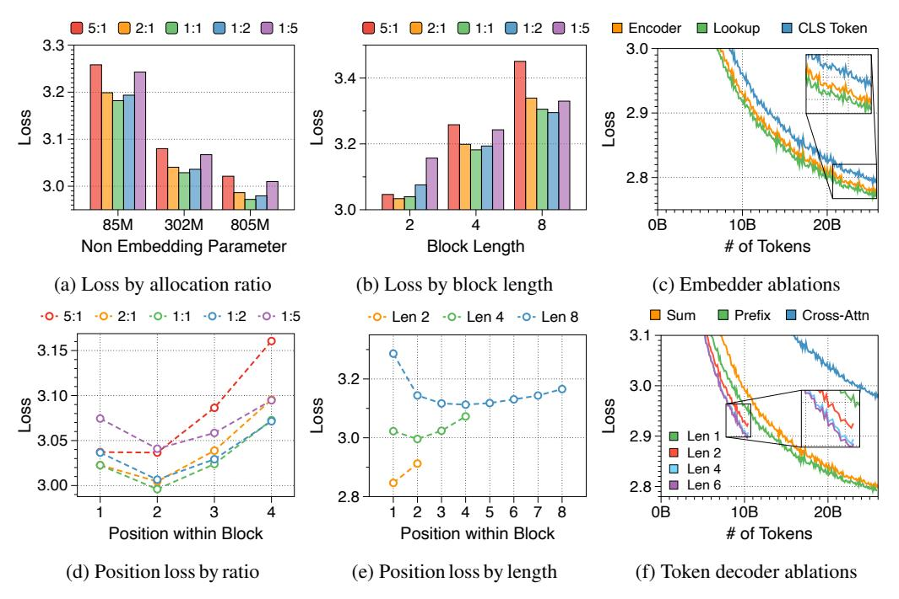
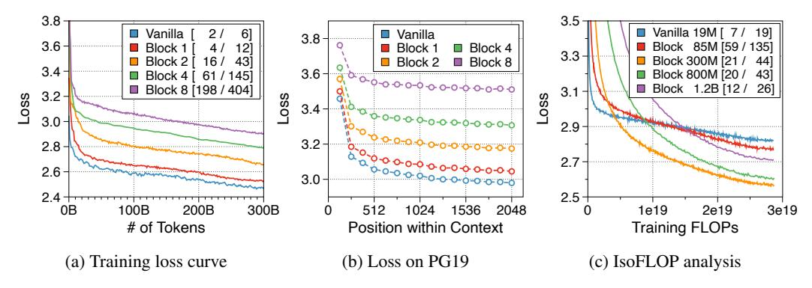
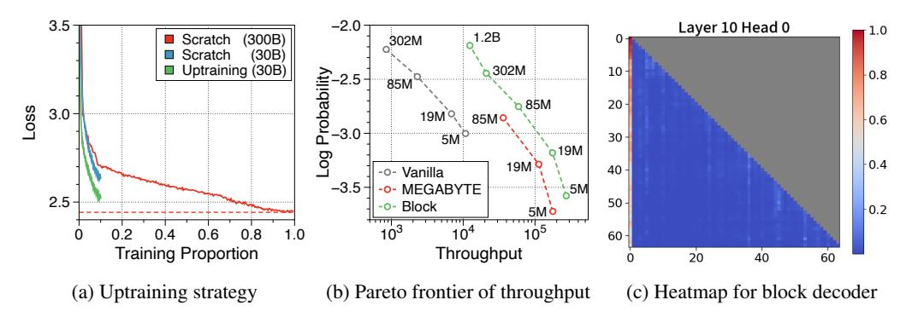

# 2 Block Transformer

The Block Transformer employs global and local attention mechanisms with hierarchical paradigm by separating the comprehension of the full context and detailed interactions into two distinct stages. Specifically, global context is captured at lower layers in coarse block-level granularity, where each block consists of a fixed number of tokens aggregated into a single embedding. The local dependencies are resolved at upper layers, where multiple subword tokens are decoded in an autoregressive manner using the context embedding from the block decoder, with local attention.

The Block Transformer consists of three components:

- 1. Embedder: The embedder aggregates each block of LB tokens into an input block embedding.
- 2. Block decoder: The block decoder applies self-attention across the full sequence of blocks to model global dependencies.
- 3. Token decoder: The token decoder applies self-attention within each block to handle finegrained local dependencies and decode individual tokens.

We outline the design and list efficiency benefits for each component in the following subsections. To lay the groundwork for detailed cost analysis, we begin with a simplified primer on key bottlenecks in autoregressive transformers, assuming a single accelerator device.

## 2.1 A primer on the key bottlenecks of autoregressive transformers

Key costs of autoregressive transformers These can be categorized into *compute*, *parameter memory* and *KV cache memory*. (1) Compute refers to arithmetic operations, dominated by matrix multiplications in the attention and feedforward layers. The number of floating-point operations (FLOPs) is proportional to the number of non-embedding parameters and total tokens, i.e., sequence length × batch size. (2) Parameters must be fully stored in device memory and retrieved at *each* forward or backward pass, regardless of the sequence length and batch size. (3) During inference, the KV cache of previously computed sequences are typically cached in memory, and retrieved at *each* forward pass, i.e., decoding step. Similar to compute, its size is proportional to sequence length × batch size.

Case study of Llama 7B [\[75\]](#page-15-1) The compute cost of *each* token is roughly 7 × 2 = 14GFLOPs, where 2 comes from the multiply-accumulate operation used in matrix-vector multiplication [\[40\]](#page-13-3). The memory size of the model parameters is 7 × 2 = 14GB under 16-bit, or 2-byte, floating-point precision. The size of the KV cache of a *single* token is 512KB. While this seems minuscule compared to the parameters, the total KV cache can quickly outsize the parameters with more tokens; for sequence length 2048 and batch size 16, the KV cache occupies 16GB. To translate this to *wall-clock time*, note that the compute throughput (FLOP/s) of accelerator devices is 2–3 orders of magnitude higher than HBM memory bandwidth (bytes/s)—a gap which is widening exponentially [\[33\]](#page-12-2).

Computation scenarios for autoregressive LMs These can be broadly divided into *training* and inference. During training, every token is processed in parallel. For a precise cost analysis of inference, we further dissect it into the *prefill stage* and the *decode stage*. To generate a response to a given prompt, all input tokens must first be processed to obtain and cache their KV values in each layer, allowing subsequent tokens to access them for self-attention. This is referred to as the prefill stage. Next is the decode stage, where subsequent tokens are generated one at a time. In each forward step, only one token per batch sample is computed, but the KV cache of *all* preceding tokens must be loaded from memory.

Primary bottlenecks per computation scenario vary significantly (1) During training, all tokens are processed in parallel, thus compute demands far outweigh parameter memory access, which remains constant. (2) Similarly, the prefill stage is typically compute-bound, as all input tokens are processed in parallel. (3) In contrast, the decode stage, given sufficient sequence length, is heavily memory-bound, as only one token per batch sample is computed in each forward pass, while parameter and KV cache memory access demands are significant. Specifically, KV cache memory access exceeds parameter memory access when sequence length and batch size are large, while parameter memory dominates when they are small. A larger batch size helps reduce the relative cost of parameter memory access by amortizing it over batch samples. Our proposed Block Transformer design optimizes inference, especially in batch decoding, where KV cache impacts throughput.

#### 2.2 Embedder

For the embedder, we prioritize simplicity, given the small block lengths  $L_B=1,2,4,8$  considered in our study. Our primary design uses a lookup table  $E_{\rm emb}\in\mathbb{R}^{V\times D_{\rm emb}}$  to retrieve and concatenate trainable token embeddings. We set the embedding dimension to  $D_{\rm emb}=D/L_B$ , where D is the primary model dimension, used throughout the block and token decoders. We also consider variants which incorporate small encoder transformers (Appendix F), but these do not yield performance improvements (Section 3.4).

## 2.3 Block decoder

The block decoder aims to contextualize block representations by attending to preceding blocks, utilizing the embedder's output as input. This autoregressive transformer operates at the block level, producing output block embeddings, or *context embeddings*2, that enable the token decoder to autoregressively decode the subsequent block's token contents. Given input block embeddings from the embedder, derived from input tokens  $x_{0:i \times L_B-1}$ , the block decoder outputs a context embedding which contains the information to predict  $x_{i \times L_B:(i+1) \times L_B-1}$ .

This approach mitigates the quadratic costs of self-attention by using coarse-grained block inputs instead of individual tokens, while preserving global modeling capabilities and ease of hardware acceleration of dense attention [85]. This reduces the context length of a given sequence by  $L_B$  compared to a vanilla transformer. We compare the block decoder with vanilla transformer layers, in terms of the key bottlenecks discussed in Section 2.1:

- Computation is reduced by  $L_B$  due to reduced input units.
- Parameter memory access is reduced by  $L_B$  due to reduced decoding frequency.
- KV cache size is reduced by  $L_B$  due to coarsity.3 KV cache access is reduced by  $L_B^2$  due to reduced size and decoding frequency.

#### 2.4 Token decoder

The token decoder decodes the individual tokens of the next block, taking the form of an autoregressive transformer with a separate embedding table  $E_{\text{tok}} \in \mathbb{R}^{V \times D_{\text{tok}}}$  and classifier. Each block is processed independently, relying on the context embedding as the sole source of information on previous input blocks. Only the *local* KV cache of the current block needs to be stored in memory and accessed at each decoding step. Conveniently, none of the prompt tokens in previous blocks are attended by future tokens, allowing the prefill stage to be skipped entirely–except for the most recent block.

The relative size of this local KV cache is smaller by a factor of  $R=L/L_B$  when compared to the global KV cache of vanilla transformers, which spans the entire sequence length L. For standard lengths L=2048 and  $L_B=4$ , the reduction factor is a staggering R=256.4 We compare the token decoder with vanilla transformer layers, with respect to key bottlenecks:

- Computation is reduced to near-zero during prefill. Training computes remains the same.
- Parameter memory access remains the same.
- KV cache size is reduced by  $R = L/L_B$  with  $L_B \ll L$ , practically eliminating its memory footprint.3 KV cache memory access is equally reduced by R.

The key to designing the token decoder lies in how to incorporate the context embedding into the decoding process. In our main design, we project the context embedding into prefix tokens, enabling further refinement of the global context. Expanding the number of prefix tokens, i.e., *prefix length*, broadens the token decoder's computation width and allows for finer attention to context information and improved performance, similar to pause tokens [34]. Note that this is only feasible due to local processing, whereas extra tokens in vanilla transformers layers would exacerbate the overhead of KV cache. Extra computation incurred by prefix tokens has minimal effect on inference throughput as inference is largely memory-bound. While we also considered summation and cross-attention based variants (Appendix F), these proved less effective than our main method (Section 3.4).

&lt;sup>2We use the term *context embedding*, as it is the sole source of context information for the token decoder.

&lt;sup>3Reduced KV cache memory footprint can lower hardware requirements or allow for larger batch sizes, which can increase throughput by further amortizing parameter memory access.

&lt;sup>4Models continue to support longer contexts, like Gemini [67] with 2M tokens, effectively making R larger.

Table 1: Performance comparison between vanilla and block transformer models. For a clear comparison, we highlight an example where the vanilla and our models achieve comparable levels of training loss. We measure the perplexity of LAMBADA [58] and WikiText [49], and the accuracy of HellaSwag [86], PIQA [11], and ARC-easy [21] benchmarks. Memory refers to the amount of memory allocated per sample, measured in megabytes, while throughput is measured in units of 1K tokens per second. \* refers to variants trained with random-length padding5.

|         | # Para | meter |                    |        | Zero-shot Eval |       |       |       |                      | nory ↓              | Throughput †         |                     |
|---------|--------|-------|--------------------|--------|----------------|-------|-------|-------|----------------------|---------------------|----------------------|---------------------|
| Models  | Total  | N-Emb | $Loss\!\downarrow$ | LD↓    | WK↓            | HS↑   | PQ↑   | ARC↑  | Prefill h | Decode h | Prefill h | Decode h |
|         | 31M    | 5M    | 3.002              | 282.7  | 78.4           | 26.47 | 57.97 | 37.10 | 355.0                | 38.5                | 10.8                 | 41.6                |
| Vanilla | 70M    | 19M   | 2.820              | 67.2   | 46.9           | 27.20 | 59.73 | 40.24 | 390.0                | 76.8                | 6.9                  | 19.1                |
| vaiiiia | 160M   | 85M   | 2.476              | 20.2   | 28.5           | 29.80 | 64.22 | 46.85 | 675.0                | 229.6               | 2.3                  | 6.2                 |
|         | 410M   | 302M  | 2.224              | 10.0   | 20.1           | 35.05 | 68.10 | 51.68 | 1140.0               | 608.2               | 0.8                  | 2.1                 |
|         | 33M*   | 5M    | 3.578              | 2359.9 | 134.2          | 26.25 | 55.90 | 35.17 | 25.0                 | 5.0                 | 272.3                | 809.5               |
|         | 77M*   | 19M   | 3.181              | 390.5  | 80.1           | 27.21 | 57.69 | 38.31 | 48.9                 | 9.9                 | 175.3                | 421.4               |
| Block   | 170M*  | 85M   | 2.753              | 67.9   | 43.7           | 28.28 | 62.22 | 43.43 | 56.3                 | 29.1                | 59.0                 | 134.7               |
| DIOCK   | 420M   | 302M  | 2.445              | 29.5   | 27.7           | 31.13 | 64.35 | 48.48 | 105.0                | 77.2                | 21.0                 | 44.1                |
|         | 1.0B   | 805M  | 2.268              | 16.5   | 21.4           | 34.68 | 68.18 | 52.26 | 130.2                | 102.8               | 19.8                 | 42.5                |
|         | 1.4B   | 1.2B  | 2.188              | 12.2   | 19.1           | 36.66 | 68.63 | 54.63 | 194.2                | 153.9               | 12.4                 | 25.7                |

Figure 2: Pareto frontier of throughput to language modeling performance. Throughput denotes the number of generated tokens per second, and the numbers next to each point represent the number of non embedding parameters. (a) Pareto frontier in the prefill-heavy setting. (b) Pareto frontier in the decode-heavy setting. (c) Throughput in the prefill-heavy setting with varying prompt lengths. Each point corresponds to the same order of model sizes as in the left figures.

## 3 Experiments

## 3.1 Experimental setup

We use the transformer architecture of Pythia [10], and train both vanilla and Block Transformer models on the Pile [30, 9] with a context length of 2048. The models are pretrained on 300B tokens, which corresponds to about 1.5 epochs. We employ the HuggingFace training framework [80]. Eight A100 GPUs with 40 GiB of VRAM are used for training, while an H100 GPU is used for inference wall-time measurements. Experimental details of each subsection are summarized in Appendix G.

## 3.2 Main results

In Table 1, we measure the language modeling performance of the Block Transformer. Block models are scaled to have the same number of non-embedding parameters as the vanilla model variants. Our models, when having two or three times more parameters, achieve comparable perplexity and accuracy on five zero-shot evaluation tasks as the vanilla models. This is an expected result because two separate decoders spend fewer FLOPs per forward pass, reducing the attention complexity by a factor of  $1/L_B^2$  at the block-level and by roughly  $L_B/L$  at the token-level.

&lt;sup>5During evaluation, we add left padding of length  $L_B-1$  to the first block. To use internal padding in blocks during inference, we apply random-length padding when packing documents for pretraining (see Appendix H). Absence of this technique results in significant performance drop for certain tasks such as LAMBADA.

Figure 3: (Left: (a), (d)) Average and position-wise loss by the ratio of parameter allocation between block and token decoders. The ratio is represented as block to token decoders. (Center: (b), (e)) Average and position-wise loss in relation to block length LB. (Right: (c), (f)) Training loss curve for variants of the embedder and token decoder. We consider four different lengths for the prefix-based token decoder. We use models with 302M non-embedding parameters and one-to-one ratio trained on 8 billion tokens.

The actual inference throughput and memory efficiency of the Block Transformer are significantly higher compared to vanilla models. We measure the maximum throughput [\[71\]](#page-15-4), which use maximum batch sizes of each model variant allowed by memory. As shown in [Figure 2a](#page-4-2) and [Figure 2b,](#page-4-2) our models achieve Pareto-optimality, especially demonstrating up to 25 times increase, under two scenarios: *prefill-heavy* and *decode-heavy*, where the input and output sequence lengths are 2048, 128 and vice-versa. This efficiency improvement is due to effective reductions in KV cache memory, which allows batch sizes to be about six times larger, as summarized in memory per sample in [Table 1.](#page-4-1) The Block Transformer further reduces latency in a prefill-heavy setting, as past KV states of prompts need to be cached only in the block decoder, without forwarding them to the token decoder. As detailed in Appendix [I,](#page-26-0) this overall trend remains consistent even with the FlashAttention algorithm [\[23\]](#page-11-0) employed during inference.

The Pareto frontiers for variable fixed batch sizes, i.e., 1, 32, and 256, are illustrated in [Appendix J.](#page-27-0) We discover that as both the model size and batch size increase, the throughput rate of the Block Transformer scales exponentially. Considering that the LLMs typically utilized in real-world applications have billions of parameters, and taking into account the strategy of aggregating multiple user requests to optimize batch inference [\[42,](#page-13-0) [60,](#page-14-6) [71\]](#page-15-4), the results suggest that our proposed architecture will demonstrate even more benefits in practical multi-tenant deployment scenarios.

In [Figure 2c,](#page-4-2) we observe that the throughput of the Block Transformer with an 8K prompt length surpasses that of the vanilla model with a 2K prompt length. This is reasonable because the context length of the block decoder is reduced by a factor of 4, and the token decoder is nearly free of KV-cache overheads. Given the rising interest in enabling longer context lengths, even over one million tokens [\[15,](#page-11-4) [67,](#page-15-2) [52\]](#page-13-5), the Block Transformer has potential to enhance throughput even further.

## 3.3 Analysis on parameter allocation ratio and block length

Perplexity shows a U-shaped pattern across different allocation ratios We explore the impact of different allocation ratios between the block and token decoders on language modeling performance, while keeping the total number of non-embedding parameters constant. [Figure 3a](#page-5-0) illustrates the training loss across five distinct ratios for three model sizes. Interestingly, there is a clear U-shaped trade-off at all three model sizes. We find that a one-to-one ratio is optimal for models with LB = 4 consistently across all model sizes. If either side is too small, there is a noticeable decline in performance. This demonstrates the synergistic effect and the equal importance of the block and token decoders in language modeling.

Larger block and token decoders reduce perplexity at initial and later positions respectively We measure average loss at each position within a block, depicted in [Figure 3d.](#page-5-0) The position-wise loss typically exhibits a U-shaped pattern, aligning with findings from a previous multiscale language model [\[84\]](#page-16-0) and blockwise parallel decoding methods [\[72,](#page-15-5) [16,](#page-11-5) [41\]](#page-13-6). This trend stems from the lack of global context in context embeddings, which escalates uncertainty at later positions. Moreover, perplexity at specific positions correlates with the parameter sizes of two decoders. A larger block decoder significantly lowers initial position loss due to predictions solely based on the context embedding. In contrast, a larger token decoder improves prediction accuracy for later tokens by better leveraging local context. These interdependent effects dictate the optimal parameter ratio, with similar patterns evident in models of various sizes, detailed in [Appendix K.](#page-28-0)

Shorter block length favors larger block decoder whereas longer length prefers token decoder [Figure 3b](#page-5-0) demonstrates that training loss still follows a U-shaped pattern across different allocation ratios, regardless of block length. Optimal ratios shift with block length: shorter blocks benefit from a larger block decoder, while longer blocks perform better with more parameters in the token decoder. This is due to the inverse relationship between block length and FLOPs of the block decoder, which influences model capacity [\[25,](#page-12-5) [26,](#page-12-6) [34\]](#page-12-3). As [Figure 3e](#page-5-0) shows, first position loss significantly decreases with shorter blocks, reflecting increased capacity in the block decoder. While the token decoder shows minimal differences in FLOPs across block lengths, it has more chance to improve the likelihood of later tokens as block length increases, favoring a larger token decoder. These trends are consistent across different model sizes and allocation ratios, detailed in [Appendix L.](#page-28-1)

Larger token decoder and longer block length are beneficial for achieving high-throughput We evaluate the allocation ratio and block length from a throughput perspective, summarizing the Pareto frontier in [Appendix M.](#page-29-0) Models with larger token decoders reach Pareto-optimality by achieving higher throughput at a minor performance compromise. Since KV cache IO significantly influences inference time, allocating more parameters to the token decoder is advantageous because the local context length is bounded by the block length. Additionally, increasing the block length improves throughput as KV cache length in the block decoder reduces proportionally. Therefore, although our main configuration uses a one-to-one ratio and a block length of four, opting for a longer block length and a larger token decoder could result in a higher-throughput model.

## 3.4 Ablation on components of the Block Transformer

Lookup strategy is the most effective approach for the embedder In [Figure 3c,](#page-5-0) we experiment with three embedder strategies to bundle block tokens into a single embedding. Surprisingly, a complex transformer encoder like RoBERTa [\[47\]](#page-13-7) does not outperform a simpler lookup table strategy. Moreover, the encoder-based embedder lowers generation throughput due to additional computational overhead. As a result, we opt for the lookup strategy to steamline the Block Transformer architecture. Although the CLS token approach allows flexibility in block length, we leave it for future work as it compromises language modeling performance.

Prefix token decoder with longer prefixes enhances performance with minimal overhead [Fig](#page-5-0)[ure 3f](#page-5-0) shows the training loss curve for three token decoder strategies. Using a cross-attention module with key and value sequences equal to the block length considerably diminishes performance. In contrast, forwarding context embeddings through self-attention operations enhances performance, with prefix decoding surpassing other methods. Furthermore, extending the prefix beyond four tokens markedly improves perplexity, effectively broadening the computation width of token decoder. Since longer prefixes add minimal inference overhead, we select a prefix length of two by balancing performance with FLOPs. This approach offers new insights into global-to-local modeling, diverging from previous studies [\[84\]](#page-16-0) which overlook the potential of local computational capacity in the token decoder. Detailed results across various model sizes are summarized in [Appendix N.](#page-31-0)

Figure 4: (a) Training loss curve with varying block lengths. The numbers in the brackets represent the maximum throughput, measured in 1K tokens per second, for prefill-heavy and decode-heavy settings, respectively. (b) The loss at different token positions within context length on the PG19 test set. We average over every 128 sequences for smoothing. (c) Training loss curves under the same budget for both training FLOPs and inference throughput.

## 3.5 Analysis on global-to-local language modeling

Global-to-local language modeling efficiently optimizes throughput relative to performance In [Figure 4a,](#page-7-0) we transition from vanilla to Block Transformers by adjusting block lengths. As block length increases, training loss changes log-linearly and throughput increases exponentially, clearly demonstrating the efficiency of global-to-local modeling. Using a lookup embedder and token decoder with one prefix token, our model with LB = 1 differs from the vanilla model only by removing global attention in the upper layers. Notably, this model achieves loss equivalent to that of the vanilla model after training on 70% of the tokens, while doubling throughput. Despite pruning all past sequences, this robust performance shows that the context embedding can retain relevant information, enabling the effective of use local computations in global-to-local language modeling.

Block transformer can effectively leverage full context Since the token decoder depends solely on the context embedding, there could be a concern about whether the Block Transformer fully utilize context information. To address this, we evaluate the loss of token positions within a 2K context window using the test set of PG19 dataset [\[62\]](#page-14-4). [Figure 4b](#page-7-0) indicates that later tokens are consistently predicted with higher likelihood, suggesting that our architecture, which distinguishes between block-level and token-level decoders, effectively leverages full context information. Furthermore, we observed the same trend with an 8K context length (in Figure [20\)](#page-32-0), demonstrating our model's ability to fully exploit at least 8K tokens of context. Our block language modeling further demonstrated its effective utilization of full context in the recent Needle-In-a-Haystack long-context benchmark [\[39\]](#page-13-2) (refer to Appendix [O](#page-32-1) for details.)

## 3.6 IsoFLOP analysis under inference throughput constraints

Previous studies have focused on compute-optimal models to maximize performance within training FLOPs budgets [\[40,](#page-13-3) [37\]](#page-12-7), while typically overlooking inference throughput. Recent trends, however, emphasize models that also consider inference throughput constraints, either by overtraining smaller models [\[76,](#page-15-6) [74\]](#page-15-7) or by reducing FLOPs of the model itself [\[65\]](#page-14-7). In [Figure 4c,](#page-7-0) an optimal Block Transformer model achieves superior perplexity and triples the throughput when using the training FLOPs and throughput of the vanilla model as budget constraints. This illustrates that our models can effectively balance training efficiency and inference throughput.

## 3.7 Uptraining from vanilla transformers

Unlike previous studies [\[84\]](#page-16-0), our subword-level global-to-local architecture can leverage the initialization from a pretrained vanilla transformer. This enables efficient training, requiring only a small number of data. As shown in [Figure 5a,](#page-8-0) this uptraining strategy can lead to near-full performance recovery with just 10% of the original training steps, outperforming random initialization strategy. Consistent with previous studies [\[2,](#page-10-1) [5\]](#page-10-4), investigating deliberate weight initialization techniques can further enhance the performance convergence. We summarize details in [Appendix P.](#page-33-0)

Figure 5: (a) Training loss curve with uptraining strategy. The red horizontal line refers to the training loss of a full pretrained model. (b) Throughput comparison to MEGABYTE. We compare to three sizes of MEGABYTE in the prefill-heavy setting. (c) Visualization of heatmap for attention scores in block decoder. We visualize only the first 64 sequences for clarity.

#### 3.8 Comparison to related works

**Performance comparison to MEGABYTE** The MEGABYTE model [84] adopts a global-to-local structure but focuses on efficient pretraining over inference. Thus, within the training FLOPs budget, they argue for a larger block decoder based on a 6:1 ratio deemed optimal. As shown in Figure 5b, we reimplement the token-level MEGABYTE models, and they also achieve significantly higher throughput compared to vanilla models through global-to-local modeling. Nevertheless, consistent with our insights in Section 3.3, our models with enhanced local computational capacity demonstrate a significant throughput increase of over 1.5 times on top of MEGABYTE. See Appendix Q for more details.

**Relation to KV cache compression** Global-to-local modeling can be viewed through the lens of KV cache compression, where past sequences are entirely pruned (yet compressed into a context embedding) in the upper layers. Similar to techniques that preserve only meaningful tokens determined by accumulated attention scores [78, 87], this offers a promising way to improve decoding speed without compromising performance. Following the observations of [82, 32] that attention often concentrates on the first token (frequently semantically unimportant), Figure 5c reveals a similar pattern in our block decoder. This suggests that augmenting the token decoder's input with the initial "sink" block embedding, or a local window of embeddings, could yield substantial performance gains.

## 4 Discussion

## 4.1 Contextual information encapsulated in context block embedding

Since the input tokens and context embeddings share the same latent space in the token decoder, we analyze the nearest tokens to these block embeddings. Interestingly, Table 7 in Appendix S reveals that context embeddings compress global context rather than outlining the next block. The second prefix often contains information about the last token of current block to aid predicting the first token of the next block. Meanwhile, the first prefix typically matches non-intuitive or the EOS token, suggesting that they carry more general information. In light of this, the block decoder effectively compresses past global contexts, which the token decoder leverages for its local language modeling.

## **4.2** Techniques for further throughput improvement

Block autoregressive model with parallel token decoding When we pretrain the block decoder to predict next input block embeddings, the token decoder can decode all blocks in parallel if the predictions from block decoder are precise. While Mujika [50] enhance pretraining efficiency by directly predicting the embedding matrix, we find that MSE or contrastive losses [18] at the block decoder actually degrades performance. Moreover, error accumulation at the block level needs to be addressed, as discretization is not possible with block embeddings. Nevertheless, using pretrained text embeddings [79, 43] as ground truth, instead of jointly training embedder, could be beneficial.

Predicting multiple blocks at once with longer output length If the model is trained to predict two or three blocks simultaneously, throughput will increase proportionally. For example, if the input block length is four, the token decoder can be pretrained to predict eight tokens, equivalent to two blocks. One efficient training method could be uptraining the original Block Transformer models. To guarantee performance, we can adaptively adjust the prediction length based on the confidence of subsequent blocks or verify those drafts, similar to speculative decoding [\[44,](#page-13-9) [17,](#page-11-7) [46\]](#page-13-10).

