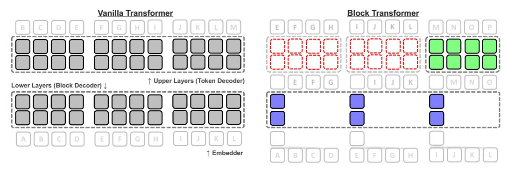

# D Extended related work

## D.1 KV cache compression

Recent advancements in KV cache compression aim to optimize memory usage by selectively retaining essential key-value pairs [\[82,](#page-16-4) [87,](#page-16-3) [32,](#page-12-8) [83,](#page-16-5) [45\]](#page-13-13). Scissorhands [\[32\]](#page-12-8) and H2O [\[87\]](#page-16-3) enhances compression by leveraging attention scores to preserve only the crucial components of the KV cache. Fast-Gen [\[48\]](#page-13-14) refines this approach by employing distinct policies per attention head. StreamingLLM [\[82\]](#page-16-4) maintains only the recent context window and a few initial tokens as an 'attention sink', thereby discarding other past context. SnapKV [\[45\]](#page-13-13) focuses on pruning tokens in the input prompt, in response to increasing input lengths. PyramidInfer [\[83\]](#page-16-5) prunes KV heads during prefill, as each layer is computed, to tackle memory usage in this stage. While various methods have been proposed to intelligently prune tokens that are relatively less important, these approaches essentially permanently discard information which may become relevant again in future contexts. In contrast, Block Transformer retains access to all previous context in the block decoder. KV cache compression methods can also be applied to the block decoder to improve efficiency.

#### D.2 Architectural for optimizations of KV cache

Recent works modify the design of the attention block such that multiple query heads can attend to the same shared KV heads, significantly reducing the number of unique KV heads while minimal degradation in performance. Multi-query attention (MQA) [70] allows multiple query heads to attend to shared key/value pairs, reducing storage overhead. Grouped-query attention (GQA) [2] generalizes this by organizing query heads into groups sharing a single KV head to achieve the same goal. Several concurrent works take this idea even further, by sharing KV heads between adjacent layers [13] or share the KV head of the top layer across the majority of layers [81]. A recent architecture [24] introduces multi-head latent attention (MLA) to jointly quantize KV states. By adopting standard transformer architectures, our Block Transformer can also benefit from these techniques to mitigate the remaining KV cache bottlenecks in the block decoder.

Several works take novel approaches to the overall architectural formulation. Tandem Transformers [55] alternate between a *large* block-level encoder and *small* token-level decoder. YOCO [73] is a decoder-decoder architecture that employs a cross-attention based decoder at upper layers which all refer to KV cache from a single middle layer which mitigates KV cache storage. In contrast, we take a different approach where the context information is compressed into a single context embedding to enable local modeling, nearly free of KV cache storage *and* access costs, mitigating critical bottlenecks in inference throughput.

## **E** Analysis on the inference efficiency of Block Transformer

## E.1 Background: inference stages and principal bottlenecks

To generate a response to an input prompt, it is necessary to prefill and cache the KV values of all input tokens, as they are attended by subsequent tokens under global self-attention. (1) The prefill phase is computation-bound because all input tokens can be processed in parallel during one forward pass. In contrast, when generating new tokens, only a single token can be processed per forward pass, as the output of the previous token is needed as the input for the next. While linear projection FLOPs are dominant with short context lengths, self-attention FLOPs surpass linear projection FLOPs with very large context lengths, due to quadratic scaling. (2) The decode phase is memory access-bound because all model parameters and previous KV cache must be loaded from memory at *each forward pass*. To achieve high compute utilization and throughput, production serving systems typically leverage batching to amortize the cost of parameter IO [1, 51]. Thus, under large batch sizes (and sufficiently long contexts), KV cache IO becomes the main bottleneck in decoding [61].

#### E.2 Inference-time advantages of block and token decoders

The following paragraphs provide a detailed presentation of the inference benefits associated with our proposed block and token decoder. For visual clarification, refer to Figure 6, and Table 2 offers a comparative analysis of actual computation speeds.

Block decoder reduces prefill computation by  $L_B$  and decode IO by  $L_B^2$ . The block decoder maintains global attention similar to vanilla transformers but operates at a much coarser block level, reducing context length by  $L_B$  compared to the original token-level sequence. This reduction decreases position-wise computation during prefill by  $L_B$  compared to vanilla transformers of the same size. The main bottleneck during batch decoding, i.e., KV cache IO, is reduced by  $L_B^2$  as it is quadratic to context length. The same savings apply to attention computation, which can become a bottleneck during prefill as context lengths grow. KV cache storage in GPU memory during decoding is also reduced linearly by  $L_B$ , enabling larger batch sizes and higher parallelism.

Token decoder skips prefill entirely and nearly eliminates decode IO  $\,$  The token decoder does not use global attention but relies on a single context embedding for global context information, applying attention within each independent block for local context. Thus, the token decoder does not need to preserve or retrieve KV cache values from previous blocks, eliminating the need to prefill input tokens. This also nearly eliminates KV cache IO overhead during decoding, as quadratic scaling applies to the small local context of  $L_B$  rather than the global context L. Compared to the KV cache IO complexity of  $L^2$  in vanilla transformers, token decoders have  $L_B^2$  complexity per block, across  $L/L_B$  blocks, achieving an overall reduction of  $L/L_B$ . For our main models with L=2048 and  $L_B=4$ , this results in a 256-fold reduction in KV cache IO overhead. Asymptotically, this reduces KV cache IO overhead from quadratic to linear with respect to context length, solving a key challenge in scaling to very long contexts [29]. KV cache storage is also reduced by the same factor, enabling larger batch sizes. This significantly improves the utilization of inference hardware, which is typically as low as  $\sim 1\%$  model FLOPs utilization (MFU) in vanilla transformers [61]. Thus, we can apply more FLOPs in the token decoder to improve performance, with minimal effect on inference throughput.

Figure 6: Illustration of key advantages of Block Transformer over Vanilla Transformers. Each colored box represents a single input unit that is processed at each layer, and input tokens A to L are prompt tokens.(1) The local token decoder does not need to prefill the prompt, as it is not used in subsequent generation, whereas the upper vanilla layers require the KV values of *all* prompt tokens to generate token M and onwards. (2) The token decoder only needs to fetch KV cache from up to  $L_B=4$  local tokens, while the upper vanilla layers needs to fetch from all previous tokens *at each step*, which can go up to the thousands or millions. (3) Since the block decoder operates at the block level, overall computation, memory overhead, and forward steps are reduced by  $L_B=4$ . KV cache IO is reduced quadratically. (4) Block transformer enables significantly higher batch size and thus overall higher compute utilization on identical hardware, as it only needs to preserve the KV cache of the blue and green parts in memory (green is minuscule for longer context lengths).

Table 2: Measurements on key advantages of Block Transformer during prefill and decode. Persample walltime of key operations at lower layers (block decoder) and upper layers (token decoder), for vanilla model with 300M non-embed params and a better performing Block Transformer with 1.2B non-embed params, using identical hardware (one H100 GPU). Refer to the caption of Figure 1 on the reason behind the significant walltime savings, despite using more parameters.

|                 |           | Van     | illa T. | Blo     | ck T.  |
|-----------------|-----------|---------|---------|---------|--------|
|                 |           | Prefill | Decode  | Prefill | Decode |
| Upper Layers    | Attention | 19.94   | 56.21   | N/A     | 2.41   |
| (Token Decoder) | FFN       | 0.86    | 1.42    | N/A     | 0.55   |
| Lower Layers    | Attention | 19.94   | 56.21   | 1.96    | 5.00   |
| (Block Decoder) | FFN       | 0.86    | 1.42    | 0.68    | 0.09   |

Vanilla T Block T. Prefill Decode Prefill Decode Upper Layers Attention 500.50 FFN 16.75 7.71 Lower Layers 47.24 0.06 1.44 (Block Decoder) 16.75

(b) Decode-heavy setting (128/2048)

(a) Prefill-heavy setting (2048/128)

