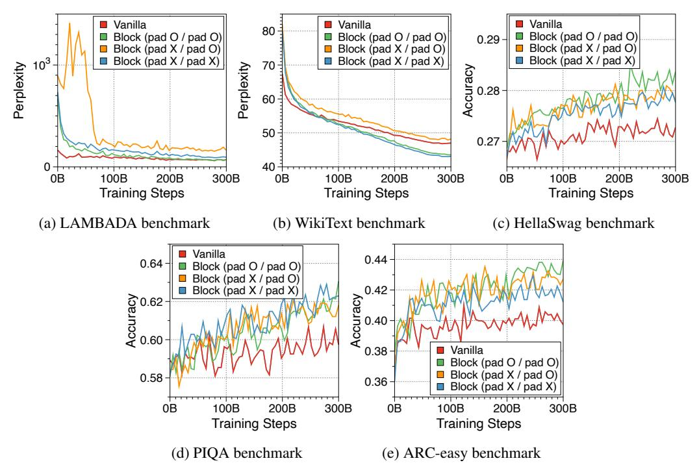

# G Experimental settings

## G.1 Overall settings

We use the same transformer architecture as Pythia [\[10\]](#page-10-2), utilizing the open-source GPT-NeoX library [\[3\]](#page-10-8). We train both vanilla and Block Transformer models on the Pile [\[30,](#page-12-4) [9\]](#page-10-3), which is a curated collection of English datasets specifically developed for training large language models. We utilize a BPE tokenizer tailored for the Pile dataset [\[12\]](#page-11-13), including a vocabulary size of 50,304. The models are pretrained on approximately 300 billion tokens, which corresponds to about 1.5 epochs of training, given that the deduplicated Pile comprises 207 billion tokens. To evaluate the models on various zero-shot tasks, we use the Language Model Evaluation Harness framework [\[31\]](#page-12-12). We employ the HuggingFace training framework [\[80\]](#page-15-3) and enhance memory efficiency through mixed precision training and the Zero Redundancy Optimizer (ZeRO) [\[64\]](#page-14-11) from the DeepSpeed library [\[66\]](#page-14-12). We use eight A100s with 40 GiB of VRAM for training, while we measure the inference latency using an H100 GPU.

#### **G.2** Model sizes and hyperparameters

Our models are trained across six different sizes, varying from 33 million (M) to 1.4 billion (B) parameters, to explore how performance scales with model size. We train four vanilla models corresponding to our Block Transformer models. We summarize detailed model configurations and training hyperparameters in Table 3.

Table 3: Hyperparameters for vanilla and block models. The size of each model refers to the size of non-embedding parameters. The transformer in vanilla model are summarized under the token decoder.  $n_L$  denotes the number of layers, and L and  $L_B$  represents the context length and block length, respectively. For the token decoder,  $L_{ctx}$  is calculated by summing the prefix length of two and the block length of four. We note that the lookup method is used as the embedder component.

|          |      | Token Decoder |       |       |      |      |       | Block Decoder |       |      |      |      |       |
|----------|------|---------------|-------|-------|------|------|-------|---------------|-------|------|------|------|-------|
| Models   | Size | Method        | L     | $n_L$ | Dim  | Head | $L_B$ | L             | $n_L$ | Dim  | Head | LR   | Batch |
|          | 5M   | -             | 2048  | 6     | 256  | 8    | -     | -             | -     | -    | -    | 1e-3 | 256   |
| Vanilla  | 19M  | -             | 2048  | 6     | 512  | 8    | -     | -             | -     | -    | -    | 1e-3 | 256   |
| vaiiiiia | 85M  | -             | 2048  | 12    | 768  | 12   | -     | -             | -     | -    | -    | 6e-4 | 256   |
|          | 302M | -             | 2048  | 24    | 1024 | 16   | -     | -             | -     | -    | -    | 3e-4 | 256   |
|          | 5M   | Prefix        | 2+4   | 3     | 256  | 8    | 4     | 512           | 3     | 256  | 8    | 1e-3 | 256   |
|          | 19M  | Prefix        | 2 + 4 | 3     | 512  | 8    | 4     | 512           | 3     | 512  | 8    | 1e-3 | 256   |
| Block    | 85M  | Prefix        | 2 + 4 | 6     | 768  | 12   | 4     | 512           | 6     | 768  | 12   | 6e-4 | 256   |
| Бюск     | 302M | Prefix        | 2 + 4 | 12    | 1024 | 16   | 4     | 512           | 12    | 1024 | 16   | 3e-4 | 256   |
|          | 805M | Prefix        | 2 + 4 | 8     | 2048 | 16   | 4     | 512           | 8     | 2048 | 16   | 3e-4 | 512   |
|          | 1.2B | Prefix        | 2+4   | 12    | 2048 | 16   | 4     | 512           | 12    | 2048 | 16   | 2e-4 | 512   |

## **G.3** Settings for Section 3.2

Each model is trained for 300 billion tokens with a context length of 2048. For the Block Transformer models, we set the block length to four, and leverage prefix decoding with a length of two and lookup methods as the token decoder and embedder components, respectively. To measure the allocated memory and throughput, we use synthetic samples where all prompts are padded to the target length.

#### **G.4** Settings for Section 3.3

Unless otherwise specified, we use a default setting of a model with 302M non-embedding parameters, allocating the same size of parameters to both the block and token decoders. For the default strategies of embedder and token decoder components, we use three CLS tokens from a RoBERTa model, composed of three layers with a dimension of 256, and a prefix with a length of one, respectively. Extensive experiments reveal that finding the optimum requires minimal overhead because the ranking trend between ablations remains consistent from the early training stages, across various model sizes. Therefore, we train the models with just 8 billion tokens.

#### G.5 Settings for Section 3.4

Each model is trained with a block length of four on 26 billion tokens, with the parameters of the block and token decoder being distributed equally. We have experimented with two model sizes of 85M and 302M non-embedding parameters. We set the default strategy for the embedder as utilizing three CLS tokens from the RoBERTa model, composed of three layers with a dimension of 256, and for the token decoder as prefix decoding with a length of one.

#### **G.6** Settings for Section 3.5

We use both vanilla and Block Transformers with the non-embedding parameters of 85M. All models are fully pretrained on 300 billion tokens with a context length of 2K. For Block Transformer models, we use a lookup strategy and prefix decoding with a length of one to facilitate a smooth transition from vanilla models to Block Transformers.

## **G.7** Settings for Section 3.6

We train Block Transformer variants using the training FLOPs and inference throughput of a vanilla 70M model as constraints. All models are pretrained from scratch, with their training steps adjusted to match their respective FLOPs. The learning rate has fully decayed at the end of training steps.

#### **G.8** Settings for Section 3.7

To leverage the pretrained layer weights of the vanilla transformer model, we allocate parameters equally to the block and token decoders, preserving the overall non-embedding parameter size. Additionally, after concatenating four token embeddings from a lookup table of the vanilla models, we introduce a fully-connected layer to map it into the hidden dimension of the block decoder. We evaluate two models with 85 million and 302 million non-embedding parameters, training them on 30 billion tokens (10% of the original training data).

#### **G.9** Settings for Section 3.8

**Performance comparison to MEGABYTE** We have reimplemented several variations of the MEGABYTE model, with their configurations detailed in Table 4. MEGABYTE bases its model dimensions on the GPT-3 model configuration [14] and argues that a block and token decoder parameter ratio of approximately 6:1 is optimal when considering training FLOPs budgets. We pretrained these models from scratch on 300 billion tokens.

Table 4: Hyperparameters for various sizes of MEGABYTE models. The size of each model refers to the size of non-embedding parameters.  $n_L$  denotes the number of layers, and L and  $L_B$  represents the context length and block length, respectively.

|          |                  | Token Decoder     |             |             |                   |      | Block Decoder |                   |              |                   |      |                      |                   |
|----------|------------------|-------------------|-------------|-------------|-------------------|------|---------------|-------------------|--------------|-------------------|------|----------------------|-------------------|
| Models   | Size             | Method            | L           | $n_L$       | Dim               | Head | $L_B$         | L                 | $n_L$        | Dim               | Head | LR                   | Batch             |
| MEGABTYE | 5M 19M 85M | Sum Sum Sum | 4 4 4 | 4 4 4 | 128 256 512 | 8    | 4 4 4   | 512 512 512 | 5 5 11 | 256 512 768 |      | 1e-3 1e-3 6e-4 | 256 256 256 |

**Relation to KV cache compression** To explore attention scores, we utilize a pretrained Block Transformer model with 1.2B non-embedding parameters. The attention scores are extracted from randomly selected samples. Furthermore, we focus on the first attention head of each of the 12 layers in both the block and token decoders.

## H Random length padding during pre-training

To apply inference on prompts whose lengths are not multiples of  $L_B$ , we need to add padding tokens to the prompt to fill the input blocks. Unlike padding tokens in vanilla transformers, these padding tokens are actually considered in the computation of the input block embedding, due to the fixed-size nature of our embedding methods, except for the CLS token variant. Therefore, we add random padding tokens with uniform length between 0 and  $L_B-1$  at the beginning of each document when applying input packing during pre-training. We also pad the unfilled tokens in the last block of each document, to prevent multiple documents being included in a single block. Note that this was applied after our main experiments, thus were not applied to our largest models in Table 1. We posit that this has adversely affected some downstream task performance evaluations. Figure 7 presents a comprehensive overview of the results obtained with and without appending random padding during both training and inference stages.

Figure 7: Zero-shot evaluation performance of vanilla and Block Transformer models. We use a 19M vanilla model and a 85M Block Transformer model. The first 'pad' in parentheses indicates whether random-length padding is used for input packing during training, and the second 'pad' indicates whether  $L_B - 1$  length of padding tokens are added before the first token during inference.

