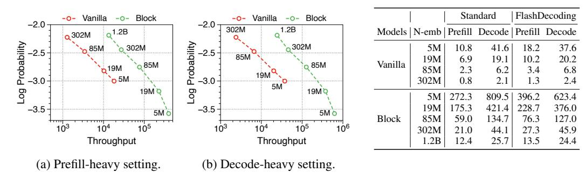

# I Throughput Comparison with FlashDecoding

In modern LLM deployments, decoding speed enhancements through kernel fusion techniques like the FlashAttention algorithm [23] are generally employed. These mechanisms reduce the number of memory accesses, leading to faster decoding in LLMs. Consequently, the speed advantages of our Block Transformer, which minimizes KV cache size and memory accesses, could be a little diminished compared to a vanilla Transformer. To investigate this, we measured the maximum throughput with FlashDecoding applied, as illustrated in Figure 8. Interestingly, we observed an overall trend similar to that presented in Figure 2 in the main paper. Our model architecture still benefits significantly from FlashAttention for global attention within the block decoder, resulting in a considerable speed improvement of up to 31%.

Figure 8: Pareto frontier of throughput to language modeling performance using FlashDecoding.

