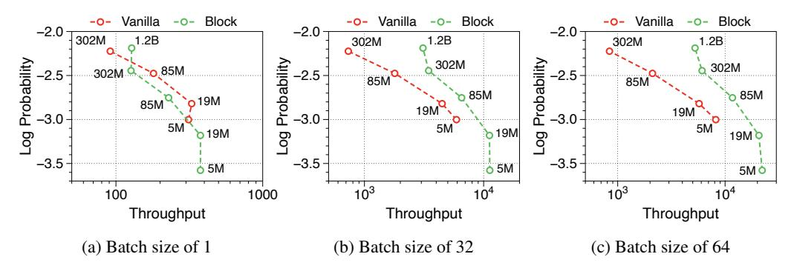
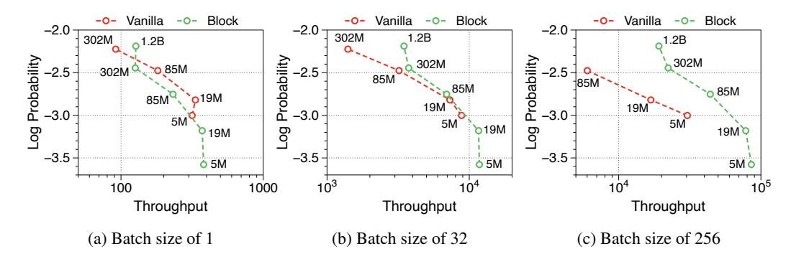
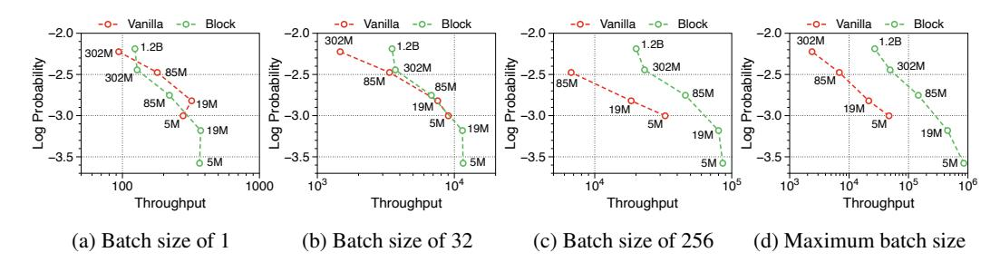
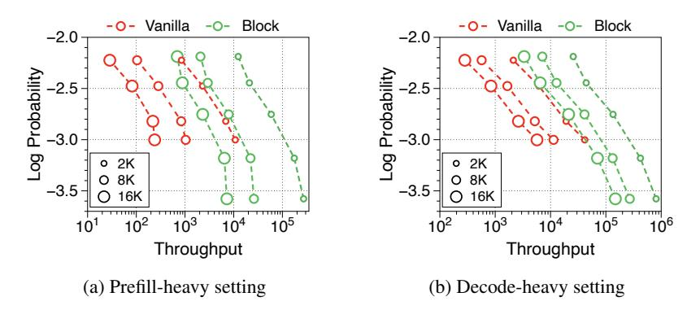

# J Pareto frontiers at variable batch sizes and context lengths

In [Figure 9](#page-27-1) and [Figure 10,](#page-27-2) we measure throughput in both prefill-heavy and decode-heavy settings across three different batch sizes. At a batch size of 1, parameter IO has a much greater impact on throughput compared to KV cache IO, resulting in slightly lower throughput for Block Transformer. However, as the model sizes increase beyond a certain point, the increased KV cache memory causes this trend to reverse. With a batch size of 32, our models achieve significantly higher throughput. To ensure that the improvements in decode-heavy settings are not solely due to gains in the prefill phase from not needing to forward the token decoder, we also experiment with a setting without a prompt. The results, summarized in [Figure 11,](#page-27-3) show consistent performance improvements.

Figure 9: Pareto frontier of throughput to language modeling performance in the prefill-heavy setting. We set the input and output sequence lengths as 2048 and 128, respectively. The numbers denote the number of non embedding parameters in each model variants. We note that most vanilla models are out of memory from the batch size of 128.

Figure 10: Pareto frontier of throughput to language modeling performance in the decode-heavy setting. We set the input and output sequence lenghts as 128 and 2048, respectively. In the batch size of 256, the vanilla model with the parameters of 302M is excluded due to out of memory issues.

Figure 11: Pareto frontier of throughput without any input sequences. This setting is for the only decode phase, where the input and output sequence lengths are set to 1 and 2048, respectively. The numbers denote the number of non embedding parameters in each model variants.

Moreover, we compare the throughput of vanilla and Block Transformer models across various context lengths under two scenarios. In [Figure 12,](#page-28-2) each point corresponds to the same order of model sizes. Our models demonstrate remarkable speed improvements, and even when the context length is increased by four or eight times, they outperform the vanilla models with a context length of 2K. By reducing the context length at the block decoder by a factor of block length, our models achieve faster generation speeds even with much longer context length.

Figure 12: Pareto frontier of throughput with varying context lengths. We set the prompt length to 128 in prefill-heavy scenarios and the output length to 128 in decode-heavy scenarios.

