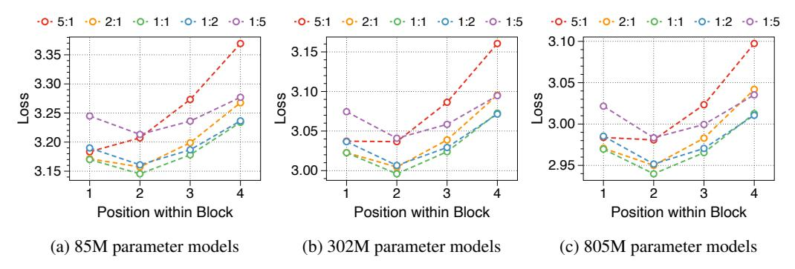

# K Position-wise loss by parameter allocation ratio

We summarize the position-wise loss for three different model sizes in [Figure 13.](#page-28-3) We confirm that changing the model size does not alter the overall trend, which exhibits a U-shape pattern depending on the token position. Additionally, we observe that a larger block decoder consistently improves the likelihood of earlier tokens, while a larger token decoder improves the likelihood of later tokens.

Figure 13: Position-wise loss based on the model sizes and parameter allocation ratios. All models are trained on about 8 billion tokens with a block length of four. The parameter number indicates the sum of non-embedding parameters in block and token decoders, and the ratio represents the proportion of parameters between them.

