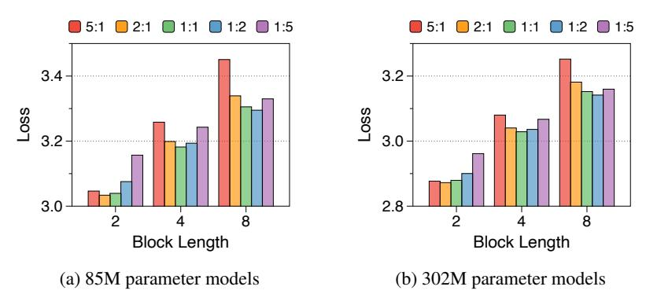
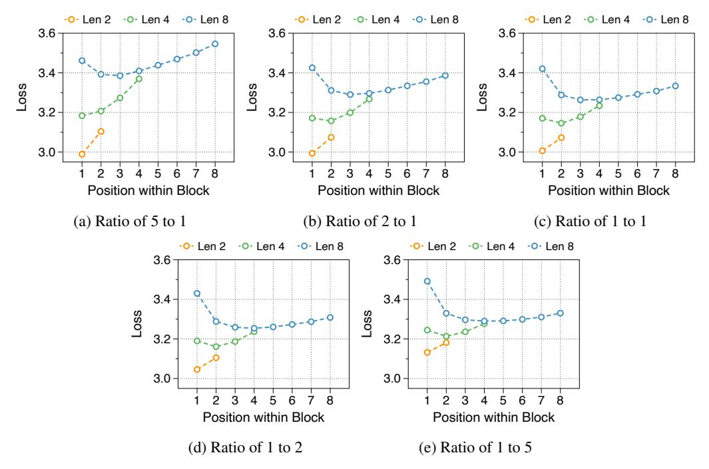

# L Loss trend by allocation ratio and block length

We analyze average loss in [Figure 14](#page-29-1) and position-wise loss in [Figure 15](#page-29-2) and [Figure 16,](#page-30-0) adjusting for three block lengths and five allocation ratios across two model sizes. Surprisingly, all experimental results demonstrate the same trend. Notably, shorter block lengths favor larger block decoders, while longer block lengths benefit from larger token decoders. The rationale behind this trend becomes apparent through an examination of position-wise perplexity, particularly by observing the changes in loss for the first token and the variations in loss for later tokens. We believe that our extensive ablation studies will facilitate the determination of parameter ratios tailored to the specific scenarios for which the Block Transformer is designed.

Figure 14: Loss by varying block lengths and the parameter allocation ratios. The numbers indicate the sum of non-embedding parameters in the block and token decoders.

Figure 15: Position-wise loss in relation to block length using three different parameter ratios. The models have 85M non-embedding parameters.

