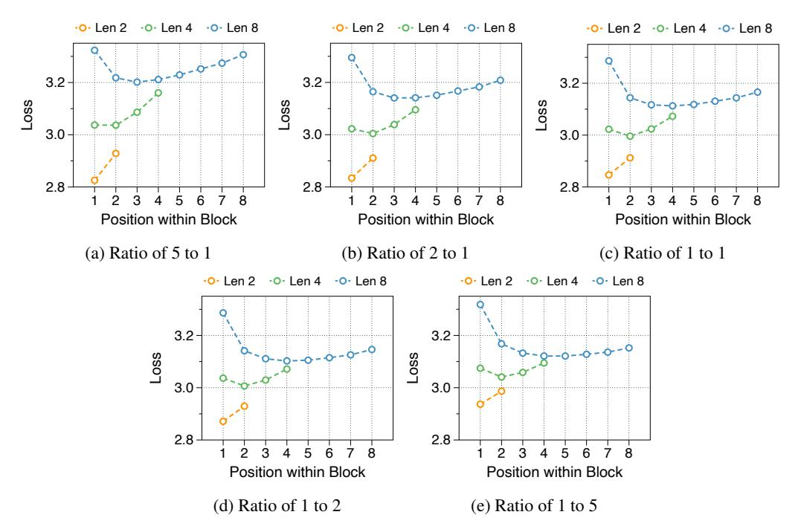
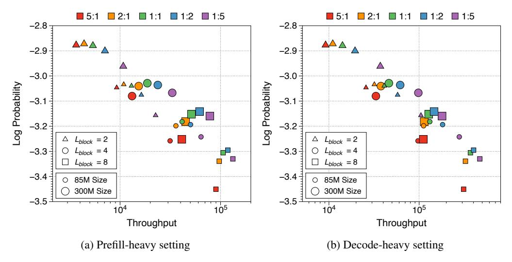

# M Pareto frontier of throughput by allocation ratio and block length

While we have analyzed the optimal parameter ratio and block length from a perplexity perspective, we also evaluate which settings perform best from a throughput standpoint. The Pareto frontier for all model variants is depicted in [Figure 17.](#page-30-1) Although there is a trade-off between throughput and performance, two clear findings emerge from the extensive combinations. First, the larger the token decoder, the higher the throughput improvement. Despite the token decoder consumes more FLOPs, the significantly shorter context length does not add overhead to the actual generation speed. Conversely, the block decoder, with its longer context length compared to the token decoder, hinders throughput as its size increases. The second observation is that longer block lengths significantly benefit throughput because they effectively reduce the context length. In conclusion, to optimize inference throughput, the token decoder should be enlarged, and the block length increased. However, to also consider perplexity, it is necessary to finely adjust the total model size, the allocation ratio, and the block length.

Figure 16: Position-wise loss in relation to block length using three different parameter ratios. The models have 302M non-embedding parameters.

Figure 17: Pareto frontier of throughput to language modeling performance across various parameter allocation ratios, block lengths, and model sizes. Throughput is measured in the number of output tokens generated per second. The input and output sequence lengths are set to 2048 and 128 for the prefill-heavy setting, and 128 and 2048 for the decode-heavy setting. All model variants are trained on 8 billion tokens.

