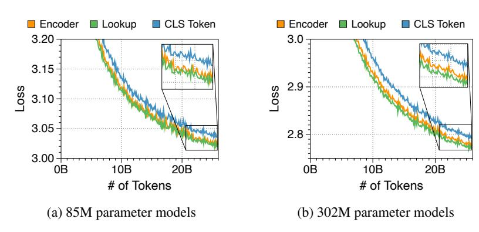
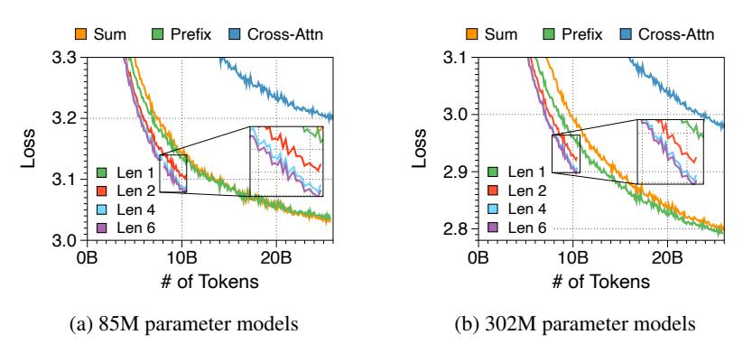
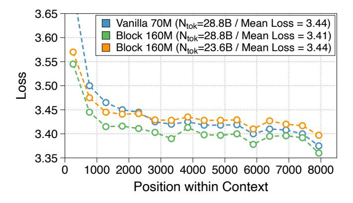
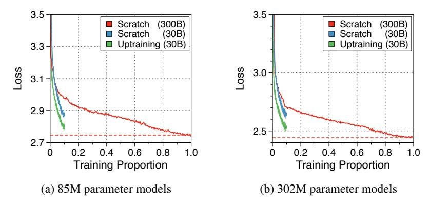
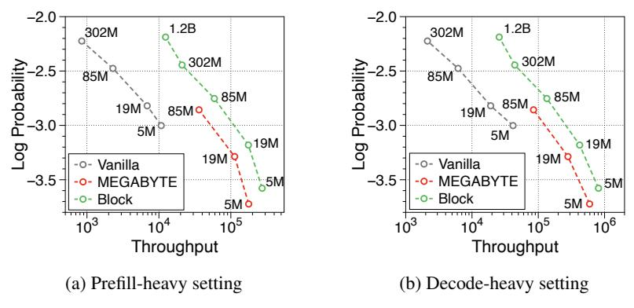
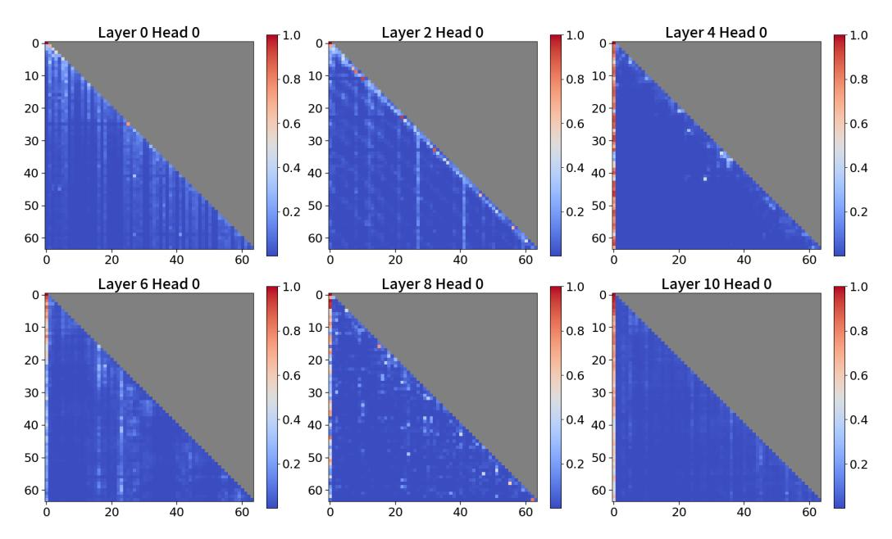
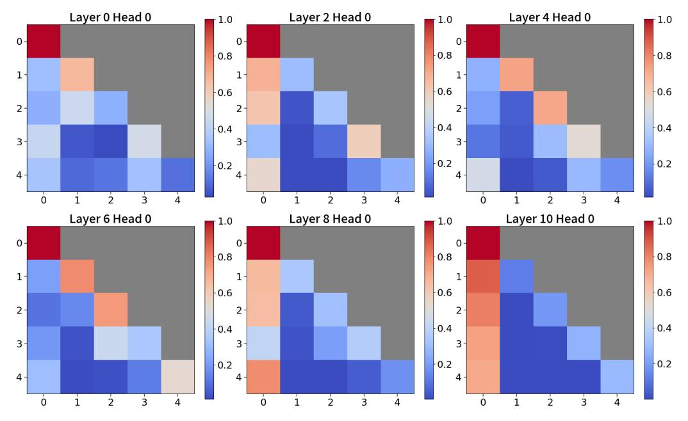

# N Ablation studies on components of Block Transformer

## N.1 Embedder design

We compare three methodologies as embedder components in [Figure 18.](#page-31-3) Surprisingly, the lookup strategy using an embedding table shows faster convergence than the transformer-based encoder, despite eventually reaching the same level of performance with prolonged training. Although increasing the number of layers of encoders could potentially improve performance, we choose not to pursue this due to its detrimental impact on inference throughput. Using a fixed number of CLS tokens allows for flexibility in adjusting the length of each block. Drawing inspiration from studies that adaptively allocate computational costs based on the difficulty of predictions [\[68,](#page-15-10) [4\]](#page-10-6), this strategy could be effectively utilized when designing a Block Transformer capable of handling adaptive output lengths.

Figure 18: Training loss curve for three embedder components across two model sizes. We use a three layer RoBERTa model with a dimension of 256, and average the embeddings of three CLS tokens from the RoBERTa model.

## N.2 Token decoder design

In [Figure 19,](#page-31-4) we compare three components for the optimal design of the token decoder. Prefix decoding outperform other strategies, particularly when the prefix length is increased, leading to a significant boost in performance. Given that the token decoder has a short context length, extending the prefix length does not substantially slow down the actual generation speed. However, since FLOPs increase proportionally, we set the prefix length to two as the main configuration to maintain a balance between performance and computational efficiency.

Figure 19: Training loss curve for three token decoder components across two models sizes. For the prefix method, we train the models with four different prefix lengths for block embeddings.

## O Long-context modeling ability

**8K context length on the PG19 dataset** To further support the effectiveness of our proposed block language modeling in capturing full context, we conducted experiments with an 8K context length (refer to Figure 20). However, due to limited computational resources, we pretrained only a 70M parameter vanilla model and a 170M parameter Block model. Following prior work [84, 82, 87] that used token position-wise perplexity on the PG19 dataset to demonstrate the utilization of global information in long contexts, we evaluated our Block Transformer in the same manner with 8K context length (refer to Figure 4b of the main paper for 2K context window). Even with a extended 8K context window, our models effectively utilized the full context, showing a decreasing loss trend as token position increased, similar to the vanilla model. Besides, consistent with Table 1 in the main paper, the 170M block model outperformed the 70M vanilla model in terms of perplexity.

Figure 20: Long-context modeling ability up to 8K tokens. Average loss at different token positions (512-token bins) within 8192-token snippets from the entire PG19 test set. Blue and green lines show Vanilla and Block Transformers, trained on 28.8B tokens with context length of 8192. Orange line shows a vanilla-loss-equivalent Block Transformer checkpoint, at 23.6B tokens. Both architectures achieve lower loss as context length increases, with the Block Transformer performing relatively stronger at early tokens. Block Transformer achieves lower loss at all positions up to 8K.

**Performance on the Needle-In-a-Haystack task** To precisely evaluate long-context modeling ability of LLMs, recent benchmarks, such as Needle-In-a-Haystack (NIAH) [39], LongBench [7], and ZeroScrolls [69], are typically utilized. However, to the best of our knowledge, these benchmarks mostly evaluate instruction-tuned models, as opposed to our pretrained base models. Nevertheless, we slightly modified the tailored prompt with an instruction version to evaluate the performance. Following prior work [67], we construct the context by first sampling 2K-length snippets from concatenated essays written by Paul Graham as the "haystack", and then inserting a "needle" containing key information in a random location. Following Reid et al. [67], we use this needle format: "The special magic {city} number is: {number}." Here, {city} is a randomly chosen city name, and {number} is a random 7-digit number. We then append a prompt that queries to model to retrieve the 7-digit number. We consider two prompt formats:

- 1. **Gemini prompt** Format is as follows: "<context>\ncontext\n</context>\n\nWhat is the special magic {city} number?\n\nHere is the magic number from the context:". We mostly followed the NIAH prompt used in Gemini, but we excluded the "Don't give information outside the document or repeat your findings" part, as our models are not instruction-tuned.
- 2. **Verbatim prompt** Format is as follows: "<context>\ncontext\n</context>\n\nquesti on\n\nThe special magic {city} number is:". Here, we used the exact same format as that in the needle to query the model.

We measured the accuracy by generating 20 new tokens, and considering a prediction correct if the generated text contains the 7-digit number. Tables 5 and 6 presents a comparison of accuracy between vanilla and Block Transformers across two different prompts. We found that Block Transformers

perform equally or stronger than loss-equivalent vanilla models, consistently across (1) needle locations, (2) model scales and (3) prompt variants. These results confirm that the Block Transformer, like the vanilla models, can effectively retrieve global information contained within the 2K context length. With the Gemini prompt, we observed an accuracy trend that was very similar to the perplexity trend of the vanilla vs. block models. Near-perfect performance with the Verbatim prompt supports the long-sequence modeling capabilities of our models even when context information is squeeze into a single context embedding. We believe this parity between vanilla and Block Transformers on 2K context length will extend to 8K and beyond.

Table 5: Accuracy on Needle-In-a-Haystack task with Gemini prompt. Note that depth refers to the relative of the location of the needle within the haystack, in percentages.

|         |       |                  |                  |                  |                  |                  | De               | pth              |                  |                  |                  |                                     |                  |
|---------|-------|------------------|------------------|------------------|------------------|------------------|------------------|------------------|------------------|------------------|------------------|-------------------------------------|------------------|
| Models  | N-Emb | 0                | 10               | 20               | 30               | 40               | 50               | 60               | 70               | 80               | 90               | 100                                 | Mean             |
| Vanilla |       | 21.00%           |                  |                  | 27.40%           |                  | 28.00%           | 26.80%           | 40.20%           |                  |                  | 6.40% 22.80% 66.20%           |                  |
| Block   | 800M  | 23.40% 35.80% | 52.60% 74.00% | 52.60% 76.40% | 46.60% 78.40% | 46.00% 69.80% | 49.20% 77.40% | 58.40% 76.40% | 70.40% 79.00% | 64.00% 75.20% | 53.60% 72.80% | 6.40% 18.40% 53.60% 78.80% | 48.65% 69.89% |

Table 6: Accuracy on Needle-In-a-Haystack task with Verbatim prompt.

|         |              |                                      |                            |                                      |                           |    | Dej                                  | pth    |                                      |                                      |                                      |                                      |                  |
|---------|--------------|--------------------------------------|----------------------------|--------------------------------------|---------------------------|----|--------------------------------------|--------|--------------------------------------|--------------------------------------|--------------------------------------|--------------------------------------|------------------|
| Models  | N-Emb        | 0                                    | 10                         | 20                                   | 30                        | 40 | 50                                   | 60     | 70                                   | 80                                   | 90                                   | 100                                  | Mean             |
| Vanilla | 85M          | 8.20% 95.60% 99.60%            | 1.40% 99.40% 100.00% | 3.00% 99.00% 100.00%           | 6.80% 99.40% 99.80% |    | 99.20%                               | 99.00% | 65.80% 99.60% 100.00%          | 63.40% 99.60% 100.00%          | 99.00%                               | 95.60%                               | 98.60%           |
| Block   | 300M 800M | 96.20% 90.20% 95.20% 92.60% | 99.40% 99.40%           | 96.20% 99.60% 98.80% 99.40% | 99.20% 98.80%          |    | 98.00% 99.60% 98.80% 99.60% | 99.60% | 98.80% 99.80% 99.40% 99.80% | 99.00% 99.80% 99.20% 99.80% | 99.40% 99.20% 97.40% 99.20% | 96.20% 99.20% 99.60% 98.00% | 98.56% 98.58% |

## P Uptraining strategy for training efficiency

Ainslie et al. [2] have demonstrated the significance of weight initialization for effectively uptraining models. Our extensive ablation studies reveal the optimal strategies for the Block Tramsformers: (1) Dividing a vanilla transformer layer in half and assigning each half to the block and token decoders, respectively, outperforms assigning the same weights of selected layers to both. (2) Initializing the input block embedding as the average of token embeddings within the block improves performance. (3) Initializing token decoder prefixes by replicating the context embedding enhances convergence. As depicted in Figure 21, these initialization techniques allow uptrained models to nearly match fully pretrained models. While larger models generally require longer uptraining, this approach still converges faster and recovers performance better than random initialization.

Figure 21: Training loss curve of uptraining strategy for two model sizes. Scratch denotes pretraining models from randomly initialized weights. The numbers in parentheses represents the number of training tokens.

## O Performance comparison to MEGABYTE

MEGABYTE propose a global-to-local architecture similar to ours, but their emphasis on efficient training leads to different conclusions. For instance, they claim that a model structure with a block decoder six times larger than the token decoder is optimal, while overlooking the significance of local computation within the token decoder. However, our observations indicate that increasing the block decoder size is detrimental to throughput, and significantly reducing token decoder severely impacts language modeling performance. This is evident in Figure 22, where our reimplementation of MEGABYTE, based on their reported results, demonstrates considerably lower generation speed and performance than our baseline model in both prefill-heavy and decode-heavy settings. In light of this, we believe that our findings, focused on efficient inference, will open up new directions for global-to-local language models.

Figure 22: Pareto frontier of throughput comparing our Block Transformer to MEGABTYE models. The numbers adjacent to each point indicte the number of non-mebedding parameters.

#### **R** Visualization of attention scores in Block Transformer

We visualize the attention scores from both block and token decoder in Figure 23 and Figure 24. In block decoders, we observe a similar pattern of attention sinking to the first token. Previous research has taken advantage of this by keeping the first token as a global token to prevent performance drop when compressing long sequences of past tokens. We believe this approach could also benefit Block Transformers. Furthermore, the attention map in token decoders shows that later tokens strongly attend to the context embedding. This suggests that the global context is effectively compressed within them, which aligns with the insights in Section 4.1.

Figure 23: Visualization of attention scores in the block decoder. For clarity, we visualize only the first 64 sequences out of a total context length of 512. The causal mask parts are marked in gray.

Figure 24: Visualization of attention scores in the token decoder. A total sequence length of attention scores is 5, since the block length is 4 and the prefix length is 2. The causal mask parts are marked in gray.

## S Analysis on the context block embedding

To investigate whether global-to-local language modeling utilizes full context, we examine the information stored in context block embeddings. Specifically, given that the input token and context embedding share the same latent space in the token decoder, we analyze the three closest vocabulary terms to prefixes, which are projected from the context embedding, as shown in Table 7. We use a Block Transformer with 1.2 billion non-embedding parameters and prefix decoding with a prefix length of two. There are several interesting findings. The second prefix typically contains information about the last token of the current block. This suggests that the block decoder incorporates information about that specific token, rather than the previous sequences, to better predict the first token of the next block. Conversely, the first prefix of the context embedding contains uninterpretable tokens, indicating that it serves primarily to capture the global context as much as possible. This is further supported by Figure 24, which shows that later tokens in the token decoder tend to attend more to this prefix.

Table 7: Qualitative examples of the nearest token to the block embedding. We use a Block Transformer model with 1.2 billion non-embedding parameters. Utilizing prefix decoding with a length of two, we summarize the top three closest tokens for two positions of prefixes based on an embedding matrix from the token decoder. We randomly sample the input sequences from the Pile dataset.

| Sample | Tokens  | Top-k | Block #0                                                                              | Block #1                                                                     | Block #2                                                                | Block #3                                                                | Block #4                                                            |
|--------|---------|-------|---------------------------------------------------------------------------------------|------------------------------------------------------------------------------|-------------------------------------------------------------------------|-------------------------------------------------------------------------|---------------------------------------------------------------------|
|        | Input   | -     | \n\n#### Card                                                                         | iff $\n$ The                                                                 | exuberant capital                                                       | of Wales, compact                                                       | Cardiff has recently                                                |
| #0     | Nearest | k=2   | (' <lendoftextl>', ' Card') ('the', 'Card') ('.', 'card')</lendoftextl>       | ('the', 'The') (' <lendoftextl>', 'the') ('219', 'The')</lendoftextl> | ('guarantee', 'captial' ('ocardial', 'captial') ('28', 'Capital') | (' guranteee', ' compact' (' the', ',') (' unfamiliar', 'compact' | (',', 'recently')                                                   |
|        | Input   | -     | the medieval Jewish community                                                         | , who were not                                                               | allowed to bury their                                                   | dead within the city                                                    | , would take bodies                                                 |
| #1     | Nearest | k=2   | ('and', 'community') (',', 'Community') ('the', 'community')                    | ('the', 'not') ('and', 'were') ('.', 'are')                            | ('maybe', 'their') ('LOSS', 'Their') ('and', 'Their')             | ('LOSS', 'City') ('removed', 'City') ('otten', 'city')            | ('deteriorated', 'body') ('iding', 'bodies') ('pped', 'Body') |
|        | Input   | -     | to six daily                                                                          | Fort William (£28                                                            | .20, 3                                                                  | ¾ hours, four                                                           | to five daily),                                                     |
| #2     | Nearest | k=2   | ('< endoftext >', ',') (' the', '),') (' and', ']\\]')                          | ('fiercely', '28') ('foe', '28') ('illes', '30')                       | ('ijing', '3') ('\n', '3') ('á¿l', '4')                           | ('ulsions', 'four') ('fierecely', '4') ('\n', 'three')            | ('illes', ',') ('yscall', '),') ('boats', '!),')              |
|        | Input   | -     | can get almost anywhere                                                               | in Britain without having                                                    | g to drive.\n                                                           | \nThe main public                                                       | transport options are train                                         |
| #3     | Nearest | k=2   | (' <lendoftextl>', 'anywhere') ('the', 'anything') ('.', 'anything')</lendoftextl>    | ('uin', 'having') ('[]', 'without') ('the', 'have')                    | ('the', '.') ('and', 'C') (',', '?).')                            | ('the', 'public') ('.', 'Public') ('in', 'Public')                | ('onet', 'train') ('stuff', 'train') ('atisfaction', 'Train') |
|        | Input   | -     | \n\n**Length                                                                          | ** : 2 miles                                                                 | ; two to four                                                           | hours\n\nIt                                                             | 's fitting to start                                                 |
| #4     | Nearest | k=2   | ('the', 'length') (' <lendoftextl>', 'length') ('and', 'Length')</lendoftextl> | (' the', ' miles') (' and', 'km') (' in', ' mile')                     | ('the', 'four') ('079', 'two') ('and', '4')                       | ('the', 'It') ('in', 'It') ('and', 'it')                          | ('the', 'start') ('305', 'started') (',', 'starts')           |
|        | Input   | -     | the English church.                                                                   | If this is the                                                               | only cathedral you visi                                                 | t in England, you                                                       | 'll still walk away                                                 |
| #5     | Nearest | k=2   | (' <lendoftextl>', '.') (' and', '^).') (' the', ')\$.')</lendoftextl>        | ('the', 'the') ('cción', 'The') ('and', 'this')                        | ('zione', 'visit') ('icions', 'visiting') ('opsis', 'visits')     | ('zione', 'you') ('Heather', 'You') ('icions', 'You')             | ('aciones', 'away') ('326', 'walk') ('the', 'walked')         |
|        | Input   | -     | \\n\nStart at                                                                         | the 1 **Store                                                                | y Arms car park                                                         | ** off the A                                                            | 470. A clear                                                        |
| #6     | Nearest | k=2   | (' <lendoftextl>', 'at') ('the', 'At') (',', 'At')</lendoftextl>              | ('the', 'Store') ('ãĤĬ', 'Store') ('and', 'store')                     | ('ãĤĬ', ' Park') (' and', 'Park') ('ishops', 'park')              | ('and', 'A') ('the', 'A') ('.', 'a')                              | ('etus', 'clear') ('the', 'Clear') ('ção', 'Clear')           |